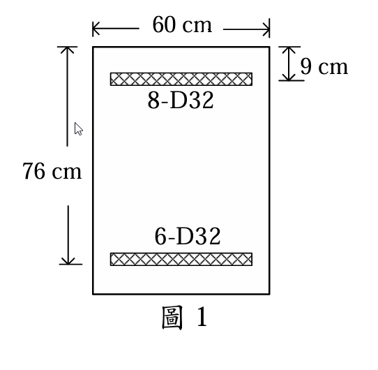

### 考題編號：RC-2025-2

**主分類：** `RC-U3-3` 韌性要求與耐震設計
**副分類：** `RC-U2-1` RC 剪力強度分析與設計
**設計法：** USD強度設計法（耐震規範）
**標籤：** `耐震梁` `特殊矩形框架梁` `可能彎矩強度Mpr` `Vc=0條件` `密箍區` `剪力筋設計` `閉合箍筋`

---

## 1. 原始題目重述 (Problem Restatement)

**規範依據：** 土木401-112（含耐震設計特殊規定）

一連接於兩內柱間之**耐震梁（特殊矩形框架梁）**，淨跨距 $l_n = 9\text{ m}$，斷面如圖1所示。

**斷面幾何（由圖1讀取）：**
- 梁寬：$b_w = 60\text{ cm}$
- 梁總高：$h = 76\text{ cm}$
- 柱面至縱向鋼筋形心距：$d' = 9\text{ cm}$（頂底皆同）
- **有效深度：** $d = h - d' = 76 - 9 = 67\text{ cm}$

*圖說：矩形梁斷面，b = 60 cm，h = 76 cm，d' = 9 cm（由頂/底面至鋼筋形心距）。柱面處頂層配置 8-D32（As,top = 65.12 cm²），底層配置 6-D32（As,bot = 48.84 cm²）。*

**配筋（柱面處）：**
- 頂層：8-D32，$A_{s,top} = 8 \times 8.14 = 65.12\text{ cm}^2$
- 底層：6-D32，$A_{s,bot} = 6 \times 8.14 = 48.84\text{ cm}^2$

**載重：** 跨距內因數化重力均布載重 $w_u = 2\text{ tf/m}$

**設計用剪力筋：** D13（$f_{yt} = 2800\text{ kgf/cm}^2$，$A_b = 1.27\text{ cm}^2$）

**材料：** $f'_c = 280\text{ kgf/cm}^2$，$f_y = 4200\text{ kgf/cm}^2$（D25以上主筋）

**要求：** 依耐震設計規範，設計靠近柱端之剪力筋。（30分）

---

## 2. 考題核心精神與出題者意圖 (Core Concepts & Examiner's Intent)

**核心觀念：** 耐震梁剪力設計的「靈魂」是**可能彎矩強度（Mpr）法**——不依賴因數化剪力圖，而是假設梁端塑鉸發生並充分轉動時，以 $1.25 f_y$（超強係數）計算梁端最大可能彎矩，再反算出對應的設計剪力 $V_u$。此法確保不管地震幾大，剪力筋都不會先於彎矩鉸破壞（能量消散機制保護）。

**出題者意圖：**
1. 測試是否懂得用 $1.25f_y$（非 $f_y$）計算 $M_{pr}$
2. 測試能否判斷 $V_c = 0$ 的適用條件（地震剪力 > $0.5V_u$）
3. 測試密箍區長度（$2h$）及最大間距（$d/4$, $6d_b$, $150\text{ mm}$ 取最小）
4. 測試是否記得第一支箍筋距柱面 $\leq s_o/2$

---

## 3. 解題戰略地圖與陷阱分析 (Strategic Roadmap & Trap Analysis)

**作戰計畫：**
1. 計算 $M_{pr}^-$（頂筋受拉）和 $M_{pr}^+$（底筋受拉）— 用 $1.25f_y$、$\phi=1.0$
2. 建立自由體圖，計算兩個搖擺方向的柱端剪力，取最大 $V_u$
3. 判斷 $V_c = 0$ 條件
4. 設計箍筋（$V_s$ 需求 → 間距），同時驗算耐震間距限制
5. 明確標出密箍區範圍（$2h$ 從柱面算起）

**關鍵陷阱：**

| # | 陷阱 | 正確做法 |
|---|------|---------|
| 1 | **用 $f_y$ 算 $M_{pr}$**（忘記超強係數） | $M_{pr}$ 用 $1.25f_y = 5250\text{ kgf/cm}^2$，$\phi = 1.0$ |
| 2 | **以為 $V_c \neq 0$**，不扣掉地震剪力比例 | 地震剪力佔比 $> 50\%$ → $V_c = 0$（密箍區內） |
| 3 | **密箍區長度錯誤**：用 $2d$ 而非 $2h$ | 密箍區 $= 2h$（以梁全高計算），$2h = 152\text{ cm}$ |
| 4 | **$\phi$ 取錯**：剪力用 $\phi=0.75$，非 $0.9$ | 設計 $V_s$：$V_s \geq V_u/0.75$ |

---

## 3.5 變數層次分析 (Variable Hierarchy Analysis)

> 複習提示：第一次解題後，在每個卡住的知識點旁標記 `⚠`；第二次複習時只看有 `⚠` 的項目。

### 最終目標
`計算 Mpr⁻, Mpr⁺ → 求柱端 Vu → 設計 D13 箍筋間距（密箍區 + 中間區）`

### 本題關鍵公式（依計算順序）

> $\boxed{\cdot}$ = 需由前步驟推導，非題目直接給定的變數

$$\text{Step 1: } a_{top} = \frac{A_{s,top}\cdot 1.25f_y}{0.85f'_c b_w} \quad\Rightarrow\quad M_{pr}^- = A_{s,top}\cdot1.25f_y\!\left(d-\frac{\boxed{a_{top}}}{2}\right)$$

$$\text{Step 2: } a_{bot} = \frac{A_{s,bot}\cdot 1.25f_y}{0.85f'_c b_w} \quad\Rightarrow\quad M_{pr}^+ = A_{s,bot}\cdot1.25f_y\!\left(d-\frac{\boxed{a_{bot}}}{2}\right)$$

$$\text{Step 3: } V_u = \frac{\boxed{M_{pr}^-}+\boxed{M_{pr}^+}}{l_n} + \frac{w_u l_n}{2}$$

$$\text{Step 4: 判斷 } V_c=0\text{ 條件：}\frac{({\boxed{M_{pr}^-}+\boxed{M_{pr}^+}})/l_n}{\boxed{V_u}} > 50\%$$

$$\text{Step 5: } s \leq \frac{A_v f_{yt} d}{\boxed{V_u}/\phi} \quad \text{且} \quad s \leq s_o = \min\!\left(\frac{d}{4},\,6d_b,\,150\text{mm}\right)$$

### L1：題目直接給定

| 符號 | 數值 | 說明 |
|------|------|------|
| $l_n$ | 9 m | 梁淨跨距 |
| $b_w$ | 60 cm | 梁寬 |
| $h$ | 76 cm | 梁總高 |
| $d'$ | 9 cm | 由圖1讀取（面至筋形心） |
| $A_{s,top}$ | $8\times8.14=65.12\text{ cm}^2$ | 柱面頂層 8-D32 |
| $A_{s,bot}$ | $6\times8.14=48.84\text{ cm}^2$ | 柱面底層 6-D32 |
| $w_u$ | 2 tf/m | 因數化重力均布載重 |
| $d_{b,main}$ | 3.22 cm | D32 標稱直徑 |
| $d_{b,stir}$ | 1.27 cm | D13 標稱直徑 |

### L2：需知識點推導

**Step 1：幾何計算**

| 符號 | 公式/來源 | 卡關? |
|------|----------|:-----:|
| $d$ | $h - d' = 76 - 9 = 67\text{ cm}$ | |
| $1.25f_y$ | $1.25\times4200 = 5250\text{ kgf/cm}^2$（Mpr 用） | |

**Step 2：可能彎矩強度 Mpr（$\phi=1.0$，$1.25f_y$）**

| 符號 | 公式/來源 | 卡關? |
|------|----------|:-----:|
| $a_{top}$ | $\frac{65.12\times5250}{0.85\times280\times60} = 23.94\text{ cm}$ | |
| $M_{pr}^-$ | $65.12\times5250\times(67-11.97) = 188.2\text{ tf·m}$（頂筋受拉） | |
| $a_{bot}$ | $\frac{48.84\times5250}{0.85\times280\times60} = 17.95\text{ cm}$ | |
| $M_{pr}^+$ | $48.84\times5250\times(67-8.975) = 148.8\text{ tf·m}$（底筋受拉） | |

**Step 3：耐震設計剪力 Vu**

| 符號 | 公式/來源 | 卡關? |
|------|----------|:-----:|
| $V_{seis}$ | $(M_{pr}^- + M_{pr}^+)/l_n = 337.0/9 = 37.44\text{ tf}$ | |
| $V_{grav}$ | $w_u l_n/2 = 2\times9/2 = 9\text{ tf}$ | |
| $V_u$ | $37.44 + 9.00 = 46.44\text{ tf}$（控制方向，重力與地震同向） | |

**Step 4：判斷 Vc = 0**

| 符號 | 公式/來源 | 卡關? |
|------|----------|:-----:|
| 地震剪力比 | $37.44/46.44 = 80.6\% > 50\%$ → $V_c = 0$ | |
| $V_s \geq$ | $V_u/\phi = 46.44/0.75 = 61.92\text{ tf}$（全由箍筋承擔） | |

**Step 5：箍筋設計（密箍區）**

| 符號 | 公式/來源 | 卡關? |
|------|----------|:-----:|
| $A_v$（4腳） | $4\times1.27 = 5.08\text{ cm}^2$ | |
| $s_{req}$ | $A_v f_{yt} d/V_s = 5.08\times2800\times67/61920 = 15.4\text{ cm}$ | |
| $s_{seis}$ | $\min(d/4,\,6d_b,\,150\text{ mm}) = \min(16.8,\,19.3,\,15.0) = 15\text{ cm}$ | |
| $2h$（密箍區長） | $2\times76 = 152\text{ cm}$ | |

### L3：深層知識（不懂就卡住）

| 知識點 | 說明 | 卡關? |
|--------|------|:-----:|
| $M_{pr}$ 定義 | 以 $1.25f_y$、$\phi=1.0$ 計算的**可能彎矩強度**（不是 $\phi M_n$） | |
| 為何用 $1.25$ | 鋼筋實際降伏應力通常超過標稱值，係數 1.25 反映這種超強 | |
| $V_c=0$ 的物理意義 | 塑鉸發生時反覆受力使混凝土剪力退化，保守設定 $V_c=0$ | |
| 密箍區 = $2h$（不是 $2d$） | ACI/土木401 以**全高 $h$** 計算密箍區長度 | |
| 第一箍筋位置 | 距柱面 $\leq s_o/2$（即 $\leq 7.5\text{ cm}$） | |

---

## 4. 步驟化詳細計算過程 (Step-by-Step Detailed Calculation)

### 【Step 1】斷面幾何

$$b_w = 60\text{ cm},\quad h = 76\text{ cm},\quad d' = 9\text{ cm},\quad d = 76-9 = \boxed{67\text{ cm}}$$

$$A_{s,top} = 8 \times 8.14 = 65.12\text{ cm}^2 \quad(\text{柱面頂層，8-D32})$$
$$A_{s,bot} = 6 \times 8.14 = 48.84\text{ cm}^2 \quad(\text{柱面底層，6-D32})$$

---

### 【Step 2】計算可能彎矩強度 $M_{pr}$（$\phi = 1.0$，$1.25f_y$）

> 📝 **策略註解：** 耐震設計剪力以「梁端塑鉸充分發展」為基準，用 $1.25f_y$ 而非設計值 $f_y$，確保剪力設計比彎矩設計更保守（避免剪力先破壞）。

**頂筋受拉（負彎矩，$M_{pr}^-$）：**

$$a_{top} = \frac{A_{s,top} \cdot 1.25f_y}{0.85 f'_c b_w} = \frac{65.12 \times 5250}{0.85 \times 280 \times 60} = \frac{341{,}880}{14{,}280} = 23.94\text{ cm}$$

$$M_{pr}^- = A_{s,top} \cdot 1.25f_y \cdot \left(d - \frac{a_{top}}{2}\right) = 65.12 \times 5250 \times (67 - 11.97)$$

$$= 341{,}880 \times 55.03 = 18{,}816{,}000\text{ kgf·cm} = \boxed{188.2\text{ tf·m}}$$

**底筋受拉（正彎矩，$M_{pr}^+$）：**

$$a_{bot} = \frac{48.84 \times 5250}{14{,}280} = \frac{256{,}410}{14{,}280} = 17.95\text{ cm}$$

$$M_{pr}^+ = 48.84 \times 5250 \times (67 - 8.975) = 256{,}410 \times 58.025 = 14{,}882{,}000\text{ kgf·cm} = \boxed{148.8\text{ tf·m}}$$

---

### 【Step 3】計算耐震設計剪力 $V_u$

對稱兩端配筋，取控制方向（梁端負彎矩 + 梁端正彎矩，重力與地震同向）：

$$\boxed{V_u = \frac{M_{pr,L}^- + M_{pr,R}^+}{l_n} + \frac{w_u l_n}{2}}$$

$$= \frac{188.2 + 148.8}{9.0} + \frac{2.0 \times 9.0}{2} = \frac{337.0}{9.0} + 9.0 = 37.44 + 9.00 = \boxed{46.44\text{ tf}}$$

（另一搖擺方向：$V_u = 37.44 - 9.00 = 28.44\text{ tf}$，不控制）

---

### 【Step 4】判斷密箍區是否需 $V_c = 0$

地震引致剪力：$V_{seis} = (M_{pr}^- + M_{pr}^+)/l_n = 337.0/9.0 = 37.44\text{ tf}$

$$\frac{V_{seis}}{V_u} = \frac{37.44}{46.44} = 80.6\% > 50\% \quad \Rightarrow \quad \boxed{V_c = 0 \text{（密箍區內）}}$$

> 📝 **策略註解：** 土木401-112 規定：當耐震引致剪力超過總設計剪力的 50% 時（且梁為無軸力構件），密箍區內 $V_c = 0$，由箍筋獨立承擔全部剪力。

**密箍區長度（從柱面算起）：**

$$l_{hinge} = 2h = 2 \times 76 = \boxed{152\text{ cm}}$$

---

### 【Step 5】計算所需 $V_s$ 與箍筋設計

**所需剪力強度：**

$$V_s \geq \frac{V_u}{\phi} - V_c = \frac{46.44}{0.75} - 0 = \boxed{61.92\text{ tf} = 61{,}920\text{ kgf}}$$

**檢核最大剪力強度（$V_{s,max}$）：**

$$V_{s,max} = \frac{2}{3}\sqrt{f'_c} \times b_w \times d \quad(\text{SI}) = \frac{2}{3} \times \sqrt{27.46\text{ MPa}} \times 600 \times 670\text{ mm}$$
$$= \frac{2}{3} \times 5.24 \times 402{,}000 = 1{,}404{,}000\text{ N} = 143.2\text{ tf} \gg 61.92\text{ tf} \quad \checkmark$$

**箍筋設計（採 4 腳 D13 閉合箍筋）：**

$$A_v = 4 \times 1.27 = 5.08\text{ cm}^2$$

由強度需求：

$$s_{req} = \frac{A_v f_{yt} d}{V_s} = \frac{5.08 \times 2800 \times 67}{61{,}920} = \frac{953{,}072}{61{,}920} = 15.4\text{ cm}$$

---

### 【Step 6】耐震間距限制（密箍區）

$$s_o = \min\left(\frac{d}{4},\;6d_{b,main},\;150\text{ mm}\right) = \min\left(\frac{67}{4},\;6\times3.22,\;15.0\right)$$

$$= \min(16.75,\;19.32,\;15.0) = \boxed{15.0\text{ cm}} \quad \leftarrow 150\text{ mm 控制}$$

強度需求 $s_{req} = 15.4\text{ cm}$，間距限制 $s_o = 15.0\text{ cm}$：

$$\therefore \text{採用 } s = 15\text{ cm} \leq \min(s_{req},\; s_o) \quad \checkmark$$

**驗算 $\phi V_s$：**

$$\phi V_s = \phi \times \frac{A_v f_{yt} d}{s} = 0.75 \times \frac{5.08 \times 2800 \times 67}{15} = 0.75 \times 63{,}701 = 47{,}776\text{ kgf} = 47.8\text{ tf}$$

$$\phi V_s = 47.8\text{ tf} \geq V_u = 46.44\text{ tf} \quad \checkmark$$

---

### 【Step 7】最小箍筋量驗核

$$\frac{A_{v,min}}{s} \geq \max\!\left(\frac{0.35 b_w}{f_{yt}},\;\frac{0.0625\sqrt{f'_c}\,b_w}{f_{yt}}\right) = \max\!\left(\frac{0.35\times60}{2800},\;\frac{0.0625\times16.73\times60}{2800}\right)$$

$$= \max(0.0075,\;0.0224) = 0.0224\text{ cm}^2/\text{cm}$$

實際提供：$\dfrac{A_v}{s} = \dfrac{5.08}{15} = 0.339\text{ cm}^2/\text{cm} \gg 0.0224 \quad \checkmark$

---

### 【最終設計】

| 區域 | 範圍 | 箍筋規格 | 間距 | 說明 |
|------|------|---------|------|------|
| **密箍區（塑鉸區）** | 距柱面 0～152 cm | 4-D13 閉合箍筋 | **s = 15 cm** | $V_c=0$，$\phi V_s = 47.8\text{ tf} \geq V_u = 46.44\text{ tf}$ |
| **一般區（跨中）** | 152 cm 以外 | 2-D13 閉合箍筋 | $s \leq d/2 = 33.5\text{ cm}$，取 30 cm | $V_c = 27.3\text{ tf} > V_u = 9\text{ tf}$（重力剪力），最小箍筋控制 |

**特殊規定（土木401-112 耐震）：**
- 第一支箍筋距柱面 $\leq s_o/2 = 7.5\text{ cm}$（取 7.5 cm 或更小）
- 密箍區使用**閉合箍筋**（不得用開口箍筋），彎鉤須 $135°$，延伸 $6d_b$ 以上

---

$$\boxed{\text{柱端密箍區（152 cm）：4-D13 閉合箍筋，第一支 @ 7.5 cm，以後每 15 cm}}$$

---

## 5. 關鍵爭議點與進階探討 (Critical Issues & Advanced Discussion)

**爭議1：$M_{pr}$ 計算中的 $d$ 值**
- 本題假設頂底筋形心距柱面均為 $d' = 9\text{ cm}$（圖1標示）
- 若 8-D32 排成兩排，形心距會增至約 12 cm，$d$ 減為 64 cm
- 考場建議：以題目/圖面給定的數字為準

**爭議2：$V_c = 0$ 的適用範圍**
- 僅適用於**密箍區（$2h$）內**，且 $V_c = 0$ 是規範要求的保守設定
- 密箍區以外（跨中）可以恢復 $V_c > 0$，依一般剪力設計

**進階思考：若 $V_s$ 需求超過 $V_{s,max}$？**
- 代表斷面過小，需要加大梁深 $h$ 或梁寬 $b_w$
- 不應只靠增加箍筋數量來解決（混凝土承壓面積限制）
