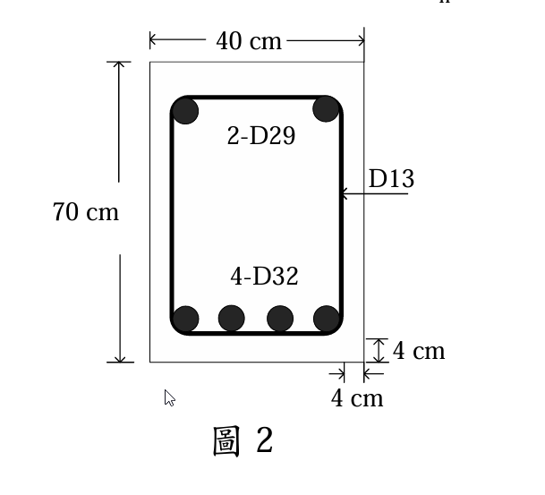

### 考題編號：RC-2025-3

**主分類：** `RC-U2-2` RC 扭力強度設計
**副分類：** 無
**設計法：** USD強度設計法
**標籤：** `扭矩強度` `空間桁架類比` `Tn` `閉合箍筋` `縱向鋼筋` `Aoh` `矩形梁扭力`

---

## 1. 原始題目重述 (Problem Restatement)

**規範依據：** 中國土木水利工程學會「混凝土工程設計規範與解說」（土木401-112）

一鋼筋混凝土矩形梁斷面（如圖2），配置下層 4 支 D32 拉力筋，上層 2 支 D29 壓力筋，閉合箍筋使用 D13，間距 15 cm，淨保護層為 4 cm。**若箍筋僅用於抵抗扭矩**，試求此斷面之扭矩強度 $T_n$ (tf·m)。（25 分）

**斷面資料（圖2）：**
- 斷面：$b = 40\text{ cm}$，$h = 70\text{ cm}$
- 下層：4-D32，$A_b = 8.14\text{ cm}^2$，共 $A_{sl,bot} = 4 \times 8.14 = 32.56\text{ cm}^2$
- 上層：2-D29，$A_b = 6.47\text{ cm}^2$，共 $A_{sl,top} = 2 \times 6.47 = 12.94\text{ cm}^2$
- 箍筋：D13 閉合箍筋，間距 $s = 15\text{ cm}$，$A_t = 1.27\text{ cm}^2$（單腳）
- 淨保護層：$c_c = 4\text{ cm}$（至箍筋外緣）

*圖說：矩形梁斷面寬 $b = 40\text{ cm}$，高 $h = 70\text{ cm}$。下層受拉筋 4-D32（$A_s = 31.96\text{ cm}^2$），上層受壓筋 2-D29（$A_{sl} = 12.94\text{ cm}^2$）。D13 閉合箍筋，間距 $s = 15\text{ cm}$，淨保護層 $c_c = 4\text{ cm}$（至箍筋外緣）。*

**全卷通用材料：**
- $f'_c = 280\text{ kgf/cm}^2$，$f_y = 4200\text{ kgf/cm}^2$（D25以上），$f_{yt} = 2800\text{ kgf/cm}^2$（D13）

---

## 2. 考題核心精神與出題者意圖 (Core Concepts & Examiner's Intent)

**核心觀念：** 土木401-112（ACI 318）採用**空間桁架類比（Space Truss Analogy）**計算扭矩強度——把斷面視為薄壁管，扭矩由閉合箍筋（橫向）與縱向鋼筋共同抵抗。$T_n$ 由**箍筋**與**縱筋**各自算出，取較小值（通常箍筋控制）。

**出題者意圖：**
1. 測試 $A_{oh}$（箍筋圍合面積）的幾何計算——從淨保護層推至箍筋中心線
2. 測試 $A_o = 0.85 A_{oh}$ 的折減係數
3. 測試扭矩公式 $T_n = 2A_o A_t f_{yt}/s \cdot \cot\theta$（$\theta=45°$時 $\cot\theta=1$）
4. 測試縱向鋼筋驗核（需求量 vs. 提供量）

---

## 3. 解題戰略地圖與陷阱分析 (Strategic Roadmap & Trap Analysis)

**作戰計畫：**
1. 算幾何量：由淨保護層→箍筋中心線距→$x_1, y_1$→$A_{oh}, p_h$
2. 算 $A_o = 0.85 A_{oh}$
3. 算箍筋提供之 $T_n$（橫向控制）
4. 驗核縱向鋼筋需求量 $\leq$ 提供量（縱向不控制）
5. 驗核混凝土壓碎上限

**關鍵陷阱：**

| # | 陷阱 | 正確做法 |
|---|------|---------|
| 1 | **$A_{oh}$ 算到箍筋外緣**（不是中心線） | 箍筋中心線距面 $= c_c + d_b/2 = 4.635\text{ cm}$ |
| 2 | **忘記乘 $A_o = 0.85A_{oh}$**，直接用 $A_{oh}$ | 規範規定 $A_o = 0.85A_{oh}$（平均剪力流路徑） |
| 3 | **$A_t$ 用兩腳**（閉合箍筋每圈有兩腳） | $A_t$ 為**單腳**面積（$= 1.27\text{ cm}^2$），公式已含係數 2 |
| 4 | **$\theta$ 取錯**，用其他角度 | 非預力梁取 $\theta = 45°$，$\cot\theta = 1.0$ |
| 5 | **忘記驗核縱向鋼筋**是否足夠 | 算需求 $A_l$ 與提供量比較 |

---

## 3.5 變數層次分析 (Variable Hierarchy Analysis)

> 複習提示：第一次解題後，在每個卡住的知識點旁標記 `⚠`；第二次複習時只看有 `⚠` 的項目。

### 最終目標
`計算閉合箍筋提供的扭矩強度 Tn，並驗核縱向鋼筋足夠`

### 本題關鍵公式（依計算順序）

> $\boxed{\cdot}$ = 需由前步驟推導，非題目直接給定的變數

$$\text{Step 1: } x_1 = b - 2\!\left(c_c + \frac{d_{b,s}}{2}\right),\quad y_1 = h - 2\!\left(c_c + \frac{d_{b,s}}{2}\right)$$

$$\text{Step 2: } A_{oh} = \boxed{x_1} \cdot \boxed{y_1},\quad p_h = 2(\boxed{x_1}+\boxed{y_1}),\quad A_o = 0.85\,\boxed{A_{oh}}$$

$$\text{Step 3（箍筋控制）: } T_n = \frac{2\,\boxed{A_o}\,A_t\,f_{yt}}{s}\cot\theta$$

$$\text{Step 4（縱筋驗核）: } A_{l,req} = \frac{A_t}{s}\,\boxed{p_h}\,\frac{f_{yt}}{f_y}\cot^2\!\theta \leq A_{l,prov}$$

### L1：題目直接給定

| 符號 | 數值 | 說明 |
|------|------|------|
| $b$ | 40 cm | 梁寬 |
| $h$ | 70 cm | 梁高 |
| $c_c$ | 4 cm | 淨保護層（至箍筋外緣） |
| $d_{b,s}$ | 1.27 cm | D13 箍筋直徑 |
| $A_t$ | 1.27 cm²（單腳） | D13 箍筋單腳面積 |
| $s$ | 15 cm | 箍筋間距 |
| $f_{yt}$ | 2800 kgf/cm² | 箍筋降伏強度 |
| $f_y$ | 4200 kgf/cm² | 縱向鋼筋降伏強度 |
| $A_{sl,prov}$ | $4(8.14)+2(6.47)=45.50\text{ cm}^2$ | 縱向鋼筋總量 |

### L2：需知識點推導

**Step 1：箍筋中心線幾何**

| 符號 | 公式/來源 | 卡關? |
|------|----------|:-----:|
| 箍筋中心線距面 | $c_c + d_{b,s}/2 = 4 + 0.635 = 4.635\text{ cm}$ | |
| $x_1$ | $40 - 2\times4.635 = 30.73\text{ cm}$ | |
| $y_1$ | $70 - 2\times4.635 = 60.73\text{ cm}$ | |
| $A_{oh}$ | $30.73 \times 60.73 = 1866.4\text{ cm}^2$ | |
| $p_h$ | $2(30.73+60.73) = 182.92\text{ cm}$ | |
| $A_o$ | $0.85 \times 1866.4 = 1586.4\text{ cm}^2$ | |

**Step 2：扭矩強度（箍筋控制，$\theta=45°$）**

| 符號 | 公式/來源 | 卡關? |
|------|----------|:-----:|
| $T_n$ | $2 \times 1586.4 \times 1.27 \times 2800 / 15 = 752{,}165\text{ kgf·cm}$ | |
| $T_n$ | $= 7.52\text{ tf·m}$ | |

**Step 3：縱向鋼筋需求驗核**

| 符號 | 公式/來源 | 卡關? |
|------|----------|:-----:|
| $A_{l,req}$ | $(1.27/15)\times182.92\times(2800/4200)\times1.0 = 10.33\text{ cm}^2$ | |
| $A_{l,prov}$ | $45.50\text{ cm}^2 \gg 10.33\text{ cm}^2$ → 縱筋足夠 | |

### L3：深層知識（不懂就卡住）

| 知識點 | 說明 | 卡關? |
|--------|------|:-----:|
| 為何 $A_o = 0.85A_{oh}$ | 薄壁管剪力流路徑的有效面積（非箍筋圍合的全部面積） | |
| $A_t$ 是單腳還是雙腳 | $A_t$ 為**單腳**；公式已有係數 2（兩腳共同抵抗扭力） | |
| $\theta$ 的選取 | 非預力梁允許 $30°\leq\theta\leq60°$；取 45° 最保守且常考 | |
| 縱筋與箍筋須聯合才能抵抗扭矩 | 空間桁架中，斜壓力由箍筋（拉桿）＋縱筋（弦桿）共同平衡 | |
| $p_h$（箍筋周長）的用途 | 計算縱筋需求量 $A_l$；$p_h$ 越大需要越多縱筋 | |

---

## 4. 步驟化詳細計算過程 (Step-by-Step Detailed Calculation)

### 【Step 1】箍筋圍合幾何量

淨保護層至箍筋外緣：$c_c = 4\text{ cm}$

箍筋中心線距梁面：
$$c_{cover} = c_c + \frac{d_{b,s}}{2} = 4 + \frac{1.27}{2} = 4 + 0.635 = 4.635\text{ cm}$$

箍筋中心線圍合之矩形尺寸：

$$x_1 = b - 2c_{cover} = 40 - 2(4.635) = 40 - 9.27 = \boxed{30.73\text{ cm}}$$

$$y_1 = h - 2c_{cover} = 70 - 2(4.635) = 70 - 9.27 = \boxed{60.73\text{ cm}}$$

箍筋中心線圍合面積與周長：

$$A_{oh} = x_1 \times y_1 = 30.73 \times 60.73 = \boxed{1866.4\text{ cm}^2}$$

$$p_h = 2(x_1 + y_1) = 2(30.73 + 60.73) = 2 \times 91.46 = \boxed{182.92\text{ cm}}$$

有效剪力流面積（土木401-112）：

$$A_o = 0.85 \times A_{oh} = 0.85 \times 1866.4 = \boxed{1586.4\text{ cm}^2}$$

> 📝 **策略註解：** $A_{oh}$ 量到箍筋**中心線**，不是外緣或內緣。$A_o = 0.85A_{oh}$ 為規範規定的有效剪力流路徑修正（薄壁管理論）。

---

### 【Step 2】扭矩強度 $T_n$（橫向箍筋控制）

採用空間桁架類比（$\theta = 45°$，$\cot 45° = 1.0$）：

$$T_n = \frac{2\,A_o\,A_t\,f_{yt}}{s}\cot\theta$$

$$= \frac{2 \times 1586.4 \times 1.27 \times 2800}{15} \times 1.0$$

$$= \frac{2 \times 1586.4 \times 3{,}556}{15} = \frac{11{,}282{,}477}{15} = 752{,}165\text{ kgf·cm}$$

$$\boxed{T_n = 7.52\text{ tf·m}}$$

> 📝 **策略註解：** 題目說「箍筋僅用於抵抗扭矩」，表示全部 $A_t$ 用於扭矩計算，不需扣除剪力分配。$A_t = 1.27\text{ cm}^2$ 為**單腳**面積，公式前的 2 代表一個箍筋有兩腳。

---

### 【Step 3】縱向鋼筋需求驗核

土木401-112 規定扭矩設計須同時配置縱向鋼筋，所需最小面積：

$$A_{l,req} = \frac{A_t}{s} p_h \frac{f_{yt}}{f_y} \cot^2\!\theta = \frac{1.27}{15} \times 182.92 \times \frac{2800}{4200} \times 1.0$$

$$= 0.08467 \times 182.92 \times 0.6667 = 10.33\text{ cm}^2$$

實際提供縱向鋼筋總量：

$$A_{l,prov} = 4 \times 8.14 + 2 \times 6.47 = 32.56 + 12.94 = 45.50\text{ cm}^2$$

$$A_{l,prov} = 45.50\text{ cm}^2 \gg A_{l,req} = 10.33\text{ cm}^2 \quad \checkmark$$

**縱向鋼筋充足，箍筋控制 $T_n$。**

---

### 【Step 4】混凝土壓碎上限驗核

換算至 SI 制：$f'_c = 280/10.197 = 27.46\text{ MPa}$，$A_{oh} = 186{,}640\text{ mm}^2$，$p_h = 1829.2\text{ mm}$

純扭矩時截面壓碎限制（土木401-112）：

$$T_{n,max} \leq \frac{(2/3)\sqrt{f'_c} \times 1.7 A_{oh}^2}{p_h}$$

$$= \frac{(2/3)\times\sqrt{27.46}\times1.7\times(186{,}640)^2}{1829.2}$$

$$= \frac{(2/3)\times5.24\times1.7\times3.484\times10^{10}}{1829.2} = \frac{2.068\times10^{11}}{1829.2} = 1.131\times10^8\text{ N·mm}$$

$$= 113.1\text{ kN·m} = 11.54\text{ tf·m}$$

$$T_n = 7.52\text{ tf·m} < T_{n,max} = 11.54\text{ tf·m} \quad \checkmark \text{（混凝土不會壓碎）}$$

---

### 【結論】

$$\boxed{T_n = 7.52\text{ tf·m}}$$

| 驗核項目 | 結果 |
|---------|:----:|
| 箍筋提供之 $T_n$ | **7.52 tf·m** |
| 縱向鋼筋供給（45.50 cm²）≥ 需求（10.33 cm²） | ✅ |
| 混凝土壓碎上限（11.54 tf·m）≥ $T_n$（7.52 tf·m） | ✅ |

> 設計強度：$\phi T_n = 0.75 \times 7.52 = 5.64\text{ tf·m}$

---

## 5. 關鍵爭議點與進階探討 (Critical Issues & Advanced Discussion)

**爭議1：$\theta$ 角的選取**
- ACI 318 允許 $30° \leq \theta \leq 60°$，考場通常取 $45°$
- 若取 $\theta < 45°$（如 $37.5°$），$\cot\theta > 1$，箍筋效率提高，但縱筋需求也增大
- 取 $45°$ 是最安全的預設選項

**爭議2：$A_{oh}$ vs. $A_{cp}$**
- $A_{cp}$ = 全截面面積（含保護層）= $40 \times 70 = 2800\text{ cm}^2$，用於門檻扭矩 $T_{th}$ 計算
- $A_{oh}$ = 箍筋中心線圍合面積，用於 $T_n$ 計算
- 本題給了足夠配筋，直接計算 $T_n$ 即可

**進階思考：若 $T_n$ 不足怎麼辦？**
- 方案①：縮小箍筋間距 $s$（$T_n \propto 1/s$，最直接）
- 方案②：增加箍筋腳數或改用較大號箍筋（增大 $A_t$）
- 方案③：加大斷面（增大 $A_{oh}$）
