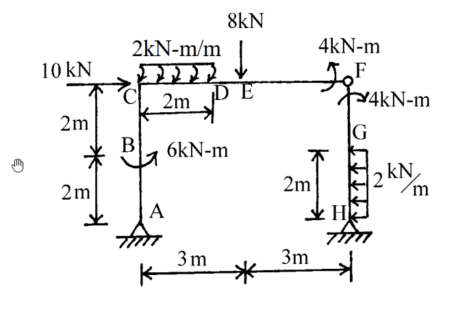

# 考題編號：SA-2002-1

**主分類：** `SA-1` 靜定結構分析
**副分類：** `SA-1-2` 靜定剛架
**分析法：** 靜定分析
**標籤：** `靜定剛架` `內鉸` `集中力矩` `剪力彎矩圖`

---

## 1. 原始題目重述 (Problem Restatement)
如下圖所示之剛架結構，點F 為內鉸，在各種外力作用下，試繪其軸力圖、剪力圖及彎矩圖。（25 分）

*圖說：本結構為一非對稱剛架，A點與H點為鉸支承。左側柱高4m，於y=2m處(B點)受6 kN-m順時針集中彎矩；頂部C點受10 kN向右集中力。橫梁長6m，C到D(2m)受2 kN/m向下均布載重，E點(x=3m)受8 kN向下集中力。右側柱高4m，下半段H到G(2m)受2 kN/m向左均布載重。F點為內鉸，梁端與柱端各受4 kN-m之集中彎矩（梁端逆時針，柱端順時針）。*

## 2. 考題核心精神與出題者意圖 (Core Concepts & Examiner's Intent)
本題測驗的核心觀念為**靜定結構的整體與局部平衡**，以及**內鉸與集中力矩的處理細節**。
出題者刻意在內鉸 F 點的相鄰桿端加上集中力矩（梁端 4 kN-m 逆時針，柱端 4 kN-m 順時針），藉此測驗考生是否清楚「內鉸本身彎矩為零，但緊鄰內鉸的桿端內力會因外部集中力矩而發生突變或不為零」的觀念。此外，左右側不同的均布載重與集中載重配置，考驗考生在計算支承反力與繪製內力圖時的細心程度。

## 3. 解題戰略地圖與陷阱分析 (Strategic Roadmap & Trap Analysis)
**作戰計畫：**
1. **分離體平衡：** 將結構由內鉸 F 點拆分為左右兩分離體（左：A-B-C-D-E-F，右：F-G-H）。
2. **求解反力：** 利用右側分離體對 H 點取矩求得 F 點水平剪力 $F_x$，再利用左側分離體對 A 點取矩求得 F 點垂直剪力 $F_y$。接著利用整體或各自分離體的 $\Sigma F_x=0$ 與 $\Sigma F_y=0$ 求解 A、H 的支承反力。
3. **分段內力計算：** 依據求得之反力，逐段計算軸力(N)、剪力(V)與彎矩(M)。
4. **繪製內力圖：** 標示關鍵點數值，特別注意集中力矩造成的彎矩圖跳躍，以及均布載重造成的二次拋物線。

**陷阱分析：**
- ⚠ **陷阱一：F點集中力矩的歸屬。** 鉸 F 本身不能承受彎矩，圖示的兩個 4 kN-m 集中力矩應視為分別作用於「梁 CF 的右端」與「柱 FH 的頂端」。在取分離體平衡時，必須將對應的力矩納入該分離體中。
- ⚠ **陷阱二：彎矩圖跳躍方向。** 在 B 點有 6 kN-m 的順時針集中力矩，會造成彎矩圖發生跳躍；在判斷跳躍方向時，務必以分離體切面平衡為準。
- ⚠ **陷阱三：柱頂與梁端的內力轉換。** 在剛節點 C 處，柱頂的彎矩與剪力將轉換為梁端的彎矩與軸力，轉換過程需繪製節點 C 的自由體圖確認符號與方向，確保平衡。

## 3.5 變數層次分析 (Variable Hierarchy Analysis)

### 最終目標
`求出所有支承反力，並精確繪製各桿件的軸力(AFD)、剪力(SFD)與彎矩圖(BMD)`

### 本題關鍵公式（依計算順序）
- 鉸接點拆解平衡（右部分）：$\sum M_H = 0 \implies F_x$
- 鉸接點拆解平衡（左部分）：$\sum M_A = 0 \implies F_y$
- 整體平衡求反力：$\sum F_x = 0 \implies A_x, H_x$，$\sum F_y = 0 \implies A_y, H_y$
- 桿件內力計算：$V(x) = \int -w(x) dx$，$M(x) = \int V(x) dx$

### L1：題目直接給定
- **符號 ∣ 數值 ∣ 說明**
  - $L_{AC}$ ∣ $4 \text{ m}$ ∣ 左柱高度
  - $L_{CF}$ ∣ $6 \text{ m}$ ∣ 橫梁長度
  - $L_{FH}$ ∣ $4 \text{ m}$ ∣ 右柱高度
  - $P_C$ ∣ $10 \text{ kN}$ (向右) ∣ C 點集中水平力
  - $M_B$ ∣ $6 \text{ kN-m}$ (順時針) ∣ B 點集中力矩
  - $w_{CD}$ ∣ $2 \text{ kN/m}$ (向下) ∣ CD 段均布載重
  - $P_E$ ∣ $8 \text{ kN}$ (向下) ∣ E 點集中垂直力
  - $w_{GH}$ ∣ $2 \text{ kN/m}$ (向左) ∣ GH 段均布載重
  - $M_{F,beam}$ ∣ $4 \text{ kN-m}$ (逆時針) ∣ F 點橫梁端集中力矩
  - $M_{F,col}$ ∣ $4 \text{ kN-m}$ (順時針) ∣ F 點右柱端集中力矩

### L2：需知識點推導
**求解支承反力與鉸接力**
- **符號 ∣ 公式／來源 ∣ 卡關?**
  - $F_x, F_y$ ∣ F 點內鉸分離體平衡 ∣
  - $A_x, A_y$ ∣ 整體結構或左部分離體力平衡 ∣
  - $H_x, H_y$ ∣ 右部分離體力平衡 ∣

### L3：深層知識（不懂就卡住）
- **知識點 ∣ 說明 ∣ 卡關?**
  - **內鉸外加力矩處理** ∣ 內鉸 $M=0$，外部力矩應直接施加於分離體的桿端，不影響鉸本身的彎矩傳遞 ∣
  - **節點內力轉換** ∣ 剛接點 C 的柱頂剪力轉換為梁軸力，柱頂軸力轉換為梁剪力，彎矩則依節點平衡分配 ∣

## 4. 步驟化詳細計算過程 (Step-by-Step Detailed Calculation)

### Step 1: 拆解結構與反力計算
將結構於 F 點拆開，設 F 點內力為 $F_x$ (設向右為正) 與 $F_y$ (設向下為正，作用於右分離體)。
針對**右分離體 (F-G-H)**，H 為鉸支承有 $H_x, H_y$。
- 對 H 點取力矩 $\sum M_H = 0$：
  $$ -F_x \times 4 - 4 \text{ (柱端順時針)} + (2 \times 2) \times 1 \text{ (均布載重)} = 0 $$
  $$ -4F_x - 4 + 4 = 0 \implies \boxed{F_x = 0 \text{ kN}} $$
- $\sum F_x = 0$：
  $$ H_x + F_x - (2 \times 2) = 0 \implies H_x - 4 = 0 \implies \boxed{H_x = 4 \text{ kN} \text{ (向右)}} $$

針對**左分離體 (A-B-C-D-E-F)**，F 點受力為 $F_x=0$, $F_y$ (向上)。
- 對 A 點取力矩 $\sum M_A = 0$：
  $$ -6 \text{ (B點力矩)} - 10 \times 4 \text{ (C點水平力)} - (2 \times 2) \times 1 \text{ (CD載重)} - 8 \times 3 \text{ (E點力)} + 4 \text{ (梁端逆時針)} + F_y \times 6 = 0 $$
  $$ -6 - 40 - 4 - 24 + 4 + 6F_y = 0 \implies -70 + 6F_y = 0 \implies \boxed{F_y = \frac{35}{3} \approx 11.67 \text{ kN} \text{ (向上)}} $$
- $\sum F_x = 0$：
  $$ A_x + 10 + F_x = 0 \implies \boxed{A_x = -10 \text{ kN} \text{ (向左)}} $$
- $\sum F_y = 0$：
  $$ A_y - (2 \times 2) - 8 + F_y = 0 \implies A_y - 12 + \frac{35}{3} = 0 \implies \boxed{A_y = \frac{1}{3} \text{ kN} \text{ (向上)}} $$

回到右分離體求 $H_y$：
- $\sum F_y = 0 \implies H_y - F_y = 0 \implies \boxed{H_y = \frac{35}{3} \approx 11.67 \text{ kN} \text{ (向上)}} $$

### Step 2: 各桿件內力計算 (以受拉側為彎矩正向)

#### 1. 左側柱 (A-B-C)
- **A-B段 (y = 0 ~ 2m)**：
  - 軸力：$N = -A_y = \boxed{-1/3 \text{ kN} \text{ (壓)}}$
  - 剪力：$V = A_x = \boxed{-10 \text{ kN}}$
  - 彎矩：$M(y) = 10 \times y$ (左側受拉)。$M_A = \boxed{0}$，$M_B^- = \boxed{20 \text{ kN-m}}$ (左側受拉)。
- **B-C段 (y = 2 ~ 4m)**：
  - 軸力與剪力不變：$N = \boxed{-1/3 \text{ kN}}$，$V = \boxed{-10 \text{ kN}}$
  - B點有 6 kN-m 順時針外加力矩，使左側受拉增加：$M_B^+ = 20 + 6 = \boxed{26 \text{ kN-m}}$ (左側受拉)。
  - $M(y) = 26 + 10(y-2)$。至 C 點：$M_C = 26 + 10(2) = \boxed{46 \text{ kN-m}}$ (左側受拉)。

#### 2. 剛節點 C 之平衡
柱頂 C 點提供 46 kN-m (左側受拉，即柱頂逆時針作用於節點)。為維持節點平衡，梁左端需承受 46 kN-m 之彎矩 (順時針作用於梁左端)，這將使梁產生**底部受拉**。因此橫梁起始彎矩為 $M_{CD}(0) = \boxed{+46 \text{ kN-m}}$。
同時，柱頂剪力 10 kN (向左) 與外力 10 kN (向右) 抵銷，故橫梁軸力為 $\boxed{0}$。柱頂軸力 $1/3$ kN (向上推) 轉換為橫梁左端剪力 $V_{CD}(0) = \boxed{+1/3 \text{ kN}}$。

#### 3. 橫梁 (C-D-E-F)
- **C-D段 (x = 0 ~ 2m)**：
  - 軸力：$N = \boxed{0}$
  - 剪力：$V(x) = 1/3 - 2x$。$V_C = \boxed{1/3 \text{ kN}}$，$V_D = \boxed{-11/3 \text{ kN}}$。剪力過零點在 $x = 1/6 \text{ m}$。
  - 彎矩：$M(x) = 46 + \frac{1}{3}x - x^2$ (底部受拉)。
    最大彎矩：$M_{max} = 46 + \frac{1}{3}(\frac{1}{6}) - (\frac{1}{6})^2 = \boxed{46.03 \text{ kN-m}}$。
    $M_D = 46 + \frac{2}{3} - 4 = \boxed{42.67 \text{ kN-m}}$。
- **D-E段 (x = 2 ~ 3m)**：
  - 軸力：$N = \boxed{0}$
  - 剪力：$V = \boxed{-11/3 \text{ kN}}$ (常數)
  - 彎矩：線性變化。$M_E = 42.67 - \frac{11}{3} \times 1 = \boxed{39 \text{ kN-m}}$ (底部受拉)。
- **E-F段 (x = 3 ~ 6m)**：
  - 軸力：$N = \boxed{0}$
  - E點有 8 kN 向下外力。剪力：$V = -11/3 - 8 = \boxed{-35/3 \text{ kN}}$ (常數)。
  - 彎矩：線性變化。$M_F = 39 - \frac{35}{3} \times 3 = 39 - 35 = \boxed{4 \text{ kN-m}}$ (底部受拉)。
  - 此內部彎矩剛好由 F 點逆時針 4 kN-m 的外部集中力矩完美平衡。

#### 4. 右側柱 (H-G-F)
- **H-G段 (y = 0 ~ 2m)**：
  - 軸力：$N = -H_y = \boxed{-35/3 \text{ kN} \text{ (壓)}}$
  - 剪力：考慮底部 $H_x=4$ (向右) 與均布力 $2y$ (向左)，剪力由下至上線性遞減，$V_H = \boxed{-4 \text{ kN}}$，$V_G = \boxed{0 \text{ kN}}$。
  - 彎矩：$M(y) = 4y - \frac{1}{2}(2)y^2 = 4y - y^2$ (右側受拉)。
    $M_H = \boxed{0}$，$M_G = 4(2) - 2^2 = \boxed{4 \text{ kN-m}}$ (右側受拉)。
- **G-F段 (y = 2 ~ 4m)**：
  - 軸力：$N = \boxed{-35/3 \text{ kN} \text{ (壓)}}$
  - 剪力：$V = \boxed{0}$
  - 彎矩：由於剪力為 0，彎矩維持常數。$M_F = \boxed{4 \text{ kN-m}}$ (右側受拉)。
  - 此數值剛好由 F 點順時針 4 kN-m 外部集中力矩平衡。

### Step 3: 繪製 AFD、SFD 與 BMD
*(詳細圖形請參照手繪補充)*
- **AFD**：左柱恆為 -1/3，橫梁為 0，右柱恆為 -35/3。
- **SFD**：左柱恆為 -10，橫梁由 1/3 降至 -11/3，再階梯降至 -35/3；右柱由 -4 線性升至 0，其後為 0。
- **BMD** (畫於受拉側)：
  - **左柱(左側)**：0 $\xrightarrow{直線}$ 20 (跳躍至26) $\xrightarrow{直線}$ 46。
  - **橫梁(下側)**：46 $\xrightarrow{二次曲線}$ 42.67 $\xrightarrow{直線}$ 39 $\xrightarrow{直線}$ 4。
  - **右柱(右側)**：0 $\xrightarrow{二次曲線}$ 4 $\xrightarrow{直線}$ 4。

## 5. 關鍵爭議點與進階探討 (Critical Issues & Advanced Discussion)
本題最大的考驗在於 F 點「雙集中力矩」的解讀。部分考生可能會誤將 4 kN-m 力矩直接加總或互相抵銷，而忽略了它們分別作用在內鉸兩側的實體桿件上。
標準作法是將它們**視為作用於分離體桿端的外力**，這樣一來內鉸本身的彎矩 $M=0$ 條件依然成立，且桿端的內部彎矩能與這些外部力矩完美平衡。解題時強烈建議如 Step 1 般拆解為左右兩自由體，即可避免符號混淆與漏算。
