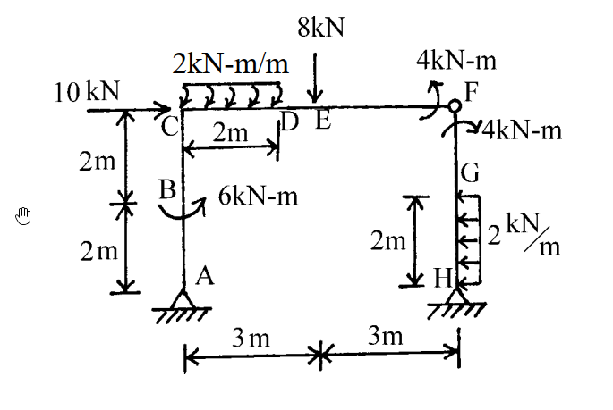
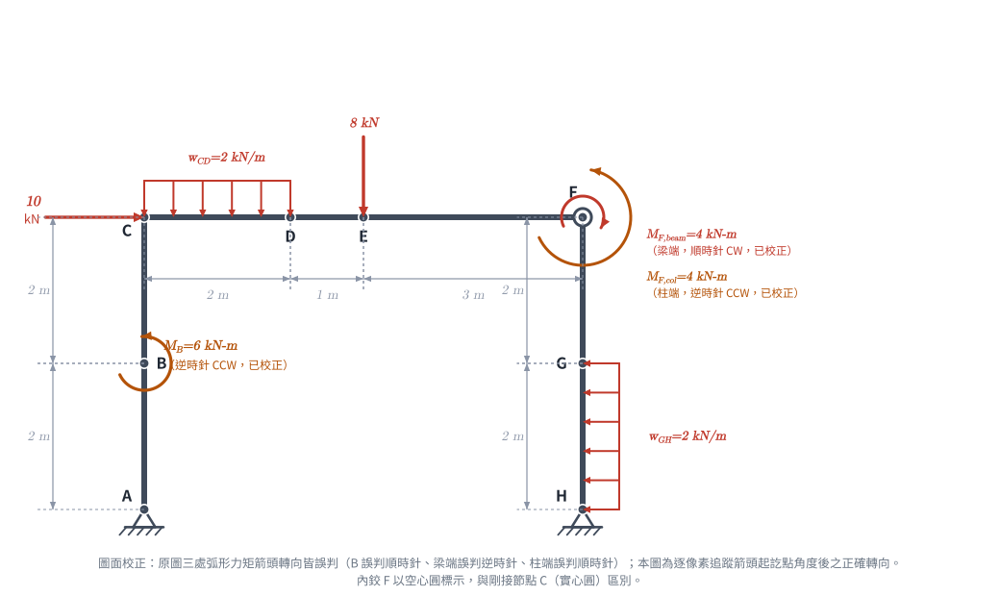
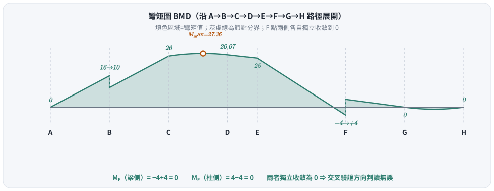

# 考題編號：SA-2002-1

**主分類：** `SA-U1-2` 靜定結構之分析
**分析法：** 靜定分析
**標籤：** `靜定剛架` `內鉸` `集中力矩` `剪力彎矩圖`

---

## 1. 原始題目重述 (Problem Restatement)
如下圖所示之剛架結構，點F 為內鉸，在各種外力作用下，試繪其軸力圖、剪力圖及彎矩圖。（25 分）

*圖說：本結構為一非對稱剛架，A點與H點為鉸支承。左側柱高4m，於y=2m處(B點)受6 kN-m逆時針集中彎矩；頂部C點受10 kN向右集中力。橫梁長6m，C到D(2m)受2 kN/m向下均布載重，E點(x=3m)受8 kN向下集中力。右側柱高4m，下半段H到G(2m)受2 kN/m向左均布載重。F點為內鉸，梁端與柱端各受4 kN-m之集中彎矩（梁端順時針，柱端逆時針；已逐像素比對原圖箭頭弧線確認轉向）。*

*圖 2　校正後之向量重繪。內鉸 F 以空心圓標示，與剛接節點 C（實心圓）明確區別；B、F 兩處弧形力矩的轉向皆為本次解析逐像素校正後的結果（原圖三處判讀恰好相反）。*

## 2. 考題核心精神與出題者意圖 (Core Concepts & Examiner's Intent)
本題測驗的核心觀念為**靜定結構的整體與局部平衡**，以及**內鉸與集中力矩的處理細節**。
出題者刻意在內鉸 F 點的相鄰桿端加上集中力矩（梁端 4 kN-m 順時針，柱端 4 kN-m 逆時針），藉此測驗考生是否清楚「內鉸本身彎矩為零，但緊鄰內鉸的桿端內力會因外部集中力矩而發生突變或不為零」的觀念。此外，左右側不同的均布載重與集中載重配置，考驗考生在計算支承反力與繪製內力圖時的細心程度。

## 3. 解題戰略地圖與陷阱分析 (Strategic Roadmap & Trap Analysis)
**作戰計畫：**
1. **分離體平衡：** 將結構由內鉸 F 點拆分為左右兩分離體（左：A-B-C-D-E-F，右：F-G-H）。
2. **求解反力：** 利用右側分離體對 H 點取矩求得 F 點水平剪力 $F_x$，再利用左側分離體對 A 點取矩求得 F 點垂直剪力 $F_y$。接著利用整體或各自分離體的 $\Sigma F_x=0$ 與 $\Sigma F_y=0$ 求解 A、H 的支承反力。
3. **分段內力計算：** 依據求得之反力，逐段計算軸力(N)、剪力(V)與彎矩(M)。
4. **繪製內力圖：** 標示關鍵點數值，特別注意集中力矩造成的彎矩圖跳躍，以及均布載重造成的二次拋物線。

**陷阱分析：**
- ⚠ **陷阱一：F點集中力矩的歸屬。** 鉸 F 本身不能承受彎矩，圖示的兩個 4 kN-m 集中力矩應視為分別作用於「梁 CF 的右端」與「柱 FH 的頂端」。在取分離體平衡時，必須將對應的力矩納入該分離體中。
- ⚠ **陷阱二：彎矩圖跳躍方向。** 在 B 點有 6 kN-m 的逆時針集中力矩，會造成彎矩圖發生跳躍；在判斷跳躍方向時，務必以分離體切面平衡為準，且務必仔細比對原圖弧形箭頭的實際轉向，不可憑印象猜測。
- ⚠ **陷阱三：柱頂與梁端的內力轉換。** 在剛節點 C 處，柱頂的彎矩與剪力將轉換為梁端的彎矩與軸力，轉換過程需繪製節點 C 的自由體圖確認符號與方向，確保平衡。

## 3.5 變數層次分析 (Variable Hierarchy Analysis)

### 最終目標
`求出所有支承反力，並精確繪製各桿件的軸力(AFD)、剪力(SFD)與彎矩圖(BMD)`

### 本題關鍵公式（依計算順序）
- 鉸接點拆解平衡（右部分）：$\sum M_H = 0 \implies F_x$
- 鉸接點拆解平衡（左部分）：$\sum M_A = 0 \implies F_y$
- 整體平衡求反力：$\sum F_x = 0 \implies A_x, H_x$，$\sum F_y = 0 \implies A_y, H_y$
- 桿件內力計算：$V(x) = \int -w(x) dx$，$M(x) = \int V(x) dx$

### L1：題目直接給定
- **符號 ∣ 數值 ∣ 說明**
  - $L_{AC}$ ∣ $4 \text{ m}$ ∣ 左柱高度
  - $L_{CF}$ ∣ $6 \text{ m}$ ∣ 橫梁長度
  - $L_{FH}$ ∣ $4 \text{ m}$ ∣ 右柱高度
  - $P_C$ ∣ $10 \text{ kN}$ (向右) ∣ C 點集中水平力
  - $M_B$ ∣ $6 \text{ kN-m}$ (逆時針) ∣ B 點集中力矩
  - $w_{CD}$ ∣ $2 \text{ kN/m}$ (向下) ∣ CD 段均布載重
  - $P_E$ ∣ $8 \text{ kN}$ (向下) ∣ E 點集中垂直力
  - $w_{GH}$ ∣ $2 \text{ kN/m}$ (向左) ∣ GH 段均布載重
  - $M_{F,beam}$ ∣ $4 \text{ kN-m}$ (順時針) ∣ F 點橫梁端集中力矩
  - $M_{F,col}$ ∣ $4 \text{ kN-m}$ (逆時針) ∣ F 點右柱端集中力矩

### L2：需知識點推導
**求解支承反力與鉸接力**
- **符號 ∣ 公式／來源 ∣ 卡關?**
  - $F_x, F_y$ ∣ F 點內鉸分離體平衡 ∣
  - $A_x, A_y$ ∣ 整體結構或左部分離體力平衡 ∣
  - $H_x, H_y$ ∣ 右部分離體力平衡 ∣

### L3：深層知識（不懂就卡住）
- **知識點 ∣ 說明 ∣ 卡關?**
  - **內鉸外加力矩處理** ∣ 內鉸 $M=0$，外部力矩應直接施加於分離體的桿端，不影響鉸本身的彎矩傳遞 ∣
  - **節點內力轉換** ∣ 剛接點 C 的柱頂剪力轉換為梁軸力，柱頂軸力轉換為梁剪力，彎矩則依節點平衡分配 ∣

## 4. 步驟化詳細計算過程 (Step-by-Step Detailed Calculation)

### Step 1: 拆解結構與反力計算

> **圖面校正說明：** 原圖 B、F 兩處集中力矩弧形箭頭的轉向，經放大並逐像素追蹤箭頭起訖點角度後重新確認為：B 點 6 kN-m **逆時針**、F 點梁端 4 kN-m **順時針**、F 點柱端 4 kN-m **逆時針**——與最初判讀（B 順時針、梁端逆時針、柱端順時針）三處恰好相反。下方反力與內力計算均以校正後之轉向為準；兩處內鉸邊界條件（$M_F=0$）最終計算結果精確為零，可交叉驗證方向判讀無誤（若沿用原判讀方向重算，兩處內鉸彎矩將無法同時歸零）。

將結構於 F 點拆開，設「左分離體作用於右分離體」在 F 點的力為 $(P,Q)$（$P$ 向右為正、$Q$ 向上為正）。

針對**右分離體 (F-G-H)**，H 為鉸支承有 $H_x, H_y$，另受柱端力矩 $M_{F,col}=4\text{ kN-m}$（逆時針）及 GH 段均布載重合力 $2\times2=4\text{ kN}$（向左，作用於 G-H 中點）。
- 對 H 點取力矩 $\sum M_H = 0$（逆時針為正）：
  $$ -P \times 4 + (2 \times 2) \times 1 \text{ (均布載重合力)} + 4 \text{ (柱端逆時針力矩)} = 0 $$
  $$ -4P + 4 + 4 = 0 \implies \boxed{P = 2 \text{ kN}} $$
- $\sum F_x = 0$：
  $$ H_x + P - (2 \times 2) = 0 \implies H_x + 2 - 4 = 0 \implies \boxed{H_x = 2 \text{ kN} \text{ (向右)}} $$

針對**左分離體 (A-B-C-D-E-F)**，F 點受右分離體之反作用力為 $(-P,-Q)=(-2,-Q)$，另受 B 點力矩 $M_B=6\text{ kN-m}$（逆時針）及梁端力矩 $M_{F,beam}=4\text{ kN-m}$（順時針）。
- 對 A 點取力矩 $\sum M_A = 0$（逆時針為正）：
  $$ 6 \text{ (B點逆時針力矩)} - 10 \times 4 \text{ (C點水平力)} - (2 \times 2) \times 1 \text{ (CD載重)} - 8 \times 3 \text{ (E點力)} - 4 \text{ (梁端順時針力矩)} + \left[6\times(-Q) - 4\times(-2)\right] = 0 $$
  $$ 6 - 40 - 4 - 24 - 4 - 6Q + 8 = 0 \implies -58 - 6Q = 0 \implies \boxed{Q = -\frac{29}{3} \text{ kN}} $$
- $\sum F_x = 0$：
  $$ A_x + 10 + (-P) = 0 \implies A_x + 10 - 2 = 0 \implies \boxed{A_x = -8 \text{ kN} \text{ (向左)}} $$
- $\sum F_y = 0$：
  $$ A_y - (2 \times 2) - 8 + (-Q) = 0 \implies A_y - 12 + \frac{29}{3} = 0 \implies \boxed{A_y = \frac{7}{3} \approx 2.33 \text{ kN} \text{ (向上)}} $$

回到右分離體求 $H_y$：
- $\sum F_y = 0 \implies H_y + Q = 0 \implies \boxed{H_y = \frac{29}{3} \approx 9.67 \text{ kN} \text{ (向上)}}$

**整體平衡驗證**：$\Sigma F_x = A_x+10+H_x-4 = -8+10+2-4=0$ ✓；$\Sigma F_y = A_y-4-8+H_y = \frac{7}{3}-12+\frac{29}{3}=0$ ✓。

### Step 2: 各桿件內力計算 (以受拉側為彎矩正向)

#### 1. 左側柱 (A-B-C)
- **A-B段 (y = 0 ~ 2m)**：
  - 軸力：$N = -A_y = \boxed{-\frac{7}{3} \text{ kN} \text{ (壓)}}$
  - 剪力：$V = A_x = \boxed{-8 \text{ kN}}$
  - 彎矩：$M(y) = 8y$ (左側受拉)。$M_A = \boxed{0}$，$M_B^- = 8\times2 = \boxed{16 \text{ kN-m}}$ (左側受拉)。
- **B-C段 (y = 2 ~ 4m)**：
  - 軸力與剪力不變：$N = \boxed{-\frac{7}{3} \text{ kN}}$，$V = \boxed{-8 \text{ kN}}$
  - B點有 6 kN-m **逆時針**外加力矩，使左側受拉**減少**：$M_B^+ = 16 - 6 = \boxed{10 \text{ kN-m}}$ (左側受拉)。
  - $M(y) = 8y-6$。至 C 點：$M_C = 8(4)-6 = \boxed{26 \text{ kN-m}}$ (左側受拉)。

#### 2. 剛節點 C 之平衡
柱頂 C 點提供 26 kN-m (左側受拉)，直接轉換為梁左端 26 kN-m 之彎矩 (底部受拉)：$M_{CD}(0) = \boxed{+26 \text{ kN-m}}$。
柱頂剪力 8 kN 與外力 10 kN (向右) 於節點處平衡後，橫梁軸力為 $\boxed{0}$。柱頂軸力 $7/3$ kN 轉換為橫梁左端剪力 $V_{CD}(0) = \boxed{+\frac{7}{3} \text{ kN}}$。

#### 3. 橫梁 (C-D-E-F)
- **C-D段 (x = 0 ~ 2m)**：
  - 軸力：$N = \boxed{0}$
  - 剪力：$V(x) = \frac{7}{3} - 2x$。$V_C = \boxed{\frac{7}{3} \text{ kN}}$，$V_D = \frac{7}{3}-4 = \boxed{-\frac{5}{3} \text{ kN}}$。剪力過零點在 $x = \frac{7}{6} \text{ m}$。
  - 彎矩：$M(x) = 26 + \frac{7}{3}x - x^2$ (底部受拉)。
    最大彎矩：$M_{max} = M\left(\frac{7}{6}\right) = 26 + \frac{49}{36} = \boxed{\frac{985}{36} \approx 27.36 \text{ kN-m}}$。
    $M_D = 26 + \frac{14}{3} - 4 = \boxed{\frac{80}{3} \approx 26.67 \text{ kN-m}}$。
- **D-E段 (x = 2 ~ 3m)**：
  - 軸力：$N = \boxed{0}$
  - 剪力：$V = \boxed{-\frac{5}{3} \text{ kN}}$ (常數)
  - 彎矩：線性變化。$M_E = \frac{80}{3} - \frac{5}{3} \times 1 = \boxed{25 \text{ kN-m}}$ (底部受拉)。
- **E-F段 (x = 3 ~ 6m)**：
  - 軸力：$N = \boxed{0}$
  - E點有 8 kN 向下外力。剪力：$V = -\frac{5}{3} - 8 = \boxed{-\frac{29}{3} \text{ kN}}$ (常數)。
  - 彎矩：線性變化。$M_F^- = 25 - \frac{29}{3} \times 3 = 25 - 29 = \boxed{-4 \text{ kN-m}}$ (即頂部受拉 4 kN-m)。
  - F點梁端有**順時針** 4 kN-m 外部集中力矩，貢獻 $+4$：$M_F = -4+4 = \boxed{0 \text{ kN-m}}$ ✓ 與內鉸零彎矩條件完全吻合。

#### 4. 右側柱 (H-G-F)
- **H-G段 (y = 0 ~ 2m)**：
  - 軸力：$N = -H_y = \boxed{-\frac{29}{3} \text{ kN} \text{ (壓)}}$
  - 剪力：$V(y) = H_x - 2y = 2-2y$。$V_H = \boxed{2 \text{ kN}}$，$V_G = 2-4 = \boxed{-2 \text{ kN}}$。
  - 彎矩：$M(y) = 2y - y^2$ (右側受拉)。
    $M_H = \boxed{0}$，中點 $y=1$ 處出現局部反曲：$M(1) = \boxed{-1 \text{ kN-m}}$ (短暫左側受拉)，$M_G = 4-4 = \boxed{0}$。
- **G-F段 (y = 2 ~ 4m)**：
  - 軸力：$N = \boxed{-\frac{29}{3} \text{ kN} \text{ (壓)}}$
  - 剪力：$V = \boxed{-2 \text{ kN}}$ (常數)
  - 彎矩：$M(y) = 2y-4$ (右側受拉)。$M_G = \boxed{0}$，$M_F^- = 2(4)-4 = \boxed{4 \text{ kN-m}}$。
  - F點柱端有**逆時針** 4 kN-m 外部集中力矩，貢獻 $-4$：$M_F = 4-4 = \boxed{0 \text{ kN-m}}$ ✓ 與內鉸零彎矩條件完全吻合。

### Step 3: 繪製 AFD、SFD 與 BMD
*(詳細圖形請參照手繪補充)*
- **AFD**：左柱恆為 $-7/3$，橫梁為 $0$，右柱恆為 $-29/3$。
- **SFD**：左柱恆為 $-8$；橫梁由 $7/3$ 降至 $-5/3$，再階梯降至 $-29/3$；右柱由 $2$ 線性降至 $-2$，其後維持 $-2$。
- **BMD** (畫於受拉側)：
  - **左柱(左側)**：0 $\xrightarrow{直線}$ 16 (跳躍至10) $\xrightarrow{直線}$ 26。
  - **橫梁(下側)**：26 $\xrightarrow{二次曲線，峰值27.36於x=7/6}$ 26.67 $\xrightarrow{直線}$ 25 $\xrightarrow{直線}$ 0。
  - **右柱(右側)**：0 $\xrightarrow{二次曲線，y=1處出現-1的短暫反曲}$ 0 $\xrightarrow{直線}$ 4 (跳躍至0)。

*圖 3　BMD 路徑展開圖。內鉸 F 的梁側（−4+4=0）與柱側（4−4=0）各自獨立收斂到精確的 0，是校正後方向判讀是否正確的最有效自我檢查。*

## 5. 關鍵爭議點與進階探討 (Critical Issues & Advanced Discussion)
本題最大的考驗在於 F 點「雙集中力矩」的解讀。部分考生可能會誤將 4 kN-m 力矩直接加總或互相抵銷，而忽略了它們分別作用在內鉸兩側的實體桿件上。
標準作法是將它們**視為作用於分離體桿端的外力**，這樣一來內鉸本身的彎矩 $M=0$ 條件依然成立，且桿端的內部彎矩能與這些外部力矩完美平衡。解題時強烈建議如 Step 1 般拆解為左右兩自由體，即可避免符號混淆與漏算。

- **弧形力矩箭頭的判讀陷阱**：本題另一個容易出錯、且極隱蔽的環節，是原圖上 B、F 兩處集中力矩以手繪弧線＋箭頭表示轉向，肉眼一瞥容易判斷反向（本解析初版即誤將三處方向全部看反）。校正方法：找出弧線兩端何處有箭頭barb（有箭頭barb的一端為終點），沿弧線由起點掃到終點，判斷掃過的是順時針或逆時針路徑；必要時可將圖片局部放大甚至以像素座標描點確認。**內鉸兩側彎矩最終需精確為零**是最有效的自我檢查——只要方向設定正確，$M_F$（梁側）與 $M_F$（柱側）分別獨立計算都會精確收斂到 0，任何一處對不齊就代表某個力矩方向（或計算）有誤。

---

*圖解補繪：2026-08-27（向量圖，腳本 `gen_SA-2002-1.py`，可重跑）*
