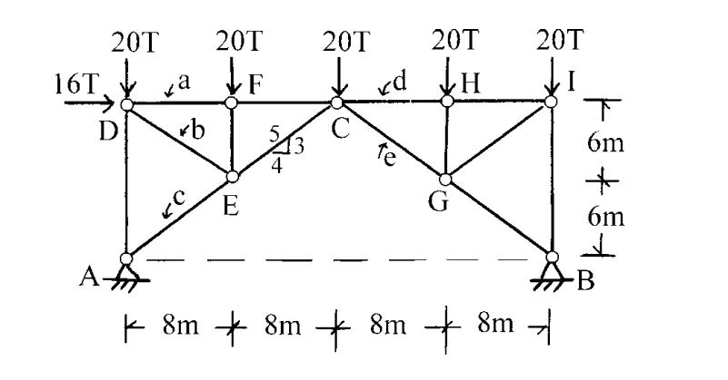

# 考題編號：SA-2002-2

**主分類：** `SA-U1-2` 靜定結構分析
**分析法：** 靜定分析 (截面法與節點法)
**標籤：** `桁架分析` `截面法` `節點法` `繫索桁架`

---

## 1. 原始題目重述 (Problem Restatement)
如圖所示之桁架，在圖示之荷重作用時，試求桿件 a、b、c、d、e 之軸力（標明拉力或壓力）。

*圖說：桁架跨度共 4 段 8m（總跨度 32m），高度 2 段 6m（總高度 12m）。A 端為鉸支承，B 端為滾支承。A、B 之間有虛線相連，代表底部為繫索 (tie rod)。頂部節點受力為：D 點受水平向右 16T 及垂直向下 20T；F、C、H、I 點各受垂直向下 20T。求 a(DF)、b(DE)、c(AE)、d(CH)、e(CG) 桿件內力。*

## 2. 考題核心精神與出題者意圖 (Core Concepts & Examiner's Intent)
- **虛線的物理意義**：本題最大的陷阱在於 A、B 之間的虛線。若視為無構件，則該桁架機構不穩定（$m+r < 2j$）；出題者以虛線暗示此為**帶繫索桁架 (Tied Arch/Truss)**，底部的虛線 AB 是一根承受拉力的繫索，使結構滿足靜定條件，這考驗考生對結構穩定性的判斷。
- **截面法與節點法的靈活切換**：本題無法單純從支承節點 A 開始節點法（因為有 $A_x, A_y, F_{AD}, F_{AE}, F_{AB}$ 共 5 個未知數，超出平衡方程式數量）。出題者意在測驗考生能否先利用**截面法**切開整體結構，求出底部繫索 AB 的內力後，再回到各節點使用**節點法**逐步解出各桿內力。

## 3. 解題戰略地圖與陷阱分析 (Strategic Roadmap & Trap Analysis)
1. **整體平衡求反力**：將整個桁架視為剛體，求出支承 A、B 之反力。
2. **截面法求繫索 AB 內力**：於 F、E 節點與 C 節點之間作一垂直截面，取左半部（或右半部）為自由體，取 C 點為彎矩中心，可直接求出繫索 AB 之張力。
3. **節點法依序推導**：
   - 具有 $F_{AB}$ 後，取節點 A 建立平衡，求出 c 桿 (AE)。
   - 取節點 D 建立平衡，求出 a 桿 (DF) 與 b 桿 (DE)。
   - 利用截面法（切 C、H 之間），取 G 點求 d 桿 (CH) 及 e 桿 (CG) 內力，或直接由右側進行節點法推導。
   
**陷阱警告 (Traps)**：
- 陷阱一：忽略 AB 桿的存在，導致節點力不平衡而產生矛盾。
- 陷阱二：計算力臂時幾何尺寸判讀錯誤（如 C 點座標為 $x=16, y=12$，G 點為 $x=24, y=6$）。

## 3.5 變數層次分析 (Variable Hierarchy Analysis)

### 最終目標
求出指定桁架桿件 a、b、c、d、e 的內力大小並標明拉力或壓力。

### 本題關鍵公式（依計算順序）
$$ \sum M_A = 0 \implies \text{求出支承反力 } B_y $$
$$ \sum M_C (\text{左半部}) = 0 \implies \text{求出繫索 } \boxed{F_{AB}} $$
$$ \text{節點 A 平衡} \implies \text{求出 } \boxed{F_{AE}} \text{ (c桿)} $$
$$ \text{節點 D 平衡} \implies \text{求出 } \boxed{F_{DF}} \text{ (a桿), } \boxed{F_{DE}} \text{ (b桿)} $$
$$ \sum M_G (\text{右半部}) = 0 \implies \text{求出 } \boxed{F_{CH}} \text{ (d桿)} $$
$$ \sum F_y (\text{右半部}) = 0 \implies \text{求出 } \boxed{F_{CG}} \text{ (e桿)} $$

### L1：題目直接給定
- 符號 ∣ 數值 ∣ 說明
  - $P_D$ ∣ 16T(→), 20T(↓) ∣ 節點 D 載重
  - $P_F, P_C, P_H, P_I$ ∣ 20T(↓) ∣ 各頂部節點載重
  - $\text{Span}$ ∣ 8m × 4 ∣ 桁架水平分段
  - $\text{Height}$ ∣ 6m × 2 ∣ 桁架垂直分段

### L2：需知識點推導
**一、整體反力計算**
- 符號 ∣ 公式／來源 ∣ 卡關?
  - $B_y$ ∣ $\sum M_A = 0$ ∣
  - $A_y$ ∣ $\sum F_y = 0$ ∣
  - $A_x$ ∣ $\sum F_x = 0$ ∣

**二、截面法與節點法求內力**
- 符號 ∣ 公式／來源 ∣ 卡關?
  - $F_{AB}$ ∣ 截面法（切 FC、EC、AB），$\sum M_C = 0$ ∣
  - $F_{AE}$ ∣ 節點 A，$\sum F_x = 0$ ∣
  - $F_{DF}, F_{DE}$ ∣ 節點 D，$\sum F_x = 0, \sum F_y = 0$ ∣
  - $F_{CH}$ ∣ 截面法（切 CH、CG、AB），$\sum M_G = 0$ ∣
  - $F_{CG}$ ∣ 右半部自由體，$\sum F_y = 0$ ∣

### L3：深層知識（不懂就卡住）
- 知識點 ∣ 說明 ∣ 卡關?
  - **機構穩定性與虛線意義** ∣ 若無 AB 桿，桁架度數不足形成不穩定機構；虛線代表張力繫索，必須視為一構件參與受力。 ∣

## 4. 步驟化詳細計算過程 (Step-by-Step Detailed Calculation)

### 步驟一：求整體支承反力
將桁架視為一整體，建立平衡方程式：
1. **水平方向力平衡**：
   $$ \sum F_x = 0 \implies A_x + 16 = 0 \implies A_x = -16\text{ T} \text{ (向左)} $$
2. **對 A 點取彎矩**：
   $$ \sum M_A = 0 \implies B_y (32) - 16(12) - 20(8) - 20(16) - 20(24) - 20(32) = 0 $$
   $$ 32 B_y - 192 - 160 - 320 - 480 - 640 = 0 $$
   $$ 32 B_y = 1792 \implies B_y = 56\text{ T} \text{ (向上)} $$
3. **垂直方向力平衡**：
   $$ \sum F_y = 0 \implies A_y + 56 - (20 \times 5) = 0 \implies A_y = 44\text{ T} \text{ (向上)} $$

### 步驟二：求底部繫索 AB 之內力
以截面法切開構件 FC、EC、AB，取**左半部**為自由體。
為了求 $F_{AB}$，對 C 點 $(x=16, y=12)$ 取彎矩（此時 FC 與 EC 之內力通過 C 點，力矩為零）：
左半部受力包含 $A_x, A_y$ 及 D、F 點之外力。
- 順時針彎矩為負，逆時針為正：
  - $A_y$ 對 C 點：$-44 \times 16 = -704$
  - $A_x$ 對 C 點（作用線在 $y=0$）：$-16 \times 12 = -192$
  - $D_y$ 對 C 點：$+20 \times 16 = +320$
  - $D_x$ 對 C 點（作用線在 $y=12$）：力臂為 $0 \implies 0$
  - $F_y$ 對 C 點：$+20 \times 8 = +160$
  - $F_{AB}$ 對 C 點（假設拉力向右，作用線在 $y=0$）：$+F_{AB} \times 12$
$$ \sum M_C = -704 - 192 + 320 + 160 + 12 F_{AB} = 0 $$
$$ 12 F_{AB} = 416 \implies F_{AB} = \frac{104}{3}\text{ T (拉力)} $$

### 步驟三：求 c 桿 (AE) 內力
取**節點 A** 作為自由體，未知力為 $F_{AD}$ 及 $F_{AE}$ (c 桿)。
已知 $A_x = 16\text{ T}$ (向左), $A_y = 44\text{ T}$ (向上), $F_{AB} = \frac{104}{3}\text{ T}$ (向右拉力)。
由幾何關係，AE 桿水平投影為 8m，垂直投影為 6m，斜長為 10m（斜率 3:4:5）。
$$ \sum F_x = 0 \implies -16 + F_{AB} + F_{AE} \left(\frac{4}{5}\right) = 0 $$
$$ -16 + \frac{104}{3} + \frac{4}{5} F_{AE} = 0 \implies \frac{56}{3} + \frac{4}{5} F_{AE} = 0 $$
$$ \frac{4}{5} F_{AE} = -\frac{56}{3} \implies \boxed{F_{AE} = -\frac{70}{3}\text{ T} \text{ (壓力)}} \quad \text{... (c 桿)} $$
*(註：同時由 $\sum F_y=0$ 可求得 $F_{AD} = -30\text{ T}$)*

### 步驟四：求 a 桿 (DF) 與 b 桿 (DE) 內力
取**節點 D** 作為自由體。
已知外力 16T(→), 20T(↓)，以及剛求出的 $F_{AD} = 30\text{ T}$ (壓力，對 D 點為向上推頂)。
DE 桿斜率與 AE 相同，垂直 6m，水平 8m (3:4:5)。
$$ \sum F_y = 0 \implies -20 + 30 - F_{DE} \left(\frac{3}{5}\right) = 0 \quad (\text{假設 } F_{DE} \text{ 為拉力向下}) $$
$$ 10 = \frac{3}{5} F_{DE} \implies \boxed{F_{DE} = \frac{50}{3}\text{ T} \text{ (拉力)}} \quad \text{... (b 桿)} $$
$$ \sum F_x = 0 \implies 16 + F_{DF} + F_{DE} \left(\frac{4}{5}\right) = 0 $$
$$ 16 + F_{DF} + \frac{50}{3} \times \frac{4}{5} = 0 \implies 16 + F_{DF} + \frac{40}{3} = 0 $$
$$ F_{DF} = -16 - \frac{40}{3} = -\frac{88}{3}\text{ T} \implies \boxed{F_{DF} = -\frac{88}{3}\text{ T} \text{ (壓力)}} \quad \text{... (a 桿)} $$

### 步驟五：求 d 桿 (CH) 與 e 桿 (CG) 內力
以截面法切開構件 CH、CG、AB，取**右半部**為自由體。
外力包含 H 點 20T(↓)、I 點 20T(↓)、支承 B 反力 56T(↑)。
為了求 $F_{CH}$，對 G 點 $(x=24, y=6)$ 取彎矩（此時 $F_{CG}$ 力矩為零）：
- $F_{AB}$ 對 G 點（拉力作用向左）：順時針 $(-)$，力臂 6m $\implies -\frac{104}{3} \times 6 = -208$
- H 點載重對 G 點：力臂為 0
- I 點載重對 G 點：順時針 $(-)$，力臂 8m $\implies -20 \times 8 = -160$
- B 點反力對 G 點：逆時針 $(+)$，力臂 8m $\implies +56 \times 8 = +448$
- $F_{CH}$ 對 G 點（假設拉力向左）：逆時針 $(+)$，力臂 6m $\implies +6 F_{CH}$
$$ \sum M_G = -208 - 160 + 448 + 6 F_{CH} = 0 $$
$$ 80 + 6 F_{CH} = 0 \implies \boxed{F_{CH} = -\frac{40}{3}\text{ T} \text{ (壓力)}} \quad \text{... (d 桿)} $$

為求 $F_{CG}$，考慮右半部垂直方向力平衡：
$$ \sum F_y = 0 \implies -20 \text{ (H點)} - 20 \text{ (I點)} + 56 \text{ (B點)} + F_{CG} \left(\frac{3}{5}\right) = 0 $$
*(註：若 $F_{CG}$ 為拉力，對右半部作用方向為左上，故有向上分量)*
$$ 16 + \frac{3}{5} F_{CG} = 0 \implies \boxed{F_{CG} = -\frac{80}{3}\text{ T} \text{ (壓力)}} \quad \text{... (e 桿)} $$

### 最終解答統整
- **a 桿 (DF)**：$88/3\text{ T} \text{ (壓力)}$
- **b 桿 (DE)**：$50/3\text{ T} \text{ (拉力)}$
- **c 桿 (AE)**：$70/3\text{ T} \text{ (壓力)}$
- **d 桿 (CH)**：$40/3\text{ T} \text{ (壓力)}$
- **e 桿 (CG)**：$80/3\text{ T} \text{ (壓力)}$

## 5. 關鍵爭議點與進階探討 (Critical Issues & Advanced Discussion)
- **虛線的詮釋**：實務與考題中，支承之間的虛線經常代表埋在地下或不明顯的「繫索」(Tie Rod)。許多考生若誤判虛線不是構件，會直接由節點 A 開始計算，隨即發現水平力無法平衡，進而陷入死胡同。判定其為繫索是本題能順利解開的先決關鍵。
- **整體與局部平衡的穿插**：遇到有繫索的桁架結構，**必須**先透過截面法與彎矩平衡方程式找出繫索內力，才能進一步使用節點法。這種截面法與節點法交替使用的技巧，是國家考試評估考生對力學平衡透徹理解的常見手法。
