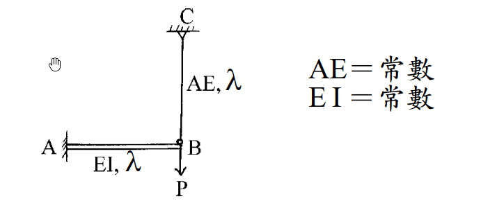

# 考題編號：[SA-2002-3]

**主分類：** `SA-U2` 靜不定結構分析
**副分類：** `SA-U2-2` 諧合變位法
**分析法：** 諧合變位法
**標籤：** `靜不定結構` `諧合變位法` `勁度法` `複合結構`

---

## 1. 原始題目重述 (Problem Restatement)
   - 題幹：如圖所示之梁，B 點用相同材料之桿吊掛。試求 B 點垂直位移。（25 分）
   - 結構型式：複合結構（由懸臂梁與吊桿組成）。
   - 幾何尺寸與材料性質：
     - 梁 AB：長度 $\lambda$，撓曲剛度 $EI$ 為常數。
     - 吊桿 CB：長度 $\lambda$，軸向剛度 $AE$ 為常數。
   - 支撐條件：
     - A 點：固定端。
     - C 點：鉸接或固定端（因吊桿僅承受軸力，支承型式對結果無影響）。
   - 載重：B 點受一向下垂直集中載重 $P$。
   - 圖片引用：
     
     *圖說：梁 AB 與桿 CB 長度皆標示為 $\lambda$。梁之撓曲剛度為 $EI$，桿之軸向剛度為 $AE$。節點 B 點受向下集中載重 $P$。*

## 2. 考題核心精神與出題者意圖 (Core Concepts & Examiner's Intent)
   - 核心觀念：複合結構（梁與軸力桿結合）的變位諧合（位移一致性）。梁承受彎矩變形，桿承受軸力變形，兩者在節點 B 處的垂直位移必須相同。
   - 出題者意圖：測驗考生能否正確運用諧合變位法（力法）或節點勁度法（位移法）來解析一次靜不定結構，並理解兩者之等效關係與適用情境。

## 3. 解題戰略地圖與陷阱分析 (Strategic Roadmap & Trap Analysis)
   - **作戰計畫**：
     1. 方法一（諧合變位法）：將結構於 B 點切開，以吊桿張力 $T$ 為多餘力。分別寫出梁在 B 點因載重 $P$ 及多餘力 $T$ 產生的變位，以及桿因張力 $T$ 產生的伸長量，由兩者位移相等求得 $T$，再代回求 B 點位移。
     2. 方法二（直接勁度法）：將 B 點視為單一自由度系統（僅考慮垂直位移）。分別計算梁在 B 點的垂直抗推勁度與桿的軸向勁度，相加後以公式 $P=K_{total}\Delta$ 直接求解位移。
   - **陷阱分析**：
     - 符號混淆：題目中長度符號使用 $\lambda$（lambda）而非慣用的 $L$，計算與書寫時需注意代數符號不要習慣性寫成 $L$ 導致閱卷者誤判。
     - 剛度組合：梁的彎曲變形與 $EI$ 有關，桿的軸向變形與 $AE$ 有關，最終答案必然同時包含此二項參數。若公式推導錯誤，可能會將兩者剛度錯誤相加或量綱不對。

## 3.5 變數層次分析 (Variable Hierarchy Analysis)

   ### 最終目標
   `求出節點 B 在受力 P 作用下的垂直向下位移量 \Delta_B`

   ### 本題關鍵公式（依計算順序）
   - B 點的梁結構垂直抗推勁度：$K_b = \frac{3EI}{\lambda^3}$
   - B 點的桿結構軸向勁度：$K_r = \frac{AE}{\lambda}$
   - 總節點勁度：$\boxed{K_{total}} = K_b + K_r$
   - 位移求解：$\Delta_B = \frac{P}{\boxed{K_{total}}}$

   ### L1：題目直接給定
   | 符號 | 數值 | 說明 |
   |:---|:---|:---|
   | $P$ | $P$ | B 點向下集中載重 |
   | $L_b$ | $\lambda$ | 梁 AB 長度 |
   | $L_r$ | $\lambda$ | 桿 CB 長度 |
   | $EI$ | $EI$ | 梁 AB 撓曲剛度 |
   | $AE$ | $AE$ | 桿 CB 軸向剛度 |

   ### L2：需知識點推導
   **節點等效勁度**
   | 符號 | 公式／來源 | 卡關? |
   |:---|:---|:---|
   | $K_b$ | $\frac{3EI}{L_b^3}$ | |
   | $K_r$ | $\frac{AE}{L_r}$ | |
   | $\Delta_B$ | $\frac{P}{K_b + K_r}$ | |

   ### L3：深層知識（不懂就卡住）
   | 知識點 | 說明 | 卡關? |
   |:---|:---|:---|
   | 複合結構諧合變形 | 梁的彎曲撓度與桿的軸向伸長量在交接點必須一致 | |
   | 單一自由度等效勁度 | 若節點只有一個方向的變位，其勁度可視為各並聯構件之勁度相加 | |

## 4. 步驟化詳細計算過程 (Step-by-Step Detailed Calculation)

### 方法一：諧合變位法（力法）

**Step 1：選擇多餘力**
將結構於 B 點解開，設吊桿 CB 承受之軸向拉力為 $T$。
此拉力 $T$ 將向上作用於懸臂梁 AB 的端點 B，並向下作用於吊桿 CB 的端點 B。

**Step 2：計算梁結構之 B 點變位**
懸臂梁 AB 端點 B 受向下集中外力 $P$ 與向上吊桿拉力 $T$ 作用，故向下的總淨載重為 $(P - T)$。
依據懸臂梁端點受集中力之撓度公式 $\delta = \frac{FL^3}{3EI}$，
梁 AB 在 B 點的向下垂直變位為：
$$ \Delta_{B, beam} = \frac{(P - T)\lambda^3}{3EI} $$

**Step 3：計算桿結構之 B 點變位**
吊桿 CB 受拉力 $T$ 作用，依據軸向變形公式 $\delta = \frac{NL}{AE}$，
桿 CB 之伸長量（即 B 點向下位移）為：
$$ \Delta_{B, rod} = \frac{T\lambda}{AE} $$

**Step 4：建立諧合方程式並求解多餘力**
由於梁與桿在 B 點物理連接，兩者產生之變位必須一致（變位諧合條件）：
$$ \Delta_{B, beam} = \Delta_{B, rod} $$
$$ \frac{(P - T)\lambda^3}{3EI} = \frac{T\lambda}{AE} $$

將方程式兩邊同除以 $\lambda$，並將含有 $T$ 的項移至等號右邊整理：
$$ \frac{P\lambda^2}{3EI} - \frac{T\lambda^2}{3EI} = \frac{T}{AE} $$
$$ \frac{P\lambda^2}{3EI} = T \left( \frac{1}{AE} + \frac{\lambda^2}{3EI} \right) $$
通分右式括號內項目：
$$ \frac{P\lambda^2}{3EI} = T \left( \frac{3EI + AE\lambda^2}{3EI \cdot AE} \right) $$
交叉相乘解得拉力 $T$：
$$ T = \frac{P\lambda^2}{3EI} \cdot \frac{3EI \cdot AE}{3EI + AE\lambda^2} = \frac{P\lambda^2 \cdot AE}{3EI + AE\lambda^2} $$

**Step 5：計算 B 點垂直位移**
將 $T$ 代回桿 CB 的變形公式，可得 B 點垂直向下位移 $\Delta_B$：
$$ \Delta_B = \frac{T\lambda}{AE} = \frac{\frac{P\lambda^2 \cdot AE}{3EI + AE\lambda^2} \cdot \lambda}{AE} $$
$$ \boxed{ \Delta_B = \frac{P\lambda^3}{3EI + AE\lambda^2} } \quad (\text{向下}) $$

---

### 方法二：直接勁度法（位移法）

**Step 1：建立單一自由度系統**
結構僅在 B 點有未知的垂直位移 $\Delta_B$（不考慮 B 點微小轉角對軸力桿的影響），故可將 B 點視為單一自由度節點，求其總勁度 $K_{total}$。

**Step 2：計算各構件對 B 點之垂直勁度**
- 懸臂梁 AB 對端點垂直位移之抗推勁度（彈簧常數）：
  $$ K_b = \frac{3EI}{\lambda^3} $$
- 吊桿 CB 對端點垂直位移之軸向勁度（彈簧常數）：
  $$ K_r = \frac{AE}{\lambda} $$

**Step 3：組裝總勁度並求解位移**
兩構件在 B 點為並聯關係，總勁度 $K_{total}$ 為兩者之和：
$$ K_{total} = K_b + K_r = \frac{3EI}{\lambda^3} + \frac{AE}{\lambda} = \frac{3EI + AE\lambda^2}{\lambda^3} $$

根據力與變位關係式 $P = K_{total} \cdot \Delta_B$，可直接求得：
$$ \Delta_B = \frac{P}{K_{total}} = \frac{P}{\frac{3EI + AE\lambda^2}{\lambda^3}} $$
$$ \boxed{ \Delta_B = \frac{P\lambda^3}{3EI + AE\lambda^2} } \quad (\text{向下}) $$

## 5. 關鍵爭議點與進階探討 (Critical Issues & Advanced Discussion)
   - 本題完美展現了力法（諧合變位法）與位移法（勁度法）的殊途同歸。對於單一節點自由度的複合結構，使用**位移法（直接相加勁度）**通常較為直觀且不易計算錯誤。
   - 在考場上，若題目未指定分析方法，強烈建議使用直接勁度法（方法二）秒殺此題，但也可將諧合變位法（方法一）列出作為驗算工具，確保滿分萬無一失。
   - 需再次提醒，題目給的長度符號為 $\lambda$。遇到非慣用符號時，應仔細對應量綱與單位，例如 $EI/\lambda^3$ 與 $AE/\lambda$ 兩者量綱皆為「力量/長度」，確認單位一致無誤後即可放心作答。
