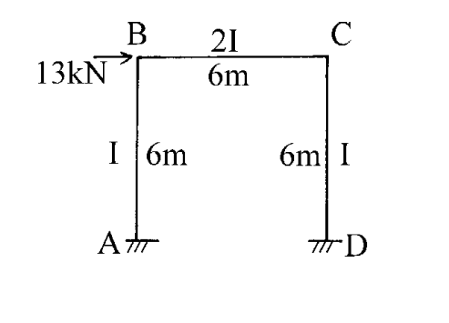

# 考題編號：[SA-2002-4]

**主分類：** `SA-U2-3` 結構靜不定分析
**副分類：** 無
**分析法：** 傾角變位法
**標籤：** `傾角變位法` `有側移剛架` `反對稱變形`

---

## 1. 原始題目重述 (Problem Restatement)
**四、試用傾角變位法(Slope-deflection method)解此剛架，並作彎矩圖。E＝常數。（25 分）**

本題為一單層單跨平面剛架，承受節點水平集中載重：
- **幾何尺寸**：柱 $AB$ 長度 $6\text{ m}$，梁 $BC$ 長度 $6\text{ m}$，柱 $CD$ 長度 $6\text{ m}$。
- **邊界條件**：節點 A 與 D 為固定端 (Fixed supports)。
- **斷面性質**：柱 $AB$ 與 $CD$ 之慣性矩為 $I$，梁 $BC$ 之慣性矩為 $2I$；彈性模數 $E$ 為常數。
- **外加載重**：節點 B 承受向右之水平集中載重 $13\text{ kN}$。

*圖說：剛架 ABCD，A、D固定，柱高6m、梁長6m，B點受13kN向右水平力，梁斷面為2I，柱為I。*

## 2. 考題核心精神與出題者意圖 (Core Concepts & Examiner's Intent)
- **有側移分析**：本題承受非對稱之水平載重，結構必然發生側移（Sway）。出題者主要測驗考生是否能正確建立並解出包含側移角 $\psi$ 的層剪力方程式（Shear condition）。
- **相對勁度與傾角變位法符號約定**：測驗考生是否能正確寫出各桿件的傾角變位方程式，特別是處理梁與柱慣性矩不同 ($I$ vs $2I$) 時的相對勁度 $K$，以及固端彎矩為零情況下的基本式。

## 3. 解題戰略地圖與陷阱分析 (Strategic Roadmap & Trap Analysis)
1. **定義未知數**：因 A、D 為固定端，$\theta_A = \theta_D = 0$。未知數為節點旋轉角 $\theta_B$、$\theta_C$ 以及側移角 $\psi$。
2. **建立傾角變位方程式**：寫出 $M_{AB}, M_{BA}, M_{BC}, M_{CB}, M_{CD}, M_{DC}$ 關於 $\theta_B, \theta_C, \psi$ 之方程式。
3. **建立平衡方程式**：
   - 節點 B 彎矩平衡：$\Sigma M_B = 0 \Rightarrow M_{BA} + M_{BC} = 0$
   - 節點 C 彎矩平衡：$\Sigma M_C = 0 \Rightarrow M_{CB} + M_{CD} = 0$
   - 整體剪力平衡（側移方程式）：切開兩柱求層剪力，建立水平力平衡 $\Sigma F_x = 0$。
4. **解聯立方程式**：解出 $\theta_B, \theta_C, \psi$ 後，代回求各桿端彎矩。
5. **繪製彎矩圖 (BMD)**：依據算出的桿端彎矩數值與正負號，判斷受拉側，繪製 BMD。

**陷阱分析**：
- **層剪力方程式的符號**：建立水平力平衡時，必須極度小心剪力方向與桿端彎矩正負號的關係，推導出 $M_{AB} + M_{BA} + M_{CD} + M_{DC} + 13 \times 6 = 0$。若正負號寫錯，將導致整個結果完全錯誤。
- **梁柱勁度不同**：梁 $BC$ 的 $I$ 為 $2I$，柱為 $I$，代入傾角變位公式時易忘記乘上倍數。

## 3.5 變數層次分析 (Variable Hierarchy Analysis)

### 最終目標
`求出各桿端彎矩並繪製剛架之彎矩圖 (BMD)。`

### 本題關鍵公式（依計算順序）
- 傾角變位方程式：
  $$ M_{ij} = \frac{2EI_{ij}}{L} \left( 2\theta_i + \theta_j - 3\psi \right) + FEM_{ij} $$
- 節點彎矩平衡：
  $$ \sum M_B = 0 \Rightarrow M_{BA} + M_{BC} = 0 $$
  $$ \sum M_C = 0 \Rightarrow M_{CB} + M_{CD} = 0 $$
- 層剪力方程式（側移方程）：
  $$ \boxed{M_{AB}} + \boxed{M_{BA}} + \boxed{M_{CD}} + \boxed{M_{DC}} + H \cdot L = 0 $$

### L1：題目直接給定
| 符號 | 數值 | 說明 |
|---|---|---|
| $L_{AB}, L_{BC}, L_{CD}$ | $6\text{ m}$ | 柱與梁之長度 |
| $I_{AB}, I_{CD}$ | $I$ | 柱之慣性矩 |
| $I_{BC}$ | $2I$ | 梁之慣性矩 |
| $P$ | $13\text{ kN}$ | 節點 B 之水平載重（向右） |

### L2：需知識點推導
**相對勁度與固端彎矩**
| 符號 | 公式／來源 | 卡關? |
|---|---|---|
| $K_{AB}$ | $I/6$ | |
| $K_{BC}$ | $2I/6 = I/3$ | |
| $K_{CD}$ | $I/6$ | |
| $\psi$ | $\Delta/6$ | |
| $FEM$ | $0$ (無構件載重) | |

### L3：深層知識（不懂就卡住）
| 知識點 | 說明 | 卡關? |
|---|---|---|
| 側移方程式推導 | 利用柱之自由體圖，柱頂與柱底剪力與彎矩之關係，配合整體水平平衡求得。 | |
| 對稱性判斷 | 結構幾何與勁度對稱，承受反對稱側向載重，變形將呈反對稱。 | |

## 4. 步驟化詳細計算過程 (Step-by-Step Detailed Calculation)

### Step 1：建立傾角變位方程式
本題無構件載重，故所有固端彎矩 $FEM = 0$。
節點 A、D 為固定端，$\theta_A = \theta_D = 0$。
令柱與梁之相對側移角為 $\psi_{AB} = \psi_{CD} = \psi$，梁無側移 $\psi_{BC} = 0$。

各桿端彎矩可表為：
$$ M_{AB} = \frac{2E(I)}{6} (2\theta_A + \theta_B - 3\psi) = \frac{EI}{3} (\theta_B - 3\psi) $$
$$ M_{BA} = \frac{2E(I)}{6} (2\theta_B + \theta_A - 3\psi) = \frac{EI}{3} (2\theta_B - 3\psi) $$
$$ M_{BC} = \frac{2E(2I)}{6} (2\theta_B + \theta_C - 3(0)) = \frac{2EI}{3} (2\theta_B + \theta_C) $$
$$ M_{CB} = \frac{2E(2I)}{6} (2\theta_C + \theta_B - 3(0)) = \frac{2EI}{3} (2\theta_C + \theta_B) $$
$$ M_{CD} = \frac{2E(I)}{6} (2\theta_C + \theta_D - 3\psi) = \frac{EI}{3} (2\theta_C - 3\psi) $$
$$ M_{DC} = \frac{2E(I)}{6} (2\theta_D + \theta_C - 3\psi) = \frac{EI}{3} (\theta_C - 3\psi) $$

### Step 2：建立節點平衡方程式
對於節點 B：
$$ \Sigma M_B = 0 \Rightarrow M_{BA} + M_{BC} = 0 $$
$$ \frac{EI}{3} (2\theta_B - 3\psi) + \frac{2EI}{3} (2\theta_B + \theta_C) = 0 $$
展開並整理：
$$ 2\theta_B - 3\psi + 4\theta_B + 2\theta_C = 0 $$
$$ \boxed{6\theta_B + 2\theta_C - 3\psi = 0} \quad \text{--- (1)} $$

對於節點 C：
$$ \Sigma M_C = 0 \Rightarrow M_{CB} + M_{CD} = 0 $$
$$ \frac{2EI}{3} (2\theta_C + \theta_B) + \frac{EI}{3} (2\theta_C - 3\psi) = 0 $$
展開並整理：
$$ 4\theta_C + 2\theta_B + 2\theta_C - 3\psi = 0 $$
$$ \boxed{2\theta_B + 6\theta_C - 3\psi = 0} \quad \text{--- (2)} $$

### Step 3：建立層剪力方程式（側移方程）
取整體剛架為自由體，設 A 點與 D 點之水平反力分別為 $H_A, H_D$（設向右為正）。
由水平力平衡：
$$ \Sigma F_x = 0 \Rightarrow 13 + H_A + H_D = 0 $$
取柱 AB 為自由體，對 B 點取彎矩（順時針為正）：
$$ \Sigma M_B = 0 \Rightarrow -H_A \times 6 + M_{AB} + M_{BA} = 0 \Rightarrow H_A = \frac{M_{AB} + M_{BA}}{6} $$
同理，取柱 CD 為自由體，對 C 點取彎矩：
$$ H_D = \frac{M_{CD} + M_{DC}}{6} $$
代回水平力平衡式：
$$ 13 + \frac{M_{AB} + M_{BA}}{6} + \frac{M_{CD} + M_{DC}}{6} = 0 $$
同乘 6 移項可得層剪力方程式：
$$ \boxed{M_{AB} + M_{BA} + M_{CD} + M_{DC} = -78} \quad \text{--- (3)} $$
*(註：此方程式代表若剛架向右受力，兩柱底部必定產生向左的抗剪力，故推導出負值總和。)*

將各桿端彎矩式代入 (3)：
$$ \frac{EI}{3} (\theta_B - 3\psi) + \frac{EI}{3} (2\theta_B - 3\psi) + \frac{EI}{3} (2\theta_C - 3\psi) + \frac{EI}{3} (\theta_C - 3\psi) = -78 $$
$$ \frac{EI}{3} (3\theta_B + 3\theta_C - 12\psi) = -78 $$
$$ \boxed{EI (\theta_B + \theta_C - 4\psi) = -78} \quad \text{--- (4)} $$

### Step 4：解聯立方程式
由式 (1) 減去式 (2)：
$$ (6\theta_B + 2\theta_C) - (2\theta_B + 6\theta_C) = 0 \Rightarrow 4\theta_B - 4\theta_C = 0 \Rightarrow \theta_B = \theta_C $$
將 $\theta_C = \theta_B$ 代入式 (1)：
$$ 6\theta_B + 2\theta_B - 3\psi = 0 \Rightarrow 8\theta_B = 3\psi \Rightarrow \psi = \frac{8}{3}\theta_B $$
將 $\theta_C = \theta_B$ 及 $\psi = \frac{8}{3}\theta_B$ 代入式 (4)：
$$ EI \left( \theta_B + \theta_B - 4\left(\frac{8}{3}\theta_B\right) \right) = -78 $$
$$ EI \left( 2\theta_B - \frac{32}{3}\theta_B \right) = -78 $$
$$ EI \left( -\frac{26}{3}\theta_B \right) = -78 $$
$$ \theta_B = \frac{-78 \times 3}{-26 EI} = \frac{9}{EI} $$
因此可得：
$$ \theta_B = \frac{9}{EI} $$
$$ \theta_C = \frac{9}{EI} $$
$$ \psi = \frac{24}{EI} $$

*(註：$\psi$ 為正值，代表弦位移旋轉角為順時針，即剛架確實向右側移，符合物理直覺。)*

### Step 5：計算各桿端彎矩
將 $\theta_B, \theta_C, \psi$ 代回傾角變位方程式：
$$ \boxed{M_{AB}} = \frac{EI}{3} \left( \frac{9}{EI} - 3\left(\frac{24}{EI}\right) \right) = \frac{1}{3} (9 - 72) = \boxed{-21 \text{ kN-m}} $$
$$ \boxed{M_{BA}} = \frac{EI}{3} \left( 2\left(\frac{9}{EI}\right) - 3\left(\frac{24}{EI}\right) \right) = \frac{1}{3} (18 - 72) = \boxed{-18 \text{ kN-m}} $$
$$ \boxed{M_{BC}} = \frac{2EI}{3} \left( 2\left(\frac{9}{EI}\right) + \frac{9}{EI} \right) = \frac{2}{3} (27) = \boxed{18 \text{ kN-m}} $$
$$ \boxed{M_{CB}} = \frac{2EI}{3} \left( 2\left(\frac{9}{EI}\right) + \frac{9}{EI} \right) = \frac{2}{3} (27) = \boxed{18 \text{ kN-m}} $$
$$ \boxed{M_{CD}} = \frac{EI}{3} \left( 2\left(\frac{9}{EI}\right) - 3\left(\frac{24}{EI}\right) \right) = \frac{1}{3} (18 - 72) = \boxed{-18 \text{ kN-m}} $$
$$ \boxed{M_{DC}} = \frac{EI}{3} \left( \frac{9}{EI} - 3\left(\frac{24}{EI}\right) \right) = \frac{1}{3} (9 - 72) = \boxed{-21 \text{ kN-m}} $$

*(驗算平衡：$M_{BA} + M_{BC} = -18 + 18 = 0$；$M_{CB} + M_{CD} = 18 - 18 = 0$；$M_{AB} + M_{BA} + M_{CD} + M_{DC} = -21 - 18 - 18 - 21 = -78$，皆符合。)*

### Step 6：彎矩圖 (BMD) 繪製數據整理
> 📊 彎矩圖繪製詳見文字說明或手寫補充。

依據算出的彎矩值繪製 BMD（彎矩畫在受拉側）：
- **柱 AB**：A 端彎矩為負 (逆時針)，受拉側在右側 (內側)，值為 $21\text{ kN-m}$。B 端彎矩為負 (逆時針)，受拉側在左側 (外側)，值為 $18\text{ kN-m}$。
- **梁 BC**：B 端彎矩為正 (順時針)，受拉側在上側，值為 $18\text{ kN-m}$。C 端彎矩為正 (順時針)，受拉側在下側，值為 $18\text{ kN-m}$。
- **柱 CD**：C 端彎矩為負 (逆時針)，受拉側在左側 (內側)，值為 $18\text{ kN-m}$。D 端彎矩為負 (逆時針)，受拉側在右側 (外側)，值為 $21\text{ kN-m}$。

## 5. 關鍵爭議點與進階探討 (Critical Issues & Advanced Discussion)
- **結構對稱性之利用**：本題剛架在幾何配置與桿件勁度上完全對稱，但承受了反對稱的側向載重 $13\text{ kN}$。因此結構的變形會呈現反對稱（Anti-symmetric）模態。由結果可以看出 $\theta_B = \theta_C$，且 $M_{AB} = M_{DC}$、$M_{BA} = M_{CD}$、$M_{BC} = M_{CB}$。若在考場上熟悉對稱結構承受反對稱載重的特性，可直接假設 $\theta_B = \theta_C$，從而減少一個未知數，大幅加快解題速度。
- **層剪力方向判斷**：建立 $M_{AB} + M_{BA} + M_{CD} + M_{DC} = -78$ 此一方程式時，符號正負號極易出錯。建議一律依照「圖解自由體」並堅守靜力平衡方程式，不可死背公式，以避免等號右邊的正負號錯置。
