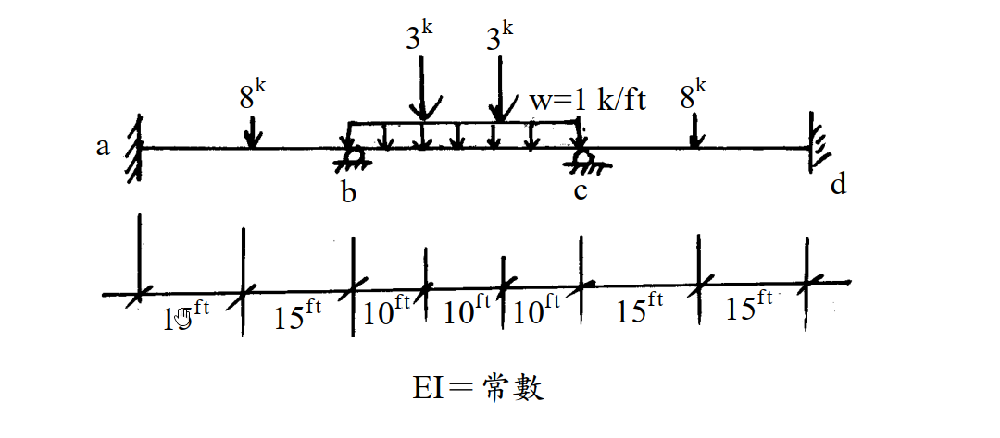

# 考題編號：SA-2003-1

**主分類：** `SA-U2` 靜不定結構分析
**副分類：** `SA-U2-5` 彎矩分配法
**分析法：** 彎矩分配法
**標籤：** `對稱結構` `對稱修正勁度` `固端彎矩疊加`

---

## 1. 原始題目重述 (Problem Restatement)
一、試以彎矩分配法，求解各節點彎矩。（25 分）

*圖說：本題為三跨連續梁，跨距均為 30 ft。A、D 端為固定支承，B、C 端為滾支承。AB 跨距中央承受 8k 集中力；BC 跨承受 1 k/ft 均布載重及兩個 3k 對稱集中力（各距 B、C 端 10 ft）；CD 跨距中央承受 8k 集中力。各桿件 EI = 常數。*

## 2. 考題核心精神與出題者意圖 (Core Concepts & Examiner's Intent)
本題旨在測驗考生對於**彎矩分配法 (Moment Distribution Method)** 的操作熟練度，特別是**對稱結構與對稱載重**的簡化技巧。出題者刻意設計了完全對稱的幾何與載重配置，若考生具備結構直覺，能運用對稱修正勁度，將能大幅縮短計算時間並避免迭代過程中的計算錯誤。同時，BC 跨的複合載重（均布 + 兩點集中）也考驗考生對固端彎矩 (FEM) 疊加法的掌握。

## 3. 解題戰略地圖與陷阱分析 (Strategic Roadmap & Trap Analysis)
- **戰略一：判斷對稱性**
  全結構幾何、邊界與載重均對稱於 BC 跨中，無側移。可取左半結構分析，並將 BC 桿視為遠端轉角反向對稱的特殊桿件。
- **戰略二：計算 FEM 疊加**
  分別求 AB、BC 桿的 FEM。其中 BC 桿須將均布載重之 FEM 與兩個對稱集中載重之 FEM 疊加。
- **戰略三：修正勁度與分配**
  B 節點的 BC 桿勁度須乘上修正係數 $0.5$（因變形對稱 $\theta_C = -\theta_B$）。如此 B 節點分配一次後即可達到完全平衡，無須再做往返傳遞。
- **陷阱：符號約定混淆**
  分配法中統一規定**順時針為正**。推算右半結構彎矩時，由於對稱關係，右半對應位置的桿端彎矩數值與左半相同，但**旋轉方向（正負號）相反**。

## 3.5 變數層次分析 (Variable Hierarchy Analysis)

### 最終目標
求解連續梁各節點之桿端彎矩。

### 本題關鍵公式（依計算順序）
固端彎矩（集中載重於跨中）：
$$ \boxed{FEM_{ab}} = -\frac{PL}{8} $$
固端彎矩（均布載重及對稱集中載重）：
$$ \boxed{FEM_{bc}} = -\frac{wL^2}{12} - \frac{Pa(L-a)}{L} $$
對稱修正勁度（遠端轉角反向對稱）：
$$ \boxed{K_{bc}^*} = \frac{1}{2} \left( \frac{I}{L} \right) $$
分配因子：
$$ \boxed{DF_{ba}} = \frac{K_{ba}}{K_{ba} + \boxed{K_{bc}^*}} $$
桿端彎矩（分配與傳遞）：
$$ \boxed{M_{ij}} = \boxed{FEM_{ij}} + \sum Bal + \sum CO $$

### L1：題目直接給定
| 符號 | 數值 | 說明 |
|:---|:---|:---|
| $L_{ab}, L_{bc}, L_{cd}$ | 30 ft | 各跨距長度 |
| $P_{ab}, P_{cd}$ | 8 k | ab、cd 跨中集中載重 |
| $w_{bc}$ | 1 k/ft | bc 跨均布載重 |
| $P_{bc}$ | 3 k | bc 跨三分點集中載重 |
| $a_{bc}$ | 10 ft | bc 跨集中載重距端點距離 |

### L2：需知識點推導
**固端彎矩**

| 符號 | 公式／來源 | 卡關? |
|:---|:---|:---|
| $FEM_{ab}, FEM_{ba}$ | 集中載重固端彎矩公式 | |
| $FEM_{bc}, FEM_{cb}$ | 均布與對稱集中載重疊加 | |

**勁度與分配因子**

| 符號 | 公式／來源 | 卡關? |
|:---|:---|:---|
| $K_{ba}, K_{bc}^*$ | 對稱修正勁度 | |
| $DF_{ba}, DF_{bc}$ | 分配因子定義 | |

### L3：深層知識（不懂就卡住）
| 知識點 | 說明 | 卡關? |
|:---|:---|:---|
| 結構對稱性應用 | 本題結構幾何、邊界條件與載重均完全對稱於 bc 跨中，無側移。可取半結構分析，並運用對稱條件簡化。 | |
| 對稱修正勁度 $K^*$ | 若桿件變形對稱 ($\theta_{far} = -\theta_{near}$)，其勁度修正為一般勁度 ($4EI/L$) 的一半，即 $K^* = 0.5K$。 | |

## 4. 步驟化詳細計算過程 (Step-by-Step Detailed Calculation)

**Step 1：判斷結構特性與對稱性**
觀察題目結構，幾何尺寸、支承條件（A、D端固定，B、C端滾支）與載重分布完全對稱於結構中心線（即 BC 跨中）。
因此，結構變形亦將呈現完全對稱，即 $\theta_A = \theta_D = 0$，且 $\theta_B = -\theta_C$。
無側移發生，且可利用結構對稱性取左半結構進行分析，以簡化彎矩分配過程。

**Step 2：計算各桿件之固端彎矩 (FEM)**
定義順時針桿端彎矩為正。
- **跨距 AB (L=30 ft, 中央集中載重 P=8k)：**
  $$ FEM_{ab} = -\frac{PL}{8} = -\frac{8 \times 30}{8} = -30 \text{ k-ft} $$
  $$ FEM_{ba} = +\frac{PL}{8} = +30 \text{ k-ft} $$

- **跨距 BC (L=30 ft, 均布載重 w=1 k/ft, 三分點集中載重 P=3k)：**
  利用疊加法，包含均布載重與兩對稱集中載重（距離端點 $a=10 \text{ ft}$）：
  $$ FEM_{bc} = -\frac{wL^2}{12} - \frac{Pa(L-a)}{L} $$
  代入數值：
  $$ FEM_{bc} = -\frac{1 \times 30^2}{12} - \frac{3 \times 10 \times (30-10)}{30} $$
  $$ FEM_{bc} = -75 - \frac{600}{30} = -75 - 20 = -95 \text{ k-ft} $$
  $$ FEM_{cb} = +95 \text{ k-ft} $$

- **跨距 CD (對稱於 AB)：**
  $$ FEM_{cd} = -30 \text{ k-ft} $$
  $$ FEM_{dc} = +30 \text{ k-ft} $$

**Step 3：計算勁度與分配因子 (DF)**
因選用半結構分析，A 端為固定端不分配 ($DF_{ab}=0$)，針對 B 節點計算分配因子：
- 桿件 BA 遠端 (A) 為固定端，採用一般相對勁度 ($K = I/L$)：
  $$ K_{ba} = \frac{I}{L_{ab}} = \frac{I}{30} $$
- 桿件 BC 變形對稱 ($\theta_C = -\theta_B$)，採用對稱修正勁度 ($K^* = 0.5 \times I/L$)：
  $$ K_{bc}^* = \frac{1}{2} \left( \frac{I}{L_{bc}} \right) = \frac{1}{2} \times \frac{I}{30} = \frac{I}{60} $$
- B 節點總勁度：
  $$ \sum K_B = K_{ba} + K_{bc}^* = \frac{I}{30} + \frac{I}{60} = \frac{3I}{60} $$
- B 節點分配因子：
  $$ DF_{ba} = \frac{K_{ba}}{\sum K_B} = \frac{2/60}{3/60} = \frac{2}{3} $$
  $$ DF_{bc} = \frac{K_{bc}^*}{\sum K_B} = \frac{1/60}{3/60} = \frac{1}{3} $$

**Step 4：彎矩分配表 (Moment Distribution Table)**
使用對稱修正勁度後，不平衡彎矩僅需在 B 節點分配一次，並傳遞至固定端 A 即告完成收斂（不需自 C 節點傳遞回來）。

| 節點 | A | \multicolumn{2}{c|}{B} |
|:---|:---:|:---:|:---:|
| 桿端 | ab | ba | bc |
| DF | 0 | 2/3 | 1/3 |
| FEM | -30.00 | +30.00 | -95.00 |
| Bal | | +43.33 | +21.67 |
| CO | +21.67 | | |
| $\sum M$ | -8.33 | +73.33 | -73.33 |

*(註：為計算精確，分配值 $65 \times \frac{2}{3} = 43.333$，保留兩位小數為 43.33)*

**Step 5：求得全結構各節點彎矩**
由結構對稱性推導右半邊彎矩。注意彎矩圖對稱代表相對應的桿端彎矩值大小相等、**符號相反**。
- $M_{cb} = -M_{bc} = +73.33 \text{ k-ft}$
- $M_{cd} = -M_{ba} = -73.33 \text{ k-ft}$
- $M_{dc} = -M_{ab} = +8.33 \text{ k-ft}$

> **最終解答：**
> 各節點之桿端彎矩為：
> $\boxed{M_{ab} = -8.33 \text{ k-ft}}$
> $\boxed{M_{ba} = +73.33 \text{ k-ft}}$
> $\boxed{M_{bc} = -73.33 \text{ k-ft}}$
> $\boxed{M_{cb} = +73.33 \text{ k-ft}}$
> $\boxed{M_{cd} = -73.33 \text{ k-ft}}$
> $\boxed{M_{dc} = +8.33 \text{ k-ft}}$

## 5. 關鍵爭議點與進階探討 (Critical Issues & Advanced Discussion)

- **對稱性的善用：**
  考場上若遇到完全對稱結構與載重，**強烈建議使用對稱修正勁度** ($K^* = 0.5 K$)。若採取標準的全結構彎矩分配表，C 節點的不平衡彎矩會不斷傳遞回 B 節點，導致需要計算多個循環（通常需至少 4~5 個 Cycle 才能收斂至小數點後第一位），不僅耗時且極易發生計算錯誤。利用對稱性可將無窮級數收斂過程化簡為單步驟（One-step）分配。
- **多重載重 FEM 的疊加法：**
  本題 BC 跨同時承受均布載重與兩個集中載重。計算固端彎矩時，將其視為基本載重情況的線性疊加。特別留意兩個對稱集中載重的公式 $-\frac{Pa(L-a)}{L}$，可由標準公式 $-\frac{Pab^2}{L^2}$ 與 $-\frac{Pa^2b}{L^2}$ 合併而得，此為加速計算的實用技巧。若不熟悉該推導，分別計算兩力再相加也是完全可行且安全的作法。
