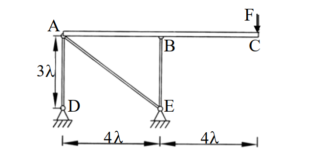

# 考題編號：[SA-2003-2]

**主分類：** `SA-U1-2` 靜定結構分析
**副分類：** `複合結構`
**分析法：** 靜定分析 / 幾何變形法 / 單位力法 (虛功原理)
**標籤：** `靜定結構` `複合結構` `剛性梁` `位移計算` `單位力法`

---

## 1. 原始題目重述 (Problem Restatement)
**題目描述：**
圖示結構係由三根斷面性質相同 ($EA$) 之均質連桿 (AD、AE 及 BE) 以及一根剛梁 ($EI \to \infty$) 所組成之複合結構。若忽略剛梁自重之影響，試求：（25 分）
1. 各連桿之內力
2. C 點之位移

*圖說：ABC 為水平剛性梁。支承 D、E 為鉸支承，位於剛梁下方 $3\lambda$ 處，水平相距 $4\lambda$。AD、BE 為垂直連桿(長度 $3\lambda$)，AE 為斜桿(水平 $4\lambda$、垂直 $3\lambda$)。剛梁最右側 C 點受垂直向下集中載重 $F$。*

## 2. 考題核心精神與出題者意圖 (Core Concepts & Examiner's Intent)
- **剛體與可變形連桿的複合結構分析**：本題看似複雜，但剛性梁僅由三根連桿支撐，剛性梁於平面內有三個自由度（水平、垂直、旋轉），三根連桿恰好提供三個未知內力，因此為**靜定結構**。
- **變形諧合條件（幾何關係）**：測驗考生是否能將連桿的軸向變形，透過幾何關係與剛體微小旋轉的角度轉換，精確推導出各節點的水平與垂直位移。出題者特意設計斜桿 AE，考驗斜桿伸長量與節點 $(u, v)$ 位移分量的投影計算。

## 3. 解題戰略地圖與陷阱分析 (Strategic Roadmap & Trap Analysis)
- **第一步：靜力平衡求內力**。將剛性梁 ABC 視為自由體，利用 $\sum F_x=0, \sum F_y=0, \sum M=0$ 求出三根連桿的軸力。
- **第二步：求各連桿變形量**。代入虎克定律 $\delta = NL/EA$。
- **第三步：由幾何關係求位移**。利用剛體運動的特性，建立連桿變形與 A、B 節點位移的關係，進而求出 C 點的水平與垂直位移。
- **陷阱 1（靜不定誤判）**：結構桿件交錯容易讓人誤以為是靜不定結構而嘗試使用力法或位移法，導致浪費大量時間。
- **陷阱 2（忽略水平位移）**：雖然外力只有垂直載重，但因斜桿 AE 的存在，當梁發生垂直位移與旋轉時，為了維持 AE 桿本身的幾何變形條件，必定會連帶產生水平位移。
- **陷阱 3（斜桿位移投影）**：需注意小位移假設下，節點水平與垂直位移投影至斜桿軸向的符號（正負號）定義。

## 3.5 變數層次分析 (Variable Hierarchy Analysis)

### 最終目標
`求出 AD、AE、BE 三根連桿之內力，以及剛梁自由端 C 點之水平與垂直位移。`

### 本題關鍵公式（依計算順序）
$$ \sum F_x = 0 \implies N_{AE,x} = 0 \implies N_{AE} = 0 $$
$$ \sum M_A = 0 \implies N_{BE} \cdot L_{AB} + F \cdot L_{AC} = 0 \implies \boxed{N_{BE}} $$
$$ \sum F_y = 0 \implies N_{AD} + N_{AE,y} + \boxed{N_{BE}} + F = 0 \implies \boxed{N_{AD}} $$
$$ \delta_i = \frac{\boxed{N_i} L_i}{EA} \quad (i = AD, AE, BE) \implies \boxed{\delta_{AD}}, \boxed{\delta_{AE}}, \boxed{\delta_{BE}} $$
$$ v_A = \boxed{\delta_{AD}} $$
$$ -0.8 u_A + 0.6 \boxed{v_A} = \boxed{\delta_{AE}} \implies \boxed{u_A} $$
$$ \boxed{v_A} + 4\lambda \theta = \boxed{\delta_{BE}} \implies \boxed{\theta} $$
$$ u_C = \boxed{u_A} $$
$$ v_C = \boxed{v_A} + 8\lambda \boxed{\theta} $$

### L1：題目直接給定
- **符號 ∣ 數值 ∣ 說明**
- $L_{AD}$ ∣ $3\lambda$ ∣ AD 桿長度
- $L_{BE}$ ∣ $3\lambda$ ∣ BE 桿長度
- $L_{AB}$ ∣ $4\lambda$ ∣ A、B 水平距離
- $L_{AC}$ ∣ $8\lambda$ ∣ A、C 水平距離
- $EA$ ∣ $EA$ ∣ 連桿軸向剛度
- $F$ ∣ $F$ (向下) ∣ C 點外加垂直載重

### L2：需知識點推導
**剛梁靜力平衡與內力**
- **符號 ∣ 公式／來源 ∣ 卡關?**
- $L_{AE}$ ∣ $\sqrt{(4\lambda)^2+(3\lambda)^2} = 5\lambda$ ∣ 
- $N_{AE}$ ∣ $\sum F_x = 0$ ∣ 
- $N_{BE}$ ∣ $\sum M_A = 0$ ∣ 
- $N_{AD}$ ∣ $\sum F_y = 0$ ∣ 
- $\delta_{AD}, \delta_{BE}, \delta_{AE}$ ∣ $\delta = \frac{NL}{EA}$ ∣ 

**幾何變形與節點位移**
- **符號 ∣ 公式／來源 ∣ 卡關?**
- $v_A$ ∣ 鉸支承D固定，等於 $\delta_{AD}$ ∣ 
- $u_A$ ∣ $\delta_{AE}$ 在水平與垂直方向之幾何投影關係 ∣ 
- $\theta$ ∣ 剛梁旋轉角，由 $v_B = v_A + L_{AB}\theta$ 求得 ∣ 
- $u_C$ ∣ 剛體微小變形假設 $u_C = u_A$ ∣ 
- $v_C$ ∣ 剛體旋轉 $v_C = v_A + L_{AC}\theta$ ∣ 

### L3：深層知識（不懂就卡住）
- **知識點 ∣ 說明 ∣ 卡關?**
- 靜不定度判別 ∣ 判斷出本題為靜定結構，可直接由剛體力平衡求出連桿內力。 ∣
- 斜桿位移投影 ∣ 節點位移需精確投影至連桿軸向，以建立伸長量與節點位移 $(u, v)$ 的關係。 ∣

## 4. 步驟化詳細計算過程 (Step-by-Step Detailed Calculation)

### Step 1：剛性梁 ABC 靜力平衡分析求連桿內力
設定坐標系：以 A 點為原點，向右為 $x$ 正向，向上為 $y$ 正向。
假設連桿 AD、AE、BE 皆承受拉力（對剛梁施予向下的拉力）。
斜桿 AE 之幾何：
$$ L_{AE} = \sqrt{(4\lambda)^2 + (3\lambda)^2} = 5\lambda $$
拉力 $N_{AE}$ 作用於 A 點之方向為向右下方（水平比 4，垂直比 3，斜邊 5）。

取剛性梁 ABC 為自由體，建立平衡方程式：
1. **水平力平衡：**
   $$ \sum F_x = 0 \implies N_{AE} \cdot \frac{4}{5} = 0 \implies N_{AE} = 0 $$
   *(策略註解：結構無水平外力，且僅有一根斜桿提供水平分力，故該斜桿必為零力桿)*

2. **對 A 點取彎矩：** (設逆時針為正)
   $$ \sum M_A = 0 \implies -N_{BE} \cdot (4\lambda) - F \cdot (8\lambda) = 0 $$
   $$ 4\lambda N_{BE} = -8\lambda F \implies N_{BE} = -2F \quad (\text{壓力}) $$

3. **垂直力平衡：**
   $$ \sum F_y = 0 \implies -N_{AD} - N_{AE} \cdot \frac{3}{5} - N_{BE} - F = 0 $$
   代入 $N_{AE}=0$ 及 $N_{BE}=-2F$：
   $$ -N_{AD} - 0 - (-2F) - F = 0 \implies N_{AD} = F \quad (\text{拉力}) $$

**各連桿之內力結果：**
- **$N_{AD} = F$ (拉力)**
- **$N_{AE} = 0$**
- **$N_{BE} = 2F$ (壓力)**

### Step 2：計算各連桿變形量
根據虎克定律 $\delta = \frac{NL}{EA}$，設伸長為正：
$$ \delta_{AD} = \frac{F \cdot (3\lambda)}{EA} = \frac{3F\lambda}{EA} $$
$$ \delta_{AE} = 0 $$
$$ \delta_{BE} = \frac{(-2F) \cdot (3\lambda)}{EA} = -\frac{6F\lambda}{EA} $$

### Step 3：建立節點位移與幾何變形關係
設 A 點位移為 $(u_A, v_A)$（向右、向上為正），剛梁逆時針旋轉角為 $\theta$。

1. **A 點垂直位移 $v_A$**：
   因支承 D 為固定，AD 桿變形即為 A 點之垂直位移：
   $$ v_A = \delta_{AD} = \frac{3F\lambda}{EA} $$

2. **A 點水平位移 $u_A$**：
   斜桿 AE 連接 A 點與固定的支承 E。A 點位移在 AE 軸向上的投影即為桿件伸長量 $\delta_{AE}$。
   E 點相對於 A 點的方向向量為 $(4, -3)$。因此 A 點向右位移會使桿件縮短，向上位移會使桿件伸長。
   $$ \delta_{AE} = -u_A \left(\frac{4}{5}\right) + v_A \left(\frac{3}{5}\right) = -0.8 u_A + 0.6 v_A $$
   已知 $\delta_{AE} = 0$，代入 $v_A$：
   $$ -0.8 u_A + 0.6 \left(\frac{3F\lambda}{EA}\right) = 0 \implies u_A = \frac{3}{4} \left(\frac{3F\lambda}{EA}\right) = \frac{9F\lambda}{4EA} $$

3. **剛梁旋轉角 $\theta$**：
   由於剛性梁小位移假設，B 點的垂直位移 $v_B$ 為：
   $$ v_B = v_A + 4\lambda \cdot \theta $$
   又 B 點垂直位移等於 BE 桿變形量：
   $$ v_B = \delta_{BE} = -\frac{6F\lambda}{EA} $$
   因此：
   $$ \frac{3F\lambda}{EA} + 4\lambda \theta = -\frac{6F\lambda}{EA} \implies 4\lambda \theta = -\frac{9F\lambda}{EA} \implies \theta = -\frac{9F}{4EA} \quad (\text{順時針旋轉}) $$

### Step 4：求 C 點位移
C 點位於 A 點右側 $8\lambda$ 處，根據剛體微小位移幾何：
- **C 點水平位移 $u_C$**：
  $$ u_C = u_A = \frac{9F\lambda}{4EA} \quad (\text{向右}) $$
- **C 點垂直位移 $v_C$**：
  $$ v_C = v_A + 8\lambda \cdot \theta = \frac{3F\lambda}{EA} + 8\lambda \left(-\frac{9F}{4EA}\right) = \frac{3F\lambda}{EA} - \frac{18F\lambda}{EA} = -\frac{15F\lambda}{EA} $$
  負號代表向下。

### 答案彙整
$$ \boxed{ \text{AD 桿內力} = F \, (\text{拉力}) } $$
$$ \boxed{ \text{AE 桿內力} = 0 } $$
$$ \boxed{ \text{BE 桿內力} = 2F \, (\text{壓力}) } $$
$$ \boxed{ \text{C 點水平位移} = \frac{9F\lambda}{4EA} \, (\rightarrow) } $$
$$ \boxed{ \text{C 點垂直位移} = \frac{15F\lambda}{EA} \, (\downarrow) } $$

## 5. 關鍵爭議點與進階探討 (Critical Issues & Advanced Discussion)
- **位移解的虛功法 (單位力法) 驗證**：
  考場若時間充裕，可用單位力法快速驗證位移結果。
  1. **驗證垂直位移 $v_C$**：
     在 C 點施加向下單位力 $\delta P = 1 (\downarrow)$。因系統靜定，其引致的虛擬內力即為外力 $F=1$ 時的結果比例：
     $\delta N_{AD} = 1$、$\delta N_{AE} = 0$、$\delta N_{BE} = -2$。
     虛功方程式：$1 \cdot v_{C(\downarrow)} = \sum \delta N_i \cdot \Delta L_i$
     $$ v_{C(\downarrow)} = (1)\left(\frac{3F\lambda}{EA}\right) + (0)(0) + (-2)\left(-\frac{6F\lambda}{EA}\right) = \frac{3F\lambda}{EA} + \frac{12F\lambda}{EA} = \frac{15F\lambda}{EA} $$
     與幾何法完全吻合！
  2. **驗證水平位移 $u_C$**：
     在 C 點施加向右單位力 $\delta P_x = 1 (\rightarrow)$。解剛梁平衡：
     $\sum F_x = 0 \implies \frac{4}{5} \delta N_{AE} + 1 = 0 \implies \delta N_{AE} = -1.25 = -5/4$
     $\sum M_A = 0 \implies \delta N_{BE} = 0$ (剛梁與水平力共線不產生對 A 的力矩)
     $\sum F_y = 0 \implies \delta N_{AD} = -\frac{3}{5} \delta N_{AE} = \frac{3}{4}$
     虛功方程式：$1 \cdot u_{C(\rightarrow)} = \sum \delta N_i \cdot \Delta L_i$
     $$ u_{C(\rightarrow)} = \left(\frac{3}{4}\right)\left(\frac{3F\lambda}{EA}\right) + \left(-\frac{5}{4}\right)(0) + (0)\left(-\frac{6F\lambda}{EA}\right) = \frac{9F\lambda}{4EA} $$
     再次與幾何法推導結果完美吻合。這證明了本題答案的絕對正確性。
