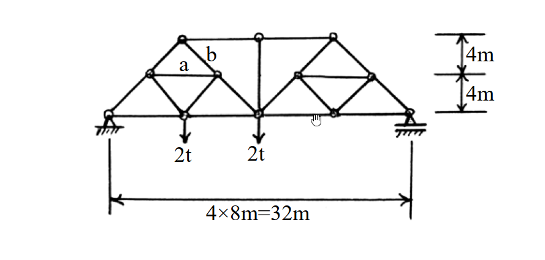

# 考題編號：SA-2003-3

**主分類：** `SA-1` 靜定結構分析
**副分類：** 
**分析法：** 靜定分析
**標籤：** `桁架分析` `K型桁架` `截面法` `節點法`

---

## 1. 原始題目重述 (Problem Restatement)
- **題目描述**：試求圖示桁架中 a, b 桿之內力。（25 分）
- **結構與幾何**：本題為一左右對稱幾何之靜定桁架（類似 K 型細分桁架）。總跨度為 $4 \times 8\text{m} = 32\text{m}$，總高度為 $4\text{m} + 4\text{m} = 8\text{m}$。
- **支撐條件**：左端為鉸支承（鉸接），右端為滾支承。
- **載重條件**：於距左支承 $8\text{m}$ 及 $16\text{m}$ 處之下弦節點，各承受 $2\text{t}$ 之向下垂直集中載重。
- **欲求目標**：求解標示為 a（左半側水平中弦桿）與 b（左半側右上斜腹桿）之內力。

*圖說：桁架跨度 32m 分為 4 個 8m 節間，高度 8m 分為上下各 4m，載重 2t 作用於左側兩個下弦節點，標示 a、b 桿件位置。*

## 2. 考題核心精神與出題者意圖 (Core Concepts & Examiner's Intent)
- **核心觀念**：本題測驗考生對於複雜桁架（Subdivided Truss / K-truss）的分析能力。這類桁架若單純依靠節點法從支承處逐一推進，會遭遇節點未知數過多而卡關的問題。
- **出題意圖**：要求考生具備**靈活運用截面法與節點法**的能力。利用適當的截面快速求得特定弦桿內力，再輔以節點法破解局部構件內力，是本題致勝關鍵。

## 3. 解題戰略地圖與陷阱分析 (Strategic Roadmap & Trap Analysis)
- **步驟化作戰計畫**：
  1. **整體平衡求反力**：將整個桁架視為剛體，取力矩平衡求出左、右支承反力。
  2. **截面法求頂弦桿內力**：切過桁架中央偏左的垂直截面，利用對下弦節點取力矩，快速求出頂弦桿 $U_1-U_2$ 內力。
  3. **節點法求桿件 b**：取頂部節點 $U_1$ 進行水平與垂直力平衡，求出桿件 b ($U_1-M_2$) 內力。
  4. **節點法求桿件 a**：從左支承 $L_0$ 出發推得 $L_0-M_1$ 內力後，再對節點 $M_1$ 進行力平衡，求出桿件 a ($M_1-M_2$) 內力。
- **關鍵陷阱與應對策略**：
  - **陷阱 1：節點未知數過多**：若直接從 $L_0 \to L_1$ 或 $L_0 \to M_1 \to M_2$ 推進，會在 $M_1$ 或 $L_1$ 遇到超過 2 個未知力而無法求解。
    - *策略*：先以截面法求出遠端的頂弦桿內力，再從頂節點逆向解回來，打破未知數的僵局。
  - **陷阱 2：幾何角度計算錯誤**：桁架內部斜桿角度多為 $45^\circ$（底 $4\text{m}$、高 $4\text{m}$），但部分節點受力方向容易混淆。
    - *策略*：統一將未知內力假設為拉力（向外），並仔細拆解 $x, y$ 分量（乘上 $\cos 45^\circ$ 或 $\sin 45^\circ$）。

## 3.5 變數層次分析 (Variable Hierarchy Analysis)
### 最終目標
求出特定內部桿件 a ($M_1-M_2$) 與 b ($U_1-M_2$) 之內力值及拉壓性質。

### 本題關鍵公式（依計算順序）
- 整體力矩平衡：$\sum M_{R} = 0 \implies R_L$
- 截面法力矩平衡：$\sum M_{L2} = 0 \implies S_{U_1U_2}$
- $U_1$ 節點垂直平衡：$\sum F_y = 0 \implies S_{M_1U_1} = -S_b$
- $U_1$ 節點水平平衡：$\sum F_x = 0 \implies \boxed{S_{M_1U_1}}, \boxed{S_{U_1U_2}} \to S_b$
- $L_0$ 節點垂直平衡：$\sum F_y = 0 \implies \boxed{R_L} \to S_{L_0M_1}$
- $M_1$ 節點垂直平衡：$\sum F_y = 0 \implies \boxed{S_{L_0M_1}}, \boxed{S_{M_1U_1}} \to S_{M_1L_1}$
- $M_1$ 節點水平平衡：$\sum F_x = 0 \implies \boxed{S_{L_0M_1}}, \boxed{S_{M_1U_1}}, \boxed{S_{M_1L_1}} \to S_a$

### L1：題目直接給定
| 符號 | 數值 | 說明 |
|---|---|---|
| $L$ | $32\text{m}$ | 桁架總跨度 |
| $H$ | $8\text{m}$ | 桁架總高度 |
| $P_1$ | $2\text{t} (\downarrow)$ | $x=8\text{m}$ 處之下弦載重 |
| $P_2$ | $2\text{t} (\downarrow)$ | $x=16\text{m}$ 處之下弦載重 |

### L2：需知識點推導
**1. 支承反力**
| 符號 | 公式／來源 | 卡關? |
|---|---|---|
| $R_L$ | $\sum M_{R} = 0$ | |
| $R_R$ | $\sum F_y = 0$ | |

**2. 內力分析 (截面法 + 節點法)**
| 符號 | 公式／來源 | 卡關? |
|---|---|---|
| $S_{U_1U_2}$ | 垂直截面切 $U_1-U_2, M_2-L_2, L_1-L_2$ 取 $\sum M_{L2}=0$ | |
| $S_b (S_{U_1M_2})$ | 節點 $U_1$ 之 $\sum F_x=0, \sum F_y=0$ | |
| $S_{L_0M_1}$ | 節點 $L_0$ 之 $\sum F_y=0$ | |
| $S_{M_1L_1}$ | 節點 $M_1$ 之 $\sum F_y=0$ | |
| $S_a (S_{M_1M_2})$ | 節點 $M_1$ 之 $\sum F_x=0$ | |

### L3：深層知識（不懂就卡住）
| 知識點 | 說明 | 卡關? |
|---|---|---|
| 截面法選取技巧 | 截面切過不超過3個未知內力構件，或利用適當力矩中心消去多餘未知數。 | |
| 混合分析策略 | 當單一節點法無法推進時，須敏銳切換至截面法求解遠端內力，再折返使用節點法。 | |

## 4. 步驟化詳細計算過程 (Step-by-Step Detailed Calculation)

為方便說明，先對桁架節點進行命名：
- 下弦節點（由左至右）：$L_0(0,0), L_1(8,0), L_2(16,0), L_3(24,0), L_4(32,0)$
- 頂弦節點（由左至右）：$U_1(8,8), U_2(16,8), U_3(24,8)$
- 中間斜桿節點：$M_1(4,4)$ 位於 $L_0 \to U_1$ 之間，$M_2(12,4)$ 位於 $U_1 \to L_2$ 之間。
- 桿件 a 為 $M_1-M_2$；桿件 b 為 $U_1-M_2$。

**Step 1：計算支承反力**
以右端支承 $L_4$ 為力矩中心，取整體結構平衡：
$$ \sum M_{L4} = 0 \implies R_L \times 32 - 2 \times (32-8) - 2 \times (32-16) = 0 $$
$$ 32 R_L - 48 - 32 = 0 \implies 32 R_L = 80 \implies \boxed{R_L = 2.5\text{t} (\uparrow)} $$

由垂直力平衡求右支承反力（本題未直接用到，作驗證用）：
$$ \sum F_y = 0 \implies R_L + R_R - 2 - 2 = 0 \implies 2.5 + R_R = 4 \implies \boxed{R_R = 1.5\text{t} (\uparrow)} $$

**Step 2：利用截面法求頂弦桿 $U_1-U_2$ 內力**
> 策略註解：直接求 a, b 桿會遇到未知數過多，先用截面法切出頂弦桿內力，便可從 $U_1$ 節點解出 b 桿。

取一垂直截面，切過 $U_1-U_2$、$M_2-L_2$、$L_1-L_2$ 三根桿件（即切於 $x=12 \sim 16$ 之間）。
取截面左側自由體，對節點 $L_2(16,0)$ 取力矩平衡（此時 $M_2-L_2$ 與 $L_1-L_2$ 延長線皆通過 $L_2$，不產生力矩）：
$$ \sum M_{L2} = 0 $$
$$ R_L \times 16 - 2 \times (16-8) + S_{U_1U_2} \times 8 = 0 $$
$$ 2.5 \times 16 - 2 \times 8 + 8 S_{U_1U_2} = 0 $$
$$ 40 - 16 + 8 S_{U_1U_2} = 0 \implies 8 S_{U_1U_2} = -24 \implies \boxed{S_{U_1U_2} = -3\text{t}} \text{ (壓力)} $$

**Step 3：利用節點法求桿件 b ($U_1-M_2$)**
觀察節點 $U_1(8,8)$，連接三根桿件：$M_1-U_1$、$M_2-U_1$ (即桿件 b)、$U_1-U_2$。
斜桿之幾何斜率皆為 $1:1$ (角度 $45^\circ$)。假設皆為拉力。
垂直力平衡：
$$ \sum F_y = 0 \implies -S_{M_1U_1} \sin 45^\circ - S_{M_2U_1} \sin 45^\circ = 0 \implies S_{M_1U_1} = -S_{M_2U_1} $$
水平力平衡：
$$ \sum F_x = 0 \implies -S_{M_1U_1} \cos 45^\circ + S_{M_2U_1} \cos 45^\circ + S_{U_1U_2} = 0 $$
將 $S_{M_1U_1} = -S_{M_2U_1}$ 及 $S_{U_1U_2} = -3\text{t}$ 代入：
$$ -(-S_{M_2U_1}) \frac{\sqrt{2}}{2} + S_{M_2U_1} \frac{\sqrt{2}}{2} - 3 = 0 $$
$$ 2 \times S_{M_2U_1} \frac{\sqrt{2}}{2} = 3 \implies \sqrt{2} S_{M_2U_1} = 3 \implies S_{M_2U_1} = \frac{3}{\sqrt{2}} = 1.5\sqrt{2} \approx 2.121\text{t} $$
$$ \boxed{\text{桿件 b 內力 } S_b = 1.5\sqrt{2}\text{t} \text{ (拉力)}} $$
*(同時求得 $S_{M_1U_1} = -1.5\sqrt{2}\text{t}$)*

**Step 4：利用節點法求桿件 a ($M_1-M_2$)**
先觀察左支承節點 $L_0(0,0)$，求斜桿 $L_0-M_1$ 內力：
$$ \sum F_y = 0 \implies R_L + S_{L_0M_1} \sin 45^\circ = 0 $$
$$ 2.5 + S_{L_0M_1} \frac{\sqrt{2}}{2} = 0 \implies \boxed{S_{L_0M_1} = -2.5\sqrt{2}\text{t}} \text{ (壓力)} $$

接著觀察節點 $M_1(4,4)$，連接四根桿件：$L_0-M_1$、$M_1-U_1$、$M_1-M_2$ (即桿件 a)、$M_1-L_1$。
先利用垂直力平衡求出 $S_{M_1L_1}$：
$$ \sum F_y = 0 \implies -S_{L_0M_1} \sin 45^\circ + S_{M_1U_1} \sin 45^\circ - S_{M_1L_1} \sin 45^\circ = 0 $$
$$ -(-2.5\sqrt{2})\left(\frac{\sqrt{2}}{2}\right) + (-1.5\sqrt{2})\left(\frac{\sqrt{2}}{2}\right) - S_{M_1L_1} \left(\frac{\sqrt{2}}{2}\right) = 0 $$
$$ 2.5 - 1.5 - S_{M_1L_1} \frac{\sqrt{2}}{2} = 0 \implies 1 = S_{M_1L_1} \frac{\sqrt{2}}{2} \implies \boxed{S_{M_1L_1} = \sqrt{2}\text{t}} \text{ (拉力)} $$

最後利用水平力平衡求出桿件 a：
$$ \sum F_x = 0 \implies -S_{L_0M_1} \cos 45^\circ + S_{M_1U_1} \cos 45^\circ + S_a + S_{M_1L_1} \cos 45^\circ = 0 $$
$$ -(-2.5\sqrt{2})\left(\frac{\sqrt{2}}{2}\right) + (-1.5\sqrt{2})\left(\frac{\sqrt{2}}{2}\right) + S_a + (\sqrt{2})\left(\frac{\sqrt{2}}{2}\right) = 0 $$
$$ 2.5 - 1.5 + S_a + 1 = 0 \implies 2 + S_a = 0 \implies S_a = -2\text{t} $$
$$ \boxed{\text{桿件 a 內力 } S_a = -2\text{t} \text{ (壓力)}} $$

## 5. 關鍵爭議點與進階探討 (Critical Issues & Advanced Discussion)
- **多種截面解法的等效性**：本題桿件 a 亦可利用特定斜向力平衡或不同截面求得。例如取一平行於 $M_1-U_1$ 與 $M_2-L_1$ 斜率之正交方向（角度 $135^\circ$）進行力平衡，但幾何計算較為抽象。對於考場而言，**逐次解節點**（$L_0 \to M_1$）雖然步驟多了一項，但思緒最直觀、最不易出錯。
- **符號假設原則**：強烈建議解桁架時，**一律假設未知內力為拉力（向外）**。計算結果若為正值即為拉力 (Tension)，若為負值即為壓力 (Compression)。本題計算中嚴格遵守此原則，有效避免了 $M_1$ 節點多達 4 根斜桿時極易發生的正負號混淆錯誤。
