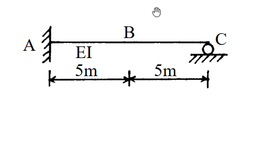

# 考題編號：[SA-2003-4]

**主分類：** `SA-U1` 影響線
**副分類：** `SA-U2` 諧合變位法（靜不定結構影響線）
**分析法：** 影響線 / 諧合變位法
**標籤：** `靜不定影響線` `Müller-Breslau` `柔度法` `彎矩影響線` `剪力影響線`

---

## 1. 原始題目重述 (Problem Restatement)
   - 題幹：如圖所示之梁結構，EI 值為常數，試分別繪出此梁中點B 之彎矩及剪力影響線圖。（說明：影響線圖中，需標示B 點彎矩及剪力之影響值）
   - 結構描述：一端固定、一端滾支承的靜不定梁（Propped cantilever beam）。左端 A 為固定端，右端 C 為滾支承，跨度為 10m，B 點位於中點（距 A 端 5m）。梁的 EI 為常數。
   
   *圖說：靜不定梁，A為固定支承，C為滾支承，總長10m，B為中點（AB=5m，BC=5m）*

## 2. 考題核心精神與出題者意圖 (Core Concepts & Examiner's Intent)
   - 本題主要測驗考生對**靜不定結構影響線**的求解能力。
   - 可利用 Müller-Breslau 原理定性繪製影響線形狀，但題目要求「標示影響值」，因此必須進行定量的靜力分析（如柔度法、力法或諧合變位法），求出單位載重移動時的內力函數。
   - 考驗考生對於不同區段（單位載重在 B 點左側或右側）剪力與彎矩方程式的推導與符號約定的掌握。

## 3. 解題戰略地圖與陷阱分析 (Strategic Roadmap & Trap Analysis)
   - **Step 1：解除支承，建立基本結構**
     選擇 C 點的垂直反力 $C_y$ 作為多餘力，將結構退化為 A 端固定的懸臂梁基本結構。
   - **Step 2：計算多餘力 $C_y$ 的影響線**
     將單位載重 $P=1$ 放置於距 A 點 $x$ 處，計算此時 C 點的變位 $\Delta_{C0}$。再計算 $C_y=1$ 作用下的 C 點變位 $\Delta_{CC}$。利用諧合條件 $\Delta_{C0} + \Delta_{CC} = 0$ 求出 $C_y$ 關於 $x$ 的函數。
   - **Step 3：分段建立 $V_B$ 與 $M_B$ 的影響線方程式**
     利用靜力平衡，以 B 點為界，將梁分為 $0 \le x \le 5$ (單位力在左段) 與 $5 < x \le 10$ (單位力在右段)。取右側自由體 (BC段) 計算 B 點的剪力 $V_B$ 與彎矩 $M_B$。
   - **陷阱分析**：
     - **符號約定陷阱**：在推導內力時，需嚴格遵守正剪力與正彎矩的符號約定（正彎矩：下緣受拉；正剪力：左下右上）。
     - **分段函數**：載重越過 B 點時，自由體的受力條件會改變，因此方程式會分為兩段，必須小心處理。

## 3.5 變數層次分析 (Variable Hierarchy Analysis)

   ### 最終目標
   `求出B點剪力與彎矩隨單位力位置x變化的影響線函數，並計算關鍵點數值。`

   ### 本題關鍵公式（依計算順序）
   - 懸臂梁受載重 $P$ 之端點變位公式：
     $$ \Delta_{C0} = -\frac{Px^2}{6EI}(3L - x) $$
   - 多餘力位移公式：
     $$ \Delta_{CC} = \frac{C_y L^3}{3EI} $$
   - 位移諧合條件：
     $$ \Delta_{C0} + \Delta_{CC} = 0 \Rightarrow \boxed{C_y(x)} $$
   - B點剪力影響線 ($x \le 5$)：
     $$ V_B = -\boxed{C_y(x)} $$
   - B點彎矩影響線 ($x \le 5$)：
     $$ M_B = \overline{BC} \cdot \boxed{C_y(x)} $$

   ### L1：題目直接給定
   - 欄位：**符號 ∣ 數值 ∣ 說明**
   - $L$ ∣ $10$ m ∣ 梁總長度
   - $x_B$ ∣ $5$ m ∣ B點距離A端之位置
   - $\overline{BC}$ ∣ $5$ m ∣ B點到C點之距離
   - $EI$ ∣ 常數 ∣ 梁之抗彎剛度

   ### L2：需知識點推導
   **位移與多餘力**
   - 欄位：**符號 ∣ 公式／來源 ∣ 卡關?**
   - $C_y(x)$ ∣ $\frac{x^2(3L-x)}{2L^3}$ ∣ 

   **影響線方程式**
   - 欄位：**符號 ∣ 公式／來源 ∣ 卡關?**
   - $V_B(x)$ ∣ 分段靜力平衡 ($-C_y(x)$ 或 $1-C_y(x)$) ∣ 
   - $M_B(x)$ ∣ 分段靜力平衡 ($5C_y(x)$ 或 $5C_y(x)-(x-5)$) ∣ 

   ### L3：深層知識（不懂就卡住）
   - 欄位：**知識點 ∣ 說明 ∣ 卡關?**
   - 影響線定義 ∣ 單位力在 $x$ 處時，特定點之內力響應 ∣
   - 內力符號約定 ∣ 正彎矩：下緣受拉；正剪力：截面左側向上、右側向下（右自由體左端向上為正） ∣

## 4. 步驟化詳細計算過程 (Step-by-Step Detailed Calculation)

### Step 1: 建立柔度法位移諧合條件
設定右端 C 點為多餘支承，將原結構視為以 A 為固定端之懸臂梁（基本結構），多餘力為 $C_y$（向上為正）。
當一向下的單位載重 $P=1$ 作用於距 A 點 $x$ 處時（$0 \le x \le 10$），
載重 $P$ 在 C 點產生的向下變位（基本結構變位）為：
$$ \Delta_{C0} = -\frac{1 \cdot x^2}{6EI}(3L - x) = -\frac{x^2}{6EI}(30 - x) $$

多餘力 $C_y$ 在 C 點產生的向上變位為：
$$ \Delta_{CC} = \frac{C_y L^3}{3EI} = \frac{C_y (10)^3}{3EI} = \frac{1000 C_y}{3EI} $$

依據位移諧合條件 $\Delta_C = \Delta_{C0} + \Delta_{CC} = 0$：
$$ -\frac{30x^2 - x^3}{6EI} + \frac{2000 C_y}{6EI} = 0 $$
$$ \boxed{ C_y(x) = \frac{30x^2 - x^3}{2000} } \quad (0 \le x \le 10) $$

### Step 2: 建立 B 點剪力影響線 ($V_B$)
以 B 點（$x=5$）為界，取右側梁 BC 為自由體進行靜力平衡分析。BC段長度為 5m。
依標準符號約定，右側自由體左端（即 B 點）的正剪力方向為**向上**，正彎矩方向為**順時針**（使下緣受拉）。

**情況 (a)：單位力位於 B 點左側 ($0 \le x \le 5$)**
此時單位力不在 BC 自由體上。
$$ \sum F_y = 0 \Rightarrow V_B + C_y = 0 \Rightarrow V_B(x) = -C_y(x) $$
代入 $C_y(x)$：
$$ V_B(x) = -\frac{30x^2 - x^3}{2000} $$

**情況 (b)：單位力位於 B 點右側 ($5 < x \le 10$)**
此時單位力在 BC 自由體上。
$$ \sum F_y = 0 \Rightarrow V_B + C_y - 1 = 0 \Rightarrow V_B(x) = 1 - C_y(x) $$
代入 $C_y(x)$：
$$ V_B(x) = 1 - \frac{30x^2 - x^3}{2000} $$

**關鍵點數值計算：**
- $x = 0$ (A點) : $V_B = 0$
- $x = 5$ (B點左側, $x \to 5^-$) : $V_B = -\frac{30(25) - 125}{2000} = -\frac{625}{2000} = \mathbf{-\frac{5}{16}} = -0.3125$
- $x = 5$ (B點右側, $x \to 5^+$) : $V_B = 1 - \frac{5}{16} = \mathbf{\frac{11}{16}} = 0.6875$
- $x = 10$ (C點) : $C_y = \frac{3000-1000}{2000} = 1 \Rightarrow V_B = 1 - 1 = \mathbf{0}$

### Step 3: 建立 B 點彎矩影響線 ($M_B$)
同樣取右側梁 BC 為自由體。
**情況 (a)：單位力位於 B 點左側 ($0 \le x \le 5$)**
對 B 點取彎矩平衡（設順時針為正）：
$$ \sum M_B = 0 \Rightarrow M_B - C_y \times 5 = 0 \Rightarrow M_B(x) = 5 C_y(x) $$
代入 $C_y(x)$：
$$ M_B(x) = \frac{5(30x^2 - x^3)}{2000} = \frac{30x^2 - x^3}{400} $$

**情況 (b)：單位力位於 B 點右側 ($5 < x \le 10$)**
單位力距 B 點距離為 $(x-5)$。
$$ \sum M_B = 0 \Rightarrow M_B - C_y \times 5 + 1 \times (x - 5) = 0 \Rightarrow M_B(x) = 5 C_y(x) - (x - 5) $$
代入 $C_y(x)$：
$$ M_B(x) = \frac{30x^2 - x^3}{400} - x + 5 $$

**關鍵點數值計算：**
- $x = 0$ (A點) : $M_B = \mathbf{0}$
- $x = 5$ (B點) : $M_B = \frac{30(25) - 125}{400} = \frac{625}{400} = \mathbf{\frac{25}{16}} = 1.5625$
- $x = 10$ (C點) : $C_y = 1 \Rightarrow M_B = 5(1) - (10 - 5) = \mathbf{0}$

> 💡 **策略註解**：在繪製影響線時，保留分數 $\frac{5}{16}$、$\frac{11}{16}$、$\frac{25}{16}$ 能幫助圖形標示更精確。彎矩影響線在 B 點達到最大值。

**最終結果整理：**
$$
\boxed{
V_B \text{ 影響線} :
\begin{cases}
-\frac{30x^2 - x^3}{2000} & (0 \le x \le 5) \\
1 - \frac{30x^2 - x^3}{2000} & (5 < x \le 10)
\end{cases}
}
$$
(關鍵影響值：$V_B(5^-) = -\frac{5}{16}$, $V_B(5^+) = \frac{11}{16}$)

$$
\boxed{
M_B \text{ 影響線} :
\begin{cases}
\frac{30x^2 - x^3}{400} & (0 \le x \le 5) \\
\frac{30x^2 - x^3}{400} - x + 5 & (5 < x \le 10)
\end{cases}
}
$$
(關鍵影響值：$M_B(5) = \frac{25}{16}$)

## 5. 關鍵爭議點與進階探討 (Critical Issues & Advanced Discussion)
- 利用 Müller-Breslau 原理可快速驗證圖形形狀：
  - **剪力影響線**：在 B 點切斷並施加單位相對剪切位移，左側因固定端A的限制，曲線為切線水平開始的三次曲線；右側有支承C，因此形成兩段相連的變形曲線，且在 B 點有 1 的跳躍（$11/16 - (-5/16) = 1$），完全與計算相符。
  - **彎矩影響線**：在 B 點加入鉸接並施加單位相對旋轉角，左側從A點開始彎曲向上，右側亦向上彎曲至C點歸零，B 點處形成尖點，無位移跳躍，符合計算出的 $\frac{25}{16}$ 峰值特徵。
- 考場上應清楚列出 $x \le 5$ 與 $x > 5$ 兩段的方程式，並明確標示 $x=5$ 處的影響值（峰值與跳躍值）。
