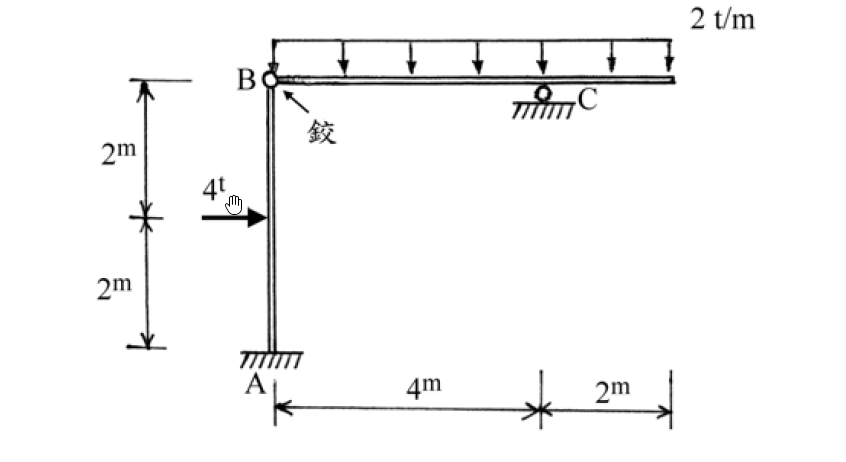

# 考題編號：[SA-2004-1]

**主分類：** `SA-U1` 靜定結構分析
**副分類：** 
**分析法：** 靜定分析
**標籤：** `靜定剛架` `剪力圖` `彎矩圖` `內部鉸`

---

## 1. 原始題目重述 (Problem Restatement)

一、 試分析如圖所示之靜定結構系統，並繪製剪力圖及彎矩圖。其中A 端為固定支承；B 為鉸接點；C 為滾支承。（25 分）

結構包含一垂直柱 AB 與一水平梁 BCD。A端為固定端，B點為內部鉸接。水平梁總長 6m，在距B點 4m 處設有滾支承 C，右側外伸 2m 至自由端 D。載重包含：柱 AB 中點 (距 A 端 2m) 有一水平向右之 4t 集中力；水平梁全線承受 2 t/m 之向下均布載重。

*圖說：結構為 A端固定，B端內部鉸接，C端滾支承。柱AB長4m，受中點水平力4t；梁BCD總長6m (BC=4m, CD=2m)，受2t/m均布載重。*

## 2. 考題核心精神與出題者意圖 (Core Concepts & Examiner's Intent)

本題為經典的靜定剛架分析。核心精神在於測驗考生能否正確運用「內部鉸接點 (Hinge)」作為分離體 (Free Body Diagram) 的切斷點，將複雜結構拆解為單純的靜定柱與梁來求解支承反力與鉸接傳遞力。
出題者刻意將滾支承放置於水平梁上，且梁無任何水平外力，意圖測驗考生是否能敏銳察覺鉸接點的水平傳遞力必然為零，進而發現「柱段受力點以上的部分完全無剪力與彎矩」的有趣現象。

## 3. 解題戰略地圖與陷阱分析 (Strategic Roadmap & Trap Analysis)

**解題戰略：**
1. 將結構於 B 點鉸接處拆解為「水平梁 BCD」與「垂直柱 AB」兩個分離體。
2. 先分析水平梁 BCD，利用 $\sum M_B = 0$ 求解滾支承反力 $C_y$，再由 $\sum F_y = 0$ 求解鉸接點垂直傳遞力 $B_y$。
3. 由水平梁 $\sum F_x = 0$ 可得鉸接點水平傳遞力 $B_x = 0$。
4. 接著分析垂直柱 AB，將求得之 $B_x, B_y$ 反向施加於 B 點。利用 $\sum F_x, \sum F_y, \sum M_A = 0$ 求得固定端 A 之三個反力。
5. 分段寫出剪力與彎矩方程式，繪製 SFD 與 BMD，特別注意利用 $V(x)=0$ 定位出梁段的最大正彎矩位置。

**陷阱分析：**
1. **柱段上半部零內力陷阱**：因鉸接點水平傳遞力 $B_x = 0$，柱 AB 在受力點 ($y=2\text{m}$) 以上的區域，剪力與彎矩皆為零。考生若未確實繪製分離體，極易慣性假設全柱皆有彎矩分佈。
2. **最大正彎矩位置**：梁段的最大彎矩並不在中央，必須透過設定剪力 $V(x)=0$ 來精確定位。
3. **符號與繪圖約定**：彎矩圖繪製通常習慣畫於受拉側。柱段需仔細判斷受拉面 (本題下半柱為左側受拉)；懸臂外伸段為上側受拉。

## 3.5 變數層次分析 (Variable Hierarchy Analysis)

### 最終目標
繪製靜定剛架系統之剪力圖 (SFD) 及彎矩圖 (BMD)。

### 本題關鍵公式（依計算順序）
$$ \sum M = 0, \quad \sum F_x = 0, \quad \sum F_y = 0 $$
$$ V(x) = \int -w(x) dx $$
$$ M(x) = \int \boxed{V(x)} dx $$

### L1：題目直接給定
- 符號 ∣ 數值 ∣ 說明
  - $L_{AB}$ ∣ $4\text{ m}$ ∣ 柱 AB 總高
  - $L_{BC}$ ∣ $4\text{ m}$ ∣ 梁 BC 段跨度
  - $L_{CD}$ ∣ $2\text{ m}$ ∣ 梁外伸段 CD 長度
  - $P$ ∣ $4\text{ t}$ ∣ 柱中點水平集中載重
  - $w$ ∣ $2\text{ t/m}$ ∣ 梁向下降均布載重

### L2：需知識點推導
**步驟一：分離體與支承反力**
- 符號 ∣ 公式／來源 ∣ 卡關?
  - $C_y$ ∣ $\sum M_B^{\text{right}} = 0$ ∣ 
  - $B_y$ ∣ $\sum F_y^{\text{right}} = 0$ ∣ 
  - $B_x$ ∣ $\sum F_x^{\text{right}} = 0$ ∣ 
  - $A_x$ ∣ $\sum F_x^{\text{left}} = 0$ ∣ 
  - $A_y$ ∣ $\sum F_y^{\text{left}} = 0$ ∣ 
  - $M_A$ ∣ $\sum M_A^{\text{left}} = 0$ ∣ 

**步驟二：梁段與柱段內力**
- 符號 ∣ 公式／來源 ∣ 卡關?
  - $V_{BC}(x)$ ∣ $B_y - w x$ ∣ 
  - $M_{BC}(x)$ ∣ $B_y x - \frac{1}{2} w x^2$ ∣ 
  - $M_{\text{max}}^+$ ∣ $M_{BC}(x \text{ at } V=0)$ ∣ 
  - $M_C$ ∣ $-\frac{1}{2} w L_{CD}^2$ ∣ 
  - $V_{AB}(y)$ ∣ 取決於 $A_x$ 與 $P$ ∣ 
  - $M_{AB}(y)$ ∣ $M_A - A_x y$ ∣ 

### L3：深層知識（不懂就卡住）
- 知識點 ∣ 說明 ∣ 卡關?
  - 內部鉸接點 (Hinge) 特性 ∣ 鉸接點無法傳遞彎矩，可作為拆解分離體 (Free Body) 的斷點，提供 $\sum M = 0$ 的額外方程式。 ∣ 
  - 滾支承之反力限制 ∣ 滾支承僅能提供垂直反力，無水平反力，故本題梁段無水平載重時，內部鉸接點之水平傳遞力 $B_x = 0$。 ∣ 
  - 剪力與彎矩之微分關係 ∣ 剪力為零處，彎矩有極值 (最大正彎矩)。需透過 $V(x)=0$ 找出該位置。 ∣ 

## 4. 步驟化詳細計算過程 (Step-by-Step Detailed Calculation)

**Step 1：拆解分離體與求解支承反力**
將結構於內部鉸 B 拆解，先取右側水平梁 BCD 為分離體：
- 水平梁全長 $6\text{ m}$，承受向下均布載重 $w = 2\text{ t/m}$，總等效集中力 $W = 2 \times 6 = 12\text{ t}$，作用於距 B 點 $3\text{ m}$ 處。
- 對 B 點取彎矩平衡求 $C_y$：
  $$ \sum M_B = 0 \implies C_y \times 4 - 12 \times 3 = 0 $$
  $$ 4 C_y = 36 \implies \boxed{C_y = 9\text{ t} (\uparrow)} $$
- 垂直方向力平衡求 $B_y$：
  $$ \sum F_y = 0 \implies B_y + C_y - 12 = 0 $$
  $$ B_y + 9 - 12 = 0 \implies \boxed{B_y = 3\text{ t} (\uparrow)} \text{ (作用於梁上)} $$
- 水平方向力平衡求 $B_x$：
  $$ \sum F_x = 0 \implies \boxed{B_x = 0} $$

再取左側垂直柱 AB 為分離體：
- 承受外部水平力 $P = 4\text{ t} (\rightarrow)$ 於距 A 端 $2\text{ m}$ 處。
- B 點承受來自梁之反作用力：$B_x' = 0$、$B_y' = 3\text{ t} (\downarrow)$。
- 水平方向力平衡求 $A_x$：
  $$ \sum F_x = 0 \implies A_x + 4 + B_x' = 0 \implies A_x + 4 = 0 \implies \boxed{A_x = -4\text{ t} \text{ (即向左 4t)}} $$
- 垂直方向力平衡求 $A_y$：
  $$ \sum F_y = 0 \implies A_y - B_y' = 0 \implies A_y - 3 = 0 \implies \boxed{A_y = 3\text{ t} (\uparrow)} $$
- 對 A 點取彎矩平衡求 $M_A$：
  $$ \sum M_A = 0 \implies M_A - 4 \times 2 - B_x' \times 4 = 0 \implies M_A - 8 - 0 = 0 \implies \boxed{M_A = 8\text{ t-m} (\text{逆時針})} $$

**Step 2：計算梁段 (BCD) 之剪力與彎矩**
設 $x$ 為自 B 點向右之距離 ($0 \le x \le 6\text{ m}$)：
- **BC 段 ($0 \le x < 4$)**：
  $$ V(x) = B_y - wx = 3 - 2x $$
  $$ M(x) = B_y x - \frac{1}{2}wx^2 = 3x - x^2 $$
  當 $V(x) = 0$ 時發生最大正彎矩：
  $$ 3 - 2x = 0 \implies x = 1.5\text{ m} $$
  $$ \boxed{M_{\text{max}}^+ = M(1.5) = 3(1.5) - (1.5)^2 = 2.25\text{ t-m} \text{ (下側受拉)}} $$
  在 C 點 ($x=4$) 剛左側：
  $$ V_C^{\text{左}} = 3 - 2(4) = -5\text{ t} $$
  $$ M_C = 3(4) - 4^2 = -4\text{ t-m} \text{ (上側受拉)} $$

- **CD 外伸段 ($4 < x \le 6$)**：
  $$ V(x) = V_C^{\text{左}} + C_y - w(x-4) = -5 + 9 - 2(x-4) = 12 - 2x $$
  端點檢核：於 $x=6$ 時 $V(6) = 12 - 12 = 0$，符合自由端條件。
  此段亦可由自由端 D 向左計算，設 $x'$ 為距 D 點向左之距離：
  $$ V(x') = w x' = 2 x' $$
  $$ M(x') = -\frac{1}{2} w (x')^2 = -(x')^2 $$
  於 C 點 ($x'=2$)：$M_C = -2^2 = -4\text{ t-m}$，計算結果一致。

**Step 3：計算柱段 (AB) 之剪力與彎矩**
設 $y$ 為自 A 點向上之距離 ($0 \le y \le 4\text{ m}$)：
- **下半段 ($0 \le y < 2$)**：
  剪力 $V(y) = 4\text{ t}$ (左側推力產生之剪力)
  彎矩 $M(y) = M_A - A_x y = 8 - 4y$ (左側受拉為正)
  在受力點 ($y=2\text{ m}$)：$M(2) = 8 - 8 = 0$
- **上半段 ($2 < y \le 4$)**：
  剪力 $V(y) = 4 - 4 = 0$
  彎矩 $M(y) = 0$
  > 策略註解：因頂端 B 點無水平傳遞力 ($B_x=0$)，受力點以上的柱段並無承受任何水平方向的力量，故無剪力與彎矩。

**Step 4：剪力圖 (SFD) 及彎矩圖 (BMD) 總結**
- **剪力圖 (SFD)**：
  - 柱 AB：$0\sim2\text{m}$ 為 $+4\text{t}$ (矩形)；$2\sim4\text{m}$ 為 $0$。
  - 梁 BCD：由 B 點 $+3\text{t}$ 直線遞減至 C 點左側 $-5\text{t}$ (於 $1.5\text{m}$ 處穿過零點)；C 點因 $9\text{t}$ 向上反力跳升至 $+4\text{t}$，再直線遞減至 D 點 $0$。
- **彎矩圖 (BMD)** (繪於受拉側)：
  - 柱 AB：於 A 端為 $8\text{ t-m}$ (畫於左側)，直線遞減至 $2\text{m}$ 處為 $0$；$2\sim4\text{m}$ 皆為 $0$。
  - 梁 BCD：B 點為 $0$，呈拋物線於 $x=1.5\text{m}$ 達最大正彎矩 $2.25\text{ t-m}$ (畫於下側)，交於 $x=3\text{m}$ 為 $0$，至 C 點達 $-4\text{ t-m}$ (畫於上側)；CD 段亦為拋物線遞減至 D 點 $0$。

## 5. 關鍵爭議點與進階探討 (Critical Issues & Advanced Discussion)

- **無內力的陷阱區段**：本題中，柱之上半部無剪力與彎矩內力，這在直覺上極易被考生忽略。必須堅持嚴謹的靜力平衡原則：由於鉸接點 B 不能傳遞彎矩，且梁上無水平載重導致滾支承 C 唯一的限制使 $B_x=0$，因此柱頂B點無任何水平力，導致負載以上的柱段如同懸臂之無載重段，內力為零。
- **作圖習慣與受拉側標示**：結構學實務中，彎矩圖強烈建議繪製於「受拉側 (Tension Side)」，能直觀對應鋼筋混凝土結構中的主筋配置位置。本題柱 AB之下半段受拉側在左，梁 BC 段最大正彎矩受拉側在下，而支承 C 處負彎矩受拉側在上。作答時除了標註數值，繪製於正確側邊是拿滿分的關鍵。
- **分離體的重要性**：此題型強調「以鉸接點拆解」及「逐段檢核邊界條件」的紮實功夫。若企圖直接硬解全結構的平衡方程，雖仍可得出反力，但在繪製內力圖時極容易發生符號錯亂，拆解分離體(FBD)始終是降低錯誤率與釐清觀念的最佳實務。
