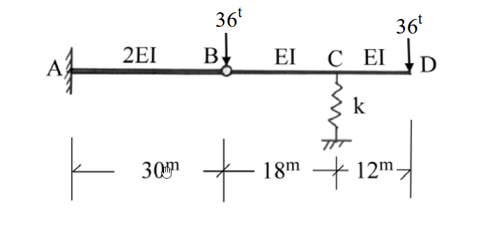

# 考題編號：SA-2004-3

**主分類：** `SA-U2` 結構變位分析
**副分類：** `SA-U1-2` 靜定結構分析
**分析法：** 單位力法 / 虛功法
**標籤：** `內部鉸` `彈簧支承` `剛體位移` `懸臂梁` `複合梁`

---

## 1. 原始題目重述 (Problem Restatement)
如圖所示 $C$ 點為彈簧支承之複合梁，試求在圖示之荷重作用時，點 $C$、$D$ 之傾角及點 $B$、$C$、$D$ 之垂直變位。
已知條件：
- 彎曲剛度 $EI = 1 \times 10^6 \text{ t-m}^2$
- 彈簧常數 $k = 10^4 \text{ t/m}$
- 幾何尺寸：$AB = 30\text{m}$，$BC = 18\text{m}$，$CD = 12\text{m}$
- 桿件剛度：$AB$ 段為 $2EI$，$BCD$ 段為 $EI$
- 支承條件：$A$ 點固定端，$B$ 點為內部鉸 (Hinge)，$C$ 點為彈簧支承
- 載重：$B$ 點受垂直向下集中載重 $36\text{t}$，$D$ 點受垂直向下集中載重 $36\text{t}$

*圖說：A端固定，B為內部鉸接。AB段長30m(2EI)，BC段長18m(EI)，CD段長12m(EI)。C點有彈簧(k=10^4 t/m)。B、D兩點各有36t向下集中載重。*

## 2. 考題核心精神與出題者意圖 (Core Concepts & Examiner's Intent)
本題看似具有彈簧支承，容易讓考生誤以為是靜不定結構而嘗試使用諧合變位法。但實際上，因為 $B$ 點為內部鉸，提供了額外的彎矩為零 ($M_B=0$) 之條件，使整個結構為**靜定結構**。
出題者的意圖在測驗：
1. **靜定性判斷與自由體圖分析**：能否正確切開鉸接點 $B$，利用力平衡直接求得彈簧反力 $R_C$ 與鉸接傳遞之剪力 $V_B$。
2. **彈簧變位與剛體位移之疊加**：梁 $BCD$ 的位移不僅來自於本身的彈性彎曲，還包含了因為支承 $B$、$C$ 下陷所導致的**剛體旋轉與平移 (Rigid body motion)**。
3. **分段變位計算**：懸臂梁位移公式的應用，以及單位力法 (虛功法) 在含有支承變位時的正確列式。

## 3. 解題戰略地圖與陷阱分析 (Strategic Roadmap & Trap Analysis)
**戰略步驟：**
1. **靜力平衡**：取右段梁 $BCD$ 為自由體，對 $B$ 點取力矩平衡，直接求出彈簧反力 $R_C$，進而求得 $B$ 點鉸接剪力 $V_B$。
2. **支承變位計算**：
   - 取左段梁 $AB$，$B$ 點受載重與傳遞剪力共同作用，計算 $B$ 點下陷量 $\Delta_B$。
   - 利用彈簧反力 $R_C$ 及彈簧常數 $k$，計算 $C$ 點下陷量 $\Delta_C$。
3. **彈性位移與剛體位移疊加**：
   - 將 $BCD$ 視為具有支承變位 ($\Delta_B, \Delta_C$) 的結構。
   - 使用單位力法計算 $C$、$D$ 點的絕對傾角及 $D$ 點的絕對垂直變位時，外力虛功必須包含反力在支承變位上所作的功 ($1 \cdot \Delta + \sum r_i \Delta_i = \int \frac{Mm}{EI}dx$)。

**陷阱分析：**
- **陷阱一：誤判為靜不定結構**。若將彈簧力設為贅力 $R$，列出長篇大論的諧合變位方程式，會浪費大量時間，且極易出錯。
- **陷阱二：忽略剛體位移**。計算 $D$ 點變位或 $C,D$ 點傾角時，若僅考慮彈性彎曲變位，而忘記疊加 $B$、$C$ 下陷造成的影響，將會得到錯誤答案。
- **陷阱三：B 點載重歸屬**。$B$ 點的 $36\text{t}$ 載重可以直接分配給 $AB$ 梁或 $BCD$ 梁，兩者分析結果相同，但在計算鉸接剪力 $V_B$ 時符號與意義需保持一致，建議將整個 $B$ 點載重連同 $BCD$ 梁一起畫自由體圖以避免混淆。

## 3.5 變數層次分析 (Variable Hierarchy Analysis)

### 最終目標
`求出 C、D 兩點之傾角，以及 B、C、D 三點之垂直變位`

### 本題關鍵公式（依計算順序）
- 靜力平衡求反力：
  $$ \sum M_B = 0 \Rightarrow R_C \cdot L_{BC} - P_D \cdot (L_{BC} + L_{CD}) = 0 $$
- 懸臂梁自由端變位：
  $$ \Delta_B = \frac{P_{net} L_{AB}^3}{3 (2EI)} $$
- 彈簧變位：
  $$ \Delta_C = \frac{\boxed{R_C}}{k} $$
- 虛功原理 (含支承變位)：
  $$ 1 \cdot \Delta + \sum r_i \boxed{\Delta_i} = \int \frac{M m}{EI} dx $$

### L1：題目直接給定
- 符號 ∣ 數值 ∣ 說明
- $EI$ ∣ $1 \times 10^6 \text{ t-m}^2$ ∣ 基準彎曲剛度
- $k$ ∣ $10^4 \text{ t/m}$ ∣ 彈簧常數
- $P_B, P_D$ ∣ $36\text{t}$ ∣ 節點集中載重

### L2：需知識點推導
- 符號 ∣ 公式／來源 ∣ 卡關?
- $R_C$ ∣ $\sum M_B = 0$ (對BCD梁) ∣ 
- $\Delta_B$ ∣ 懸臂梁變位公式 ∣ 
- $\Delta_C$ ∣ $\Delta = F/k$ ∣ 

### L3：深層知識（不懂就卡住）
- 知識點 ∣ 說明 ∣ 卡關?
- 含支承沉陷之虛功原理 ∣ 虛功方程式左式必須包含 $\sum r_i \Delta_i$，其中 $r_i$ 為單位虛載重產生之反力，$\Delta_i$ 為真實支承變位 ∣ 

## 4. 步驟化詳細計算過程 (Step-by-Step Detailed Calculation)

### Step 1: 結構靜定性判斷與反力計算
整體結構有 $A$ 點固定端 (3個反力：$A_x, A_y, M_A$) 與 $C$ 點彈簧支承 (1個反力：$R_C$)，共 4 個未知反力。
整體平衡方程式有 3 個，加上內部鉸 $B$ 提供 1 個條件 ($M_B=0$)，未知數數目等於方程式數目 ($4 = 3+1$)，故本結構為**靜定結構**。

取鉸接點右側之 $BCD$ 梁為自由體，為避免混淆，我們僅考慮 $BCD$ 桿件本身受力 (不含 $36\text{t}$ 集中力)，則 $BCD$ 桿件在 $B$ 點受 $AB$ 梁提供之下向作用力 $V_B'$，以及 $D$ 點的 $36\text{t}$ 載重。
對 $B$ 點取力矩平衡 ($\sum M_B = 0$)，以順時針為正：
$$ R_C \times 18 - 36 \times (18 + 12) = 0 $$
$$ 18 R_C = 1080 \Rightarrow \boxed{R_C = 60\text{ t} (\uparrow)} $$

接著求 $B$ 點之剪力傳遞。考慮整體 $BCD$ 系統 (包含 $B$ 點的載重)：
$$ \sum F_y = 0 \Rightarrow V_{B,\text{left}} + R_C - 36 - 36 = 0 $$
$$ V_{B,\text{left}} = 72 - 60 = 12\text{ t} (\uparrow) $$
此為 $AB$ 梁對 $BCD$ 梁提供之向上支承力。根據作用力與反作用力定律，$BCD$ 梁對 $AB$ 梁之端點 $B$ 施加 $12\text{t}$ 的向下作用力。
*(註：若將 $36\text{t}$ 完全歸於 $AB$ 梁，則 $BCD$ 梁端剪力為 $24\text{t}$ 向下，$AB$ 梁受 $36\text{t}$ 及 $24\text{t}$ 向上反作用力，淨力仍為 $12\text{t}$ 向下。兩者物理意義一致。)*

### Step 2: 計算 B、C 點之垂直變位
- **B 點變位 ($\Delta_B$)**：
  左段 $AB$ 為懸臂梁，長度 $L_{AB} = 30\text{m}$，剛度為 $2EI$。自由端 $B$ 承受淨向下力 $P_{B,\text{net}} = 12\text{t}$。
  $$ \Delta_B = \frac{P_{B,\text{net}} L_{AB}^3}{3 (2EI)} = \frac{12 \times 30^3}{6 \times 10^6} = \frac{324000}{6000000} = 0.054\text{ m} $$
  $$ \boxed{\Delta_B = 54\text{ mm} (\downarrow)} $$

- **C 點變位 ($\Delta_C$)**：
  彈簧承受梁傳來之向下力 $R_C = 60\text{t}$，產生壓縮變位。
  $$ \Delta_C = \frac{R_C}{k} = \frac{60}{10^4} = 0.006\text{ m} $$
  $$ \boxed{\Delta_C = 6\text{ mm} (\downarrow)} $$

### Step 3: 計算真實結構之內力彎矩 $M(x)$
取 $BCD$ 梁，建立座標 $x$ (自 $B$ 向右為正)。
- $0 \le x \le 18$ ($BC$ 段)：
  左端 $B$ 受淨力 $24\text{t}$ 向下 (為維持 $M_B=0$ 與 $R_C=60\text{t}$ 的等效支承力)。
  切面取左側自由體：$M(x) + 24x = 0 \Rightarrow M(x) = -24x$
- $18 < x \le 30$ ($CD$ 段)：
  設 $x'$ 為自 $C$ 向右之座標 ($x' = x - 18$)。
  切面取右側自由體：$M(x') + 36(12 - x') = 0 \Rightarrow M(x') = -36(12 - x')$
全段均為負彎矩 (Hogging，上端受拉)。

### Step 4: 單位力法求 C 點傾角 ($\theta_C$)
為了包含支承下陷的影響，使用含支承變位之虛功方程式：
$$ 1 \cdot \theta_C + \sum r_i \Delta_i = \int \frac{M m}{EI} dx $$
於 $C$ 點施加一**逆時針 (CCW)** 單位力矩 $m_C = 1$。
求虛擬反力 (以向上為正，逆時針為正)：
$$ \sum M_B = 0 \Rightarrow r_C \times 18 + 1 (\text{CCW}) = 0 \Rightarrow r_C = -\frac{1}{18} (\downarrow) $$
$$ \sum F_y = 0 \Rightarrow r_B + r_C = 0 \Rightarrow r_B = \frac{1}{18} (\uparrow) $$
求虛擬彎矩 $m(x)$ (Sagging為正)：
- $BC$ 段：$m(x) = \frac{x}{18}$ (因左端受向上力 $1/18$，於切面產生順時針力矩，內部彎矩需逆時針抵抗，即正彎矩)
- $CD$ 段：$m(x') = 0$
外虛功 ($W_{ext}$) (定向上為正，真實位移向下取負值)：
$$ W_{ext} = 1 \cdot \theta_C + r_B (-\Delta_B) + r_C (-\Delta_C) = \theta_C + \left(\frac{1}{18}\right)(-0.054) + \left(-\frac{1}{18}\right)(-0.006) $$
$$ W_{ext} = \theta_C - 0.003 + 0.000333 = \theta_C - 0.0026667 $$
內虛功 ($W_{int}$)：
$$ W_{int} = \int_0^{18} \frac{(-24x) \cdot (x/18)}{EI} dx = \int_0^{18} \frac{-4x^2/3}{EI} dx = \frac{-4}{3EI} \left[ \frac{18^3}{3} \right] = \frac{-2592}{EI} = -0.002592 $$
等式求解：
$$ \theta_C - 0.0026667 = -0.002592 \Rightarrow \theta_C = 0.000074667\text{ rad} $$
由於假設逆時針為正，結果為正，代表**逆時針**。
$$ \boxed{\theta_C = 7.467 \times 10^{-5}\text{ rad} (\text{逆時針})} $$

### Step 5: 單位力法求 D 點傾角 ($\theta_D$)
於 $D$ 點施加一**逆時針**單位力矩 $m_D = 1$。
虛擬反力同上：$r_B = 1/18 (\uparrow)$，$r_C = -1/18 (\downarrow)$。
虛擬彎矩 $m(x)$：
- $BC$ 段：$m(x) = x/18$
- $CD$ 段：由右端看，逆時針力矩導致全段承受正彎矩 $m(x') = 1$。
內虛功：
$$ W_{int} = \int_0^{18} \frac{(-24x)(x/18)}{EI} dx + \int_0^{12} \frac{-36(12-x')(1)}{EI} dx $$
$$ W_{int} = -0.002592 + \frac{-36}{EI} \left[ 12x' - \frac{x'^2}{2} \right]_0^{12} = -0.002592 - \frac{2592}{EI} = -0.005184 $$
外虛功與求解：
$$ \theta_D + \left(\frac{1}{18}\right)(-0.054) + \left(-\frac{1}{18}\right)(-0.006) = -0.005184 $$
$$ \theta_D - 0.0026667 = -0.005184 \Rightarrow \theta_D = -0.0025173\text{ rad} $$
結果為負，代表**順時針**。
$$ \boxed{\theta_D = 2.517 \times 10^{-3}\text{ rad} (\text{順時針})} $$

### Step 6: 單位力法求 D 點垂直變位 ($\Delta_D$)
於 $D$ 點施加一**向下**單位力 $P_D = 1$。
求虛擬反力 (向上為正，向下負)：
$$ \sum M_B = 0 \Rightarrow r_C \times 18 - 1 \times 30 = 0 \Rightarrow r_C = \frac{5}{3} (\uparrow) $$
$$ \sum F_y = 0 \Rightarrow r_B + r_C - 1 = 0 \Rightarrow r_B = 1 - \frac{5}{3} = -\frac{2}{3} (\downarrow) $$
求虛擬彎矩 $m(x)$：
- $BC$ 段：左端受向下力 $2/3$，產生負彎矩 $m(x) = -\frac{2}{3}x$
- $CD$ 段：右端受向下力 $1$，產生負彎矩 $m(x') = -1 \times (12 - x') = -(12 - x')$
內虛功：
$$ W_{int} = \int_0^{18} \frac{(-24x)(-2x/3)}{EI} dx + \int_0^{12} \frac{(-36(12-x'))(-(12-x'))}{EI} dx $$
$$ W_{int} = \int_0^{18} \frac{16x^2}{EI} dx + \int_0^{12} \frac{36(12-x')^2}{EI} dx = \frac{31104}{EI} + \frac{20736}{EI} = \frac{51840}{EI} = 0.05184 $$
外虛功與求解 (設真實位移向下取負值)：
$$ 1 (\text{DOWN}) \cdot \Delta_D (\text{DOWN}) + r_B (-\Delta_B) + r_C (-\Delta_C) = 0.05184 $$
(注意：此處因虛擬載重與預期位移皆向下，我們設定 $W_{ext}$ 中施力處之乘積為 $\Delta_D$，若 $\Delta_D$ 計算為正則表示向下)
$$ \Delta_D + \left(-\frac{2}{3}\right)(-0.054) + \left(\frac{5}{3}\right)(-0.006) = 0.05184 $$
$$ \Delta_D + 0.036 - 0.010 = 0.05184 \Rightarrow \Delta_D + 0.026 = 0.05184 $$
$$ \Delta_D = 0.05184 - 0.026 = 0.02584\text{ m} = 25.84\text{ mm} $$
結果為正，代表**向下**。
$$ \boxed{\Delta_D = 25.84\text{ mm} (\downarrow)} $$

## 5. 關鍵爭議點與進階探討 (Critical Issues & Advanced Discussion)
1. **靜定判斷的直覺盲點**：
   此題極易誤導考生將 $R_C$ 設為贅力，浪費時間列出冗長的諧合變位方程式。判斷靜定與否時，務必將所有反力數與方程式數（含內部條件）清點一次。只要 $m+r-3j=0$，即可透過靜力平衡直接解出所有反力。
2. **虛功方程式之支承下陷項**：
   在含有支承下陷的題目中，虛功方程式左式為 $1 \cdot \Delta + \sum r_i \Delta_i$。此處的符號極易出錯。最保險的作法是**嚴格定義一個正向座標系（例如向上為正）**：真實位移向下則代入負值，虛擬反力向下則代負值，兩者相乘的符號自然正確。
3. **剛體位移疊加法**：
   本題也可完全不使用虛功法，改以幾何疊加法求解。先由 $B, C$ 點沉陷量畫出剛體位移直線，求出 $C, D$ 點的剛體旋轉角及 $D$ 點的剛體位移；再將 $B, C$ 視為不動鉸支承，利用共軛梁法或面積矩法求出各點的彈性變形量，兩者相加即為最終絕對變位。此方法物理意義清晰，可作為考場上的最佳驗算工具。
