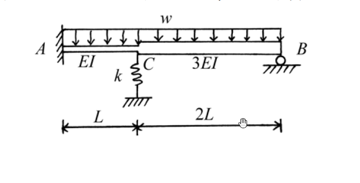

# 考題編號：SA-2004-4

**主分類：** `SA-U2` 結構分析（靜不定）
**副分類：** `SA-U2-4` 矩陣位移法
**分析法：** 矩陣位移法 (直接勁度法)
**標籤：** `矩陣位移法`, `彈簧支承`, `修正式勁度矩陣`, `非節點載重`

---

## 1. 原始題目重述 (Problem Restatement)
本題為一連續梁結構，A 點為固定端，B 點為滾支承，C 點為內部節點。
- 構件 AC：長度 $L$，抗彎剛度 $EI$。
- 構件 CB：長度 $2L$，抗彎剛度 $3EI$。
- C 點下方設有一軸向彈簧，勁度 $k = 12EI/L^3$。
- 均布載重 $w$ 作用於全跨 (A 到 B)。
要求以**直接勁度法**或**矩陣位移法**，求各構件端之彎矩及彈簧力大小。

*圖說：結構總長 $3L$，A 點固定，B 點滾支承，C 點有彈簧支承且為剛度變化點，全跨受向下均布載重 $w$。*

## 2. 考題核心精神與出題者意圖 (Core Concepts & Examiner's Intent)
本題測驗考生對**矩陣位移法（直接勁度法）**的熟練度。核心難點有三：
1. **系統維度選擇：** 一般情況 C 點與 B 點均有旋轉自由度，系統維度為 $3 \times 3$。但若利用 B 點為鉸支承的邊界條件，對 CB 桿段使用「修正式勁度矩陣」（靜態凝聚），可將系統維度降為 $2 \times 2$，大幅降低手算矩陣反轉的錯誤率。
2. **彈簧支承處理：** C 點的軸向彈簧與垂直位移自由度直接相關，只需在整體勁度矩陣對應的對角線元素疊加彈簧勁度 $k$ 即可。
3. **固端載重轉換：** 外力為均布載重，須先計算固端反力（Fixed-End Forces），再反轉符號成為「等效節點載重（Equivalent Nodal Loads）」。

## 3. 解題戰略地圖與陷阱分析 (Strategic Roadmap & Trap Analysis)
**戰略地圖：**
1. **定義自由度：** 選擇 C 點的垂直位移 $D_1$（向上為正）及旋轉角 $D_2$（逆時針為正）作為未知自由度。
2. **建立單元勁度矩陣：**
   - AC 桿：標準固端-固端梁元素（考慮右端自由度）。
   - CB 桿：右端為滾支承，採用固端-鉸端之修正式勁度矩陣。
   - 彈簧：直接疊加至 $K_{11}$。
3. **計算等效節點載重：** 將 AC 與 CB 的均布載重轉換為固端反力，並取負號作為節點外力。
4. **解聯立方程式：** 解出 $D_1, D_2$。
5. **回代求內力：** 依單元勁度方程式回推各桿端彎矩，並計算彈簧力 $F_s = k \cdot D_1$。

**陷阱分析：**
- **陷阱一（符號錯亂）：** 位移法高度依賴嚴格的符號系統。建議全程採用「位移向上為正、旋轉逆時針為正；節點力向上為正、彎矩逆時針為正」的標準直角座標系。
- **陷阱二（CB 桿的剛度參數）：** CB 桿長度為 $2L$、剛度為 $3EI$，代入公式時極易忘記平方或三次方，例如 $K = \frac{3(3EI)}{(2L)^3}$。
- **陷阱三（固端彎矩的修正式）：** 對於一端鉸接的 CB 桿，其固端彎矩公式為 $wL_{CB}^2/8$，切勿誤用 $wL_{CB}^2/12$。

## 3.5 變數層次分析 (Variable Hierarchy Analysis)

### 最終目標
`利用矩陣位移法，求出結構所有桿端彎矩與 C 點彈簧力。`

### 本題關鍵公式（依計算順序）
1. 建立整體勁度矩陣（含彈簧）：
$$ [K] = [K^{(AC)}] + [K^{(CB)}_{mod}] + [K^{(spring)}] $$
2. 計算等效節點載重向量：
$$ \{P_{eq}\} = -\{F_{FEM}^{(AC)}\} - \{F_{FEM}^{(CB)}\} $$
3. 求解位移向量：
$$ \{D\} = [K]^{-1} \{P_{eq}\} $$
4. 回代求桿端內力與彈簧力：
$$ \{F^{(i)}\} = [k^{(i)}] \{d^{(i)}\} + \{F_{FEM}^{(i)}\} $$
$$ F_{s} = k \cdot \boxed{D_1} $$

### L1：題目直接給定
| 符號 | 數值 | 說明 |
|---|---|---|
| $L_1, (EI)_1$ | $L, EI$ | AC 桿長度與抗彎剛度 |
| $L_2, (EI)_2$ | $2L, 3EI$ | CB 桿長度與抗彎剛度 |
| $k$ | $12EI/L^3$ | C 點彈簧勁度 |
| $w$ | $w$ (向下) | 全跨均布載重 |

### L2：需知識點推導
**單元勁度與固端力計算**
| 符號 | 公式／來源 | 卡關? |
|---|---|---|
| $[k_{mod}]$ | 一端鉸接之修正式勁度矩陣 | |
| $FEM_{mod}$ | 一端鉸接之固端反力 ($5wL^2/8, wL^2/8$ 形式) | |

### L3：深層知識（不懂就卡住）
| 知識點 | 說明 | 卡關? |
|---|---|---|
| 靜態凝聚 (Static Condensation) | 若支承端彎矩已知(如鉸支承 $M=0$)，可將該自由度從矩陣中消去，縮小矩陣階數以簡化手算。 | |

## 4. 步驟化詳細計算過程 (Step-by-Step Detailed Calculation)

**Step 1：定義座標系統與自由度**
採用標準卡式座標：垂直位移 $v$ 向上為正，旋轉角 $\theta$ 逆時針為正。
節點 A：固定端，$v_A = 0, \theta_A = 0$
節點 B：滾支承，$v_B = 0, \theta_B$ 不為零，但因其彎矩為零，可將其凝聚。
節點 C：定義未知自由度 $D_1 = v_C$ (向上為正)，$D_2 = \theta_C$ (逆時針為正)。

**Step 2：計算各單元之局部勁度矩陣 (對應 $D_1, D_2$)**
(1) **AC 桿單元 (長度 $L$，剛度 $EI$)**
A 端固定，C 端對應 $D_1, D_2$。對應矩陣為：
$$ [k^{(AC)}] = \begin{bmatrix} \frac{12EI}{L^3} & -\frac{6EI}{L^2} \\ -\frac{6EI}{L^2} & \frac{4EI}{L} \end{bmatrix} $$

(2) **CB 桿單元 (長度 $2L$，剛度 $3EI$)**
右端 B 為滾支承 (鉸)，使用修正式勁度矩陣 (只取左端 C 對應的自由度)：
$$ [k_{mod}^{(CB)}] = \begin{bmatrix} \frac{3(3EI)}{(2L)^3} & \frac{3(3EI)}{(2L)^2} \\ \frac{3(3EI)}{(2L)^2} & \frac{3(3EI)}{(2L)} \end{bmatrix} = \begin{bmatrix} \frac{9EI}{8L^3} & \frac{9EI}{4L^2} \\ \frac{9EI}{4L^2} & \frac{9EI}{2L} \end{bmatrix} = \begin{bmatrix} 1.125 \frac{EI}{L^3} & 2.25 \frac{EI}{L^2} \\ 2.25 \frac{EI}{L^2} & 4.5 \frac{EI}{L} \end{bmatrix} $$

(3) **彈簧支承**
C 點彈簧貢獻垂直勁度 $k = 12 \frac{EI}{L^3}$，直接疊加至 $K_{11}$。

**Step 3：組裝整體勁度矩陣 $[K]$**
$$ K_{11} = 12\frac{EI}{L^3} + 1.125\frac{EI}{L^3} + 12\frac{EI}{L^3} = 25.125\frac{EI}{L^3} = \frac{201}{8}\frac{EI}{L^3} $$
$$ K_{12} = K_{21} = -6\frac{EI}{L^2} + 2.25\frac{EI}{L^2} = -3.75\frac{EI}{L^2} = -\frac{15}{4}\frac{EI}{L^2} $$
$$ K_{22} = 4\frac{EI}{L} + 4.5\frac{EI}{L} = 8.5\frac{EI}{L} = \frac{17}{2}\frac{EI}{L} $$
$$ [K] = \begin{bmatrix} \frac{201}{8} \frac{EI}{L^3} & -\frac{15}{4} \frac{EI}{L^2} \\ -\frac{15}{4} \frac{EI}{L^2} & \frac{17}{2} \frac{EI}{L} \end{bmatrix} $$

**Step 4：計算等效節點載重 $\{P_{eq}\}$**
均布載重 $w$ 向下。先求各桿於 C 點的固端反力 (Fixed-End Forces, $F_{FEM}$)：
- **AC 桿 (兩端固定)：**
  $V_C^{(AC)} = \frac{wL}{2}$ (向上)
  $M_C^{(AC)} = -\frac{wL^2}{12}$ (順時針，負)
- **CB 桿 (左端固定，右端鉸接)：**
  長度為 $2L$。
  $V_C^{(CB)} = \frac{5w(2L)}{8} = \frac{10wL}{8} = 1.25 wL$ (向上)
  $M_C^{(CB)} = \frac{w(2L)^2}{8} = \frac{4wL^2}{8} = 0.5 wL^2$ (逆時針，正)

等效節點載重為固端反力反向（加負號）：
$$ P_1 = - (V_C^{(AC)} + V_C^{(CB)}) = - (0.5 wL + 1.25 wL) = -1.75 wL = -\frac{7}{4} wL $$
$$ P_2 = - (M_C^{(AC)} + M_C^{(CB)}) = - \left(-\frac{1}{12} wL^2 + \frac{1}{2} wL^2\right) = -\frac{5}{12} wL^2 $$
$$ \{P_{eq}\} = \begin{bmatrix} -\frac{7}{4} wL \\ -\frac{5}{12} wL^2 \end{bmatrix} $$

**Step 5：解矩陣方程式**
$$ \begin{bmatrix} \frac{201}{8} \frac{EI}{L^3} & -\frac{15}{4} \frac{EI}{L^2} \\ -\frac{15}{4} \frac{EI}{L^2} & \frac{17}{2} \frac{EI}{L} \end{bmatrix} \begin{bmatrix} D_1 \\ D_2 \end{bmatrix} = \begin{bmatrix} -\frac{7}{4} wL \\ -\frac{5}{12} wL^2 \end{bmatrix} $$
提取出 $EI, L$，簡化係數矩陣的行列式值：
$$ \Delta = \det[K] = \left(\frac{201}{8}\right)\left(\frac{17}{2}\right) - \left(-\frac{15}{4}\right)^2 = \frac{3417}{16} - \frac{225}{16} = \frac{3192}{16} = \frac{399}{2} $$
由 Cramer's Rule 求 $D_1, D_2$：
$$ D_1 = \frac{1}{\Delta} \left[ \left(-\frac{7}{4}\right)\left(\frac{17}{2}\right) - \left(-\frac{15}{4}\right)\left(-\frac{5}{12}\right) \right] \frac{wL^4}{EI} = \frac{2}{399} \left[ -\frac{119}{8} - \frac{75}{48} \right] \frac{wL^4}{EI} = \frac{2}{399} \left[ -\frac{714+75}{48} \right] \frac{wL^4}{EI} = \boxed{ -\frac{263}{3192} \frac{wL^4}{EI} } $$
$$ D_2 = \frac{1}{\Delta} \left[ \left(\frac{201}{8}\right)\left(-\frac{5}{12}\right) - \left(-\frac{7}{4}\right)\left(-\frac{15}{4}\right) \right] \frac{wL^3}{EI} = \frac{2}{399} \left[ -\frac{1005}{96} - \frac{105}{16} \right] \frac{wL^3}{EI} = \frac{2}{399} \left[ -\frac{1005+630}{96} \right] \frac{wL^3}{EI} = \boxed{ -\frac{545}{6384} \frac{wL^3}{EI} } $$
($D_1$ 為負，表示節點 C 實際向下位移；$D_2$ 為負，表示節點 C 順時針旋轉)

**Step 6：回代求各桿端彎矩與彈簧力**
利用 $\{F\} = [k]\{D\} + \{F_{FEM}\}$，此處均遵循逆時針為正。

- **A端彎矩 $M_{A} = M_{AC}$：**
  $M_{AC} = [ -\frac{6EI}{L^2} \quad \frac{2EI}{L} ] \begin{bmatrix} D_1 \\ D_2 \end{bmatrix} + \frac{wL^2}{12}$
  $M_{AC} = -\frac{6EI}{L^2} \left(-\frac{263}{3192} \frac{wL^4}{EI}\right) + \frac{2EI}{L} \left(-\frac{545}{6384} \frac{wL^3}{EI}\right) + \frac{wL^2}{12}$
  $M_{AC} = \left( \frac{1578}{3192} - \frac{1090}{6384} + \frac{266}{3192} \right) wL^2 = \left( \frac{3156 - 1090 + 532}{6384} \right) wL^2 = \frac{2598}{6384} wL^2 = \boxed{ \frac{433}{1064} wL^2 \text{ (逆時針)} }$

- **C端彎矩 $M_{CA}$ (AC桿右側)：**
  $M_{CA} = [ -\frac{6EI}{L^2} \quad \frac{4EI}{L} ] \begin{bmatrix} D_1 \\ D_2 \end{bmatrix} - \frac{wL^2}{12}$
  $M_{CA} = -\frac{6EI}{L^2} \left(-\frac{263}{3192}\right) + \frac{4EI}{L} \left(-\frac{545}{6384}\right) - \frac{1}{12} = \left( \frac{3156}{6384} - \frac{2180}{6384} - \frac{532}{6384} \right) wL^2 = \frac{444}{6384} wL^2 = \boxed{ \frac{37}{532} wL^2 \text{ (逆時針)} }$

- **C端彎矩 $M_{CB}$ (CB桿左側)：**
  $M_{CB} = [ \frac{2.25EI}{L^2} \quad \frac{4.5EI}{L} ] \begin{bmatrix} D_1 \\ D_2 \end{bmatrix} + \frac{w(2L)^2}{8}$
  $M_{CB} = \frac{9}{4} \left(-\frac{263}{3192}\right) + \frac{9}{2} \left(-\frac{545}{6384}\right) + 0.5 = \left( -\frac{2367}{12768} - \frac{4905}{12768} + \frac{6384}{12768} \right) wL^2 = -\frac{888}{12768} wL^2 = \boxed{ -\frac{37}{532} wL^2 \text{ (順時針)} }$
  *(註：$M_{CA} + M_{CB} = 0$，滿足內部節點彎矩平衡，計算無誤！)*

- **B端彎矩 $M_{B}$：**
  B 端為滾支承，彎矩直接為零：
  $\boxed{ M_{B} = 0 }$

- **彈簧力 $F_s$：**
  $F_s = k \cdot D_1 = \left( \frac{12EI}{L^3} \right) \left(-\frac{263}{3192} \frac{wL^4}{EI}\right) = -\frac{3156}{3192} wL = -\frac{263}{266} wL$
  彈簧力大小：
  $\boxed{ |F_s| = \frac{263}{266} wL \approx 0.989 wL \text{ (壓力)} }$

## 5. 關鍵爭議點與進階探討 (Critical Issues & Advanced Discussion)
1. **維度縮減的重要性：**
   若不使用鉸端修正矩陣，系統矩陣將是 $3 \times 3$。在考場上手動求解 $3 \times 3$ 矩陣的反矩陣極易發生算術錯誤且耗時。利用 B 點滾支承 $M_B=0$ 的條件預先將 $\theta_B$ 凝聚，是確保解題速度與準確度的關鍵策略。
2. **彈簧力符號解讀：**
   求得之 $D_1$ 為負值（向下），而彈簧位於梁之下方，故梁向下擠壓彈簧。因此彈簧本身承受壓縮力，其反向施加於梁節點 C 的力方向為向上（對抗外部載重）。在寫答案時，應指明彈簧力的大小及為壓力。
3. **驗算機制：**
   計算完畢後，強烈建議進行節點 C 的彎矩平衡檢驗 ($M_{CA} + M_{CB} = 0$)。若不為零，必為勁度矩陣或等效載重計算有誤，這是一個能在考場上立刻自我糾正的重要工具。
