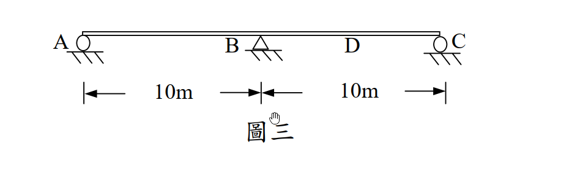

# 考題編號：[SA-2005-3]

**主分類：** `SA-U1` 影響線與靜定結構
**副分類：** `SA-U2` 靜不定結構分析
**分析法：** 影響線 / 三彎矩方程式
**標籤：** `影響線`, `連續梁`, `三彎矩方程式`, `Müller-Breslau原理`

---

## 1. 原始題目重述 (Problem Restatement)
三、二跨之靜不定梁如圖三，各梁之楊氏係數 $E$ 及慣性矩 $I$ 為常數，試每隔 2.5m 畫出 BC 跨度中點 D 之彎矩影響線（influence line）。（25 分）

*圖說：兩跨連續梁 AC，A 點為滾支承，B 點為鉸支承，C 點為滾支承。AB 跨距為 10m，BC 跨距為 10m。D 點為 BC 跨之中點。各梁之 EI 為常數。*

## 2. 考題核心精神與出題者意圖 (Core Concepts & Examiner's Intent)
本題主要測驗考生對於**靜不定結構影響線**的計算與繪製能力。
出題者意圖包含：
1. **影響線的基本概念**：理解影響線的縱座標代表單位載重移動至該點時，特定位置（D點）之內力（彎矩）大小。
2. **靜不定分析方法**：對於一次靜不定結構，需能熟練運用力法（如三彎矩方程式）或位移法求出多餘反力（如支承 B 的彎矩 $M_B$）。
3. **內力疊加原理**：在求出 $M_B$ 後，利用靜力平衡或疊加法（簡單梁彎矩圖 + 端點彎矩影響）求出 D 點彎矩 $M_D$。

## 3. 解題戰略地圖與陷阱分析 (Strategic Roadmap & Trap Analysis)
**戰略地圖：**
1. **建立模型**：考慮單位載重 $P=1$ 在距離 A 點 $x$ 處移動。
2. **計算 $M_B$**：利用三彎矩方程式，分別針對載重在 AB 跨 ($0 \le x \le 10$) 與 BC 跨 ($10 \le x \le 20$) 列式，求出 $M_B$ 隨 $x$ 變化的函數。
3. **計算 $M_D$**：
   - 當 $P=1$ 在 AB 跨時，BC 跨無外力，D 點彎矩僅由 $M_B$ 貢獻，即 $M_D = M_B / 2$。
   - 當 $P=1$ 在 BC 跨時，D 點彎矩等於「簡支梁 BC 受載重時 D 點的彎矩 $M_{D,simple}$」加上「$M_B$ 產生的彎矩 $M_B / 2$」。
4. **計算縱座標**：代入 $x = 0, 2.5, 5, 7.5, 10, 12.5, 15, 17.5, 20$，求出各點的 $M_D$ 值，並整理成表。

**陷阱分析：**
1. **三彎矩方程式的右式載重項**：載重項 $\frac{6A\bar{x}}{L}$ 的距離 $\bar{x}$ 必須是由「外側支承」量至彎矩圖形心的距離，代入時容易搞錯 $a$ 與 $b$ 的順序。
2. **D點彎矩的疊加**：當載重在 BC 跨上時，絕對不能忘記加上簡支梁效應 $M_{D,simple}$。
3. **符號約定**：計算出的 $M_B$ 通常為負值（上緣受拉），疊加時必須帶有正確的符號。

## 3.5 變數層次分析 (Variable Hierarchy Analysis)
### 最終目標
求出單位集中載重 $P=1$ 通過連續梁時，BC 跨中點 D 之彎矩 $M_D$ 於各 2.5m 節點的精確數值。

### 本題關鍵公式（依計算順序）
1. 三彎矩方程式：
$$ M_A L_1 + 2 M_B (L_1 + L_2) + M_C L_2 = - \frac{6 A_1 a_1}{L_1} - \frac{6 A_2 b_2}{L_2} $$
2. 載重在 AB 跨時的 $M_B$：
$$ \boxed{M_B} = - \frac{P \cdot x \cdot (10-x) \cdot (10+x)}{10 \cdot 40} $$
3. 載重在 BC 跨時的 $M_B$（令 $x' = x-10$）：
$$ \boxed{M_B} = - \frac{P \cdot x' \cdot (10-x') \cdot (20-x')}{10 \cdot 40} $$
4. 疊加法求 D 點彎矩：
$$ \boxed{M_D} = M_{D,simple} + \frac{\boxed{M_B}}{2} $$

### L1：題目直接給定
- 符號 $L_1$ ∣ 數值 $10\text{ m}$ ∣ 說明 AB 跨度
- 符號 $L_2$ ∣ 數值 $10\text{ m}$ ∣ 說明 BC 跨度
- 符號 $P$ ∣ 數值 $1$ ∣ 說明 單位載重
- 符號 $x_D$ ∣ 數值 $15\text{ m}$ ∣ 說明 D 點距離 A 點位置

### L2：需知識點推導
**三彎矩方程式計算**
- 符號 $M_A, M_C$ ∣ 公式 $M_A = M_C = 0$ (鉸/滾端) ∣ 卡關? 
- 符號 $M_B$ (P在AB跨) ∣ 公式 $-\frac{x(100-x^2)}{400}$ ∣ 卡關?
- 符號 $M_B$ (P在BC跨) ∣ 公式 $-\frac{x'(10-x')(20-x')}{400}$ ∣ 卡關?

**D點彎矩計算**
- 符號 $M_{D,simple}$ ∣ 公式 簡支梁跨中彎矩公式 ∣ 卡關?
- 符號 $M_D$ ∣ 公式 $M_{D,simple} + M_B / 2$ ∣ 卡關?

### L3：深層知識（不懂就卡住）
- 知識點 三彎矩方程式右式 ∣ 說明 $\frac{6Aa}{L} = \frac{Pab(L+a)}{L}$，需注意 $a$ 為距離遠端支承之長度 ∣ 卡關?
- 知識點 影響線定義 ∣ 說明 IL 上 $x$ 處的數值代表載重在 $x$ 處時目標函數的值 ∣ 卡關?

## 4. 步驟化詳細計算過程 (Step-by-Step Detailed Calculation)

**Step 1：建立三彎矩方程式**
對於 A-B-C 連續梁，因 A、C 為端點滾支承，故 $M_A = 0$、$M_C = 0$。
設 $L_1 = 10\text{ m}$，$L_2 = 10\text{ m}$，套用三彎矩方程式：
$$ M_A L_1 + 2M_B(L_1 + L_2) + M_C L_2 = - \frac{6A_1 a_1}{L_1} - \frac{6A_2 b_2}{L_2} $$
$$ 0 + 2M_B(10 + 10) + 0 = 40M_B = - \sum \frac{P a b (L+a)}{L} $$

**Step 2：計算單位載重 $P=1$ 在 AB 跨 ($0 \le x \le 10$) 時的 $M_B$ 與 $M_D$**
設載重距離 A 點為 $x$，則在 AB 跨中，距外側支承 A 之距離 $a = x$，距內側支承 B 之距離 $b = 10 - x$。
三彎矩方程式右式僅有第一跨有載重：
$$ 40M_B = - \frac{1 \cdot x \cdot (10-x) \cdot (10+x)}{10} = - \frac{x(100-x^2)}{10} $$
$$ M_B = - \frac{x(100-x^2)}{400} $$

此時 BC 跨無任何垂直外力，僅受 B 點彎矩 $M_B$ 作用。由靜力平衡，BC 跨之彎矩呈線性分佈，從 B 點的 $M_B$ 遞減至 C 點的 0。
D 為 BC 中點，故：
$$ M_D = \frac{M_B}{2} = - \frac{x(100-x^2)}{800} $$

各點縱座標計算 ($0 \le x \le 10$)：
- $x = 0$：$M_D = 0$
- $x = 2.5$：$M_B = - \frac{2.5(100 - 6.25)}{400} = - \frac{75}{128} \approx -0.586$，$M_D = - \frac{75}{256} \approx \boxed{-0.293}$
- $x = 5.0$：$M_B = - \frac{5(100 - 25)}{400} = - \frac{15}{16} = -0.9375$，$M_D = - \frac{15}{32} \approx \boxed{-0.469}$
- $x = 7.5$：$M_B = - \frac{7.5(100 - 56.25)}{400} = - \frac{105}{128} \approx -0.820$，$M_D = - \frac{105}{256} \approx \boxed{-0.410}$
- $x = 10.0$：$M_B = 0$，$M_D = \boxed{0}$

**Step 3：計算單位載重 $P=1$ 在 BC 跨 ($10 \le x \le 20$) 時的 $M_B$ 與 $M_D$**
設載重距離 B 點為 $x'$ ($x' = x - 10$)，則距內側支承 B 之距離為 $x'$，距外側支承 C 之距離為 $b = 10 - x'$。
對於第二跨，公式中的 $a$ 為距離遠端 C 之距離，故 $a = 10 - x'$，$b = x'$。
$$ 40M_B = - \frac{1 \cdot (10-x') \cdot x' \cdot (10 + 10 - x')}{10} = - \frac{x'(10-x')(20-x')}{10} $$
$$ M_B = - \frac{x'(10-x')(20-x')}{400} $$

D 點彎矩可視為「簡支梁 BC 在載重下的彎矩 $M_{D,simple}$」與「支承彎矩 $M_B$ 產生的彎矩」之疊加：
$$ M_D = M_{D,simple} + \frac{M_B}{2} $$
其中 $M_{D,simple}$ 計算如下：
- 若載重在 B、D 之間 ($0 \le x' \le 5$)：$M_{D,simple} = R_C \cdot 5 = \frac{x'}{10} \cdot 5 = \frac{x'}{2}$
- 若載重在 D、C 之間 ($5 \le x' \le 10$)：$M_{D,simple} = R_B \cdot 5 = \frac{10-x'}{10} \cdot 5 = \frac{10-x'}{2}$

各點縱座標計算 ($10 < x \le 20$)：
- $x = 12.5$ ($x'=2.5$)：
  $M_B = - \frac{2.5(7.5)(17.5)}{400} = - \frac{105}{128} \approx -0.820$
  $M_{D,simple} = \frac{2.5}{2} = 1.25$
  $M_D = 1.25 - \frac{105}{256} = \frac{320 - 105}{256} = \frac{215}{256} \approx \boxed{0.840}$
- $x = 15.0$ ($x'=5.0$)：
  $M_B = - \frac{5(5)(15)}{400} = - \frac{15}{16} = -0.9375$
  $M_{D,simple} = \frac{5}{2} = 2.5$
  $M_D = 2.5 - \frac{15}{32} = \frac{80 - 15}{32} = \frac{65}{32} = \boxed{2.03125}$
- $x = 17.5$ ($x'=7.5$)：
  $M_B = - \frac{7.5(2.5)(12.5)}{400} = - \frac{75}{128} \approx -0.586$
  $M_{D,simple} = \frac{10-7.5}{2} = 1.25$
  $M_D = 1.25 - \frac{75}{256} = \frac{320 - 75}{256} = \frac{245}{256} \approx \boxed{0.957}$
- $x = 20.0$ ($x'=10.0$)：
  $M_B = 0$，$M_D = \boxed{0}$

**Step 4：影響線座標總表**

| $x$ (m) | 點位 | $M_D$ (tf-m/tf) | 分數值 |
|:---:|:---:|:---:|:---:|
| 0 | A | 0 | 0 |
| 2.5 | | -0.293 | -75/256 |
| 5.0 | | -0.469 | -15/32 |
| 7.5 | | -0.410 | -105/256 |
| 10.0 | B | 0 | 0 |
| 12.5 | | 0.840 | 215/256 |
| 15.0 | D | 2.031 | 65/32 |
| 17.5 | | 0.957 | 245/256 |
| 20.0 | C | 0 | 0 |

*(依據上述數值繪製出兩跨之平滑曲線，在 D 點會有尖峰轉折)*

## 5. 關鍵爭議點與進階探討 (Critical Issues & Advanced Discussion)
1. **Müller-Breslau 原理的應用**：
   本題雖然使用三彎矩方程式（力法）計算十分快捷精確，但若從 Müller-Breslau 原理的角度來看，將 D 點切開並加入鉸接，施加單位相對旋轉角 $\Delta \theta_D = 1$ 後的彈性曲線即為 $M_D$ 的影響線。因為原結構為一次靜不定，在 D 點加鉸後變成「靜定結構」，此時可以完全使用共軛梁法求出該靜定結構的變形曲線，兩種方法所得結果完全一致，可用作考場上的互相驗算。
2. **影響線形狀特徵**：
   在 AB 跨，影響線皆為負值，代表載重在 AB 跨時會使 BC 跨產生上凸變形，導致 D 點產生負彎矩；在 BC 跨，D 點附近影響線為正值，且在 D 點有明顯的尖點（非平滑），這是因為內力影響線在所求截面處必定有相對位移（此題為相對轉角）的不連續。
