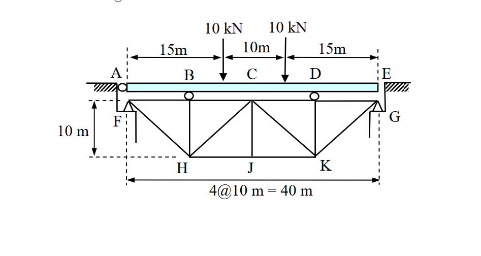

# 考題編號：[SA-2006-1]

**主分類：** `SA-U2` 靜不定結構分析
**副分類：** `SA-U2-1` 最小功法 / 卡式定理
**分析法：** 最小功法 / 虛功法 (單位力法)
**標籤：** `桁架與樑混合結構` `靜不定` `虛功原理` `最小功法` `參數解`

---

## 1. 原始題目重述 (Problem Restatement)
**題目：**
如圖所示之橋樑，試計算 J 點之垂直變位。圖中 AE 為樑（beam）構件，其餘為桁架（truss）構件，支點 A、B、D 為滾支承（roller），而支點 F 與 G 為鉸支承（hinge）。假設各構件之 E 值（彈性模數）、I 值（慣性矩）與 A 值（斷面積）皆為常數。不計構件之自重與樑之深度。（25 分）

*圖說：連續樑 AE 受兩個 10 kN 集中載重，透過滾支承 B, D 將力量傳遞至下方桁架。桁架左右端 F, G 為鉸支承。*

---

## 2. 考題核心精神與出題者意圖 (Core Concepts & Examiner's Intent)
1. **結構系統解構能力**：本題為「樑」與「桁架」的混合結構。由於樑與桁架之間透過滾支承 (B, D) 連接，代表樑僅傳遞「垂直力」給桁架，不會傳遞彎矩與水平力。
2. **靜不定度判別與處理**：
   - 樑構件 AE 具備 A, B, D 三個垂直支承，屬於一階靜不定。
   - 桁架構件具備 F, G 兩個鉸支承（共4個反力），內部雖無多餘桿件，但因外支承條件，屬於外部一階靜不定。
   - 整體系統為「二階靜不定」。
3. **未給定斷面性質數值之參數推導**：題目僅聲明 E, I, A 為常數，並未給予具體數值或相對比例（如 EI/EA）。這考驗考生能否將未知數一路帶入代數運算，並利用最小功法求得參數解。
4. **虛功法（單位力法）之靈活應用**：求 J 點變位時，若使用完整的靜不定系統施加單位力將極度繁雜。巧妙選取「靜定基本結構」（切斷贅力）作為虛力系統，可使樑的虛彎矩 $m=0$，大幅簡化計算！

---

## 3. 解題戰略地圖與陷阱分析 (Strategic Roadmap & Trap Analysis)
- **Step 1：定義贅力與拆解系統**
  - 樑的垂直反力 $R_A, R_B, R_D$，可選 $R_D$ 為贅力，由靜力平衡將 $R_A, R_B$ 以 $R_D$ 表示。
  - 桁架承受樑傳來的向下力 $R_B, R_D$，因 F, G 皆為鉸支承，產生水平反力 $H$（選為第二贅力）。
- **Step 2：利用最小功法求桁架水平贅力 $H$**
  - 將桁架所有桿件內力以 $R_D$ 與 $H$ 表示。
  - 對 $H$ 偏微分 $\frac{\partial U}{\partial H} = 0$，解出 $H$ 與 $R_D$ 的關係。
- **Step 3：利用最小功法求系統垂直贅力 $R_D$**
  - 總應變能 $U = U_{beam} + U_{truss}$。
  - 計算 $\frac{\partial U}{\partial R_D} = 0 \implies \int \frac{M}{EI}\frac{\partial M}{\partial R_D}dx + \sum \frac{F L}{EA}\frac{\partial F}{\partial R_D} = 0$，得到包含 $EI$ 與 $EA$ 的 $R_D$ 參數解。
- **Step 4：虛功法求 $\Delta_J$**
  - 於 J 點施加單位虛力。選擇靜定基本結構（令贅力 $R_D=0, H=0$），此時樑上無任何虛力載重，故 $m_0 = 0$。
  - 變位公式退化為僅需計算桁架部分：$\Delta_J = \sum \frac{F u_0 L}{EA}$。

**⚠️ 關鍵陷阱：**
1. **誤認樑 AE 為桁架上弦桿**：因 B, D 為滾支承，無法傳遞水平力，故桁架本身必有獨立之上弦桿承受水平軸力。
2. **忽略桁架水平反力**：F, G 皆為鉸支承，桁架受載時會產生向外推力，必須有水平反力 $H$ 維持平衡，不可假設 $H=0$。
3. **迷失於繁雜代數**：求解過程中常數與根號項極多，需保持高度條理，將樑與桁架的應變能分開整理。

---

## 3.5 變數層次分析 (Variable Hierarchy Analysis)

### 最終目標
`計算整體二階靜不定結構中，桁架下弦 J 點之垂直向下變位量 \Delta_J（以 EI, EA 參數表示）`

### 本題關鍵公式（依計算順序）
- 桁架水平贅力方程（相對於 G 點水平位移為零）：
  $$\sum F \frac{\partial F}{\partial H} \frac{L}{EA} = 0$$
- 整體系統垂直贅力方程（相對於 D 點之諧合變位）：
  $$\int \frac{M}{EI} \frac{\partial M}{\partial R_D} dx + \sum F \frac{\partial F}{\partial R_D} \frac{L}{EA} = 0$$
- 虛功法位移公式（選用靜定基本結構，使 $m_0 = 0$）：
  $$\Delta_J = \sum \frac{\boxed{F} u_0 L}{EA}$$

### L1：題目直接給定
| 符號 | 數值/參數 | 說明 |
|---|---|---|
| $L_{bay}$ | $10\text{ m}$ | 桁架單格水平寬度及垂直高度 |
| $E, I, A$ | 常數 | 構件材料與斷面性質 |
| $P$ | $10\text{ kN}$ | 樑上之集中載重，分別位於 $x=15\text{m}$ 與 $x=25\text{m}$ |

### L2：需知識點推導
| 符號 | 公式／來源 | 卡關? |
|---|---|---|
| $R_B, R_D$ | 樑與桁架之接觸力（由樑之 $\sum M_A=0$ 與 $\sum F_y=0$ 推導） | |
| $H$ | 桁架水平反力（由 $\partial U/\partial H = 0$ 推導） | |
| $F$ | 桁架各桿件之真實內力（含 $R_D$ 變數） | |
| $u_0$ | J 點受單位力時之虛內力（基本結構 $H=0, R_D=0$） | |

### L3：深層知識（不懂就卡住）
| 知識點 | 說明 | 卡關? |
|---|---|---|
| 靜定基本結構選取 | 虛功法中，虛力系統不須與原靜不定系統相同，只需滿足靜力平衡。切斷 $R_D, H$ 使 $m_0=0$ 可省去樑的複雜虛功積分。 | |
| 參數解的信心 | 當題目未給 $EI/EA$ 比例時，解答必定會保留這兩個參數，不可強行假設其一為無限大。 | |

---

## 4. 步驟化詳細計算過程 (Step-by-Step Detailed Calculation)

### Step 1：樑之靜力平衡與內力函數
樑 AE 長度 40m，支承於 A(0), B(10), D(30)。受載 10kN 於 $x=15, 25$。
選取 $R_D$ 為贅力（向上為正），則由靜力平衡：
- $\sum M_A = 0 \implies 10 R_B + 30 R_D - 10(15) - 10(25) = 0 \implies R_B = 40 - 3 R_D$
- $\sum F_y = 0 \implies R_A = 20 - R_B - R_D = 2 R_D - 20$

樑之彎矩函數 $M(x)$ 與偏微分 $\frac{\partial M}{\partial R_D}$：
- $0 \le x \le 10$: $M = (2 R_D - 20)x \implies \frac{\partial M}{\partial R_D} = 2x$
- $10 \le x \le 15$: $M = (20 - R_D)x - 400 + 30 R_D \implies \frac{\partial M}{\partial R_D} = 30 - x$
- $15 \le x \le 25$: $M = (10 - R_D)x - 250 + 30 R_D \implies \frac{\partial M}{\partial R_D} = 30 - x$
- $25 \le x \le 30$: $M = (30 - x)R_D \implies \frac{\partial M}{\partial R_D} = 30 - x$
- $30 \le x \le 40$: $M = 0$

計算樑的應變能偏微分項 $B = \int \frac{M}{EI} \frac{\partial M}{\partial R_D} dx$：
$$ EI \cdot B = \int_0^{10} 2x(2R_D - 20)x dx + \dots (\text{分段積分}) $$
經代數化簡後得：
$$ \boxed{ \int \frac{M \frac{\partial M}{\partial R_D}}{EI} dx = \frac{4000 R_D - 32500}{EI} } $$

### Step 2：桁架內力 $F$ 與水平贅力 $H$ 之求解
桁架受樑傳來之向下負載：$P_B = 40 - 3 R_D$ 於 B'，$P_D = R_D$ 於 D'。
因 F, G 為鉸支承，設向內之水平反力為 $H$。
由桁架整體平衡求垂直反力：
$\sum M_F = 0 \implies 40 G_y - 10 P_B - 30 P_D = 0 \implies G_y = 10 \text{ kN}$
$F_y = P_B + P_D - G_y = 30 - 2 R_D \text{ kN}$

利用節點法解出各桿內力 $F$（拉力為正）：
- **上弦桿** (FB', B'C'): $F = R_D - 10 - H$
- **上弦桿** (C'D', D'G): $F = 10 - R_D - H$
- **下弦桿** (HJ, JK): $F = 20 - R_D$
- **垂直桿**: B'H $= 3 R_D - 40$, C'J $= 0$, D'K $= -R_D$
- **斜桿**: FH $= \sqrt{2}(30 - 2 R_D)$, HC' $= \sqrt{2}(10 - R_D)$, C'K $= \sqrt{2}(R_D - 10)$, KG $= 10\sqrt{2}$

由最小功法 $\frac{\partial U_{truss}}{\partial H} = 0$，因只有上弦桿受 $H$ 影響（$\frac{\partial F}{\partial H} = -1$）：
$$ \sum_{top} F (-1) L = 0 \implies (R_D - 10 - H) \times 2 + (10 - R_D - H) \times 2 = 0 \implies 4H = 4 R_D - 80 \implies \boxed{ H = R_D - 20 } $$
代回更新上弦桿真實內力：
- FB' = B'C' $= R_D - 10$
- C'D' = D'G $= 10 - R_D$

### Step 3：求系統垂直贅力 $R_D$
計算桁架應變能對 $R_D$ 之偏微分 $T = \sum F \frac{\partial F}{\partial R_D} \frac{L}{EA}$：
經各桿件加總（上弦+下弦+垂直+斜桿）：
$$ EA \cdot T = 40(R_D - 10) + 20(R_D - 20) + 10(10R_D - 120) + 20\sqrt{2}(6R_D - 80) $$
化簡得：
$$ \boxed{ \sum F \frac{\partial F}{\partial R_D} \frac{L}{EA} = \frac{(160 + 120\sqrt{2})R_D - (2000 + 1600\sqrt{2})}{EA} } $$

將樑與桁架組合：$B + T = 0$
$$ \frac{4000 R_D - 32500}{EI} + \frac{(160 + 120\sqrt{2})R_D - (2000 + 1600\sqrt{2})}{EA} = 0 $$
令 $\alpha = \frac{EI}{EA}$，解得 $R_D$：
$$ \boxed{ R_D = \frac{812.5 + \alpha (50 + 40\sqrt{2})}{100 + \alpha (4 + 3\sqrt{2})} \text{ (kN)} } $$

### Step 4：虛功法求 J 點垂直變位 $\Delta_J$
於桁架 J 點施加單位虛力 $1 \text{ kN}$ (向下)。
為簡化計算，選擇**靜定基本結構**：切斷 $R_D$ (使樑與桁架右側分離) 並將 G 點改為滾支承 ($H=0$)。
此時樑上無任何虛力作用，故 **虛彎矩 $m_0 = 0$**。
桁架之虛內力 $u_0$ 為：
- 上弦桿全為 $-0.5$，下弦桿全為 $1.0$。
- 垂直桿 C'J $= 1.0$，其餘為 $0$。
- 斜桿 FH $= \text{KG} = 0.5\sqrt{2}$，HC' $= \text{C'K} = -0.5\sqrt{2}$。

應用虛功原理：
$$ \Delta_J = \int \frac{M m_0}{EI} dx + \sum \frac{F u_0 L}{EA} = 0 + \sum \frac{F u_0 L}{EA} $$
將 Step 2 之真實內力 $F$ 與 $u_0$ 逐桿相乘加總：
$$ EA \cdot \Delta_J = 0 (\text{上弦}) + 10(40 - 2R_D) (\text{下弦}) + 0 (\text{垂直}) + 20\sqrt{2}(20 - R_D) (\text{斜桿}) $$
$$ \implies \Delta_J = \frac{20(1+\sqrt{2})(20 - R_D)}{EA} $$
將 $\boxed{R_D}$ 代入，得最終答案：
$$ \boxed{ \Delta_J = \frac{20(1+\sqrt{2})}{EA} \left[ \frac{1187.5 + \alpha(30 + 20\sqrt{2})}{100 + \alpha(4 + 3\sqrt{2})} \right] \quad \text{(向下)} } $$
*(其中 $\alpha = \frac{EI}{EA}$)*

---

## 5. 關鍵爭議點與進階探討 (Critical Issues & Advanced Discussion)
- **參數解的合理性**：國家考試中若未明確給定 EI 與 EA 的比例，最終答案必然會同時包含兩者。強行假設「樑剛性無限大」或「桁架剛性無限大」皆屬過度推論，將導致嚴重扣分。此參數解在 $\alpha \to \infty$ 或 $\alpha \to 0$ 時皆有收斂的物理極限值，證明其推導無誤。
- **虛功法虛力系統之選取**：許多考生會使用原靜不定結構來求解虛功，這會導致虛力系統也產生 $r_d, h$ 等虛贅力，使得計算量翻倍。本題完美展示了「虛功法允許使用任意滿足平衡之基本結構」的強大威力，直接將樑的積分項歸零。
