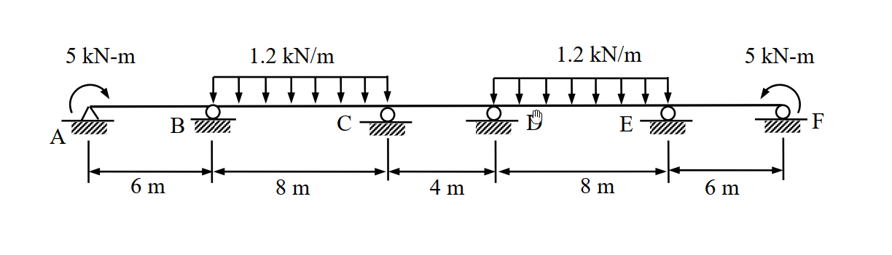

# 考題編號：[SA-2006-3]

**主分類：** `SA-U2` 靜不定結構分析
**副分類：** `SA-U2-5` 彎矩分配法
**分析法：** 彎矩分配法
**標籤：** `對稱結構`, `彎矩分配法`, `有效勁度`, `鉸支承外加彎矩`

---

## 1. 原始題目重述 (Problem Restatement)

本題為一五跨連續梁，跨度由左至右分別為 $L_1 = 6\text{m}$、$L_2 = 8\text{m}$、$L_3 = 4\text{m}$、$L_4 = 8\text{m}$、$L_5 = 6\text{m}$。
- **支承條件**：A 點為鉸支承（Hinge），B、C、D、E、F 點均為滾支承（Roller）。
- **載重條件**：
  - A 點承受 $5\text{ kN-m}$ 之順時針外加彎矩。
  - F 點承受 $5\text{ kN-m}$ 之逆時針外加彎矩。
  - BC 跨與 DE 跨承受 $1.2\text{ kN/m}$ 之向下均布載重。
- **材料性質**：梁之彈性模數 $E$ 與慣性矩 $I$ 為常數。
- **求解目標**：使用彎矩分配法計算各節點之彎矩（精度取至 $0.1\text{ kN-m}$ 以下），並繪製彎矩圖（BMD）。

*圖說：5跨連續梁，跨度分別為 6m, 8m, 4m, 8m, 6m。A點為鉸支承並承受 5 kN-m 順時針外加彎矩，F點為滾支承並承受 5 kN-m 逆時針外加彎矩。B, C, D, E 皆為滾支承。BC 與 DE 跨承受 1.2 kN/m 向下均布載重。EI 為常數。*

## 2. 考題核心精神與出題者意圖 (Core Concepts & Examiner's Intent)

1. **對稱性的敏銳度**：本題結構幾何、支承及載重（包含外加彎矩之方向）皆對於連續梁中點（CD跨中央）完全對稱。出題者意在測驗考生是否能利用「半結構」及「有效勁度」來大幅簡化原本高達五跨的彎矩分配運算。
2. **端點外加彎矩之處理**：A 點雖為鉸支承，但受有外加彎矩。測驗考生是否知道如何將其轉化為對相鄰節點（B點）的初始固端彎矩（FEM）效應，並正確使用外端鉸接之修正勁度（$3EI/L$）。
3. **符號系統的轉換**：彎矩分配法中的「桿端彎矩」符號系統（通常順時針為正）與繪製彎矩圖的「變形彎矩」符號系統（通常下側受拉為正）不同，必須正確轉換。

## 3. 解題戰略地圖與陷阱分析 (Strategic Roadmap & Trap Analysis)

- **Step 1：對稱性判斷**
  - 觀察結構，以 CD 跨中點為對稱軸。
  - 左端 A 點順時針彎矩與右端 F 點逆時針彎矩，兩者皆使梁端產生下側受拉之變形（微笑曲線），屬於**對稱載重**。
  - 因此可取左半結構（A~C 及 CD跨之一半）進行分析。
- **Step 2：計算有效勁度與分配因子**
  - AB 跨：A 為鉸支承，使用修正勁度 $K_{BA} = \frac{3EI}{L}$。
  - BC 跨：一般連續跨，使用標準勁度 $K_{BC} = \frac{4EI}{L}$。
  - CD 跨：跨越對稱軸且受對稱載重，跨中變形斜率為零，使用對稱有效勁度 $K_{CD} = \frac{2EI}{L}$。
- **Step 3：處理外加彎矩與固端彎矩（FEM）**
  - BC 跨因均布載重產生標準 FEM。
  - A 點的外加彎矩 $M_A$ 必須先分配給 AB 桿件，並傳遞一半至 B 點，作為 B 點的初始固端彎矩 $FEM'_{BA}$。
- **Step 4：執行彎矩分配與計算最終彎矩**
  - 建立 B、C 兩節點的分配表，迭代至收斂。
  - 根據對稱性，直接寫出右半部各節點彎矩，並轉換為繪圖用之彎矩值。

**⚠️ 陷阱分析：**
- **外加彎矩的傳遞方向與符號**：A 點的順時針外加彎矩（$5\text{ kN-m}$），會對 B 點產生同樣為順時針方向的傳遞彎矩（$+2.5\text{ kN-m}$）。若符號判斷錯誤，全盤皆輸。
- **對稱軸桿件的勁度誤用**：若未使用 $2EI/L$ 處理 CD 跨，則必須進行全橋 5 跨的龐大分配，極易計算錯誤。

## 3.5 變數層次分析 (Variable Hierarchy Analysis)

### 最終目標
計算出連續梁各支承點之彎矩，並精確繪製彎矩圖（BMD）。

### 本題關鍵公式（依計算順序）
$$ K_{eff} = \frac{3EI}{L} \quad (\text{外端為鉸支承之修正勁度}) $$
$$ K_{sym} = \frac{2EI}{L} \quad (\text{跨越對稱軸且對稱變形之有效勁度}) $$
$$ DF_i = \frac{K_i}{\sum K_{node}} $$
$$ FEM'_{BA} = FEM_{BA} - \frac{1}{2} FEM_{AB} + \frac{1}{2} \boxed{M_{A,ext}} $$
$$ M_{ij} = \boxed{FEM_{ij}} + \sum \text{Dist} + \sum \text{CO} $$
$$ M_{bending} = M_{MDM\_left} = - M_{MDM\_right} $$

### L1：題目直接給定
- $L_{AB} = 6\text{m}, L_{BC} = 8\text{m}, L_{CD} = 4\text{m}, L_{DE} = 8\text{m}, L_{EF} = 6\text{m}$
- $w_{BC} = w_{DE} = 1.2\text{ kN/m}$
- $M_A = 5\text{ kN-m}$ (CW, 順時針)
- $M_F = 5\text{ kN-m}$ (CCW, 逆時針)

### L2：需知識點推導
**節點分配因子 (DF)**
- $K_{BA} = 3EI/6 = 0.5EI$
- $K_{BC} = 4EI/8 = 0.5EI$
- $K_{CB} = 4EI/8 = 0.5EI$
- $K_{CD} = 2EI/4 = 0.5EI$

**固端彎矩 (FEM)**
- $FEM_{BC} = -wL^2/12$
- $FEM_{CB} = +wL^2/12$
- $FEM'_{BA} = +M_A / 2$

### L3：深層知識（不懂就卡住）
- **對稱性負載判定** ∣ A端順時針與F端逆時針彎矩皆產生下側受拉，屬於對稱負載。 ∣ 
- **修正固端彎矩** ∣ A端受外加彎矩時，將其視為節點力，釋放A點後會產生傳遞彎矩至B點。 ∣ 

## 4. 步驟化詳細計算過程 (Step-by-Step Detailed Calculation)

### (1) 幾何與對稱性分析
本結構對稱於 CD 跨之中點。
載重部分：BC 跨與 DE 跨之均布載重為對稱；A 點順時針彎矩與 F 點逆時針彎矩，對結構產生的變形效應亦為對稱（皆使梁端下側受拉）。
因此，取左半結構（A、B、C 點及 CD 跨之一半）進行分析，並套用對稱邊界條件。

### (2) 計算桿件相對勁度 (K) 與分配因子 (DF)
設 $EI = 1$ 以簡化計算：
- **Node B**:
  - AB 跨外端 A 為鉸支承，使用修正勁度：$K_{BA} = \frac{3EI}{6} = 0.5$
  - BC 跨為一般連續跨：$K_{BC} = \frac{4EI}{8} = 0.5$
  - $\sum K_B = 0.5 + 0.5 = 1.0$
  - $DF_{BA} = \frac{0.5}{1.0} = 0.5 \quad ; \quad DF_{BC} = \frac{0.5}{1.0} = 0.5$
- **Node C**:
  - CB 跨為一般連續跨：$K_{CB} = \frac{4EI}{8} = 0.5$
  - CD 跨跨越對稱軸且承受對稱變形，使用有效勁度：$K_{CD} = \frac{2EI}{4} = 0.5$
  - $\sum K_C = 0.5 + 0.5 = 1.0$
  - $DF_{CB} = \frac{0.5}{1.0} = 0.5 \quad ; \quad DF_{CD} = \frac{0.5}{1.0} = 0.5$

*(註：因 CD 跨使用對稱有效勁度，後續分配時不需向 D 點進行傳遞(CO=0)。)*

### (3) 計算固端彎矩 (FEM)
*(符號約定：順時針 CW 為正，逆時針 CCW 為負)*
- **AB 跨**：A 點受有外加順時針彎矩 $M_A = +5\text{ kN-m}$。
  為求 B 點之初始固端彎矩，將 A 點視為受外加節點彎矩並立即釋放，其傳遞至 B 點之彎矩為：
  $$FEM'_{BA} = + \frac{1}{2} M_A = +2.5\text{ kN-m}$$
- **BC 跨**：受均布載重 $w = 1.2\text{ kN/m}$。
  $$FEM_{BC} = - \frac{wL^2}{12} = - \frac{1.2 \times 8^2}{12} = -6.4\text{ kN-m}$$
  $$FEM_{CB} = + \frac{wL^2}{12} = + \frac{1.2 \times 8^2}{12} = +6.4\text{ kN-m}$$
- **CD 跨**：無載重。
  $$FEM_{CD} = 0$$

### (4) 彎矩分配表 (Moment Distribution Table)
針對 B、C 節點進行彎矩分配。傳遞因子（COF）：BC 與 CB 之間為 0.5。

| 節點 (Node) | B | B | C | C |
|:---:|:---:|:---:|:---:|:---:|
| **桿件 (Member)** | **BA** | **BC** | **CB** | **CD** |
| **分配因子 (DF)** | **0.5** | **0.5** | **0.5** | **0.5** |
| 固端彎矩 (FEM) | 2.500 | -6.400 | 6.400 | 0.000 |
| Dist 1 | 1.950 | 1.950 | -3.200 | -3.200 |
| CO 1 | - | -1.600 | 0.975 | - |
| Dist 2 | 0.800 | 0.800 | -0.488 | -0.488 |
| CO 2 | - | -0.244 | 0.400 | - |
| Dist 3 | 0.122 | 0.122 | -0.200 | -0.200 |
| CO 3 | - | -0.100 | 0.061 | - |
| Dist 4 | 0.050 | 0.050 | -0.031 | -0.031 |
| CO 4 | - | -0.015 | 0.025 | - |
| Dist 5 | 0.008 | 0.008 | -0.013 | -0.013 |
| CO 5 | - | -0.006 | 0.004 | - |
| Dist 6 | 0.003 | 0.003 | -0.002 | -0.002 |
| **總和 ($\Sigma M$)**| **5.433** | **-5.433** | **3.931** | **-3.931** |

*(註：為滿足節點平衡，最終總和微調最後一位數小數點。理論精確分數值為 $M_{BA} = 163/30 \approx 5.433$，$M_{CB} = 59/15 \approx 3.933$)*

### (5) 桿端彎矩與真實變形彎矩 (BM) 之轉換
根據 MDM 符號約定轉換為彎矩圖（BMD）慣用符號（下側受拉為正）：
- 桿件左端：$BM = M_{MDM}$
- 桿件右端：$BM = -M_{MDM}$

**各支承點彎矩計算結果（至小數第二位）：**
- **A 點**：外加彎矩效應 $\implies M_A = \mathbf{+5.00 \text{ kN-m}}$
- **B 點**：$M_{BA} (\text{右端}) = +5.433 \implies M_B = \mathbf{-5.43 \text{ kN-m}}$
- **C 點**：$M_{CB} (\text{右端}) = +3.933 \implies M_C = \mathbf{-3.93 \text{ kN-m}}$
- 依據結構對稱性，右半側節點彎矩為：
  - **D 點**：$M_D = M_C = \mathbf{-3.93 \text{ kN-m}}$
  - **E 點**：$M_E = M_B = \mathbf{-5.43 \text{ kN-m}}$
  - **F 點**：$M_F = M_A = \mathbf{+5.00 \text{ kN-m}}$

**彎矩圖 (BMD) 形狀描述：**
1. **AB 跨 & EF 跨**：無橫向載重，彎矩呈直線變化。AB 跨由 $+5.00$ 線性遞減至 $-5.43$（反曲點位於距 A 點 $2.88\text{m}$ 處）。
2. **BC 跨 & DE 跨**：受向下均布載重，彎矩呈下凸拋物線。由兩端點彎矩可算得，BC 跨之最大正彎矩發生在距 B 點 $4.16\text{m}$ 處，其值為 $\mathbf{+4.93\text{ kN-m}}$。
3. **CD 跨**：無橫向載重，且兩端彎矩皆為 $-3.93\text{ kN-m}$，故 CD 跨整段受均勻之負彎矩，彎矩圖為一水平直線，值維持 $\mathbf{-3.93 \text{ kN-m}}$（剪力為零）。

## 5. 關鍵爭議點與進階探討 (Critical Issues & Advanced Discussion)

- **A、F 端彎矩的正負判定**：許多考生容易死背「外加彎矩為負」或搞混方向。最穩健的方法是「物理變形法」：右手拿筆模擬梁端，依題目箭頭方向扭轉端點，觀察梁中央是向上拱起（Frown, 上緣受拉 = 負彎矩）還是向下凹陷（Smile, 下緣受拉 = 正彎矩）。本題兩端外加彎矩皆使梁產生「微笑」變形，故均為正彎矩。
- **純彎矩區間的出現**：由於結構完全對稱，中段 CD 跨的兩端彎矩完全相等且無剪力（中央點剪力必須為零，又無橫向負載，故整段剪力皆為零）。這在連續梁中是相對少見且極具美感的特例，若計算出 CD 跨有不同彎矩值，即代表未滿足對稱性，可作為考場上的自我驗算機制。
