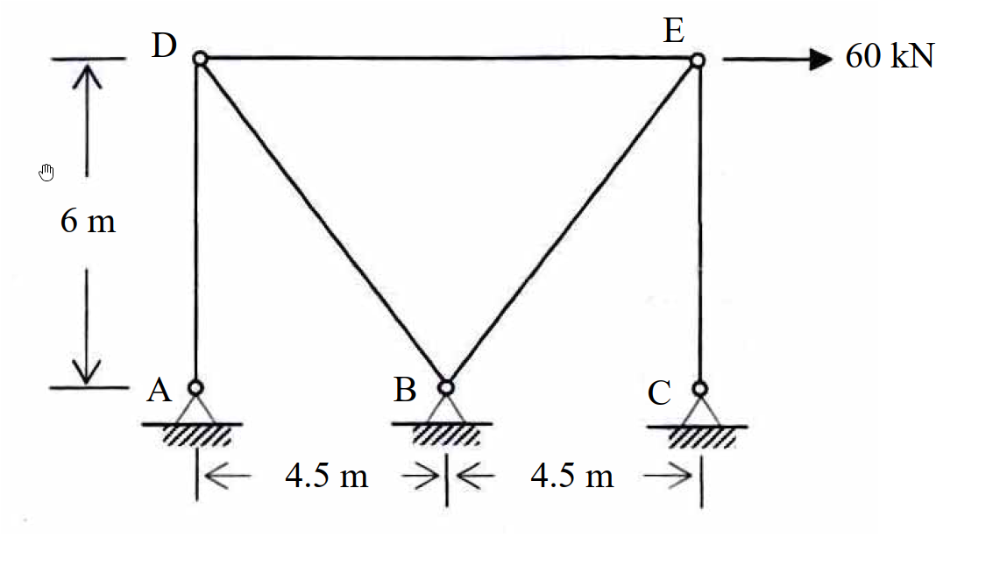

# 考題編號：[SA-2007-1]

**主分類：** `SA-U1-1`
**副分類：** `SA-U1-2`
**分析法：** 最小功法
**標籤：** `靜不定桁架` `單位力法` `柔度矩陣法` `相容方程式`

---

## 1. 原始題目重述 (Problem Restatement)

如圖所示之桁架（truss），點 A、B 及 C 為鉸接（hinge）。若每根桿件之斷面積 $A = 1000 \text{ mm}^2$，楊氏係數 $E = 200 \text{ GPa}$，當 E 點有一水平載重 $60 \text{ kN}$ 時，試計算支承反力及各桿內力。（25 分）

*圖說：A、B、C 三個節點位於底部水平線上，A 位於左側，B 位於中間，C 位於右側。A 到 B 距離為 $4.5\text{ m}$，B 到 C 距離為 $4.5\text{ m}$。D 點在 A 點正上方 $6\text{ m}$ 處，E 點在 C 點正上方 $6\text{ m}$ 處。桿件包含 AD、DB、CE、EB，以及連接 D、E 兩點的水平桿件 DE (長度 $9\text{ m}$)。E 點承受向右的水平力 $60\text{ kN}$。A、B、C 皆為固定鉸支承。*

## 2. 考題核心精神與出題者意圖 (Core Concepts & Examiner's Intent)

*   **考驗靜不定度判斷：** 本結構並非標準靜定桁架，具備三個固定鉸支承 (提供 6 個反力)，考生必須正確判斷其靜不定度為 1 度。
*   **單位力法 (力法) 的熟練度：** 要求考生能正確選定一贅力 (如 DE 桿件內力)，將結構拆解為靜定的基本結構，並運用相容方程式 (Compatibility Equation) 解出贅力。
*   **幾何與內力計算的準確性：** 桁架的斜桿長度與斜率需準確計算，並在節點平衡中正確分解力量，考驗基本靜力學的細心度。

## 3. 解題戰略地圖與陷阱分析 (Strategic Roadmap & Trap Analysis)

*   **戰略一：判別靜不定度與基本結構**
    *   $m=5$，$j=5$，$r=6$。靜不定度 $i = 5+6-2(5) = 1$。
    *   選擇 DE 桿件內力為贅力 $X$。切斷 DE 桿後，結構變為左右兩個完全獨立的靜定桁架 (左側 ADB，右側 CEB)，大幅簡化計算。
*   **戰略二：建立相容方程式**
    *   基本結構受原外力 $P=60\text{ kN}$ 作用，計算各桿內力 $F_0$。
    *   基本結構在切斷處 (D, E) 施加一單位對向拉力，計算各桿內力 $f_1$。
    *   計算位移係數 $\Delta_{10} = \sum \frac{F_0 f_1 L}{EA}$ 及柔度係數 $f_{11} = \sum \frac{f_1^2 L}{EA}$。
    *   解方程式 $\Delta_{10} + f_{11} X = 0$ 得到贅力 $X$。
*   **戰略三：疊加法求最終內力與反力**
    *   最終內力 $F = F_0 + f_1 X$。
    *   由最終內力，透過各支承節點的平衡方程式求得支承反力。
*   **陷阱分析：**
    *   **陷阱 1 (贅力選擇)：** 若選支承反力為贅力，基本結構將變得複雜 (不再是兩個獨立的靜定桁架)，計算量會大幅增加且易算錯。選擇 DE 桿件內力是最佳捷徑。
    *   **陷阱 2 (正負號約定)：** $F_0$ 與 $f_1$ 的拉力與壓力符號必須嚴格統一 (拉力為正，壓力為負)，否則在 $\sum F_0 f_1 L$ 時會導致正負號錯誤。

## 3.5 變數層次分析 (Variable Hierarchy Analysis)

### 最終目標
`求出所有支承反力 (A, B, C) 以及各桿件最終內力`

### 本題關鍵公式（依計算順序）
- 靜不定度：
  $i = m + r - 2j$
- 相容方程式：
  $\Delta_{10} + f_{11} X = 0$
- 位移係數計算：
  $\Delta_{10} = \sum \frac{F_0 f_1 L}{EA} \quad , \quad f_{11} = \sum \frac{f_1^2 L}{EA}$
- 最終內力疊加：
  $F = \boxed{F_0} + \boxed{f_1} \boxed{X}$

### L1：題目直接給定
| 符號 | 數值 | 說明 |
|---|---|---|
| $A$ | $1000 \text{ mm}^2 = 10^{-3} \text{ m}^2$ | 桿件斷面積 |
| $E$ | $200 \text{ GPa} = 2 \times 10^8 \text{ kN/m}^2$ | 楊氏係數 |
| $EA$ | $200,000 \text{ kN}$ | 軸向勁度 |
| $P$ | $60 \text{ kN}$ | E 點水平載重 |

### L2：需知識點推導
**基本結構與內力**
| 符號 | 公式／來源 | 卡關? |
|---|---|---|
| $L_{DB}, L_{BE}$ | $\sqrt{4.5^2 + 6^2} = 7.5 \text{ m}$ | |
| $F_0$ | 節點法求外力作用下內力 | |
| $f_1$ | 節點法求單位贅力作用下內力 | |

**相容方程式與贅力**
| 符號 | 公式／來源 | 卡關? |
|---|---|---|
| $\Delta_{10}$ | $\sum \frac{F_0 f_1 L}{EA}$ | |
| $f_{11}$ | $\sum \frac{f_1^2 L}{EA}$ | |
| $X$ | $-\frac{\Delta_{10}}{f_{11}}$ | |

### L3：深層知識（不懂就卡住）
| 知識點 | 說明 | 卡關? |
|---|---|---|
| 單位力法之贅力選取 | 切斷 DE 桿件，將系統化約為兩個靜定子桁架，可極大化計算效率 | |

## 4. 步驟化詳細計算過程 (Step-by-Step Detailed Calculation)

### Step 1: 判定靜不定度與選擇基本結構
*   桿件數 $m=5$，節點數 $j=5$，支承反力數 $r=6$ (三個鉸支承各提供 2 個反力)。
*   靜不定度 $i = m + r - 2j = 5 + 6 - 2(5) = 1$。
*   **策略註解：** 選擇移除桿件 DE 作為贅力 $X$。此舉將原結構拆分為左右兩個完全獨立的三鉸桁架，外力 $60\text{ kN}$ 僅作用於右側結構，大幅簡化 $F_0$ 的計算。

### Step 2: 計算基本結構外力內力 ($F_0$)
基本結構在 E 點承受水平向右 $60 \text{ kN}$，左側結構無受力。
*   **右側桁架 (節點 E 平衡)：**
    斜桿 BE 長度 $L_{BE} = \sqrt{4.5^2 + 6^2} = 7.5 \text{ m}$。
    $\sum F_x = 0 \implies 60 - F_{0,BE} \cdot (\frac{4.5}{7.5}) = 0 \implies F_{0,BE} = 100 \text{ kN} \quad (\text{拉力})$
    $\sum F_y = 0 \implies -F_{0,CE} - F_{0,BE} \cdot (\frac{6}{7.5}) = 0 \implies F_{0,CE} = -100(0.8) = -80 \text{ kN} \quad (\text{壓力})$
*   **左側桁架 (節點 D)：** 無外力。
    $F_{0,AD} = 0 \text{ kN}$
    $F_{0,DB} = 0 \text{ kN}$
*   **DE 桿件：** $F_{0,DE} = 0 \text{ kN}$

### Step 3: 計算單位贅力內力 ($f_1$)
在切斷的 DE 兩端施加一單位對向拉力，即 E 點受向左 $1 \text{ kN}$，D 點受向右 $1 \text{ kN}$。
*   **右側桁架 (節點 E 受向左 $1 \text{ kN}$)：**
    其受力狀態與 Step 2 方向相反，大小為 $1/60$。
    $f_{1,BE} = -\frac{1}{0.6} = -\frac{5}{3} \text{ kN} \quad (\text{壓力})$
    $f_{1,CE} = -f_{1,BE} \cdot 0.8 = -(-\frac{5}{3}) \cdot 0.8 = \frac{4}{3} \text{ kN} \quad (\text{拉力})$
*   **左側桁架 (節點 D 受向右 $1 \text{ kN}$)：**
    斜桿 DB 長度 $L_{DB} = 7.5 \text{ m}$。
    $\sum F_x = 0 \implies 1 + f_{1,DB} \cdot (\frac{4.5}{7.5}) = 0 \implies f_{1,DB} = -\frac{5}{3} \text{ kN} \quad (\text{壓力})$
    $\sum F_y = 0 \implies -f_{1,AD} + f_{1,DB} \cdot (\frac{-6}{7.5}) = 0 \implies f_{1,AD} = (-\frac{5}{3})(-0.8) = \frac{4}{3} \text{ kN} \quad (\text{拉力})$
*   **DE 桿件：** $f_{1,DE} = 1 \text{ kN} \quad (\text{拉力})$

### Step 4: 建立相容方程式並求解贅力 $X$
由於 $EA$ 均為常數，可將其提出：
$$ \Delta_{10} = \sum \frac{F_0 f_1 L}{EA} = \frac{1}{EA} \left[ F_{0,BE} f_{1,BE} L_{BE} + F_{0,CE} f_{1,CE} L_{CE} \right] $$
$$ \Delta_{10} = \frac{1}{EA} \left[ (100)(-\frac{5}{3})(7.5) + (-80)(\frac{4}{3})(6) \right] = \frac{1}{EA} [ -1250 - 640 ] = -\frac{1890}{EA} $$

$$ f_{11} = \sum \frac{f_1^2 L}{EA} = \frac{1}{EA} \left[ f_{1,AD}^2 L_{AD} + f_{1,CE}^2 L_{CE} + f_{1,DB}^2 L_{DB} + f_{1,BE}^2 L_{BE} + f_{1,DE}^2 L_{DE} \right] $$
$$ f_{11} = \frac{1}{EA} \left[ (\frac{4}{3})^2(6) + (\frac{4}{3})^2(6) + (-\frac{5}{3})^2(7.5) + (-\frac{5}{3})^2(7.5) + (1)^2(9) \right] $$
$$ f_{11} = \frac{1}{EA} \left[ 10.667 + 10.667 + 20.833 + 20.833 + 9 \right] = \frac{72}{EA} $$

相容方程式：
$$ \Delta_{10} + f_{11} X = 0 $$
$$ -\frac{1890}{EA} + \frac{72}{EA} X = 0 \implies \boxed{X = \frac{1890}{72} = 26.25 \text{ kN}} $$

### Step 5: 疊加法求各桿最終內力 ($F = F_0 + f_1 X$)
*   $F_{AD} = 0 + (\frac{4}{3})(26.25) = \boxed{35 \text{ kN} \quad (\text{拉力})}$
*   $F_{CE} = -80 + (\frac{4}{3})(26.25) = \boxed{-45 \text{ kN} \quad (\text{壓力})}$
*   $F_{DB} = 0 + (-\frac{5}{3})(26.25) = \boxed{-43.75 \text{ kN} \quad (\text{壓力})}$
*   $F_{BE} = 100 + (-\frac{5}{3})(26.25) = \boxed{56.25 \text{ kN} \quad (\text{拉力})}$
*   $F_{DE} = 0 + (1)(26.25) = \boxed{26.25 \text{ kN} \quad (\text{拉力})}$

### Step 6: 求解支承反力
取節點平衡，設向右、向上為正。
*   **節點 A (僅連接垂直桿 AD)：**
    $\sum F_x = 0 \implies \boxed{A_x = 0 \text{ kN}}$
    $\sum F_y = 0 \implies A_y + F_{AD} = 0 \implies \boxed{A_y = -35 \text{ kN} \quad (\text{向下})}$
*   **節點 C (僅連接垂直桿 CE)：**
    $\sum F_x = 0 \implies \boxed{C_x = 0 \text{ kN}}$
    $\sum F_y = 0 \implies C_y + F_{CE} = 0 \implies C_y - 45 = 0 \implies \boxed{C_y = 45 \text{ kN} \quad (\text{向上})}$
*   **節點 B (連接斜桿 DB, BE)：**
    $\sum F_x = 0 \implies B_x + F_{DB}(\frac{4.5}{7.5}) + F_{BE}(\frac{-4.5}{7.5}) = 0$
    $B_x + (-43.75)(0.6) + (56.25)(-0.6) = 0 \implies B_x - 26.25 - 33.75 = 0 \implies \boxed{B_x = 60 \text{ kN} \quad (\text{向左})}$ 
    *(註：反力方向為負，代表向左。解為 $B_x = +60$ 向右為正？ 重新檢視：$B_x$ 抵銷桿件水平推力，桿件水平推力總和為左向 60，故反力 $B_x$ 為向右 60？ 等等，$F_{DB}$ 壓力推 B 向右，$F_{BE}$ 拉力拉 B 往右上？不對，BE 桿件在 B 點，往右上拉，水平分力向右；DB 桿在 B 點，往左上壓，對 B 節點的作用力向右下？不，DB 為壓力，推向 B 節點，所以是右下方。兩者對 B 的水平力皆向右！故 $B_x$ 反力必向左！)*
    重新計算：
    $B_x + (F_{DB,x}) + (F_{BE,x}) = 0$
    DB 在 B 點的單位向量為 $(-4.5/7.5, 6/7.5) = (-0.6, 0.8)$。$F_{DB} = -43.75$，所以作用力為 $(-43.75)(-0.6, 0.8) = (26.25, -35)$。
    BE 在 B 點的單位向量為 $(4.5/7.5, 6/7.5) = (0.6, 0.8)$。$F_{BE} = 56.25$，所以作用力為 $(56.25)(0.6, 0.8) = (33.75, 45)$。
    $\sum F_x = B_x + 26.25 + 33.75 = 0 \implies B_x = -60 \text{ kN}$ (向左)。
    $\sum F_y = B_y - 35 + 45 = 0 \implies B_y = -10 \text{ kN}$ (向下)。
    故 $\boxed{B_x = 60 \text{ kN} \quad (\text{向左})}$，$\boxed{B_y = 10 \text{ kN} \quad (\text{向下})}$。

*(整體平衡驗證：$\sum F_x = 60 + (-60) = 0$ OK。$\sum F_y = -35 + (-10) + 45 = 0$ OK。)*

## 5. 關鍵爭議點與進階探討 (Critical Issues & Advanced Discussion)

*   **反力驗證的重要性：** 桁架解題過程中容易在各節點的正負號分解發生失誤，最後必須使用整體結構的力矩與力平衡方程式，例如 $\sum M_B = (-35)(-4.5) + (45)(4.5) - 60(6) = 157.5 + 202.5 - 360 = 0$，確認無誤後方能交卷。
*   **不同的贅力選擇：** 若選取水平反力如 $C_x$ 作為贅力，由於原結構 $A, B, C$ 皆為固定鉸支承，去除 $C_x$ 結構仍保持靜定但不再解耦，需要解整個 5 桿結構的內力，計算量約為選 DE 桿的兩倍。在考場上，觀察幾何對稱性與載重特徵以選出「能切出獨立子結構」的贅力，是奪取高分的關鍵。
