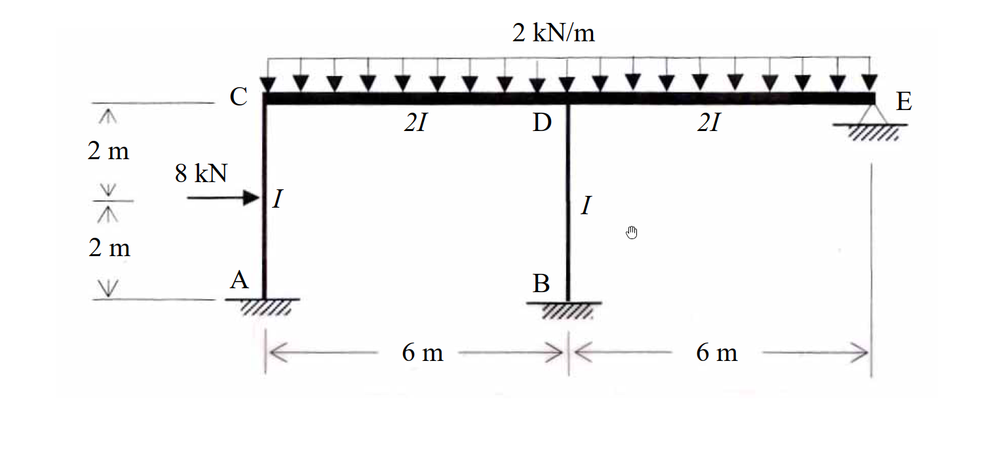

# 考題編號：[SA-2007-2]

**主分類：** `SA-U2-1`
**副分類：** `SA-U2-4`
**分析法：** 傾角變位法
**標籤：** `無側移剛架` `修正傾角撓度法` `固端彎矩`

---

## 1. 原始題目重述 (Problem Restatement)

如圖所示之剛架 (frame)，其構架高 $4 \text{ m}$，跨距為 $12 \text{ m}$，點 A、B 為固接 (fixed)，E 點為鉸接 (hinge)。若每根桿件之彈性模數 $E$ 為常數；各桿件之慣性矩 ($I$ 或 $2I$) 分別標示如圖示，且 $I$ 值亦為常數。則在圖示載重下，試求出每根桿件之結點彎矩。(25分)

*圖說：*
* *A 點與 B 點為底部固定端，上方垂直桿件 AC 長度 $4 \text{ m}$ ($I$)，BD 長度 $4 \text{ m}$ ($I$)。*
* *AC 桿件中點承受水平向右 $8 \text{ kN}$ 集中載重。*
* *頂部水平桿件 CE 總長 $12 \text{ m}$。CD 長度 $6 \text{ m}$ ($2I$)，DE 長度 $6 \text{ m}$ ($2I$)。*
* *C 點為 AC 與 CD 剛接點；D 點為 BD 與 CD、DE 剛接點。*
* *E 點為最右側鉸接支承 (hinge support)。*
* *水平桿件 CE 承受向下均佈載重 $2 \text{ kN/m}$。*

## 2. 考題核心精神與出題者意圖 (Core Concepts & Examiner's Intent)

*   **無側移剛架之判定：** 考驗考生對於邊界條件的敏銳度。最右側的 E 點為鉸接支承，提供了水平與垂直方向的拘束。加上忽略桿件軸向變形的假設，剛架將無側移 ($\Delta = 0$)。
*   **傾角變位法與修正公式：** 測驗基本傾角撓度方程式的應用。針對遠端為鉸接的 DE 桿件，若能熟練使用「修正傾角撓度公式」，將可直接減少一個未知數 $\theta_E$，大幅簡化計算。
*   **相對勁度與固端彎矩計算：** 結構中桿件長度不一、慣性矩不一 ($I$ 與 $2I$)。考生必須正確計算各桿件之勁度比例與不同載重 (集中力與均佈力) 對應之固端彎矩。

## 3. 解題戰略地圖與陷阱分析 (Strategic Roadmap & Trap Analysis)

*   **戰略一：判別側移與確立未知數**
    *   E 點鉸支承限制了整體水平位移，故為無側移剛架。
    *   A、B 兩點為固端，$\theta_A = 0, \theta_B = 0$。
    *   E 點鉸接，可使用修正公式消除 $\theta_E$。
    *   最終未知節點旋轉角僅有兩個：$\theta_C, \theta_D$。
*   **戰略二：計算固端彎矩 (FEM)**
    *   AC 桿中點受集中力，需計算標準 FEM。
    *   CD 桿受均佈載重，需計算標準 FEM。
    *   DE 桿受均佈載重且 E 端鉸接，需計算「修正」FEM。
*   **戰略三：建立節點平衡方程式並求解**
    *   於 C、D 兩節點建立 $\sum M_C = 0$ 與 $\sum M_D = 0$。
    *   解出 $\theta_C$ 與 $\theta_D$。
*   **戰略四：計算桿端彎矩**
    *   將求得的轉角代回傾角撓度方程式，得出所有彎矩。
*   **陷阱分析：**
    *   **陷阱 1 (相對勁度錯誤)：** 忽略 $2I$ 或長度不同的影響，誤將所有桿件視為相同勁度。
    *   **陷阱 2 (修正公式錯用)：** 對 DE 桿件使用標準 FEM，未修正為一端鉸接的 $wL^2/8$。或在使用修正傾角變位公式時，勁度係數忘記改為 $3EI/L$。
    *   **陷阱 3 (載重方向與符號)：** AC 桿受向右外力，若順時針定為正，則 $FEM_{AC}$ 為負、$FEM_{CA}$ 為正。符號顛倒將導致全錯。

## 3.5 變數層次分析 (Variable Hierarchy Analysis)

### 最終目標
`求出剛架所有桿件之節點桿端彎矩`

### 本題關鍵公式（依計算順序）
- 標準固端彎矩：
  中點集中力 $FEM = \pm \frac{PL}{8}$，均佈力 $FEM = \pm \frac{wL^2}{12}$
- 修正固端彎矩 (遠端鉸接)：
  $FEM' = FEM - 0.5 FEM_{\text{far}}$
- 標準傾角變位方程式：
  $M_{ij} = \boxed{FEM_{ij}} + \frac{2EI}{L} (2\theta_i + \theta_j)$
- 修正傾角變位方程式 (j端鉸接)：
  $M_{ij} = \boxed{FEM'_{ij}} + \frac{3EI}{L} \theta_i$
- 節點平衡方程式：
  $\sum M = 0$ 

### L1：題目直接給定
| 符號 | 數值 | 說明 |
|---|---|---|
| $L_{AC}, L_{BD}$ | $4 \text{ m}$ | 垂直桿長度 |
| $L_{CD}, L_{DE}$ | $6 \text{ m}$ | 水平桿長度 |
| $I_{AC}, I_{BD}$ | $I$ | 垂直桿慣性矩 |
| $I_{CD}, I_{DE}$ | $2I$ | 水平桿慣性矩 |
| $P_{AC}$ | $8 \text{ kN}$ (向右) | AC 桿中點載重 |
| $w_{CE}$ | $2 \text{ kN/m}$ (向下) | CE 桿均佈載重 |

### L2：需知識點推導
**固端彎矩 (FEM)**
| 符號 | 公式／來源 | 卡關? |
|---|---|---|
| $FEM_{AC}, FEM_{CA}$ | $\mp \frac{PL}{8}$ | |
| $FEM_{CD}, FEM_{DC}$ | $\mp \frac{wL^2}{12}$ | |
| $FEM'_{DE}$ | $-\frac{wL^2}{8}$ (遠端鉸接) | |

**傾角變位方程式**
| 符號 | 公式／來源 | 卡關? |
|---|---|---|
| $M_{CA}$ | $FEM_{CA} + \frac{2EI}{L}(2\theta_C)$ | |
| $M_{CD}$ | $FEM_{CD} + \frac{2E(2I)}{L}(2\theta_C + \theta_D)$ | |
| $M_{DE}$ | $FEM'_{DE} + \frac{3E(2I)}{L}(\theta_D)$ | |

**聯立方程式求解**
| 符號 | 公式／來源 | 卡關? |
|---|---|---|
| $\theta_C, \theta_D$ | $\sum M_C = 0, \sum M_D = 0$ | |

### L3：深層知識（不懂就卡住）
| 知識點 | 說明 | 卡關? |
|---|---|---|
| 結構側移判別 | E 點鉸接使剛架具備水平拘束，判定為無側移剛架，$\psi = 0$ | |
| 修正傾角變位公式 | 遠端鉸接時，近端彎矩公式係數變為 $3EI/L$，減少 $\theta_E$ 未知數 | |

## 4. 步驟化詳細計算過程 (Step-by-Step Detailed Calculation)

### Step 1: 計算固端彎矩 (FEM)
設順時針彎矩為正。
*   **桿件 AC:** 中點集中載重 $8 \text{ kN}$向右。
    $FEM_{AC} = -\frac{PL}{8} = -\frac{8 \times 4}{8} = -4 \text{ kN-m}$
    $FEM_{CA} = +\frac{PL}{8} = +\frac{8 \times 4}{8} = +4 \text{ kN-m}$
*   **桿件 BD:** 無橫向載重。
    $FEM_{BD} = FEM_{DB} = 0$
*   **桿件 CD:** 均佈載重 $2 \text{ kN/m}$向下。
    $FEM_{CD} = -\frac{wL^2}{12} = -\frac{2 \times 6^2}{12} = -6 \text{ kN-m}$
    $FEM_{DC} = +\frac{wL^2}{12} = +\frac{2 \times 6^2}{12} = +6 \text{ kN-m}$
*   **桿件 DE:** 均佈載重 $2 \text{ kN/m}$向下。因 E 點為鉸接，使用修正固端彎矩。
    $FEM'_{DE} = -\frac{wL^2}{8} = -\frac{2 \times 6^2}{8} = -9 \text{ kN-m}$

### Step 2: 建立傾角變位方程式
已知 $\theta_A = 0, \theta_B = 0$ (固定端)，且無側移 ($\psi = 0$)。
*   **桿件 AC ($L=4, I$):**
    $M_{CA} = FEM_{CA} + \frac{2EI}{4}(2\theta_C + \theta_A) = 4 + EI\theta_C$
    $M_{AC} = FEM_{AC} + \frac{2EI}{4}(2\theta_A + \theta_C) = -4 + 0.5 EI\theta_C$
*   **桿件 CD ($L=6, 2I$):**
    $M_{CD} = FEM_{CD} + \frac{2E(2I)}{6}(2\theta_C + \theta_D) = -6 + \frac{2}{3}EI(2\theta_C + \theta_D) = -6 + \frac{4}{3}EI\theta_C + \frac{2}{3}EI\theta_D$
    $M_{DC} = FEM_{DC} + \frac{2E(2I)}{6}(2\theta_D + \theta_C) = 6 + \frac{4}{3}EI\theta_D + \frac{2}{3}EI\theta_C$
*   **桿件 BD ($L=4, I$):**
    $M_{DB} = 0 + \frac{2EI}{4}(2\theta_D + \theta_B) = EI\theta_D$
    $M_{BD} = 0 + \frac{2EI}{4}(2\theta_B + \theta_D) = 0.5 EI\theta_D$
*   **桿件 DE ($L=6, 2I$, E端鉸接):**
    *策略註解：使用修正公式 $M_{ij} = FEM' + \frac{3EK}{L}\theta_i$*
    $M_{DE} = FEM'_{DE} + \frac{3E(2I)}{6}(\theta_D) = -9 + EI\theta_D$
    $M_{ED} = 0 \text{ kN-m}$ (鉸接端條件)

### Step 3: 節點平衡與解聯立方程式
*   **節點 C 平衡:** $\sum M_C = 0$
    $M_{CA} + M_{CD} = 0$
    $(4 + EI\theta_C) + (-6 + \frac{4}{3}EI\theta_C + \frac{2}{3}EI\theta_D) = 0$
    $\frac{7}{3}EI\theta_C + \frac{2}{3}EI\theta_D = 2$
    $\implies 7 EI\theta_C + 2 EI\theta_D = 6 \quad \text{--- (式 1)}$

*   **節點 D 平衡:** $\sum M_D = 0$
    $M_{DC} + M_{DB} + M_{DE} = 0$
    $(6 + \frac{4}{3}EI\theta_D + \frac{2}{3}EI\theta_C) + (EI\theta_D) + (-9 + EI\theta_D) = 0$
    $\frac{2}{3}EI\theta_C + \frac{10}{3}EI\theta_D = 3$
    $\implies 2 EI\theta_C + 10 EI\theta_D = 9 \quad \text{--- (式 2)}$

*   **解方程組:**
    將 (式 1) 乘以 5 減去 (式 2)：
    $35 (EI\theta_C) + 10 (EI\theta_D) = 30$
    $- \quad [2 (EI\theta_C) + 10 (EI\theta_D) = 9]$
    -------------------------------------------
    $33 (EI\theta_C) = 21 \implies \boxed{EI\theta_C = \frac{21}{33} = \frac{7}{11} \approx 0.6364}$
    
    代回 (式 2)：
    $2 (\frac{7}{11}) + 10 (EI\theta_D) = 9 \implies 10 (EI\theta_D) = 9 - \frac{14}{11} = \frac{85}{11}$
    $\implies \boxed{EI\theta_D = \frac{85}{110} = \frac{17}{22} \approx 0.7727}$

### Step 4: 代回計算最終桿端彎矩
*   $M_{AC} = -4 + 0.5(\frac{7}{11}) = -4 + \frac{7}{22} = \boxed{-\frac{81}{22} \approx -3.682 \text{ kN-m}}$
*   $M_{CA} = 4 + 1.0(\frac{7}{11}) = 4 + \frac{7}{11} = \boxed{\frac{51}{11} \approx 4.636 \text{ kN-m}}$
*   $M_{CD} = -6 + \frac{4}{3}(\frac{7}{11}) + \frac{2}{3}(\frac{17}{22}) = -6 + \frac{28}{33} + \frac{17}{33} = -6 + \frac{15}{11} = \boxed{-\frac{51}{11} \approx -4.636 \text{ kN-m}}$
*   $M_{DC} = 6 + \frac{4}{3}(\frac{17}{22}) + \frac{2}{3}(\frac{7}{11}) = 6 + \frac{34}{33} + \frac{14}{33} = 6 + \frac{16}{11} = \boxed{\frac{82}{11} \approx 7.455 \text{ kN-m}}$
*   $M_{DB} = 1.0(\frac{17}{22}) = \boxed{\frac{17}{22} \approx 0.773 \text{ kN-m}}$
*   $M_{BD} = 0.5(\frac{17}{22}) = \boxed{\frac{17}{44} \approx 0.386 \text{ kN-m}}$
*   $M_{DE} = -9 + 1.0(\frac{17}{22}) = -9 + \frac{17}{22} = \boxed{-\frac{181}{22} \approx -8.227 \text{ kN-m}}$
*   $M_{ED} = \boxed{0 \text{ kN-m}}$

## 5. 關鍵爭議點與進階探討 (Critical Issues & Advanced Discussion)

*   **無側移假設之成立要件：** 剛架的無側移特性除了依靠 E 點的鉸接支承提供約束外，還基於「忽略桿件軸向變形」的假設。實務上高層建築或大跨徑結構若軸向力極大，仍會產生微小側移；但在國考中，若無特別註明，皆視橫樑具無窮大軸向勁度。
*   **不使用修正公式的解法比較：** 若不使用修正公式，則 $M_{DE} = -6 + \frac{2}{3}EI(2\theta_D + \theta_E)$，$M_{ED} = 6 + \frac{2}{3}EI(2\theta_E + \theta_D) = 0$。由 $\sum M_E = 0$ 得到 $\theta_E = -0.5\theta_D - \frac{9}{EI}$。將其代回 $M_{DE}$ 同樣可得到 $M_{DE} = -9 + EI\theta_D$。雖然結果完全一致，但在考場上徒增一個未知數 $\theta_E$ 會增加聯立方程式的維度與計算出錯率，強烈建議直接熟記修正傾角撓度公式。
