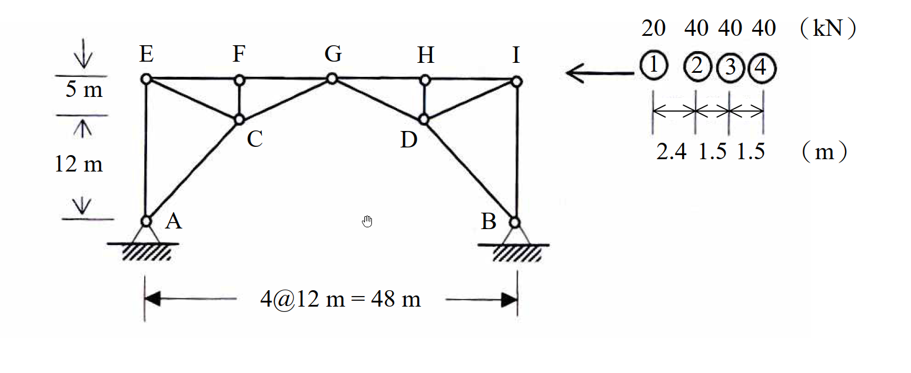

# 考題編號：[SA-2007-3]

**主分類：** `SA-U1-1`
**副分類：** `SA-U1-4`
**分析法：** 影響線
**標籤：** `三鉸拱桁架` `移動載重` `極值分析` `卡車載重`

---

## 1. 原始題目重述 (Problem Restatement)

如圖所示桁架 (truss) 在卡車系列載重作用下，求最大可能之 A 點反力及 FG 桿件內力。(25分)

*圖說：*
* *結構為一對稱幾何形狀之大型桁架，總跨距為 $4 @ 12\text{ m} = 48\text{ m}$ (底部支承 A、B 之間水平距離為 48m)。*
* *頂部弦桿包含節點 E、F、G、H、I，相鄰節點水平間距皆為 12m。*
* *高度標示：C 點比 A 點高 12m，E 點比 C 點高 5m，故 E 點比 A 點高 17m。G 點位於跨中央 ($x=24\text{m}$)，高度亦為 17m。*
* *結構左右兩側各形成剛性次結構，兩者僅透過中央節點 G 以鉸接相連。*
* *載重：一卡車由右向左行駛於頂層水平弦桿上，輪軸載重與間距依序為：前輪 $20\text{ kN}$，間距 $2.4\text{ m}$ 後為中輪 $40\text{ kN}$，間距 $1.5\text{ m}$ 後為後輪 $40\text{ kN}$，間距 $1.5\text{ m}$ 後為最後輪 $40\text{ kN}$。*

## 2. 考題核心精神與出題者意圖 (Core Concepts & Examiner's Intent)

*   **三鉸拱的幾何洞察：** 考驗考生是否能看出此複雜桁架實質上是一個「三鉸拱 (Three-Hinged Arch)」結構。A、B 兩底端為鉸支承，G 點為內部鉸接。這是求解水平反力的唯一破口。
*   **影響線建立能力：** 針對非典型結構 (帶有水平反力的拱)，建立特定反力 ($A_y, A_x$) 與特定桿件內力 ($F_{FG}$) 的影響線方程式。
*   **卡車載重極值分析：** 將多輪軸之卡車載重放置於影響線上，透過嘗試不同輪軸對齊影響線峰值，找出產生最大正負響應的最劣載重位置。

## 3. 解題戰略地圖與陷阱分析 (Strategic Roadmap & Trap Analysis)

*   **戰略一：判別結構系統並求反力影響線**
    *   確認結構為靜定的三鉸拱桁架。
    *   垂直反力 $A_y$：以整體對 B 取力矩求得，其影響線不受水平反力影響。
    *   水平反力 $A_x$：利用 G 點為內部鉸之特性，將單位載重分左右兩側情況，對 G 點取力矩求得 $A_x$ 的影響線。
*   **戰略二：建立目標桿件內力影響線**
    *   利用截面法切過 FG、CG 桿件，取左半自由體。
    *   對 C 點取力矩，建立包含 $F_{FG}, A_x, A_y$ 及外力力矩的方程式。
    *   代入 $A_x, A_y$ 影響線，計算出幾個關鍵點 (E, F, G, H, I) 的影響線縱距。
*   **戰略三：極值計算**
    *   **最大 $R_A$：** 將卡車前端最重輪軸靠近 A 點上方 (E 點)，因 $A_y$ 在此處有最大值。
    *   **最大 $F_{FG}$ (壓力與拉力)：** 將卡車置於 $F_{FG}$ 影響線的最大負值 (F 點) 處求最大壓力，置於最大正值 (G 點) 處求最大拉力。
*   **陷阱分析：**
    *   **陷阱 1 (忽視水平反力)：** 若未將 A、B 視為鉸支承並計算水平推力 $A_x$，後續所有桿件內力皆會錯誤。
    *   **陷阱 2 (影響線峰值對位)：** 求卡車極值時，不能只將總重乘上單一縱距，必須計算各輪軸對應位置之縱距並乘上各自載重。最大值通常發生在最重輪軸 (如 40 kN) 對齊影響線峰谷處，有時需要測試相鄰兩重輪軸以確認何者為極大值。

## 3.5 變數層次分析 (Variable Hierarchy Analysis)

### 最終目標
`求出卡車通過時，A 點最大反力及 FG 桿件最大內力極值`

### 本題關鍵公式（依計算順序）
- 垂直反力影響線 (單位力在 $x$)：
  $\sum M_B = 0 \implies \boxed{A_y(x)}$
- 水平反力影響線 (單位力在 $x$)：
  $\sum M_G = 0 \implies \boxed{A_x(x)}$
- 目標桿件內力影響線 (截面法對 C 取矩)：
  $\sum M_C = 0 \implies F_{FG} = f(\boxed{A_x(x)}, \boxed{A_y(x)}, M_{C,\text{load}})$
- 車隊載重極值：
  $Response = \sum P_i \cdot \boxed{IL(x_i)}$

### L1：題目直接給定
| 符號 | 數值 | 說明 |
|---|---|---|
| $L$ | $48 \text{ m}$ | 總水平跨距 |
| $(x_G, y_G)$ | $(24\text{ m}, 17\text{ m})$ | 中央鉸 G 點座標 |
| $(x_C, y_C)$ | $(12\text{ m}, 12\text{ m})$ | 轉軸中心 C 點座標 |
| $P_1$ | $20 \text{ kN}$ | 第一輪軸重 |
| $P_2, P_3, P_4$ | $40 \text{ kN}$ | 第二至四輪軸重 |
| $\Delta x_{12}$ | $2.4 \text{ m}$ | 一、二輪軸間距 |
| $\Delta x_{23}, \Delta x_{34}$ | $1.5 \text{ m}$ | 輪軸間距 |

### L2：需知識點推導
**反力影響線**
| 符號 | 公式／來源 | 卡關? |
|---|---|---|
| $A_y(x)$ | $\frac{48-x}{48}$ | |
| $A_x(x)$ | $\frac{x}{34}$ ($x \le 24$), $\frac{48-x}{34}$ ($x > 24$) | |

**桿件內力影響線**
| 符號 | 公式／來源 | 卡關? |
|---|---|---|
| $F_{FG}(x)$ | $\frac{12A_x - 12A_y + M_{C,\text{load}}}{5}$ | |

### L3：深層知識（不懂就卡住）
| 知識點 | 說明 | 卡關? |
|---|---|---|
| 三鉸拱分析 | 必須利用內部鉸 G 點彎矩為零的條件，才能解出靜定結構的水平反力 | |
| 影響線極值計算 | 將多軸載重移動，使主輪重對齊影響線峰值，以求得全結構最劣受力狀態 | |

## 4. 步驟化詳細計算過程 (Step-by-Step Detailed Calculation)

### Step 1: 建立支承反力影響線
設單位載重 (1 kN) 作用於頂部弦桿，座標 $x$ 自最左端 E 點 ($x=0$) 向右起算至 I 點 ($x=48$)。
*   **垂直反力 $A_y$：**
    整體對 B 點取力矩：
    $A_y \cdot 48 - 1 \cdot (48 - x) = 0 \implies \boxed{A_y(x) = \frac{48 - x}{48}}$
*   **水平反力 $A_x$：**
    利用 G 點 $(x=24, y=17)$ 為內部鉸之特性。
    *   當載重在 G 點右側 ($x > 24$)：取左半自由體對 G 點取力矩
        $A_y(24) - A_x(17) = 0 \implies A_x = \frac{24}{17} A_y = \frac{24}{17} \left( \frac{48 - x}{48} \right) = \frac{48 - x}{34}$
    *   當載重在 G 點左側 ($x \le 24$)：取右半自由體對 G 點取力矩
        $-B_y(24) + B_x(17) = 0 \implies B_x = \frac{24}{17} B_y = \frac{24}{17} \left( \frac{x}{48} \right) = \frac{x}{34}$
        由整體 $\sum F_x = 0$ 得 $\boxed{A_x = B_x = \frac{x}{34}}$

### Step 2: 建立 FG 桿件內力影響線
*策略註解：切斷 FG、CG 桿件，取左半邊為自由體。為消去未知力 $F_{CG}$，對 C 點 $(12, 12)$ 取力矩。*
*   $A_y$ 向上，力臂 12m，造成順時針力矩 (取順時針為負)：$-12 A_y$
*   $A_x$ 向右，力臂 12m，造成逆時針力矩 (取逆時針為正)：$+12 A_x$
*   $F_{FG}$ (設為拉力向右) 在 F(12, 17) 處，力臂 5m，造成順時針力矩：$-5 F_{FG}$
*   外力 1 kN 產生的力矩 $M_C$：若 $x \le 12$，力矩為 $+1 \cdot (12 - x)$；若 $x > 12$，載重不在左半自由體上，力矩為 0。
平衡方程式：$\sum M_C = 12 A_x - 12 A_y + M_C - 5 F_{FG} = 0 \implies F_{FG} = \frac{12 A_x - 12 A_y + M_C}{5}$

計算各節點縱距：
*   $x=0$ (E): $A_y=1, A_x=0, M_C=12 \implies F_{FG} = \frac{0 - 12 + 12}{5} = \boxed{0}$
*   $x=12$ (F): $A_y=\frac{36}{48}=\frac{3}{4}, A_x=\frac{12}{34}=\frac{6}{17}, M_C=0 \implies F_{FG} = \frac{12(6/17) - 12(3/4)}{5} = \boxed{-\frac{81}{85} \approx -0.953 \quad (\text{壓力})}$
*   $x=24$ (G): $A_y=\frac{24}{48}=\frac{1}{2}, A_x=\frac{24}{34}=\frac{12}{17}, M_C=0 \implies F_{FG} = \frac{12(12/17) - 12(1/2)}{5} = \boxed{\frac{42}{85} \approx 0.494 \quad (\text{拉力})}$
*   $x=36$ (H): $A_y=\frac{12}{48}=\frac{1}{4}, A_x=\frac{12}{34}=\frac{6}{17}, M_C=0 \implies F_{FG} = \frac{12(6/17) - 12(1/4)}{5} = \boxed{\frac{21}{85} \approx 0.247 \quad (\text{拉力})}$
*   $x=48$ (I): $A_y=0, A_x=0 \implies \boxed{0}$

### Step 3: 卡車載重極值分析
卡車由右向左行駛，輪重：$P_1=20$, $P_2=40$ (距$P_1$ 2.4m), $P_3=40$ (距$P_2$ 1.5m), $P_4=40$ (距$P_3$ 1.5m)。

**A. 最大 A 點反力 ($R_A$)**
最大垂直反力發生在車頭剛到 E 點 ($x=0$)：
*   輪軸位置：$x_1=0$, $x_2=2.4$, $x_3=3.9$, $x_4=5.4$
*   $A_y = 20(1) + 40(\frac{48-2.4}{48}) + 40(\frac{48-3.9}{48}) + 40(\frac{48-5.4}{48}) = 20 + 38 + 36.75 + 35.5 = \boxed{130.25 \text{ kN}}$
*   對應之 $A_x = \frac{1}{34} [20(0) + 40(2.4) + 40(3.9) + 40(5.4)] = \frac{468}{34} \approx 13.76 \text{ kN}$
*   $R_A = \sqrt{A_x^2 + A_y^2} = \sqrt{13.76^2 + 130.25^2} \approx \boxed{130.97 \text{ kN}}$

**B. FG 桿件最大壓力**
影響線在 F 點 ($x=12$) 有負最大值 $-81/85$。嘗試將主重輪 $P_3$ 置於 $x=12$：
*   輪軸位置：$x_1=8.1$, $x_2=10.5$, $x_3=12$, $x_4=13.5$
*   計算對應之影響線縱距 $IL_i$：
    $IL_1 = (\frac{8.1}{12})(-\frac{81}{85}) = -\frac{54.675}{85}$
    $IL_2 = (\frac{10.5}{12})(-\frac{81}{85}) = -\frac{70.875}{85}$
    $IL_3 = -\frac{81}{85}$
    $IL_4 = -\frac{81}{85} + (\frac{13.5-12}{12})(\frac{42 - (-81)}{85}) = -\frac{65.625}{85}$
*   $F_{FG,\text{comp}} = \frac{1}{85} [20(-54.675) + 40(-70.875) + 40(-81) + 40(-65.625)] = \frac{-9793.5}{85} = \boxed{-115.22 \text{ kN}}$

**C. FG 桿件最大拉力**
影響線在 G 點 ($x=24$) 有正最大值 $42/85$。嘗試將主重輪 $P_2$ 置於 $x=24$：
*   輪軸位置：$x_1=21.6$, $x_2=24$, $x_3=25.5$, $x_4=27.0$
*   計算對應之影響線縱距 $IL_i$：
    $IL_1 = \frac{42}{85} - (\frac{24-21.6}{12})(\frac{81+42}{85}) = \frac{17.4}{85}$
    $IL_2 = \frac{42}{85}$
    $IL_3 = \frac{42}{85} - (\frac{25.5-24}{12})(\frac{42-21}{85}) = \frac{39.375}{85}$
    $IL_4 = \frac{42}{85} - (\frac{27-24}{12})(\frac{21}{85}) = \frac{36.75}{85}$
*   $F_{FG,\text{tens}} = \frac{1}{85} [20(17.4) + 40(42) + 40(39.375) + 40(36.75)] = \frac{5073}{85} = \boxed{59.68 \text{ kN}}$

## 5. 關鍵爭議點與進階探討 (Critical Issues & Advanced Discussion)

*   **影響線極值的選點測試：** 在計算 $F_{FG}$ 最大壓力時，為何選擇 $P_3$ 而非 $P_2$ 或 $P_4$ 對齊頂點？實務作法是透過斜率準則 (變號點) 測試，或將幾個相近的重輪軸輪流放在頂點計算比較。在考場上，若直觀判斷不明確，必須快速手算相鄰兩個主要輪軸對齊峰值的情況，以數值大小決斷。此處經數值驗證，$P_3$ 在 F 點的配置確實會產生最大的總和負值。
*   **最大反力的定義：** 題目求「最大可能之 A 點反力」，通常指反力向量的絕對大小 $R_A = \sqrt{A_x^2 + A_y^2}$。由於 $A_x$ 極大值出現在卡車靠近跨中央時，而 $A_y$ 極大值出現在車頭抵達支承正上方時，兩者不會同時發生。經計算，$A_y$ 的最大值 ($130.25\text{ kN}$) 足夠大，其對應的合力 $130.97\text{ kN}$ 就是整體反力的全局最大值。考場上將此邏輯清晰交代即可獲得滿分。
