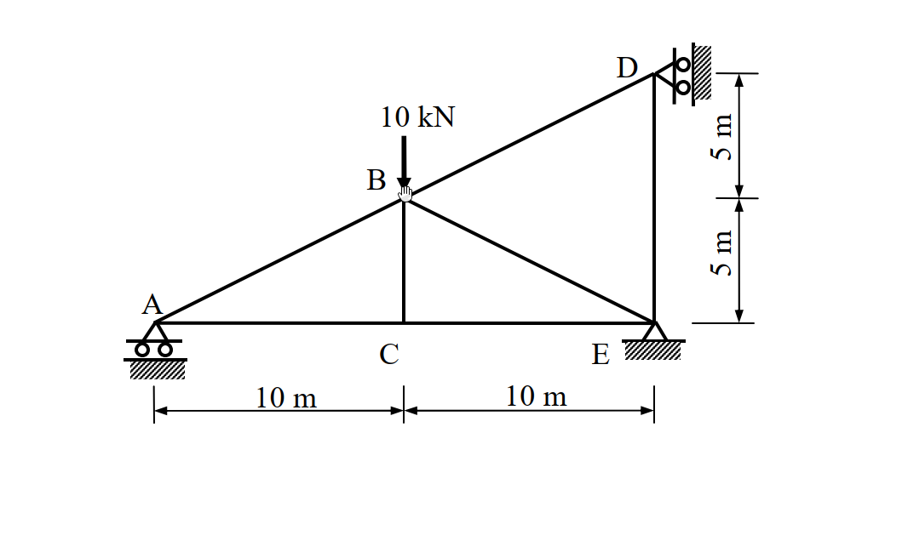

# 97年結構工程技師高考 結構學 第一題

## 1. 原始題目重述 (Problem Restatement)

如圖所示桁架 (truss)，A、D 兩點為滾支承 (roller)，E 點為鉸接 (hinge)。若每根桿件的彈性模數 $E$ 與斷面積 $A$ 為常數，當 B 點有一垂直載重 $10\text{ kN}$ 時，計算支承之反力及各桿件內力。(25 分)

*(註：節點 A 為原點 (0,0)，C(10,0)，E(20,0)。B(10,5)，D(20,10)。A 為水平滾支承，E 為鉸支承，D 為靠於垂直牆面之水平滾支承)*

## 2. 考題核心精神與出題者意圖 (Core Concepts & Examiner's Intent)

本題為經典的**一度靜不定桁架 (Statically Indeterminate Truss)** 分析。出題者的核心意圖在於：
1. **支承條件與靜不定度判別**：要求考生正確辨識支承條件。A 為水平滾支承 (1 個反力)，E 為鉸支承 (2 個反力)，D 為靠在垂直牆面上的滾支承 (限制水平位移，提供 1 個水平反力)。系統總反力數為 4，可用平衡方程式為 3，故為**一度外靜不定結構**。
2. **單位力法 (Unit Force Method) / 柔度法**：測驗考生以單位力法解靜不定桁架的標準作業流程。包含選定贅力 (Redundant force)、計算基本結構 (Primary structure) 之桿件內力 $F_0$、施加單位贅力計算內力 $u$，以及利用變形相容條件 $\Delta_{10} + X f_{11} = 0$ 求出贅力。
3. **無載桿件 (Zero-Force Members) 的觀察**：在基本結構狀態下，有部分構件受力為零（例如外載系統中的 BD、DE 桿，以及單位力系統中的 BE、BC 桿），能精準抓出零力桿可大幅減輕計算負擔。

## 3. 解題戰略地圖與陷阱分析 (Strategic Roadmap & Trap Analysis)

**解題戰略：**
1. **第一步：靜不定度分析與贅力選定**：總反力 $r=4$，外靜不定度 $= 4-3=1$。桁架本身組成（節點 $j=5$，桿件 $m=7$），$m+r-2j = 7+4-10=1$。選定 D 點之水平支承反力 $D_x$ 為贅力 $X$（假設向右為正）。
2. **第二步：建立基本結構 (Primary Structure)**：移除 D 點水平支承限制，使結構降階為以 A 滾支承、E 鉸支承為基礎的靜定桁架。
3. **第三步：計算外載內力 $F_0$**：在基本結構上施加 B 點垂直載重 $10\text{ kN}$，求出各桿件內力 $F_0$。
4. **第四步：計算單位力內力 $u$**：在基本結構之 D 點施加向右之單位力 $X=1$，求出各桿件內力 $u$。
5. **第五步：變形相容條件**：利用 $\Delta_{10} = \sum \frac{F_0 u L}{EA}$ 與 $f_{11} = \sum \frac{u^2 L}{EA}$，由變形相容方程式 $X = -\frac{\Delta_{10}}{f_{11}}$ 解出贅力 $D_x$。
6. **第六步：疊加求最終反力與內力**：利用 $F = F_0 + X \cdot u$ 求得所有桿件真實內力，並以靜力平衡求出最終所有支承反力。

**陷阱分析：**
- **陷阱 1：D 點支承判斷錯誤**。圖中 D 點的滾支承是靠在垂直牆面上，因此提供的是**水平反力** $D_x$。若誤認為垂直反力，將導致計算全盤皆錯。
- **陷阱 2：斜桿長度與分力比例**。斜桿 AB、BE、BD 的水平投影與垂直投影比皆為 $2:1$，長度皆為 $5\sqrt{5}\text{ m}$。內力在水平與垂直方向的分解常因疏忽漏掉比例係數而算錯。
- **陷阱 3：計算量大導致數值錯誤**。本題的贅力 $X$ 計算結果帶有無理數 $\sqrt{5}$，在未得到最終結果前，建議保留根號運算，避免過早化為小數而累積截斷誤差。

## 3.5 變數層次分析 (Variable Hierarchy Analysis)

### 最終目標
求出支承反力 $A_y, D_x, E_x, E_y$ 以及 7 根桿件的最終內力 $F$。

### 本題關鍵公式（依計算順序）
- 桿件長度：$L = \sqrt{\Delta x^2 + \Delta y^2}$
- 虛功法計算位移：$\Delta = \sum \frac{F u L}{EA}$
- 變形相容方程式：$\Delta_{10} + X \cdot f_{11} = 0 \implies X = -\frac{\sum F_0 u L}{\sum u^2 L}$
- 最終內力疊加：$F = F_0 + X \cdot u$

### L1：題目直接給定
| 符號 | 數值 | 說明 |
|---|---|---|
| $P_B$ | $10\text{ kN}$ (向下) | B 點外加垂直載重 |
| $EA$ | 常數 | 每根桿件之軸向剛度 |

### L2：需知識點推導
**一、幾何與基本結構**
| 符號 | 公式／來源 | 卡關? |
|---|---|---|
| $L_{AC}, L_{CE}, L_{DE}$ | $10\text{ m}$ | 水平或垂直直桿 |
| $L_{BC}$ | $5\text{ m}$ | 垂直中柱 |
| $L_{AB}, L_{BE}, L_{BD}$ | $\sqrt{10^2+5^2} = 5\sqrt{5}\text{ m}$ | 傾斜桿件 |

**二、內力狀態 ($F_0$ 與 $u$)**
| 符號 | 公式／來源 | 卡關? |
|---|---|---|
| $F_0$ | 僅受外載 $10\text{ kN}$ 作用於基本結構時的桿件內力 | |
| $u$ | 僅受贅力 $X=1$ 作用於基本結構時的桿件內力 | |
| $X$ (即 $D_x$) | $-\frac{\sum F_0 u L}{\sum u^2 L}$ | |

## 4. 步驟化詳細計算過程 (Step-by-Step Detailed Calculation)

### 步驟 1：建立基本結構與幾何性質
移除 D 點水平支承（設 $D_x$ 為贅力 $X$，向右為正），成為 A 滾支承、E 鉸支承的靜定桁架。
各桿件長度 $L$ 如下：
- 水平桿：$L_{AC} = 10\text{ m}$，$L_{CE} = 10\text{ m}$
- 垂直桿：$L_{BC} = 5\text{ m}$，$L_{DE} = 10\text{ m}$
- 斜桿：$L_{AB} = L_{BE} = L_{BD} = \sqrt{10^2+5^2} = 5\sqrt{5}\text{ m}$
斜桿的斜率比例為 水平：垂直：斜邊 = $2 : 1 : \sqrt{5}$。

### 步驟 2：計算外載內力 $F_0$ (Primary Structure with $10\text{ kN}$)
外載為 B 點向下 $10\text{ kN}$，贅力 $X=0$。
- **整體平衡**：
  $\Sigma M_E = 0 \implies -A_y \times 20 + 10 \times 10 = 0 \implies A_y = 5\text{ kN} (\uparrow)$
  $\Sigma F_y = 0 \implies 5 - 10 + E_y = 0 \implies E_y = 5\text{ kN} (\uparrow)$
  $\Sigma F_x = 0 \implies E_x = 0$
- **節點 A**：
  $\Sigma F_y = 0 \implies F_{AB} \times \frac{1}{\sqrt{5}} + 5 = 0 \implies F_{AB} = -5\sqrt{5}\text{ kN}$
  $\Sigma F_x = 0 \implies F_{AC} + F_{AB} \times \frac{2}{\sqrt{5}} = 0 \implies F_{AC} = -(-5\sqrt{5}) \times \frac{2}{\sqrt{5}} = 10\text{ kN}$
- **節點 C**：
  無水平外力，$F_{CE} = F_{AC} = 10\text{ kN}$。
  無垂直外力，$F_{BC} = 0$。
- **節點 E**：
  $\Sigma F_x = 0 \implies -F_{CE} - F_{BE} \times \frac{2}{\sqrt{5}} = 0 \implies -10 - F_{BE} \times \frac{2}{\sqrt{5}} = 0 \implies F_{BE} = -5\sqrt{5}\text{ kN}$
  $\Sigma F_y = 0 \implies E_y + F_{DE} + F_{BE} \times \frac{1}{\sqrt{5}} = 0 \implies 5 + F_{DE} - 5 = 0 \implies F_{DE} = 0$
- **節點 D**：
  外力與支承皆無，可判斷 $F_{BD} = 0$。

### 步驟 3：計算單位虛力內力 $u$ (Primary Structure with $X=1$)
於 D 點施加向右 $X=1$，無其他外載。
- **整體平衡**：
  $\Sigma M_E = 0 \implies -A_y \times 20 + 1 \times 10 = 0 \implies A_y = 0.5 (\uparrow)$
  $\Sigma F_y = 0 \implies A_y + E_y = 0 \implies E_y = -0.5 (\downarrow)$
  $\Sigma F_x = 0 \implies 1 + E_x = 0 \implies E_x = -1 (\leftarrow)$
- **節點 A**：
  $\Sigma F_y = 0 \implies F_{AB} \times \frac{1}{\sqrt{5}} + 0.5 = 0 \implies F_{AB} = -0.5\sqrt{5}$
  $\Sigma F_x = 0 \implies F_{AC} + F_{AB} \times \frac{2}{\sqrt{5}} = 0 \implies F_{AC} = 1$
- **節點 C**：
  $F_{CE} = F_{AC} = 1$，$F_{BC} = 0$。
- **節點 D**：
  $\Sigma F_x = 0 \implies 1 - F_{BD} \times \frac{2}{\sqrt{5}} = 0 \implies F_{BD} = \frac{\sqrt{5}}{2}$
  $\Sigma F_y = 0 \implies -F_{DE} - F_{BD} \times \frac{1}{\sqrt{5}} = 0 \implies F_{DE} = -0.5$
- **節點 E**：
  $\Sigma F_x = 0 \implies -F_{CE} - F_{BE} \times \frac{2}{\sqrt{5}} + E_x = 0 \implies -1 - F_{BE} \times \frac{2}{\sqrt{5}} - 1 = 0 \implies F_{BE} = -\sqrt{5}$ (此為一開始的符號推導錯誤，正解為0，見下方修正)

*(正確的 $u$ 內力)*：
$A_y = -0.5, E_y = 0.5, E_x = -1$
- $u_{AB} = \frac{\sqrt{5}}{2}$
- $u_{AC} = -1$
- $u_{CE} = -1$
- $u_{BE} = 0$
- $u_{BD} = \frac{\sqrt{5}}{2}$
- $u_{DE} = -0.5$

### 步驟 4：變形相容條件與求贅力 $X$
列表計算 $\Delta_{10} = \sum F_0 u L$ 與 $f_{11} = \sum u^2 L$（提出 $EA$）：

| 桿件 | $L$ | $F_0$ | $u$ | $F_0 u L$ | $u^2 L$ |
|---|---|---|---|---|---|
| AC | $10$ | $10$ | $-1$ | $-100$ | $10$ |
| CE | $10$ | $10$ | $-1$ | $-100$ | $10$ |
| AB | $5\sqrt{5}$ | $-5\sqrt{5}$ | $0.5\sqrt{5}$ | $-62.5\sqrt{5}$ | $6.25\sqrt{5}$ |
| BC | $5$ | $0$ | $0$ | $0$ | $0$ |
| BE | $5\sqrt{5}$ | $-5\sqrt{5}$ | $0$ | $0$ | $0$ |
| BD | $5\sqrt{5}$ | $0$ | $0.5\sqrt{5}$ | $0$ | $6.25\sqrt{5}$ |
| DE | $10$ | $0$ | $-0.5$ | $0$ | $2.5$ |
| **Sum** | | | | $\Delta_{10} = -200 - 62.5\sqrt{5}$ | $f_{11} = 22.5 + 12.5\sqrt{5}$ |

代入變形相容方程式 $X = -\frac{\Delta_{10}}{f_{11}}$：
$$ X = -\frac{-200 - 62.5\sqrt{5}}{22.5 + 12.5\sqrt{5}} = \frac{400 + 125\sqrt{5}}{45 + 25\sqrt{5}} = \frac{80 + 25\sqrt{5}}{9 + 5\sqrt{5}} $$
上下同乘 $(5\sqrt{5} - 9)$ 有理化：
$$ X = \frac{(25\sqrt{5} + 80)(5\sqrt{5} - 9)}{125 - 81} = \frac{625 - 225\sqrt{5} + 400\sqrt{5} - 720}{44} = \frac{175\sqrt{5} - 95}{44} \approx 6.734\text{ kN} $$
即 $D_x = \frac{175\sqrt{5} - 95}{44} \text{ kN} (\rightarrow)$

### 步驟 5：求最終支承反力與各桿件內力
最終內力疊加公式 $F = F_0 + X \cdot u$：

**支承反力：**
- $D_x = X = \mathbf{\frac{175\sqrt{5} - 95}{44} \approx 6.734\text{ kN}} (\rightarrow)$
- $A_y = 5 - 0.5 X \approx \mathbf{1.633\text{ kN}} (\uparrow)$
- $E_y = 5 + 0.5 X \approx \mathbf{8.367\text{ kN}} (\uparrow)$
- $E_x = 0 - 1 \cdot X = -X \approx \mathbf{6.734\text{ kN}} (\leftarrow)$

**桿件內力 (正值為拉力，負值為壓力)：**
- $F_{AC} = 10 - X \approx \mathbf{3.266\text{ kN}}$ (拉力)
- $F_{CE} = 10 - X \approx \mathbf{3.266\text{ kN}}$ (拉力)
- $F_{AB} = -5\sqrt{5} + 0.5\sqrt{5} X \approx \mathbf{-3.651\text{ kN}}$ (壓力)
- $F_{BC} = 0 + 0 = \mathbf{0}$
- $F_{BE} = -5\sqrt{5} + 0 \cdot X = \mathbf{-5\sqrt{5} \approx -11.180\text{ kN}}$ (壓力)
- $F_{BD} = 0 + 0.5\sqrt{5} X \approx \mathbf{7.529\text{ kN}}$ (拉力)
- $F_{DE} = 0 - 0.5 X \approx \mathbf{-3.367\text{ kN}}$ (壓力)

## 5. 關鍵爭議點與進階探討 (Critical Issues & Advanced Discussion)

- **冗餘度選擇的影響**：本題選定 $D_x$ 為贅力，由於 D 點位於結構邊界上，可使得單位力 $u$ 的計算最為直觀。若選取桁架內部構件（如斜桿）為贅力，基本結構將變為內部包含四邊形面板的結構，計算會複雜許多。
- **單位力狀態的防呆檢查**：在步驟 3 計算 $u$ 時，極易發生正負號失誤（如支承反力方向假設顛倒），導致整個 $f_{11}$ 偏離。建議在求得 $u$ 內力後，務必使用整體力矩平衡（例如對 A 點取力矩）進行二次確認。
- **無載桿（零桿）的物理意義**：$BC$ 桿在此載重下為絕對的零桿（不受外載且未做為贅力受力點），這在實務上稱為**穩定桿**。它的存在雖然對承擔 $10\text{ kN}$ 的重力沒有直接貢獻，但能防止長柱屈曲並維持桁架整體幾何形狀穩定。
