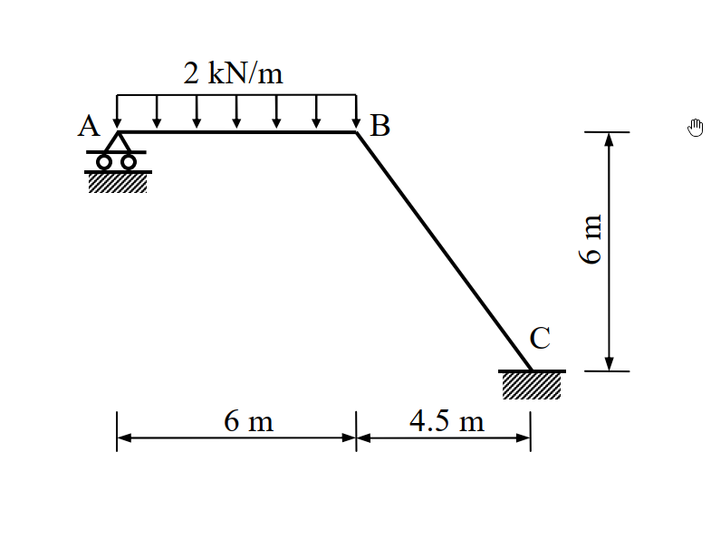

# 97年結構工程技師高考 結構學 第三題

## 1. 原始題目重述 (Problem Restatement)

試以最小功法（least work）計算圖示剛架（frame）各桿件之彎矩，並繪彎矩圖。圖中 A 點為滾支承（roller），C 點為固接（fixed）。已知各桿件之彈性模數 $E$ 與慣性矩 $I$ 為常數。（25 分）

*(註：A 為水平滾支承，C 為固定端。剛架包含水平桿 AB 與斜桿 BC。AB 長度 $6\text{ m}$，承受向下均佈載重 $2\text{ kN/m}$。BC 桿水平投影 $4.5\text{ m}$，垂直投影 $6\text{ m}$，總長度 $7.5\text{ m}$)*

## 2. 考題核心精神與出題者意圖 (Core Concepts & Examiner's Intent)

本題為**一度外靜不定剛架**，指定使用**最小功法 (Method of Least Work / Castigliano's Second Theorem)** 求解。出題者的核心意圖在於：
1. **最小功法的熟練度**：測驗考生能否正確選擇贅力 (Redundant force)，並將結構總應變能 $U$ 對贅力的偏微分設為零 ($\frac{\partial U}{\partial R} = 0$) 來求解。
2. **座標系統與內力函數的建立**：考驗考生在不同幾何區段 (水平直線與斜線) 建立彎矩方程式 $M(x)$ 的能力，以及處理斜桿段微小長度 $ds$ 與水平變數 $dx$ 轉換的幾何關係。
3. **積分計算的細心度**：本題計算牽涉到多項式的展開與積分，需要高度的細心與耐心，避免在多項式乘法中出錯。

## 3. 解題戰略地圖與陷阱分析 (Strategic Roadmap & Trap Analysis)

**解題戰略：**
1. **第一步：靜不定度分析與贅力選定**：A 點滾支承提供 1 個垂直反力 $A_y$，C 點固接提供 3 個反力 ($C_x, C_y, M_C$)。總反力數為 4，靜不定度為 1。選定 A 點垂直反力 $A_y$ 為贅力 $R$ (設向上為正)。
2. **第二步：建立全區段彎矩函數 $M(x)$**：
   以 A 點為原點，定義向右為 $x$。
   - **AB 段** ($0 \le x \le 6$)：考慮 $x$ 左側自由體，彎矩由贅力 $R$ 與均佈載重貢獻。
   - **BC 段** ($6 \le x \le 10.5$)：同樣考慮 $x$ 左側自由體，均佈載重此時為定值總力，力臂為 $(x-3)$。
3. **第三步：計算偏微分 $\frac{\partial M}{\partial R}$**：對各段彎矩函數求偏微。
4. **第四步：利用最小功法列式**：$\frac{\partial U}{\partial R} = \int \frac{M}{EI} \frac{\partial M}{\partial R} ds = 0$。注意 BC 段的斜率，需將 $ds$ 轉換為 $dx$ 以利積分計算。
5. **第五步：求解贅力與各端彎矩**：解出 $R$ 後，代回 $M(x)$ 求得 B 點與 C 點彎矩，並找出 AB 段最大正彎矩位置以繪製精確的彎矩圖。

**陷阱分析：**
- **陷阱 1：斜桿段的 $ds$ 轉換**。斜桿 BC 上積分時的微小長度為 $ds$，若直接把 $ds$ 當成 $dx$ 積分將導致錯誤。必須透過勾股定理計算 $ds = \sqrt{1 + (dy/dx)^2} dx$。
- **陷阱 2：BC 段彎矩函數列式過度複雜**。若將原點改至 C 點，雖然避開了贅力，但需要計算 C 點的未知反力，反而本末倒置。維持由 A 點向右看，AB 段均佈載重在 BC 段的等效力矩僅為 $12 \times (x-3)$，這是最簡潔的寫法。
- **陷阱 3：彎矩符號約定混亂**。應保持統一的符號約定 (例如使結構下方受拉為正)，並確保繪製彎矩圖時畫在受拉側。

## 3.5 變數層次分析 (Variable Hierarchy Analysis)

### 最終目標
求出各桿件之彎矩函數，並繪製彎矩圖。

### 本題關鍵公式（依計算順序）
- 彎矩函數建立：$\Sigma M = 0$
- 最小功法 (卡氏第二定理)：$\frac{\partial U}{\partial R} = \int \frac{M}{EI} \frac{\partial M}{\partial R} ds = 0$
- 微分幾何轉換：$ds = \sqrt{dx^2 + dy^2}$

### L1：題目直接給定
| 符號 | 數值 | 說明 |
|---|---|---|
| $w$ | $2\text{ kN/m}$ | AB 段均佈載重 |
| $EI$ | 常數 | 各桿件抗彎剛度 |

### L2：需知識點推導
**一、幾何與微積分轉換**
| 符號 | 公式／來源 | 卡關? |
|---|---|---|
| $R$ | 設 $A_y = R$ (向上) | 贅力 |
| $ds_{AB}$ | $dx$ | 水平段微小長度 |
| $ds_{BC}$ | $\sqrt{4.5^2 + (-6)^2} / 4.5 \cdot dx = \frac{7.5}{4.5} dx = \frac{5}{3} dx$ | 斜桿微小長度轉換係數 |

**二、各段彎矩函數與偏微**
| 符號 | 公式／來源 | 卡關? |
|---|---|---|
| $M_{AB}(x)$ | $R x - \frac{1}{2}(2)x^2 = R x - x^2$ | $0 \le x \le 6$ |
| $\frac{\partial M_{AB}}{\partial R}$ | $x$ | |
| $M_{BC}(x)$ | $R x - (2 \times 6)(x - 3) = R x - 12(x - 3)$ | $6 \le x \le 10.5$ |
| $\frac{\partial M_{BC}}{\partial R}$ | $x$ | |

## 4. 步驟化詳細計算過程 (Step-by-Step Detailed Calculation)

### 步驟 1：建立彎矩函數與偏微分
設 A 點垂直反力 $A_y$ 為贅力 $R$ (向上為正)。以 A 點為原點，向右為 $x$ 軸正向，向下為 $y$ 軸正向。彎矩以使桿件下方受拉為正。
- **AB 桿段 ($0 \le x \le 6$)：**
  $ds = dx$
  $M_{AB}(x) = R \cdot x - 2 \cdot \frac{x^2}{2} = R x - x^2$
  $\frac{\partial M_{AB}}{\partial R} = x$
- **BC 桿段 ($6 \le x \le 10.5$)：**
  BC 桿之幾何關係：$\Delta x = 4.5, \Delta y = -6$。
  $ds = \sqrt{dx^2 + dy^2} = \sqrt{1 + (-6/4.5)^2} dx = \sqrt{1 + (4/3)^2} dx = \frac{5}{3} dx$
  取 $x$ 左側自由體，均佈載重總力為 $12\text{ kN}$，作用點在 $x=3$。
  $M_{BC}(x) = R \cdot x - 12 \cdot (x - 3) = R x - 12 x + 36$
  $\frac{\partial M_{BC}}{\partial R} = x$

### 步驟 2：利用最小功法列方程式
根據卡氏第二定理 $\frac{\partial U}{\partial R} = 0$：
$$ \int_0^6 \frac{M_{AB}}{EI} \frac{\partial M_{AB}}{\partial R} dx + \int_6^{10.5} \frac{M_{BC}}{EI} \frac{\partial M_{BC}}{\partial R} \left(\frac{5}{3} dx\right) = 0 $$

將 $EI$ 提出並消去，分別計算兩項積分。
**第一項 (AB 桿段)：**
$$ \int_0^6 (R x - x^2) x \, dx = \int_0^6 (R x^2 - x^3) \, dx = \left[ R \frac{x^3}{3} - \frac{x^4}{4} \right]_0^6 $$
$$ = R \frac{216}{3} - \frac{1296}{4} = 72 R - 324 $$

**第二項 (BC 桿段)：**
$$ \frac{5}{3} \int_6^{10.5} (R x - 12 x + 36) x \, dx = \frac{5}{3} \int_6^{10.5} \left( (R-12) x^2 + 36 x \right) dx $$
其中：
$\int_6^{10.5} x^2 dx = \frac{1}{3} (10.5^3 - 6^3) = \frac{1}{3} (1157.625 - 216) = 313.875 = \frac{2511}{8}$
$\int_6^{10.5} x \, dx = \frac{1}{2} (10.5^2 - 6^2) = \frac{1}{2} (110.25 - 36) = 37.125 = \frac{297}{8}$
代入積分式：
$$ \frac{5}{3} \left[ (R-12)\frac{2511}{8} + 36\left(\frac{297}{8}\right) \right] = \frac{5}{3} \left[ \frac{2511 R - 30132 + 10692}{8} \right] = \frac{5}{3} \left[ \frac{2511 R - 19440}{8} \right] $$
$$ = \frac{5(837 R - 6480)}{8} = \frac{4185 R - 32400}{8} = \frac{4185}{8} R - 4050 $$

### 步驟 3：求解贅力 $R$
將兩項合併令其為 0：
$$ (72 R - 324) + \left(\frac{4185}{8} R - 4050\right) = 0 $$
$$ \left( \frac{576}{8} + \frac{4185}{8} \right) R = 324 + 4050 $$
$$ \frac{4761}{8} R = 4374 \implies R = \frac{4374 \times 8}{4761} = \frac{34992}{4761} = \frac{3888}{529} \approx \mathbf{7.350\text{ kN}} (\uparrow) $$

### 步驟 4：計算各端彎矩與最大正彎矩
將 $R = \frac{3888}{529}$ 代回彎矩方程式：
- **A 點彎矩** ($x=0$)：$M_A = \mathbf{0}$
- **B 點彎矩** ($x=6$)：
  $M_B = R(6) - 36 = \frac{23328}{529} - \frac{19044}{529} = \mathbf{\frac{4284}{529} \approx 8.098\text{ kN-m}}$ (拉力在下方)
- **C 點彎矩** ($x=10.5$)：
  $M_C = R(10.5) - 12(10.5 - 3) = \frac{3888}{529} \times \frac{21}{2} - 12 \times 7.5 = \frac{40824}{529} - 90 = \frac{40824 - 47610}{529} = \mathbf{-\frac{6786}{529} \approx -12.828\text{ kN-m}}$ (拉力在上方/外側)
- **AB 段最大正彎矩**：
  發生在剪力為零處。令 $V_{AB} = \frac{d M_{AB}}{dx} = R - 2x = 0 \implies x = \frac{R}{2} = \frac{1944}{529} \approx 3.675\text{ m}$
  最大彎矩 $M_{max} = R(\frac{R}{2}) - (\frac{R}{2})^2 = \frac{R^2}{4} = \frac{(3888/529)^2}{4} = \mathbf{\frac{3779136}{279841} \approx 13.505\text{ kN-m}}$

## 5. 關鍵爭議點與進階探討 (Critical Issues & Advanced Discussion)

- **座標系統選取的藝術**：本題解法的亮點在於統一採用 $x$ 座標來表示所有桿件的彎矩函數，並利用幾何關係將斜桿的 $ds$ 直接轉換為 $\frac{5}{3} dx$。這種手法避免了在斜桿上重新建立局部 $s$ 座標、角度轉換與投影計算的繁瑣過程，大幅降低了計算過程中的出錯率，是極高效率的考場解題技巧。
- **純代數分數運算的建議**：如計算過程所示，雖然 $R$ 的數值看似不平易近人 ($3888/529$)，但透過全程保留分數計算，能確保 $M_B$ 與 $M_C$ 的結果在數學上絕對精確。在國家考試中，建議先列出精確的分數解，再於括號內附上小數近似值，可展現高度的運算嚴謹性。
- **彎矩圖的連續性檢查**：B 點為剛性節點，從 AB 桿段計算得 $M_B = 8.098\text{ kN-m}$，從 BC 桿段公式代入 $x=6$ 亦得出相同的 $8.098\text{ kN-m}$，此連續性檢查確保了本題彎矩方程式列式正確無誤。
