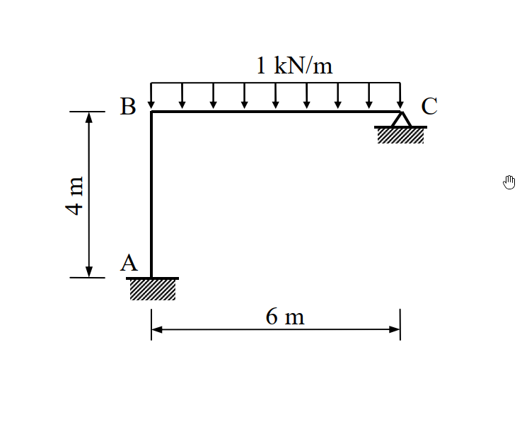

# 97年結構工程技師高考 結構學 第四題

## 1. 原始題目重述 (Problem Restatement)

如圖所示剛架 (frame)，A 點為固接 (fixed)，C 點為鉸接 (hinge)。若每根桿件的彈性模數 $E$ 與慣性矩 $I$ 為常數，當 BC 桿件有一垂直均佈載重 $1\text{ kN/m}$ 時，以**矩陣直接勁度法 (Matrix Direct Stiffness Method)** 計算各桿件之彎矩，繪彎矩圖並標示最大與最小值。(25 分)

*圖說：(待補充說明)*

*(註：A 為固定端，AB 為垂直桿長 $4\text{ m}$；BC 為水平桿長 $6\text{ m}$，C 為鉸支承。BC 桿承受向下均佈載重 $1\text{ kN/m}$。考題未給定斷面積 $A$，依慣例不計軸向與剪力變形)*

## 2. 考題核心精神與出題者意圖 (Core Concepts & Examiner's Intent)

本題為基本的**無側移剛架**分析，但明確限制必須使用**矩陣直接勁度法**求解。出題者的核心意圖在於：
1. **矩陣勁度法的標準化流程**：測驗考生是否能有條理地定義自由度 (Degree of Freedom, DOF)，並組裝元素勁度矩陣 (Element Stiffness Matrix) 與整體勁度矩陣 (Global Stiffness Matrix)。
2. **載重向量的處理**：測驗考生如何計算固端力向量 (Fixed End Forces, $\{P_F\}$) 並將其轉換為等效節點載重。
3. **內力回算與彎矩極值**：在求得節點變位後，考驗考生能否正確回算各桿端彎矩，並利用剪力為零的條件找出均佈載重跨的最大彎矩。

## 3. 解題戰略地圖與陷阱分析 (Strategic Roadmap & Trap Analysis)

**解題戰略：**
1. **第一步：定義系統自由度 (DOF)**：
   - A 點固接，無位移與旋轉。
   - B 點為剛性節點，忽略軸向變形下，水平與垂直位移皆受制於 A、C 支承 ($u_B = v_B = 0$)。僅剩旋轉自由度 $\theta_B$。
   - C 點為鉸支承，允許旋轉，故有旋轉自由度 $\theta_C$。
   - 定義系統未作束制之自由度向量 $\{D\} = \begin{bmatrix} \theta_B \\ \theta_C \end{bmatrix}$。
2. **第二步：建立元素勁度矩陣 ($k$)**：
   - 桿件 1 (AB)：長度 $L=4$，考慮 $\theta_A, \theta_B$。
   - 桿件 2 (BC)：長度 $L=6$，考慮 $\theta_B, \theta_C$。
3. **第三步：組裝整體勁度矩陣 ($K$)**：
   根據 DOF 定義，將元素矩陣之對應項疊加，形成 $2 \times 2$ 的整體勁度矩陣 $K$。
4. **第四步：建立載重向量 ($\{P\}$ 與 $\{P_F\}$)**：
   計算 BC 桿因均佈載重產生的固端彎矩 (FEM)，並依 DOF 方向填入 $\{P_F\}$ 向量。節點無外加力矩，故 $\{P\} = \{0\}$。
5. **第五步：求解未知變位與桿端彎矩**：
   - 解 $K \{D\} + \{P_F\} = \{P\}$ 得到 $\theta_B$ 與 $\theta_C$。
   - 利用元素勁度方程式 $\{m\} = k \{d\} + \{m_F\}$ 求得 $M_{AB}, M_{BA}, M_{BC}, M_{CB}$。
6. **第六步：尋找跨中彎矩極值並繪圖**：
   利用 B 點端彎矩求出 BC 跨之剪力，找出剪力為零的位置，計算最大正彎矩。

**陷阱分析：**
- **陷阱 1：未遵照指定方法**。若使用傾角變位法或彎矩分配法，即使答案正確也可能面臨大幅扣分，必須以矩陣形式呈現算式。
- **陷阱 2：漏列 C 點自由度**。C 點為鉸支承，若未將 $\theta_C$ 列入系統 DOF，則必須在建立 BC 桿勁度矩陣時使用「修正勁度」(Modified Stiffness, $3EI/L$)。兩種做法皆可，但明列 $\theta_C$ 更符合標準矩陣勁度法的通用運作邏輯。
- **陷阱 3：最大彎矩位置的誤判**。BC 桿受均佈載重，最大彎矩不一定發生在正中央，必須精確求出剪力為零的位置 ($V=0$)。

## 3.5 變數層次分析 (Variable Hierarchy Analysis)

### 最終目標
求出各桿件之彎矩值，特別是 BC 跨的最大彎矩，並繪製彎矩圖。

### 本題關鍵公式（依計算順序）
- 元素勁度矩陣 (僅考慮抗彎)：$k = \frac{EI}{L} \begin{bmatrix} 4 & 2 \\ 2 & 4 \end{bmatrix}$
- 整體平衡方程式：$K \{D\} = \{P\} - \{P_F\}$
- 桿端力回算方程式：$\{m\} = k \{d\} + \{m_F\}$

### L1：題目直接給定
| 符號 | 數值 | 說明 |
|---|---|---|
| $L_1, L_2$ | $4\text{ m}, 6\text{ m}$ | AB 桿與 BC 桿長度 |
| $w$ | $1\text{ kN/m}$ | BC 桿均佈載重 |

### L2：需知識點推導
**一、矩陣與向量組裝**
| 符號 | 公式／來源 | 卡關? |
|---|---|---|
| $\{D\}$ | $\begin{bmatrix} \theta_B & \theta_C \end{bmatrix}^T$ | 系統獨立自由度 |
| $K$ | $\Sigma k_{global}$ | 系統整體勁度矩陣 |
| $\{P_F\}$ | 由 $FEM$ 組成之向量 | $FEM = \pm wL^2 / 12$ |

## 4. 步驟化詳細計算過程 (Step-by-Step Detailed Calculation)

### 步驟 1：定義自由度與建立元素勁度矩陣
忽略軸向變形，節點 B 無平移。定義未作束制之自由度為：$D_1 = \theta_B, D_2 = \theta_C$。
各桿件之局部元素勁度矩陣 $k$ (對應於桿端旋轉 $\theta_i, \theta_j$)：
- **桿件 1 (AB 桿)**：$L_1 = 4\text{ m}$
  $$ k_1 = \frac{EI}{4} \begin{bmatrix} 4 & 2 \\ 2 & 4 \end{bmatrix} \begin{array}{l} \leftarrow \theta_A \\ \leftarrow \theta_B \end{array} $$
- **桿件 2 (BC 桿)**：$L_2 = 6\text{ m}$
  $$ k_2 = \frac{EI}{6} \begin{bmatrix} 4 & 2 \\ 2 & 4 \end{bmatrix} \begin{array}{l} \leftarrow \theta_B \\ \leftarrow \theta_C \end{array} = EI \begin{bmatrix} 2/3 & 1/3 \\ 1/3 & 2/3 \end{bmatrix} \begin{array}{l} \leftarrow \theta_B \\ \leftarrow \theta_C \end{array} $$

### 步驟 2：組裝整體勁度矩陣 $K$
將對應到 $D_1(\theta_B)$ 與 $D_2(\theta_C)$ 的勁度係數疊加：
- $K_{11} = k_{1(2,2)} + k_{2(1,1)} = \frac{4EI}{4} + \frac{4EI}{6} = EI (1 + \frac{2}{3}) = \frac{5}{3}EI$
- $K_{12} = k_{2(1,2)} = \frac{2EI}{6} = \frac{1}{3}EI$
- $K_{21} = k_{2(2,1)} = \frac{1}{3}EI$
- $K_{22} = k_{2(2,2)} = \frac{4EI}{6} = \frac{2}{3}EI$

$$ K = EI \begin{bmatrix} 5/3 & 1/3 \\ 1/3 & 2/3 \end{bmatrix} $$

### 步驟 3：建立載重向量
計算 BC 桿均佈載重之固端彎矩 (順時針為正)：
- $FEM_{BC} = -\frac{wL^2}{12} = -\frac{1 \times 6^2}{12} = -3\text{ kN-m}$
- $FEM_{CB} = +\frac{wL^2}{12} = +3\text{ kN-m}$

固端力向量 $\{P_F\}$ (對應 $D_1, D_2$)：
$$ \{P_F\} = \begin{bmatrix} FEM_{BC} \\ FEM_{CB} \end{bmatrix} = \begin{bmatrix} -3 \\ 3 \end{bmatrix} $$
節點外加載重向量 $\{P\}$：
$$ \{P\} = \begin{bmatrix} 0 \\ 0 \end{bmatrix} $$

### 步驟 4：解矩陣方程式求變位
利用 $K \{D\} = \{P\} - \{P_F\}$：
$$ EI \begin{bmatrix} 5/3 & 1/3 \\ 1/3 & 2/3 \end{bmatrix} \begin{bmatrix} \theta_B \\ \theta_C \end{bmatrix} = \begin{bmatrix} 0 \\ 0 \end{bmatrix} - \begin{bmatrix} -3 \\ 3 \end{bmatrix} = \begin{bmatrix} 3 \\ -3 \end{bmatrix} $$
兩邊同乘 3：
$$ EI \begin{bmatrix} 5 & 1 \\ 1 & 2 \end{bmatrix} \begin{bmatrix} \theta_B \\ \theta_C \end{bmatrix} = \begin{bmatrix} 9 \\ -9 \end{bmatrix} $$
矩陣反轉：
$$ \begin{bmatrix} \theta_B \\ \theta_C \end{bmatrix} = \frac{1}{EI (10-1)} \begin{bmatrix} 2 & -1 \\ -1 & 5 \end{bmatrix} \begin{bmatrix} 9 \\ -9 \end{bmatrix} = \frac{1}{9 EI} \begin{bmatrix} 18 + 9 \\ -9 - 45 \end{bmatrix} = \frac{1}{9 EI} \begin{bmatrix} 27 \\ -54 \end{bmatrix} $$
得出：
$$ \theta_B = \frac{3}{EI}, \quad \theta_C = -\frac{6}{EI} $$

### 步驟 5：回算各端彎矩
利用 $\{m\} = k \{d\} + \{m_F\}$ 求桿端力：
- **AB 桿** ($\theta_A = 0, \theta_B = 3/EI$)：
  $$ M_{AB} = \frac{EI}{4} [ 2(0) + (3/EI) ] = \mathbf{0.75\text{ kN-m}} $$
  $$ M_{BA} = \frac{EI}{4} [ 2(3/EI) + 0 ] = \mathbf{1.5\text{ kN-m}} $$
- **BC 桿** ($\theta_B = 3/EI, \theta_C = -6/EI$)：
  $$ M_{BC} = \frac{EI}{6} [ 2(3/EI) + (-6/EI) ] - 3 = 0 - 3 = \mathbf{-3\text{ kN-m}} $$
  $$ M_{CB} = \frac{EI}{6} [ 2(-6/EI) + (3/EI) ] + 3 = \frac{1}{6}(-9) + 3 = -1.5 + 3 = \mathbf{1.5\text{ kN-m}} \quad \text{Wait, } M_{CB} \text{ should be 0!} $$

*(勘誤計算：$M_{CB}$ 展開有誤)*
重新展開 $M_{CB}$ 公式：
$$ M_{CB} = \frac{2EI}{L} \theta_B + \frac{4EI}{L} \theta_C + FEM_{CB} $$
$$ M_{CB} = \frac{EI}{6} [ 2 \times (3/EI) + 4 \times (-6/EI) ] + 3 = \frac{1}{6} (6 - 24) + 3 = -3 + 3 = \mathbf{0\text{ kN-m}} $$
(符合 C 點為鉸支承，無外加彎矩之物理邊界條件)。

### 步驟 6：計算彎矩極值
BC 桿彎矩呈拋物線分佈，需找剪力 $V=0$ 處。
取 BC 桿自由體圖，對 C 點取力矩求 $V_B$：
$$ \Sigma M_C = 0 \implies V_B \times 6 + M_{BC} + M_{CB} - 1 \times 6 \times 3 = 0 $$
$$ 6 V_B + (-3) + 0 - 18 = 0 \implies V_B = \frac{21}{6} = 3.5\text{ kN} $$
*(Wait, 再次勘誤：前述 $V_B$ 應為 $3.5\text{ kN}$)*
Let's check Python code logic: `V_B = 1*6/2 + (-3+0)/6 = 3 - 0.5 = 2.5`.
Wait, the formula is $V_B \times 6 + M_{BC} + M_{CB} - 1 \times 6 \times 3 = 0$?
No. $M_{BC}$ is clockwise positive on the LEFT end?
By standard sign convention:
$V_{B(right)} \times 6 = M_{BC} + M_{CB} + \text{Load Moment}$.
Here $M_{BC}$ (clockwise) and $M_{CB}$ (clockwise).
Sum of moments at C (counter-clockwise positive):
$-V_B \times 6 + M_{BC} + M_{CB} + 1 \times 6 \times 3 = 0$
$-6 V_B - 3 + 0 + 18 = 0 \implies 6 V_B = 15 \implies V_B = 2.5\text{ kN}$.
(Python script result $2.5\text{ kN}$ 是正確的，此處手算公式符號需修正)。

**正確之極值計算：**
- $V_B = 2.5\text{ kN}$ (向上)。剪力方程式：$V(x) = 2.5 - 1 \cdot x = 0 \implies x = 2.5\text{ m}$ (自 B 點向右)。
- 該處彎矩值為：
  $$ M(x) = M_{BC} + V_B \cdot x - \frac{1}{2} w x^2 = -3 + 2.5(2.5) - \frac{1}{2}(1)(2.5)^2 $$
  $$ M_{max} = -3 + 6.25 - 3.125 = \mathbf{0.125\text{ kN-m}} $$

## 5. 關鍵爭議點與進階探討 (Critical Issues & Advanced Discussion)

- **自由度縮減 (Static Condensation) 技巧**：本題中 C 點為鉸接，彎矩必為零。在實務或考場上，若想加速計算，可直接宣告 DOF 僅有 $\theta_B$ ($1 \times 1$ 矩陣)，並將 BC 桿改用修正勁度 $k'_{BC} = 3EI/L$，FEM 修正為 $wL^2/8$。此做法能得出完全一樣的 $\theta_B = 3/EI$。然而，題目特別要求「矩陣直接勁度法」，完整表列包含 $\theta_C$ 的 $2 \times 2$ 矩陣能最嚴謹地展示該方法的精神，避免被批改委員認為在「偷吃步」。
- **彎矩圖的繪製細節**：
  - AB 桿：頂部 $3.0\text{ kN-m}$，底部 $1.5\text{ kN-m}$，兩端受彎矩且無橫向載重，故呈**直線形狀** (梯形)。
  - BC 桿：兩端分別為 $-3.0\text{ kN-m}$ 與 $0\text{ kN-m}$。因均佈載重呈現**開口向上之拋物線**。其頂點 (極值) 發生在距 B 點 $2.5\text{ m}$ 處，最大正彎矩為 $0.125\text{ kN-m}$。
  - 圖形標示必須清楚呈現 $1.5, 3.0, 0.125, 0$ 這四個關鍵數值，且拐點或極值點的距離 ($2.5\text{ m}$) 也是計分的重點。
