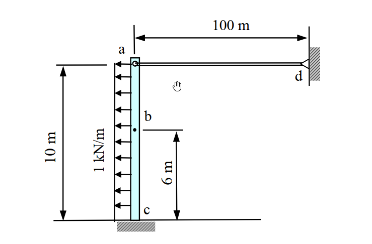

# 考題編號：SA-2009-2

**主分類：** `SA-U1-1` 桁架與梁柱結構分析
**副分類：** `SA-U1-3` 靜不定結構分析
**分析法：** 柔度法 (Force Method) / 單位虛力法
**標籤：** `靜不定`, `梁柱系統`, `均布載重`

---

## 1. 原始題目重述 (Problem Restatement)

本題為一複合結構（梁與連桿組成），梁 `ac` 底部 `c` 為固定端（Fixed End），頂端 `a` 與水平連桿 `ad` 相接。連桿右端 `d` 為固定鉸支承。梁受向左的均佈載重 $w = 1\text{ kN/m}$ 作用。

*   **已知條件：**
    *   梁 ac：長度 $L = 10\text{ m}$，彎曲剛度 $EI = 1000\text{ kN-m}^2$
    *   連桿 ad：長度 $L_{ad} = 100\text{ m}$，軸向剛度 $AE = 1000\text{ kN}$
    *   載重：均佈載重 $w = 1\text{ kN/m} (\leftarrow)$，作用於梁 `ac` 整個跨度。
*   **求解目標：** $b$ 點（距底部 $c$ 點 6m 處）的水平位移 $\Delta_b$。

*圖說：本圖為題意示意圖，包含一端固定、受水平向左均布載重的梁結構，其自由端透過水平連桿固定於右側鉸支承上，並標示梁與連桿的各項剛度條件與幾何尺寸。*

## 2. 考題核心精神與出題者意圖 (Core Concepts & Examiner's Intent)

本題的核心在於測驗考生處理「結合梁（抗彎）與二力桿件（抗軸壓/拉）」之混合結構的能力。主要考察以下知識點：
1. **靜不定度之判別與相容條件的建立**：這是一個一度靜不定結構。若以力法（柔度法）求解，需要能夠切斷連桿與梁的連接，將其內力視為贅力，並透過變形相容（相容條件）建立方程式。
2. **彈性變形之疊加原理應用**：針對懸臂梁，須熟知均布載重與端點集中載重所造成的變形公式，並在同一個目標點（$b$ 點）進行位移的疊加。
3. **軸向剛度與彎曲剛度的綜合考量**：在計算連桿的變形量時需要考慮 $AE$，而梁的撓曲變形需要考慮 $EI$。考生容易忽略二者在變形協調中符號約定的相對關係。

## 3. 解題戰略地圖與陷阱分析 (Strategic Roadmap & Trap Analysis)

**戰略地圖**：
1. **第一步**：判定靜不定度，選擇**柔度法 (Force Method)**。將連桿對梁的拉力 $X_1$ 視為贅力，建立基本結構（懸臂梁受均布載重 $w$ 及端點集中力 $X_1$）。
2. **第二步**：建立 $a$ 點的相容條件方程式。梁端 $a$ 點因載重產生的位移與連桿因受拉產生的伸長量必須符合幾何與支承關係。
3. **第三步**：代入各自的變形公式，解出贅力 $X_1$ 的大小。
4. **第四步**：以求得的 $X_1$ 與原載重 $w$ 分別計算 $b$ 點的位移，最後疊加求得最終水平位移 $\Delta_b$。

**關鍵陷阱**：
1. **符號與變形方向的混淆**：連桿若是向右拉梁（梁受向右集中力），則連桿本身亦處於受張力狀態（伸長）。梁端點位移方向與連桿伸長量的關係式中，正負號極易出錯。建議統一設定向右為正（或向左為正），並畫出分離體圖確認變位方向。
2. **彈性曲線公式套用錯誤**：計算梁任一點 $b$（距固定端 6m）的撓度時，不能只依賴自由端點的撓度公式，必須使用「任意位置 $y$ 的懸臂梁撓度公式」。若誤將 $b$ 點視為端點或直接用比例法折減，將會造成嚴重的計算錯誤。

## 3.5 變數層次分析 (Variable Hierarchy Analysis)

### 最終目標
`求出梁上 b 點的水平向位移 \Delta_b`

### 本題關鍵公式（依計算順序）
Step 1: 建立 a 點變位相容方程式
$$ \Delta_a = \Delta_{a,w} + \Delta_{a,X1} = -\Delta_{ad} $$
Step 2: 懸臂梁端點受載變位與連桿軸向變形
$$ \Delta_{a,w} = -\frac{w L^4}{8 EI}, \quad \Delta_{a,X1} = \frac{X_1 L^3}{3 EI}, \quad \Delta_{ad} = \frac{X_1 L_{ad}}{AE} $$
Step 3: 求解贅力 $X_1$
$$ \boxed{X_1} = \frac{-\Delta_{a,w}}{\frac{L^3}{3 EI} + \frac{L_{ad}}{AE}} $$
Step 4: 疊加求得任意點 b 的位移
$$ \Delta_b = \Delta_{b,X1} + \Delta_{b,w} = \frac{\boxed{X_1} y^2}{6 EI} (3L - y) - \frac{w y^2}{24 EI} (y^2 - 4Ly + 6L^2) $$

### L1：題目直接給定
| 符號 | 數值 | 說明 |
| --- | --- | --- |
| $L$ | $10\text{ m}$ | 梁 ac 的總長度 |
| $EI$ | $1000\text{ kN-m}^2$ | 梁 ac 的彎曲剛度 |
| $L_{ad}$ | $100\text{ m}$ | 連桿 ad 的長度 |
| $AE$ | $1000\text{ kN}$ | 連桿 ad 的軸向剛度 |
| $w$ | $1\text{ kN/m}$ | 作用於梁 ac 的均佈載重 (向左) |
| $y$ | $6\text{ m}$ | 目標點 b 距底部 c (固定端) 的距離 |

### L2：需知識點推導
**求解贅力**
| 符號 | 公式／來源 | 卡關? |
| --- | --- | --- |
| $\Delta_{a,w}$ | $-\frac{w L^4}{8 EI}$ | |
| $\Delta_{a,X1}$ | $\frac{X_1 L^3}{3 EI}$ | |
| $\Delta_{ad}$ | $\frac{X_1 L_{ad}}{AE}$ | |
| $X_1$ | 變位相容解出 | |

**計算 b 點位移**
| 符號 | 公式／來源 | 卡關? |
| --- | --- | --- |
| $\Delta_{b,X1}$ | $\frac{X_1 y^2}{6 EI} (3L - y)$ | |
| $\Delta_{b,w}$ | $-\frac{w y^2}{24 EI} (y^2 - 4Ly + 6L^2)$ | |
| $\Delta_b$ | $\Delta_{b,X1} + \Delta_{b,w}$ | |

### L3：深層知識（不懂就卡住）
| 知識點 | 說明 | 卡關? |
| --- | --- | --- |
| 梁與桿件的變位諧合符號約定 | 當梁端 a 向右位移 $\Delta_a$ (受拉力 $X_1$) 時，連桿端點向右移動，使得連桿縮短，但連桿受拉力 $X_1$ 時為伸長 $\Delta_{ad}$，故 $\Delta_a = -\Delta_{ad}$。 | |
| 懸臂梁任意截面的彈性曲線方程式 | 必須精確記住並套用端點集中力以及全跨均布載重在距離支承 $y$ 處的撓度公式。 | |

## 4. 步驟化詳細計算過程 (Step-by-Step Detailed Calculation)

### 4.1 建立基本結構與相容方程式

採用**柔度法 (Force Method)**：
1. **解除連桿 ad 對梁的束制**，將連桿對梁 a 點的作用力設為贅力 $X_1$（假設向右為張力）。
2. 此時基本結構為一純懸臂梁 ac，受到向左的均佈載重 $w = 1\text{ kN/m}$，以及 a 點向右的集中力 $X_1$。

**相容條件：**
梁在 a 點的水平變位量 $\Delta_a$（設向右為正）必須等於連桿 ad 左端的位移（也就是連桿伸長量所造成的位移）。
*   梁 a 點變位：$\Delta_a = \Delta_{a,w} + \Delta_{a,X1}$
*   連桿 a 點變位：連桿受張力 $X_1$ 作用，向右位移即代表連桿縮短，因此 $\Delta_a = -\Delta_{ad}$（其中 $\Delta_{ad}$ 為連桿受拉伸長量）。

### 4.2 計算基本結構變位

**1. 均佈載重 $w$ 造成的變位 (向左為負)：**
對於長度 $L=10\text{ m}$ 的懸臂梁，受均佈載重 $w$ 作用，自由端 a 的變位公式為：
$$ \Delta_{a,w} = -\frac{w L^4}{8 EI} = -\frac{1 \times 10^4}{8 \times 1000} = -\frac{10000}{8000} = -1.25\text{ m} $$

**2. 贅力 $X_1$ 造成的變位 (向右為正)：**
對於懸臂梁端點受集中力 $X_1$，自由端 a 的變位為：
$$ \Delta_{a,X1} = \frac{X_1 L^3}{3 EI} = \frac{X_1 \times 10^3}{3 \times 1000} = \frac{1000 X_1}{3000} = \frac{X_1}{3}\text{ m} $$

所以梁端 a 的總變位：
$$ \Delta_a = -1.25 + \frac{X_1}{3} $$

**3. 連桿的變形量：**
連桿承受張力 $X_1$，其伸長量為：
$$ \Delta_{ad} = \frac{X_1 L_{ad}}{AE} = \frac{X_1 \times 100}{1000} = 0.1 X_1 $$
依據相容條件，梁端向右的位移等於連桿向左的伸長量：
$$ \Delta_a = - \Delta_{ad} \implies -1.25 + \frac{X_1}{3} = -0.1 X_1 $$

### 4.3 解出贅力 $X_1$

將方程式移項求解：
$$ X_1 \left( \frac{1}{3} + \frac{1}{10} \right) = 1.25 $$
$$ X_1 \left( \frac{13}{30} \right) = \frac{5}{4} $$
$$ \boxed{X_1} = \frac{5}{4} \times \frac{30}{13} = \frac{150}{52} = \frac{75}{26}\text{ kN} \approx 2.8846\text{ kN} $$

### 4.4 計算 b 點的位移 $\Delta_b$

b 點距離底部 c 為 6m（即從固定端起算 $y = 6\text{ m}$）。
懸臂梁在任意位置 $y$ 的變形量可由各別負載的彈性曲線公式疊加求得（向右為正）：

**1. 集中力 $X_1$ 對 b 點的變位：**
公式：$v_P(y) = \frac{P y^2}{6 EI} (3L - y)$
$$ \Delta_{b,X1} = \frac{(75/26) \times 6^2}{6 \times 1000} (3 \times 10 - 6) = \frac{(75/26) \times 36}{6000} \times 24 = \frac{75 \times 6 \times 24}{26 \times 1000} = \frac{10800}{26000} = \frac{27}{65}\text{ m} \approx 0.41538\text{ m} $$

**2. 均佈載重 $w$ 對 b 點的變位：**
公式：$v_w(y) = -\frac{w y^2}{24 EI} (y^2 - 4Ly + 6L^2)$
$$ \Delta_{b,w} = -\frac{1 \times 6^2}{24 \times 1000} (6^2 - 4 \times 10 \times 6 + 6 \times 10^2) $$
$$ \Delta_{b,w} = -\frac{36}{24000} (36 - 240 + 600) = -\frac{3}{2000} \times 396 = -\frac{1188}{2000} = -0.594\text{ m} $$

**3. b 點總位移：**
$$ \Delta_b = \Delta_{b,X1} + \Delta_{b,w} = \frac{27}{65} - 0.594 = \frac{5400}{13000} - \frac{7722}{13000} = -\frac{2322}{13000}\text{ m} = -\frac{1161}{6500}\text{ m} \approx -0.1786\text{ m} $$
負號表示位移方向向左。

$$ \boxed{\Delta_b = \frac{1161}{6500}\text{ m} \approx 0.1786\text{ m} \quad (\text{方向向左})} $$

## 5. 關鍵爭議點與進階探討 (Critical Issues & Advanced Discussion)

1. **梁桿複合結構的相容條件符號約定**：
   在考試中，學生常因為梁位移方向與連桿伸長方向的配合失誤導致符號帶錯。為避免此類錯誤，強烈建議一律先畫出**分離體圖 (Free Body Diagram)**。若假設梁端 $a$ 受力向右，則連桿拉梁，代表連桿處於受張力狀態；若以連桿向右伸長為正，此時會使連桿的左節點向右移動，與梁左節點的向右位移正好符號相反，故建立出 $\Delta_a = - \Delta_{ad}$ 的關係。

2. **撓度曲線方程式的記憶與替代方案**：
   本題高度依賴對於懸臂梁在任意位置 $y$ 處撓度公式的熟悉度。如果考場上遺忘了 $v_w(y)$ 或是 $v_P(y)$ 的標準公式，可以透過**單位虛力法 (Unit Load Method)** 求解：對 $b$ 點施加單位虛力，再利用虛功原理方程式 $\int \frac{Mm}{EI} dy$ 進行積分。雖然這種方式運算較為繁瑣，但屬於最安穩且不易出錯的基本功，也能用來驗算既有的彈性曲線公式。
