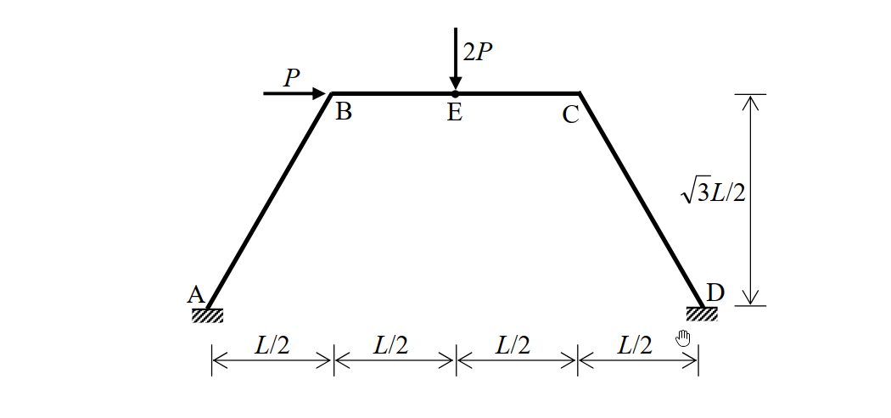

# 考題編號：SA-2010-3

**主分類：** `SA-U3-1` 傾角撓度法
**副分類：** `SA-U3-2` 具側移非正交剛架
**分析法：** 傾角撓度法 (Slope-Deflection Method)
**標籤：** `傾角撓度法`, `側移`, `非正交剛架`, `虛功法`, `剛架`

---

## 1. 原始題目重述 (Problem Restatement)

如圖所示之剛架，其支承點 A 與 D 均為固定端，同時每根構件之彈性模數與慣性矩乘積均為常數值 $EI$。當 B 點承受一水平載重 $P$ 且 E 點承受一垂直載重 $2P$ 時，請以傾角變位法（slope-deflection method）計算 A、B、C、D 各節點之彎矩。（若以其他方法計算不予計分）（25 分）

*(註：A(0,0)，D(2L,0)。B 與 C 之水平投影距離各為 L/2，構件高度為 $\sqrt{3}L/2$。E 為 BC 之中點)*

*圖說：剛架幾何條件為 A(0,0)，D(2L,0)。B 與 C 之水平投影距離各為 L/2，構件高度為 $\sqrt{3}L/2$。E 為 BC 之中點。A 與 D 為固定支承，所有桿件 EI 為常數。B 點承受向右水平載重 P，E 點承受向下垂直載重 2P。*

## 2. 考題核心精神與出題者意圖 (Core Concepts & Examiner's Intent)

本題為經典的**具側移非正交剛架 (Non-orthogonal Sway Frame)** 分析，指定使用傾角變位法。出題者的核心意圖在於：
1. **側移幾何關係 (Kinematics of Sway) 的掌握**：測試考生是否具備將整體單一側移 $\Delta$ 轉換為各非正交桿件弦切角（$\psi_{AB}, \psi_{BC}, \psi_{CD}$）的能力。在非正交剛架中，各桿的弦切角方向與大小極易出錯。
2. **剪力方程式推導 (Shear Equation)**：對於非正交剛架，傳統以自由體圖建立水平力平衡方程式非常複雜且易錯（牽涉到傾斜柱的軸力投影）。出題者希望考生能展現利用**虛功法 (Principle of Virtual Work)** 快速且正確建立額外剪力方程式的進階技巧。
3. **載重效應的疊加與解耦觀察**：幾何對稱結構承受對稱（垂直載重 $2P$）與反對稱（水平載重 $P$）的組合載重。能否看出節點旋轉主要受垂直載重影響，而側移主要受水平載重影響，是區分實力高低的關鍵。

## 3. 解題戰略地圖與陷阱分析 (Strategic Roadmap & Trap Analysis)

**解題戰略：**
1. **第一步：幾何分析與弦切角對應**：計算各桿件長度，並假設結構發生一微小獨立側移 $\Delta$。利用幾何關係（或瞬心法）求出各桿件之弦切角 $\psi$ 與單一側移參數 $R$ 的比例關係。
2. **第二步：固端彎矩與傾角變位方程式**：計算 BC 桿因中點載重 $2P$ 產生的固端彎矩。寫出所有桿端的傾角變位方程式。
3. **第三步：節點力矩平衡方程式**：利用節點 B、C 的力矩平衡（$\Sigma M_B = 0$, $\Sigma M_C = 0$）建立兩條包含 $\theta_B, \theta_C, R$ 的方程式。
4. **第四步：虛功法建立剪力方程式**：給予系統一虛擬位移 $\delta\Delta$ 及其對應之虛擬弦切角 $\delta\psi$。利用虛功方程式 $\sum P \delta\Delta + \sum (M_{ij}+M_{ji}) \delta\psi = 0$ 建立第三條聯立方程式。
5. **第五步：解聯立方程與端彎矩計算**：解出未知位移量，代回傾角變位方程式求得各節點彎矩。

**陷阱分析：**
- **陷阱 1：非正交桿件的弦切角方向與比例**。若直接假設各桿側移皆為 $\Delta$，將導致嚴重錯誤。必須以整體幾何變形圖分析各桿的相對端點垂直於桿軸方向的位移。特別是 BC 桿的弦切角方向（與 AB、CD 相反）最容易錯。
  → **策略**：畫出放大版的幾何變形圖，仔細確認水平與垂直方向的位移分量，或利用瞬心法檢驗。
- **陷阱 2：剪力方程式的推導方式**。若試圖切斷柱子畫自由體圖取水平平衡，因柱軸傾斜會牽涉到軸力，推導極為繁瑣且易算錯符號。
  → **策略**：果斷放棄靜力平衡推導，全面改用虛功方程式 $\sum P \delta\Delta + \sum (M_{ij}+M_{ji}) \delta\psi = 0$ 建立關係。
- **陷阱 3：固端彎矩的符號**。計算固端彎矩時，容易因載重向下而弄錯正負號。
  → **策略**：嚴格遵守傾角變位法的符號系統，順時針為正。左端（BC桿之B端）抵抗向下外力需逆時針（負），右端需順時針（正）。

## 3.5 變數層次分析 (Variable Hierarchy Analysis)

### 最終目標
計算 A、B、C、D 各節點之端彎矩 $M_{AB}, M_{BA}, M_{BC}, M_{CB}, M_{CD}, M_{DC}$。

### 本題關鍵公式（依計算順序）
- Step 1: 弦切角與側移關係 (Cord Rotation Kinematics)
  $$ \psi_{ij} = f(\Delta, \text{幾何}) $$
- Step 2: 固端彎矩 (Fixed-End Moments)
  $$ M^F_{ij} = \text{由外載重與桿長決定} $$
- Step 3: 傾角變位基本方程式 (Slope-Deflection Equations)
  $$ M_{ij} = 2k (2\theta_i + \theta_j - 3\boxed{\psi_{ij}}) + \boxed{M^F_{ij}} $$
- Step 4: 節點平衡方程式 (Joint Equilibrium)
  $$ \Sigma M_{\text{節點}} = \sum \boxed{M_{ij}} = 0 $$
- Step 5: 虛功方程式 (Virtual Work Equation for Sway)
  $$ \sum P \delta\Delta + \sum (\boxed{M_{ij}} + \boxed{M_{ji}}) \delta\boxed{\psi_{ij}} = 0 $$
- Step 6: 聯立求解與回代 (Solve and Back-substitute)
  $$ \text{求解 } \theta_B, \theta_C, R \text{，代回 } \boxed{M_{ij}} $$

### L1：題目直接給定
| 符號 | 數值 | 說明 |
|---|---|---|
| $L_{AB}, L_{CD}, L_{BC}$ | $L$ | 各桿件長度（由座標系統計算而得） |
| $EI$ | 常數 | 各桿件抗彎剛度 |
| $P_B$ | $P$ (向右) | B 點水平集中載重 |
| $P_E$ | $2P$ (向下) | BC 桿中點 E 之垂直集中載重 |
| $\theta_A, \theta_D$ | $0$ | A、D 為固定端，無旋轉位移 |

### L2：需知識點推導
**一、幾何與固端彎矩**
| 符號 | 公式／來源 | 卡關? |
|---|---|---|
| $k$ | $EI/L$ | |
| $\psi_{AB}, \psi_{CD}$ | $+R$ (順時針) | |
| $\psi_{BC}$ | $-R$ (逆時針) | |
| $M^F_{BC}$ | $-P_{E}L/8$ | |
| $M^F_{CB}$ | $+P_{E}L/8$ | |

**二、傾角變位方程式系統**
| 符號 | 公式／來源 | 卡關? |
|---|---|---|
| $M_{ij}$ | $2k(2\theta_i + \theta_j - 3\psi) + M^F_{ij}$ | |
| 節點平衡 | $\Sigma M_B = 0, \Sigma M_C = 0$ | |
| 剪力方程式 | $\sum P \delta\Delta + \sum (M_{ij}+M_{ji})\delta\psi = 0$ | |

### L3：深層知識（不懂就卡住）
| 知識點 | 說明 | 卡關? |
|---|---|---|
| 非正交剛架弦切角分析 | 必須考慮節點的水平與垂直位移分量，並投影至垂直桿軸方向以計算相對位移與弦切角。 | |
| 虛功法建立剪力方程式 | 利用 $\sum P \delta\Delta + \sum (M_{ij}+M_{ji})\delta\psi_{ij} = 0$ 避開複雜的靜力平衡分析。 | |
| 變形模式的對稱性觀察 | 對稱結構受反對稱載重（側移主導）與對稱載重（旋轉主導）組合，方程式解出後常有部分變數相消的現象。 | |

## 4. 步驟化詳細計算過程 (Step-by-Step Detailed Calculation)

### 步驟 1：幾何參數與弦切角 (Cord Rotations)
由座標幾何條件求桿件長度：
- 桿件 AB 長度 = $\sqrt{(L/2)^2 + (\sqrt{3}L/2)^2} = L$
- 桿件 CD 長度 = $\sqrt{(2L - 1.5L)^2 + (0 - \sqrt{3}L/2)^2} = L$
- 桿件 BC 長度 = $1.5L - 0.5L = L$
令各構件之相對勁度為 $k = EI/L$。

設結構整體發生一微小變形，使 B 點向右水平側移 $\Delta$（忽略桿件軸向變形）：
- **節點 B 變位**：水平向右 $\Delta_{Bx} = \Delta$。因為 AB 桿長不變，B 點軌跡垂直於 AB 桿軸。由幾何比例可得垂直位移 $\Delta_{By} = \Delta / \tan 60^\circ = \Delta / \sqrt{3}$ (向下)。
- **節點 C 變位**：同理，水平向右 $\Delta_{Cx} = \Delta$。垂直位移 $\Delta_{Cy} = \Delta / \sqrt{3}$ (向上)。

弦切角（定義順時針為正）：
- **AB 桿**：位移向量為 $(\Delta, -\Delta/\sqrt{3})$。將此位移投影至垂直於 AB 桿軸之方向，其相對位移為 $\Delta \sin 60^\circ + (\Delta/\sqrt{3}) \cos 60^\circ = \frac{\sqrt{3}}{2}\Delta + \frac{1}{2\sqrt{3}}\Delta = \frac{2}{\sqrt{3}}\Delta$。
  $$ \psi_{AB} = +\frac{2}{\sqrt{3}} \frac{\Delta}{L} = R $$
- **CD 桿**：因幾何對稱性，位移投影大小與方向相同，
  $$ \psi_{CD} = +\frac{2}{\sqrt{3}} \frac{\Delta}{L} = R $$
- **BC 桿**：C 點相對於 B 點的垂直位移為 $\Delta/\sqrt{3} - (-\Delta/\sqrt{3}) = \frac{2}{\sqrt{3}}\Delta$ (向上)。此位移剛好垂直於水平的 BC 桿軸，造成逆時針旋轉。
  $$ \psi_{BC} = -\frac{2}{\sqrt{3}} \frac{\Delta}{L} = -R $$

> **策略註解**：正確找出 $\psi_{AB} = \psi_{CD} = - \psi_{BC} = R$ 是本題最核心的門檻，建議務必畫出變形示意圖輔助判斷。

### 步驟 2：固端彎矩 (FEM) 與 傾角撓度方程式
- 構件 BC 承受中央集中載重 $2P$（向下）：
  $$ M_{BC}^F = -\frac{(2P)L}{8} = -\frac{PL}{4} $$
  $$ M_{CB}^F = +\frac{(2P)L}{8} = +\frac{PL}{4} $$
- A、D 為固定端，邊界條件：$\theta_A = 0, \theta_D = 0$。

傾角撓度基本方程式：
1. $M_{AB} = 2k (\theta_B - 3R)$
2. $M_{BA} = 2k (2\theta_B - 3R)$
3. $M_{BC} = 2k (2\theta_B + \theta_C + 3R) - \frac{PL}{4}$
4. $M_{CB} = 2k (2\theta_C + \theta_B + 3R) + \frac{PL}{4}$
5. $M_{CD} = 2k (2\theta_C - 3R)$
6. $M_{DC} = 2k (\theta_C - 3R)$

### 步驟 3：節點平衡方程式
- **節點 B 力矩平衡**：$\Sigma M_B = M_{BA} + M_{BC} = 0$
  $$ 2k(2\theta_B - 3R) + 2k(2\theta_B + \theta_C + 3R) - \frac{PL}{4} = 0 $$
  整理得：
  $$ 8\theta_B + 2\theta_C = \frac{PL}{4k} \quad \text{--- (式 1)} $$
- **節點 C 力矩平衡**：$\Sigma M_C = M_{CB} + M_{CD} = 0$
  $$ 2k(2\theta_C + \theta_B + 3R) + \frac{PL}{4} + 2k(2\theta_C - 3R) = 0 $$
  整理得：
  $$ 2\theta_B + 8\theta_C = -\frac{PL}{4k} \quad \text{--- (式 2)} $$

由 (式 1)、(式 2) 聯立可解得（側移參數 $R$ 剛好在平衡方程式中互相抵消，這是因垂直載重與結構對稱性之故）：
$$ \theta_B = \frac{PL}{24k}, \quad \theta_C = -\frac{PL}{24k} $$

### 步驟 4：剪力方程式 (以虛功法推導)
令系統產生一虛擬變形模式，其大小正比於前述側移，即 B 點虛擬水平側移量為 $\delta\Delta$，對應之各桿虛擬弦切角參數為 $\delta R$。
外力作功僅有水平力 $P$ 參與（因 E 點隨結構發生微小側移時，其垂直虛擬位移 $\delta\Delta_{Ey} = 0$）：
$$ \delta W_{ext} = \sum P_i \delta\Delta_i = P \times \delta\Delta = P \left( \frac{\sqrt{3}L}{2} \delta R \right) $$

依據傾角變位法中慣用的虛功方程式 $\sum P_i \delta\Delta_i + \sum (M_{ij} + M_{ji}) \delta\psi_{ij} = 0$：
$$ P \left( \frac{\sqrt{3}L}{2} \delta R \right) + (M_{AB} + M_{BA}) \delta\psi_{AB} + (M_{BC} + M_{CB}) \delta\psi_{BC} + (M_{CD} + M_{DC}) \delta\psi_{CD} = 0 $$
代入 $\delta\psi_{AB} = \delta R, \delta\psi_{CD} = \delta R, \delta\psi_{BC} = -\delta R$，並消去公因數 $\delta R$：
$$ P \frac{\sqrt{3}L}{2} + (M_{AB} + M_{BA}) - (M_{BC} + M_{CB}) + (M_{CD} + M_{DC}) = 0 $$
移項可得剪力方程式：
$$ M_{AB} + M_{BA} - M_{BC} - M_{CB} + M_{CD} + M_{DC} = - \frac{\sqrt{3}}{2} PL \quad \text{--- (式 3)} $$

將端彎矩代入 (式 3) 左邊展開：
- $M_{AB} + M_{BA} = 2k(3\theta_B - 6R)$
- $M_{BC} + M_{CB} = 2k(3\theta_B + 3\theta_C + 6R)$
- $M_{CD} + M_{DC} = 2k(3\theta_C - 6R)$

$$ \text{左式} = 2k \left[ 3\theta_B - 6R - 3\theta_B - 3\theta_C - 6R + 3\theta_C - 6R \right] = 2k(-18R) = -36kR $$
代入 (式 3)：
$$ -36kR = - \frac{\sqrt{3}}{2} PL \implies R = \frac{\sqrt{3} PL}{72k} $$

### 步驟 5：計算各端彎矩
將 $\theta_B, \theta_C, R$ 代回原方程式：
- $M_{AB} = 2k \left( \frac{PL}{24k} - \frac{3\sqrt{3}PL}{72k} \right) = \mathbf{\frac{1-\sqrt{3}}{12} PL}$
- $M_{BA} = 2k \left( \frac{2PL}{24k} - \frac{3\sqrt{3}PL}{72k} \right) = \mathbf{\frac{2-\sqrt{3}}{12} PL}$
- $M_{BC} = 2k \left( \frac{2PL}{24k} - \frac{PL}{24k} + \frac{3\sqrt{3}PL}{72k} \right) - \frac{PL}{4} = \mathbf{\frac{-2+\sqrt{3}}{12} PL}$
- $M_{CB} = 2k \left( -\frac{2PL}{24k} + \frac{PL}{24k} + \frac{3\sqrt{3}PL}{72k} \right) + \frac{PL}{4} = \mathbf{\frac{2+\sqrt{3}}{12} PL}$
- $M_{CD} = 2k \left( -\frac{2PL}{24k} - \frac{3\sqrt{3}PL}{72k} \right) = \mathbf{\frac{-2-\sqrt{3}}{12} PL}$
- $M_{DC} = 2k \left( -\frac{PL}{24k} - \frac{3\sqrt{3}PL}{72k} \right) = \mathbf{\frac{-1-\sqrt{3}}{12} PL}$

## 5. 關鍵爭議點與進階探討 (Critical Issues & Advanced Discussion)

- **虛功法符號約定**：在傾角變位法中，端彎矩順時針為正、弦切角順時針為正。推導剪力方程式時，最安全的方法是使用虛功方程式 $\sum P \delta\Delta + \sum (M_{ij} + M_{ji}) \delta\psi_{ij} = 0$。若正負號定義混淆，將導致側移參數 $R$ 方向錯誤，進而影響所有端彎矩的計算結果。
- **對稱性解耦**：本題中，由節點平衡方程式可發現，側移參數 $R$ 剛好互相抵消，使得 $\theta_B, \theta_C$ 可直接解出。這是因為結構對稱，且垂直載重 $2P$ 為對稱載重。水平載重 $P$ 為反對稱載重，主要貢獻在側移 $R$ 上。若能在考場上敏銳觀察出這類對稱與反對稱載重疊加的獨立特性，可大幅提昇驗算與防錯能力。
