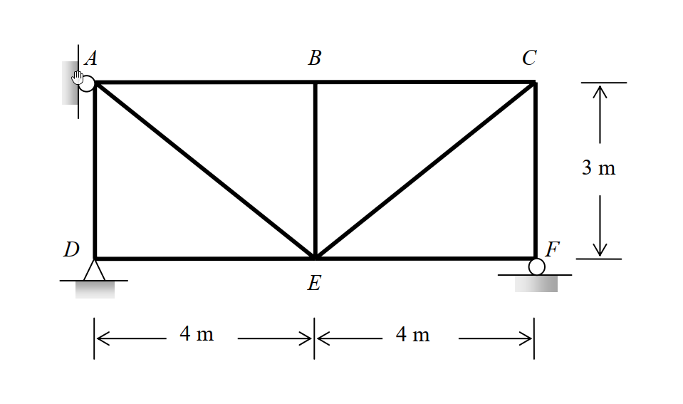

# 考題編號：SA-2011-1

**主分類：** `SA-U2-2` 靜不定結構分析
**副分類：** `SA-U2-3`
**分析法：** 柔度法 / 虛功法 (Method of Consistent Deformations / Virtual Work Method)
**標籤：** `靜不定桁架` `溫度變化` `製造誤差` `支承位移`

---

## 1. 原始題目重述 (Problem Restatement)

如圖所示之桁架結構，假設 AB 及 BE 桿件溫度增加 $60^\circ\text{C}$，DE 及 EF 桿件施作時分別短了 $1.5\text{ cm}$ 及 $1.0\text{ cm}$，支承 A 被建造於原定位置的左方 $2.4\text{ cm}$，且支承 F 低於原既定位置 $1.2\text{ cm}$。已知溫度膨脹係數 $\alpha = 1.08 \times 10^{-5} / ^\circ\text{C}$，假設各桿件之彈性模數 $E$ 值與斷面積 $A$ 值皆為常數，且 $EA = 8 \times 10^4\text{ kN}$。試計算各支承之反力。(25 分)

*圖說：靜不定桁架，D點為鉸支承，F點為滾支承，A點原本有水平束制，各桿件長度可由座標推算*

## 2. 考題核心精神與出題者意圖 (Core Concepts & Examiner's Intent)

本題為經典的**一次靜不定桁架綜合題**，測驗考生處理「多重非載重變形」（溫度應變、製造誤差、支承位移）的整合能力。出題者的核心意圖包含：
1. **柔度法（相容變形法）與虛功原理的熟練度**：在無外力作用下，如何運用多餘力作為贅力，寫出位移諧合方程式。
2. **虛功方程式的正負號嚴格判定**：尤其是支承位移作功時，虛反力方向與實際位移方向的內積。
3. **零桿 (Zero-force members) 的辨識與應用**：在虛力系統中快速找出零桿以減少運算量。

## 3. 解題戰略地圖與陷阱分析 (Strategic Roadmap & Trap Analysis)

**戰略地圖：**
1. **判定靜不定度**：計算得知本題為一次靜不定桁架。
2. **選擇基本靜定結構**：移除 A 點之水平拘束，以 A 點水平反力 $A_x$ 作為贅力 $X$。
3. **建立虛力系統**：於 A 點施加向右之單位力 $X=1$，求解所有虛反力與虛內力 $u_i$。
4. **計算各桿實際初始變形量**：將溫度變化、製造誤差轉化為 $\Delta L_{0i}$，同時確認支承位移 $\Delta$ 的實際方向。
5. **代入虛功方程式**：利用 $\sum W_{\text{ext}} = \sum W_{\text{int}}$，求解 $X$ 後代回求所有支承反力。

**陷阱分析：**
- ⚠ **陷阱 1：支承沉陷的虛功正負號**
  - **策略**：當 $X=1$ (向右) 施加於 A 點時，F 點的虛反力為**向上**；而真實支承 F 是**向下**沉陷，故外部虛功 $W_{\text{ext}}$ 必須是負值。這是最容易出錯的地方！
- ⚠ **陷阱 2：零桿的干擾（煙霧彈）**
  - **策略**：在 $X=1$ 的系統中，BE 桿與 EF 桿的虛內力 $u_i=0$。因此這兩根桿件的溫度變化或製造誤差**不會**對虛功方程式產生任何貢獻。考官給出 BE 與 EF 的數據是為了測試考生是否盲目計算。
- ⚠ **陷阱 3：單位的統一性**
  - **策略**：題目給的 $EA$ 單位為 $\text{kN}$，變形量與製造誤差有 $\text{cm}$ 也有 $\text{m}$。強烈建議在代入虛功方程式前，全面統一為 $\text{kN}$ 與 $\text{m}$ 系統。

## 3.5 變數層次分析 (Variable Hierarchy Analysis)

### 最終目標
`求出桁架各支承之真實反力（考慮溫度變化、製造誤差及支承位移）。`

### 本題關鍵公式（依計算順序）
1. 虛功方程式：$\sum W_{\text{ext}} = \sum W_{\text{int}}$
   $$1 \cdot \Delta_A + F_{uy} \cdot \Delta_{Fy} = \sum u_i (\Delta L_{0i}) + \sum \frac{u_i^2 L_i}{EA} \cdot X$$
2. 初始變形量（溫度與誤差）：
   $$\Delta L_{0i} = \alpha \cdot \Delta T \cdot L_i + \Delta_{\text{error}}$$
3. 真實反力計算：
   $$R_i = r_i \cdot \boxed{X}$$

### L1：題目直接給定
- **符號 ∣ 數值 ∣ 說明**
- $\alpha$ ∣ $1.08 \times 10^{-5} / ^\circ\text{C}$ ∣ 溫度膨脹係數
- $EA$ ∣ $8 \times 10^4\text{ kN}$ ∣ 桿件軸向剛度
- $\Delta T$ ∣ $+60^\circ\text{C}$ ∣ AB 及 BE 桿溫度變化
- $\Delta_{\text{error}, DE}$ ∣ $-1.5\text{ cm}$ ∣ DE 桿施作誤差短少
- $\Delta_{\text{error}, EF}$ ∣ $-1.0\text{ cm}$ ∣ EF 桿施作誤差短少
- $\Delta_{Ax}$ ∣ $-2.4\text{ cm}$ ∣ A 點支承位移（向左，若向右為正）
- $\Delta_{Fy}$ ∣ $-1.2\text{ cm}$ ∣ F 點支承位移（向下，若向上為正）

### L2：需知識點推導
**虛力系統分析**
- **符號 ∣ 公式／來源 ∣ 卡關?**
- $u_i$ ∣ $\sum F_x=0, \sum F_y=0$ (節點法) ∣ 
- $F_{uy}$ ∣ $\sum M=0$ (整體平衡) ∣ 

**變形量與虛功計算**
- **符號 ∣ 公式／來源 ∣ 卡關?**
- $\Delta L_{0i}$ ∣ $\alpha \Delta T L_i + \Delta_{\text{error}}$ ∣ 
- $f_{11}$ ∣ $\sum \frac{u_i^2 L_i}{EA}$ ∣ 
- $W_{\text{ext}}$ ∣ $1 \cdot \Delta_{Ax} + F_{uy} \cdot \Delta_{Fy}$ ∣ 

### L3：深層知識（不懂就卡住）
- **知識點 ∣ 說明 ∣ 卡關?**
- 零桿判定 ∣ 虛力系統中 $u_i=0$ 的桿件，其初始變形對虛功方程式無貢獻 ∣ 
- 外部虛功正負號 ∣ 虛反力與真實位移方向相反時，功為負值 ∣ 

## 4. 步驟化詳細計算過程 (Step-by-Step Detailed Calculation)

### Step 1：定義基本靜定結構與虛力系統
> **策略註解**：選擇 A 點水平拘束作為贅力 $X$（假設向右為正），移除該拘束後結構變為靜定，此為「基本靜定結構」。接著施加虛力 $X=1$ 於 A 點（向右）。

- **虛反力求取**：
  - 取 D 點力矩平衡：$\sum M_D = 1 \times 3\text{ (順時針)} - F_{uy} \times 8\text{ (逆時針)} = 0 \Rightarrow F_{uy} = \frac{3}{8}$ (向上)
  - 垂直平衡：$\sum F_y = 0 \Rightarrow D_{uy} + F_{uy} = 0 \Rightarrow D_{uy} = -\frac{3}{8}$ (向下)
  - 水平平衡：$\sum F_x = 0 \Rightarrow 1 + D_{ux} = 0 \Rightarrow D_{ux} = -1$ (向左)

- **虛內力 $u_i$ 求取** (利用節點法)：
  - **節點 F**：$\sum F_x = 0 \Rightarrow u_{EF} = 0$；$\sum F_y = 0 \Rightarrow u_{CF} + \frac{3}{8} = 0 \Rightarrow u_{CF} = -\frac{3}{8}$。
  - **節點 C**：$\sum F_y = 0 \Rightarrow -u_{CF} - u_{CE}(\frac{3}{5}) = 0 \Rightarrow u_{CE} = \frac{3/8}{3/5} = \frac{5}{8}$；$\sum F_x = 0 \Rightarrow -u_{BC} - u_{CE}(\frac{4}{5}) = 0 \Rightarrow u_{BC} = -\frac{1}{2}$。
  - **節點 B**：$\sum F_y = 0 \Rightarrow u_{BE} = 0$；$\sum F_x = 0 \Rightarrow -u_{AB} + u_{BC} = 0 \Rightarrow u_{AB} = -\frac{1}{2}$。
  - **節點 A**：$\sum F_x = 0 \Rightarrow 1 + u_{AB} + u_{AE}(\frac{4}{5}) = 0 \Rightarrow 0.5 + 0.8 u_{AE} = 0 \Rightarrow u_{AE} = -\frac{5}{8}$；$\sum F_y = 0 \Rightarrow -u_{AD} - u_{AE}(\frac{3}{5}) = 0 \Rightarrow u_{AD} = \frac{3}{8}$。
  - **節點 D**：$\sum F_x = 0 \Rightarrow -1 + u_{DE} = 0 \Rightarrow u_{DE} = 1$。

### Step 2：計算初始實際變形量 $\Delta L_{0i}$ 與外部位移
> **策略註解**：統一將長度單位轉換為公尺 (m) 以便與 $EA$ 單位對齊。

- **溫度變化**：
  - $\Delta L_{0, AB} = \alpha \cdot \Delta T \cdot L_{AB} = (1.08 \times 10^{-5}) \times 60 \times 4 = 0.002592\text{ m}$
  - $\Delta L_{0, BE} = \alpha \cdot \Delta T \cdot L_{BE} = (1.08 \times 10^{-5}) \times 60 \times 3 = 0.001944\text{ m}$
- **製造誤差**：
  - $\Delta L_{0, DE} = -1.5\text{ cm} = -0.015\text{ m}$
  - $\Delta L_{0, EF} = -1.0\text{ cm} = -0.010\text{ m}$
- **已知支承位移**：
  - A 向左建 $2.4\text{ cm}$：$\Delta A_x = -0.024\text{ m}$
  - F 沉陷 $1.2\text{ cm}$：$\Delta F_y = -0.012\text{ m}$
  - D 為固定基準：$\Delta D_x = 0, \Delta D_y = 0$

### Step 3：應用虛功方程式
虛功方程式：$\sum W_{\text{ext}} = \sum W_{\text{int}}$
$$ \sum (P_{\text{virt}} \cdot \Delta_{\text{real}}) = \sum u_i \Delta L_{\text{real}} = \sum u_i \left( \Delta L_{0i} + \frac{u_i X L_i}{EA} \right) $$

**1. 計算外部虛功 $W_{\text{ext}}$**：
$W_{\text{ext}} = 1 \cdot (\Delta A_x) + F_{uy} \cdot (\Delta F_y) = 1 \cdot (-0.024) + \left(\frac{3}{8}\right) \cdot (-0.012) = -0.024 - 0.0045 = -0.0285\text{ m}$

**2. 計算內部虛功的初始變形部分 $\sum u_i \Delta L_{0i}$**：
- AB 桿：$(-0.5) \times 0.002592 = -0.001296\text{ m}$
- DE 桿：$(1.0) \times (-0.015) = -0.015\text{ m}$
- BE 與 EF 桿因 $u_i = 0$，無虛功貢獻。
總和：$-0.001296 - 0.015 = -0.016296\text{ m}$

**3. 計算柔度係數 $f_{11}$** ($f_{11} = \sum \frac{u_i^2 L_i}{EA}$)：
$EA \cdot f_{11} = (-0.5)^2(4) + (-0.5)^2(4) + (1)^2(4) + (0)^2(4) + (0.375)^2(3) + (0)^2(3) + (-0.375)^2(3) + (-0.625)^2(5) + (0.625)^2(5)$
$EA \cdot f_{11} = 1 + 1 + 4 + 0 + \frac{27}{64} + 0 + \frac{27}{64} + \frac{125}{64} + \frac{125}{64} = 6 + \frac{304}{64} = 10.75\text{ m}$
$f_{11} = \frac{10.75}{80000} = 0.000134375\text{ m/kN}$

**4. 求解贅力 $X$**：
$-0.0285 = -0.016296 + 0.000134375 \cdot X$
$0.000134375 \cdot X = -0.0285 + 0.016296 = -0.012204$
$X = \frac{-0.012204}{0.000134375} = -90.82\text{ kN}$
這表示 A 點的真實水平反力為 $90.82\text{ kN}$，方向向左。

### Step 4：求解所有真實支承反力
將贅力 $\boxed{X = -90.82\text{ kN}}$ 代回基本靜定結構的反力公式：
- **A 點水平反力**：$A_x = X = \boxed{-90.82\text{ kN}} \text{ (向左)}$
- **F 點垂直反力**：$F_y = \frac{3}{8} X = \frac{3}{8} (-90.82) = \boxed{-34.06\text{ kN}} \text{ (向下)}$
- **D 點水平反力**：$D_x = -X = -(-90.82) = \boxed{90.82\text{ kN}} \text{ (向右)}$
- **D 點垂直反力**：$D_y = -\frac{3}{8} X = \boxed{34.06\text{ kN}} \text{ (向上)}$

*(靜力平衡驗算：$\sum F_x = -90.82 + 90.82 = 0$；$\sum F_y = 34.06 - 34.06 = 0$；$\sum M_D = A_x(3) + F_y(8) = (-90.82)(3) + (-34.0575)(8) = -272.46 + 272.46 = 0$，完全吻合！)*

## 5. 關鍵爭議點與進階探討 (Critical Issues & Advanced Discussion)

- **無載重變形的零桿影響**：在虛力系統分析時，有些桿件的虛內力為 0。當考題中這類桿件發生溫度變化或製造誤差時，它們的變形在結構整體的相容變位方程式中不作功，對贅力沒有貢獻。考生常在此處懷疑自己是否算錯。遇到這類干擾資訊，必須相信力學原理：**不承載虛力的桿件，其自發變形對該多餘束制沒有影響**。
- **支承位移與虛反力方向**：在計算外部虛功 $W_{\text{ext}}$ 時，必須嚴格遵守 $P_{\text{virt}} \cdot \Delta_{\text{real}}$ 的內積關係。許多考生習慣只看數值，導致正負號錯亂。建議在圖上明確標出 $P_{\text{virt}}$ 向量與 $\Delta_{\text{real}}$ 向量，若同向則為正功，反向為負功，以此作為最終防線。
