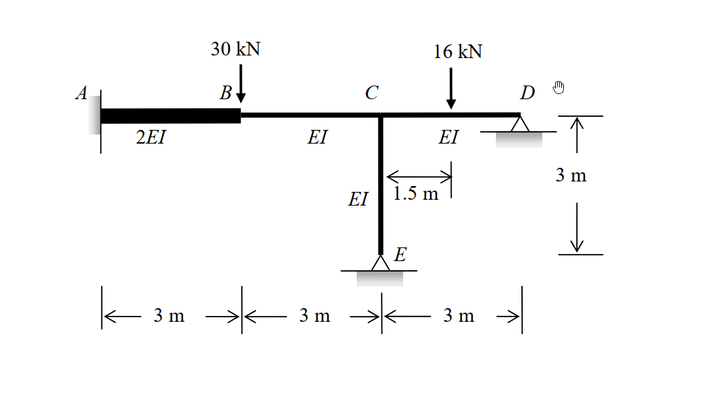

# 考題編號：SA-2011-2

**主分類：** `SA-U3-1` 傾角變位法
**副分類：** `SA-U3-2` 剛架分析 (有側位移)
**分析法：** 傾角變位法 (Slope-Deflection Method)
**標籤：** `傾角變位法`, `有側移剛架`, `修正固端彎矩`, `剪力平衡`

---

## 1. 原始題目重述 (Problem Restatement)

如圖所示之剛架，支承 A 為固定端 (fixed)、D 與 E 為鉸接。各桿件之彈性模數與慣性矩乘積 ($EI$) 如圖所示，且 $EI = 10000\text{ kN-m}^2$。當 B 點承受一 $30\text{ kN}$ 垂直載重，CD 桿件之中點亦承受一 $16\text{ kN}$ 之垂直載重作用時，試以**傾角變位法**計算各端點彎矩，並繪出彎矩圖。(若以其他方法計算不予計分) (25 分)

- **桿件長度與勁度：**
  - AB 桿：$L = 3\text{ m}, EI_{AB} = 2EI$
  - BC 桿：$L = 3\text{ m}, EI_{BC} = EI$
  - CD 桿：$L = 3\text{ m}, EI_{CD} = EI$
  - CE 桿：$L = 3\text{ m}, EI_{CE} = EI$

*圖說：結構幾何與載重示意圖。A(固定)、B(無支承)、C(無支承但與D, E連接)、D(鉸接)、E(鉸接)。AB、BC、CD、CE 桿長均為 3m。B點受 30kN 垂直向下力，CD中點受 16kN 垂直向下力。*

## 2. 考題核心精神與出題者意圖 (Core Concepts & Examiner's Intent)

本題測驗考生使用**傾角變位法**分析具局部變位剛架的標準作業流程。出題者刻意設計了幾個關鍵考點：
1. **獨立自由度 (DOFs) 的判別與弦旋轉處理**：這是一個有節點下陷 (B點) 的剛架。因為 A 點為固定端，C 點受 D、E 支撐且忽略軸向變形下垂直位移為 0，但 B 點位於懸空處，受力會產生垂直變位 $\Delta$。因此必須將 B 點視為獨立節點，自由度包含 $\theta_B, \theta_C, \Delta$。
2. **修正傾角變位方程式的應用**：端點 D 與 E 為鉸支承，應使用「遠端鉸接」的修正公式來減少未知數（即消除 $\theta_D$ 與 $\theta_E$）。
3. **固端彎矩 (FEM) 的修正計算**：CD 桿件上有中央集中載重，需正確計算雙端固定的 FEM 後，再疊加遠端鉸接的修正彎矩。
4. **剪力平衡方程式的建立**：由於有未知的弦側移 $\Delta$（B點下陷），除了節點 B、C 的彎矩平衡外，必須切出 B 點建立垂直方向的剪力平衡方程式。

## 3. 解題戰略地圖與陷阱分析 (Strategic Roadmap & Trap Analysis)

**解題策略：**
1. **定義未知數與自由度**：定義節點 B、C 的旋轉角 $\theta_B, \theta_C$ (設順時針為正)，以及節點 B 的垂直下陷量 $\Delta$ (設向下為正)。為了簡化運算，可令 $x = EI\theta_B$、$y = EI\theta_C$、$z = EI\Delta$。
2. **計算各桿件之弦旋轉角 (Chord Rotation, $\psi$)**：
   - AB 桿：右端 B 下陷 $\Delta$ $\Rightarrow \psi_{AB} = \Delta / 3$ (順時針，正)。
   - BC 桿：左端 B 下陷 $\Delta$，右端 C 不動 (相對而言右端較高) $\Rightarrow \psi_{BC} = -\Delta / 3$ (逆時針，負)。
   - CD 與 CE 桿：無相對側移 $\Rightarrow \psi_{CD} = \psi_{CE} = 0$。
3. **計算修正固端彎矩 (FEM)**：計算 CD 桿受集中載重，且右端為鉸支承時的修正固端彎矩 $FEM_C^{mod}$。
4. **寫出傾角變位方程式**：對各端點彎矩列式，CD 與 CE 桿須帶入「遠端鉸接」之修正公式。
5. **建立平衡方程式並求解**：
   - 節點 B 彎矩平衡：$\sum M_B = 0$
   - 節點 C 彎矩平衡：$\sum M_C = 0$
   - 節點 B 垂直剪力平衡：$\sum F_{y,B} = 0$
6. **回代求端彎矩**：將解得之參數代回傾角變位方程式。

**陷阱分析：**
- **陷阱 1：忽略 B 點垂直變位**。將 ABC 視為無側移梁將導致完全錯誤的結果，必須體認 B 點無垂直支撐。應對策略：畫變形圖確認各節點的位移自由度。
- **陷阱 2：剪力平衡方程式的符號**。由傾角變位法得出的桿端彎矩轉換為剪力時極易錯置正負號。應對策略：嚴格畫出 B 點自由體圖，標示彎矩與剪力方向再列式。
- **陷阱 3：CD 桿修正固端彎矩錯誤**。CD 桿右端 D 為鉸支承，其修正後的固端彎矩為 $M_{CD}^{FEM} = -\frac{3PL}{16}$，而非 $-\frac{PL}{8}$。

## 3.5 變數層次分析 (Variable Hierarchy Analysis)

> 複習提示：第一次解題後，在每個卡住的知識點旁標記 `⚠`；第二次複習時只看有 `⚠` 的項目。

### 最終目標
`計算並求出剛架各桿端的最終彎矩，並據此繪製彎矩圖。`

### 本題關鍵公式（依計算順序）
- 修正固端彎矩 (遠端鉸接)：
  $$FEM_C^{mod} = FEM_{CD} - \frac{1}{2}FEM_{DC}$$
- 傾角變位方程式 (遠端固定)：
  $$M_{ij} = \frac{2EI}{L}(2\theta_i + \theta_j - 3\psi) + FEM_{ij}$$
- 修正傾角變位方程式 (遠端鉸接)：
  $$M_{ij} = \frac{3EI}{L}(\theta_i - \psi) + \boxed{FEM_i^{mod}}$$
- 剪力與彎矩關係 (無側向載重桿件)：
  $$V_{ij} = \frac{\boxed{M_{ij}} + \boxed{M_{ji}}}{L}$$
- 節點平衡與剪力平衡方程式：
  $$\sum M_B = \boxed{M_{BA}} + \boxed{M_{BC}} = 0$$
  $$\sum M_C = \boxed{M_{CB}} + \boxed{M_{CD}} + \boxed{M_{CE}} = 0$$
  $$\sum F_{y,B} = \boxed{V_{BC}} - \boxed{V_{AB}} - P_B = 0$$

### L1：題目直接給定
| 符號 | 數值 | 說明 |
|---|---|---|
| $L_{AB}, L_{BC}, L_{CD}, L_{CE}$ | $3\text{ m}$ | 各桿件長度 |
| $EI_{AB}$ | $2EI$ | AB 桿件彎曲勁度 |
| $EI_{BC}, EI_{CD}, EI_{CE}$ | $EI$ | 其他桿件彎曲勁度 |
| $P_B$ | $30\text{ kN}$ | B點垂直載重 |
| $P_{CD}$ | $16\text{ kN}$ | CD桿中點垂直載重 |

### L2：需知識點推導
**1. 幾何變形參數**
| 符號 | 公式／來源 | 卡關? |
|---|---|---|
| $\psi_{AB}$ | $\Delta / 3$ (順時針) | |
| $\psi_{BC}$ | $-\Delta / 3$ (逆時針) | |
| $\psi_{CD}, \psi_{CE}$ | $0$ (無相對位移) | |

**2. 固端彎矩**
| 符號 | 公式／來源 | 卡關? |
|---|---|---|
| $FEM_{CD}$ | $-PL/8 = -16 \times 3 / 8 = -6$ | |
| $FEM_{DC}$ | $+PL/8 = +16 \times 3 / 8 = +6$ | |
| $FEM_C^{mod}$ | $FEM_{CD} - 0.5 FEM_{DC}$ | |

**3. 平衡方程式轉換**
| 符號 | 公式／來源 | 卡關? |
|---|---|---|
| $V_{AB}$ | $(M_{AB} + M_{BA}) / 3$ | |
| $V_{BC}$ | $(M_{BC} + M_{CB}) / 3$ | |

### L3：深層知識（不懂就卡住）
| 知識點 | 說明 | 卡關? |
|---|---|---|
| 自由度判斷 | B 點懸空且無垂直支撐，受載重後必然產生垂直變位 $\Delta$，不可當作無側移處理。 | |
| 弦旋轉角符號約定 | 順時針為正。B 點下陷時，AB 桿發生順時針旋轉 ($\Delta/L$)，BC 桿發生逆時針旋轉 ($-\Delta/L$)。 | |
| 剪力平衡 | 在 B 點切開，AB 桿與 BC 桿皆對 B 點施加剪力以抵抗向下 $30\text{ kN}$ 外力。 | |

## 4. 步驟化詳細計算過程 (Step-by-Step Detailed Calculation)

> 📊 互動圖（如有）：`SA-2011-2-sfd-bmd-viz.html`

### Step 1：定義未知數與參數
- 未知自由度：$\theta_B, \theta_C$ (順時針為正)，以及 B 點向下位移 $\Delta$ (向下為正)。
- 為了簡化運算，令 $x = EI\theta_B$、$y = EI\theta_C$、$z = EI\Delta$。

### Step 2：計算修正固端彎矩 (FEM)
CD 桿中點承受 $P=16\text{ kN}$：
- 雙端固定時：
  $$FEM_{CD} = -\frac{PL}{8} = -6\text{ kN-m}$$
  $$FEM_{DC} = +\frac{PL}{8} = +6\text{ kN-m}$$
- 因 D 端為鉸支承，釋放 D 端彎矩並分配一半至 C 端：
  $$FEM_C^{mod} = FEM_{CD} - \frac{1}{2}FEM_{DC} = -6 - \frac{1}{2}(+6) = -9\text{ kN-m}$$

### Step 3：建立傾角變位方程式
> **策略註解**：注意 AB 桿的 EI 兩倍於其他桿件，且各桿之弦旋轉角 $\psi$ 不同。此處彎矩規定順時針為正。

**1. AB 桿 ($L=3, \text{剛度}=2EI$)**
- $\psi_{AB} = \frac{\Delta}{3}$
- $M_{AB} = \frac{2(2EI)}{3} \left[ 2(0) + \theta_B - 3\left(\frac{\Delta}{3}\right) \right] = \frac{4}{3}EI\theta_B - \frac{4}{3}EI\Delta = \frac{4}{3}x - \frac{4}{3}z$
- $M_{BA} = \frac{2(2EI)}{3} \left[ 2\theta_B + 0 - 3\left(\frac{\Delta}{3}\right) \right] = \frac{8}{3}EI\theta_B - \frac{4}{3}EI\Delta = \frac{8}{3}x - \frac{4}{3}z$

**2. BC 桿 ($L=3, \text{剛度}=EI$)**
- $\psi_{BC} = \frac{-\Delta}{3}$
- $M_{BC} = \frac{2EI}{3} \left[ 2\theta_B + \theta_C - 3\left(-\frac{\Delta}{3}\right) \right] = \frac{4}{3}x + \frac{2}{3}y + \frac{2}{3}z$
- $M_{CB} = \frac{2EI}{3} \left[ 2\theta_C + \theta_B - 3\left(-\frac{\Delta}{3}\right) \right] = \frac{2}{3}x + \frac{4}{3}y + \frac{2}{3}z$

**3. CD 桿 ($L=3, \text{剛度}=EI$, D為鉸接)**
- 使用修正公式：
  $$M_{CD} = \frac{3EI}{3}(\theta_C - 0) + FEM_C^{mod} = y - 9$$

**4. CE 桿 ($L=3, \text{剛度}=EI$, E為鉸接)**
- 使用修正公式：
  $$M_{CE} = \frac{3EI}{3}(\theta_C - 0) + 0 = y$$

### Step 4：建立並求解平衡方程式

**方程式 (1)：節點 B 彎矩平衡**
$$\sum M_B = M_{BA} + M_{BC} = 0$$
$$\left( \frac{8}{3}x - \frac{4}{3}z \right) + \left( \frac{4}{3}x + \frac{2}{3}y + \frac{2}{3}z \right) = 0 \Rightarrow 4x + \frac{2}{3}y - \frac{2}{3}z = 0$$
同乘 3 $\Rightarrow \mathbf{12x + 2y - 2z = 0 \quad \cdots (1)}$

**方程式 (2)：節點 C 彎矩平衡**
$$\sum M_C = M_{CB} + M_{CD} + M_{CE} = 0$$
$$\left( \frac{2}{3}x + \frac{4}{3}y + \frac{2}{3}z \right) + (y - 9) + (y) = 0$$
$$\frac{2}{3}x + \frac{10}{3}y + \frac{2}{3}z = 9 \Rightarrow \mathbf{2x + 10y + 2z = 27 \quad \cdots (2)}$$

**方程式 (3)：節點 B 垂直剪力平衡**
取節點 B 為自由體，向上為正：
- AB 桿作用於 B 點之剪力 (向下)：$V_{AB} = \frac{M_{AB} + M_{BA}}{3}$
- BC 桿作用於 B 點之剪力 (向上)：$V_{BC} = \frac{M_{BC} + M_{CB}}{3}$
- 外力：$30\text{ kN}$ 向下
$$\sum F_y = V_{BC} - V_{AB} - 30 = 0 \Rightarrow \frac{M_{BC} + M_{CB}}{3} - \frac{M_{AB} + M_{BA}}{3} = 30$$
同乘 3 整理得：
$$-M_{AB} - M_{BA} + M_{BC} + M_{CB} = 90$$
代入彎矩展開式：
$$-\left( \frac{12}{3}x - \frac{8}{3}z \right) + \left( \frac{6}{3}x + \frac{6}{3}y + \frac{4}{3}z \right) = 90$$
$$-2x + 2y + 4z = 90 \Rightarrow \mathbf{-x + y + 2z = 45 \quad \cdots (3)}$$

> **策略註解**：利用代入消去法解聯立方程式 (1)、(2)、(3)。由 (1) 式可得 $z = 6x + y$。

**解聯立方程式：**
由 (1) 式得 $z = 6x + y$，代入 (2)、(3) 式：
- $2x + 10y + 2(6x + y) = 27 \Rightarrow 14x + 12y = 27$
- $-x + y + 2(6x + y) = 45 \Rightarrow 11x + 3y = 45 \Rightarrow 3y = 45 - 11x \Rightarrow y = 15 - \frac{11}{3}x$

代回 $14x + 12y = 27$：
$$14x + 12\left( 15 - \frac{11}{3}x \right) = 27 \Rightarrow 14x + 180 - 44x = 27 \Rightarrow -30x = -153$$
解得：
- $x = 5.1$ ($EI\theta_B = 5.1$)
- $y = 15 - \frac{11}{3}(5.1) = -3.7$ ($EI\theta_C = -3.7$)
- $z = 6(5.1) + (-3.7) = 26.9$ ($EI\Delta = 26.9$)

### Step 5：計算各端點彎矩
將 $x, y, z$ 代回 Step 3 之方程式：
- $M_{AB} = \frac{4}{3}(5.1) - \frac{4}{3}(26.9) = 6.8 - 35.87 = \boxed{-29.07\text{ kN-m}}$ (逆時針)
- $M_{BA} = \frac{8}{3}(5.1) - \frac{4}{3}(26.9) = 13.6 - 35.87 = \boxed{-22.27\text{ kN-m}}$ (逆時針)
- $M_{BC} = \frac{4}{3}(5.1) + \frac{2}{3}(-3.7) + \frac{2}{3}(26.9) = 6.8 - 2.47 + 17.93 = \boxed{22.27\text{ kN-m}}$ (順時針)
- $M_{CB} = \frac{2}{3}(5.1) + \frac{4}{3}(-3.7) + \frac{2}{3}(26.9) = 3.4 - 4.93 + 17.93 = \boxed{16.40\text{ kN-m}}$ (順時針)
- $M_{CD} = -3.7 - 9 = \boxed{-12.70\text{ kN-m}}$ (逆時針)
- $M_{CE} = \boxed{-3.70\text{ kN-m}}$ (逆時針)
- $M_{DC} = \boxed{0\text{ kN-m}}$ (鉸支承)
- $M_{EC} = \boxed{0\text{ kN-m}}$ (鉸支承)

*(平衡驗算：$M_{BA}+M_{BC} = -22.27+22.27=0$；$M_{CB}+M_{CD}+M_{CE} = 16.40-12.70-3.70=0$。計算無誤！)*

## 5. 關鍵爭議點與進階探討 (Critical Issues & Advanced Discussion)

- **剪力平衡式的正負號爭議**：
  在建立節點 B 的垂直剪力平衡方程式時，很多考生容易將桿端彎矩與剪力的關係式正負號寫錯。
  最安全的應對方法是：在旁邊繪製 B 點的自由體圖，明確畫出 $\sum F_y = 0$ 的箭頭方向，然後利用桿件自由體圖 $\sum M = 0$ 來確認剪力 $V = (M_L + M_R)/L$ 的推導（注意此處 $M$ 的符號是依照傾角變位法的「順時針為正」）。
- **「無側移」的認知誤區**：
  許多考生看到「剛架」且沒有水平外力時，會預設為無側移剛架。然而，本題的 B 點由於缺乏垂直向下的支撐力，受到 $30\text{ kN}$ 的重力作用必然會下陷，這在傾角變位法中等同於「弦旋轉」(Chord Rotation) 或側移。因此，是否「無側移」不應只看水平方向，只要有關節點在載重作用下能產生未知位移，就必須引入對應的弦旋轉角與力平衡方程式。
- **固端彎矩的分配與修正**：
  在計算 CD 桿的 FEM 時，可以直接背誦單端固定、單端鉸接的固端彎矩公式 ($-\frac{3PL}{16}$)，但如果不熟練，利用「雙端固定公式再疊加一半釋放彎矩」的推導方法 ($FEM_C^{mod} = FEM_{CD} - 0.5 FEM_{DC}$) 是考場上最不容易出錯的策略。
