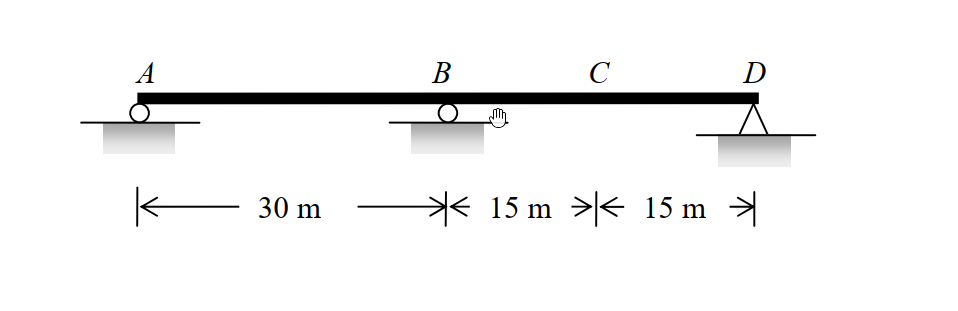

# 考題編號：SA-2011-3

**主分類：** `SA-U5-1` 影響線分析
**副分類：** `SA-U5-2` 靜不定結構影響線
**分析法：** 穆勒法 (Müller-Breslau Principle) / 積分法
**標籤：** `穆勒法`, `連續梁`, `影響線`, `最大彎矩`

---

## 1. 原始題目重述 (Problem Restatement)

如圖所示為一兩跨連續梁結構，AB 跨距 $30\text{ m}$，BD 跨距 $30\text{ m}$，C 點位於 BD 跨之中央：
(1) 請使用穆勒法 (Müller-Breslau method) 繪出支承 A 點反力 ($R_A$)、支承 B 點反力 ($R_B$)、支承 B 點負彎矩 ($M_B^-$)、C 點彎矩 ($M_C$) 及其剪力 ($V_C$) 之影響線圖。
(2) 假設該梁承受 $2\text{ kN/m}$ 之均布載重可作用於全長或部分跨長，請計算 C 點之最大彎矩 ($M_{max,C}$)。(25 分)

*圖說：兩跨對稱連續梁，支承條件為 A、B、D 點鉸支承或滾支承，總跨長 60m。*

## 2. 考題核心精神與出題者意圖 (Core Concepts & Examiner's Intent)

本題旨在測驗考生對**靜不定結構影響線 (Influence Lines for Statically Indeterminate Structures)** 的定性與定量綜合能力：
1. **定性繪製 (穆勒法, Müller-Breslau Principle)**：考驗考生是否能精確運用穆勒原理——藉由解除對應束制並施加單位變形，判斷靜不定連續梁的彈性變形曲線 (即影響線形狀)。這要求對各支承與鉸接變形邊界條件有極高敏銳度。
2. **定量計算 (最大效應分析)**：利用對稱連續梁的影響線方程式，透過積分求出影響線的面積，並根據均布載重的特性 (只需佈置在影響線為正的區域以求得最大正效應)，算出特定點的最大彎矩。出題者測試考生是否真正理解「影響線面積與均布載重的乘積即為總效應」的核心物理意義。

## 3. 解題戰略地圖與陷阱分析 (Strategic Roadmap & Trap Analysis)

**解題策略：**
1. **第一階段：影響線定性繪製 (利用穆勒法)**
   - 針對所求標的 ($R_A, R_B, M_B^-, M_C, V_C$)，逐一解除對應的束制。
   - 施加單位正向變形 (如單位位移、相對旋轉、相對剪切變形)。
   - 根據邊界條件 (其餘支承處位移必為 0) 與連續梁的彎曲連續性，繪製變形後的彈性曲線。
2. **第二階段：影響線面積積分與最大彎矩計算**
   - 根據繪出的 $M_C$ 影響線，確認正值區間 (僅 BD 跨)。
   - 將 $M_C$ 影響線拆解為「靜定簡支梁 $M_C$」與「贅力 $M_B$ 效應」的疊加。
   - 分別利用幾何關係與積分求出兩部分的面積，相加得總正面積。
   - 將總正面積乘以均布載重 $w$，即得 $M_{max,C}$。

**陷阱分析：**
- **陷阱 1：$V_C$ 影響線的形狀 (蹺蹺板效應)**。C 點正剪力會使 BC 段向下、CD 段向上。但由於這是連續梁，BC 段向下壓會像蹺蹺板一樣把 B 點左側的 AB 跨「翹起來」(向上)，因此 AB 跨的影響線為正值！若忽略結構的連續性極易畫錯。
- **陷阱 2：均布載重的佈置位置**。題目特別強調「可作用於全長或部分跨長」，若不加思索直接將 $2\text{ kN/m}$ 佈滿 $60\text{ m}$ 全長，會將 AB 跨的負效應一併計入，導致算出的結果低於真正的「最大正彎矩」。必須依據影響線正負號決定載重佈置。

## 3.5 變數層次分析 (Variable Hierarchy Analysis)

### 最終目標
`利用穆勒法繪出各項影響線後，透過積分求出影響線面積，進而算出 C 點的最大正彎矩。`

### 本題關鍵公式（依計算順序）
Step 1: 疊加法拆解 $M_C$ 影響線
$$ M_C(x) = M_C^{\text{simp}}(x) + \frac{1}{2} M_B(x) $$

Step 2: 靜定簡支梁影響線面積
$$ A_1 = \frac{1}{2} \cdot L \cdot \frac{L}{4} $$

Step 3: 贅力 $M_B$ 在單跨內之影響線方程式與面積
$$ M_B(x) = -\frac{x(L^2 - x^2)}{4L^2} $$
$$ A_2 = \int_0^L \boxed{M_B(x)} \,dx $$

Step 4: $M_C$ 影響線正面積
$$ \text{Area}_{M_C} = \boxed{A_1} + \frac{1}{2} \boxed{A_2} $$

Step 5: 計算最大正彎矩
$$ M_{max, C} = w \times \boxed{\text{Area}_{M_C}} $$

### L1：題目直接給定
| 符號 | 數值 | 說明 |
|---|---|---|
| $L$ | $30\text{ m}$ | 單跨跨距 (AB = BD = 30m) |
| $w$ | $2\text{ kN/m}$ | 均布載重強度 |

### L2：需知識點推導
**影響線面積計算**
| 符號 | 公式／來源 | 卡關? |
|---|---|---|
| $A_1$ | $A_1 = \frac{1}{2} \cdot L \cdot \frac{L}{4}$ | |
| $A_2$ | $A_2 = \int_0^L M_B(x) dx$ | |
| $\text{Area}_{M_C}$ | $\text{Area}_{M_C} = A_1 + 0.5 A_2$ | |
| $M_{max, C}$ | $M_{max, C} = w \times \text{Area}_{M_C}$ | |

### L3：深層知識（不懂就卡住）
| 知識點 | 說明 | 卡關? |
|---|---|---|
| 穆勒法 (Müller-Breslau) | 解除束制施加單位變形，曲線形狀即為影響線形狀。 | |
| 連續梁影響線拆解 | $M_C$ 可視為簡支梁效應與端點贅力彎矩效應之線性疊加。 | |
| 載重佈置原則 | 欲求最大正效應，均布載重僅能佈置在影響線縱座標為正的區間。 | |

## 4. 步驟化詳細計算過程 (Step-by-Step Detailed Calculation)

### 第一部分：穆勒法繪製影響線圖
根據穆勒法，影響線的形狀即為解除對應束制並施加單位正向變形後的彈性變形曲線：

1. **$R_A$ 影響線**：
   - **動作**：移除 A 支承，將 A 點向上抬起。
   - **形狀**：A 點為正極大值，曲線向下穿過 B 點 (因為 B 為支承)，在 BD 跨下垂為負值，最後收斂於 D 點。
   - **符號**：AB 跨 (+)，BD 跨 (-)。

2. **$R_B$ 影響線**：
   - **動作**：移除 B 支承，將 B 點向上抬起。
   - **形狀**：A 點為 0，B 點為正極大值，D 點為 0。整條梁如同一條拱起的弓。
   - **符號**：AB 跨 (+)，BD 跨 (+)。

3. **$M_B^-$ (B 點負彎矩) 影響線**：
   - **動作**：在 B 點切開加入鉸接，施加產生負彎矩的變形 (即兩側懸臂向下彎折)。
   - **形狀**：由於強制兩端向下彎折，但在 A、D 兩點又有支承，所以 AB 跨與 BD 跨均會向上拱起。
   - **符號**：AB 跨 (-)，BD 跨 (-)。*(註：因為變形向上，單位向下力作負功，故全線為負)*

4. **$M_C$ 影響線**：
   - **動作**：在 C 點加入鉸接，施加產生正彎矩的變形 (即 C 點向下凹折)。
   - **形狀**：C 點向下垂 (BD 跨為正)。因為 B 點是支承，BC 段下壓會使 AB 段向上翹起。
   - **符號**：AB 跨 (-)，BD 跨 (+)。

5. **$V_C$ 影響線**：
   - **動作**：在 C 點切開，施加正剪力變形 (左側 BC 段向下壓、右側 CD 段向上拉)。
   - **形狀**：CD 段向上 (正)；BC 段向下 (負)；AB 段因蹺蹺板效應向上翹起 (正)。
   - **符號**：AB 跨 (+)，BC 段 (-)，CD 段 (+)。

*(請依據上述定性描述繪製平滑曲線，注意在支承處位移為 0)*

### 第二部分：計算 C 點之最大彎矩 $M_{max, C}$

要使 C 點產生最大正彎矩，均布載重 $w = 2\text{ kN/m}$ 應僅佈置於 $M_C$ 影響線為正的區域。由前述定性分析可知，**僅有 BD 跨 ($L=30\text{ m}$) 為正值區域**，AB 跨為負值區域。

我們利用重疊法 (Superposition) 將連續梁的 $M_C$ 影響線拆解為靜定系統與贅力系統的疊加：
$$ M_C(x) = M_C^{\text{simp}}(x) + \frac{1}{2} M_B(x) $$
*(其中 $M_C^{\text{simp}}$ 為 BD 視為簡支梁時的影響線，$M_B$ 為支承 B 彎矩的影響線)*

**1. 計算各部分影響線面積：**
令單跨跨距 $L = 30\text{ m}$。
- **靜定部分面積 ($A_1$)**：
  為一頂點在 C (高 $L/4$) 的三角形。
  $$ A_1 = \frac{1}{2} \times L \times \frac{L}{4} = \frac{L^2}{8} $$

- **贅力 $M_B$ 影響線面積 ($A_2$)**：
  利用三彎矩方程式或力法，可得單位力在單跨內 (距外側支承 $x$) 的 $M_B$ 影響線方程式為：
  $$ M_B(x) = -\frac{x(L^2 - x^2)}{4L^2} $$
  將其在整個跨度 (0 到 $L$) 積分：
  $$ \int_0^L -\frac{xL^2 - x^3}{4L^2} dx = -\frac{1}{4L^2} \left[ \frac{L^2 x^2}{2} - \frac{x^4}{4} \right]_0^L = -\frac{1}{4L^2} \left( \frac{L^4}{4} \right) = -\frac{L^2}{16} $$

**2. 計算 $M_C$ 影響線之正面積：**
$$ \text{Area}_{M_C} = A_1 + \frac{1}{2} A_2 = \frac{L^2}{8} + \frac{1}{2}\left(-\frac{L^2}{16}\right) = \frac{L^2}{8} - \frac{L^2}{32} = \frac{3L^2}{32} $$
將 $L = 30\text{ m}$ 代入：
$$ \text{Area}_{M_C} = \frac{3 \times (30)^2}{32} = \frac{2700}{32} = 84.375\text{ m}^2 $$

**3. 求取最大正彎矩：**
$$ M_{max, C} = w \times \text{Area}_{M_C} = 2\text{ kN/m} \times 84.375\text{ m}^2 = \boxed{168.75\text{ kN-m}} $$

## 5. 關鍵爭議點與進階探討 (Critical Issues & Advanced Discussion)

- **積分法與查表法的抉擇**：本題解法使用了 $M_B$ 的影響線方程式進行積分。在實務或考場上，若考生背有連續梁影響線面積的速算法 (如對稱兩跨連續梁單跨受單位均布載重時的端彎矩為 $-wL^2/16$)，可以直接得出贅力 $M_B$ 的總面積效應為 $-L^2/16$，進而大幅縮減計算時間。建議熟記常用幾何條件的固定端彎矩與連續梁反應。
- **影響線正負號的物理意義**：穆勒法中「施加對應變形」往往會讓初學者搞混正負號。請牢記：若單位變形與標的內力/反力方向一致，外力在該變形曲線上作正功的區域，即為影響線的正值區。
- **載重佈置的保守性**：如果題目沒有強調「部分跨長」，而是「全跨滿載」，則需要扣除 AB 跨的負面積。由於要求「最大彎矩」，切斷載重佈置以避開負效應是工程設計中尋求極值包絡線 (Envelope) 的基本概念。
