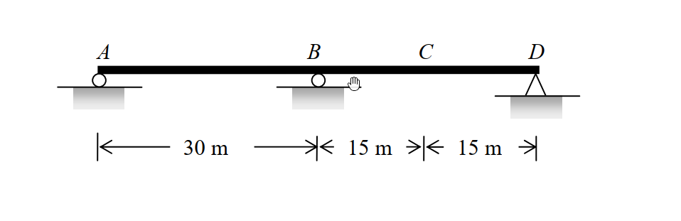
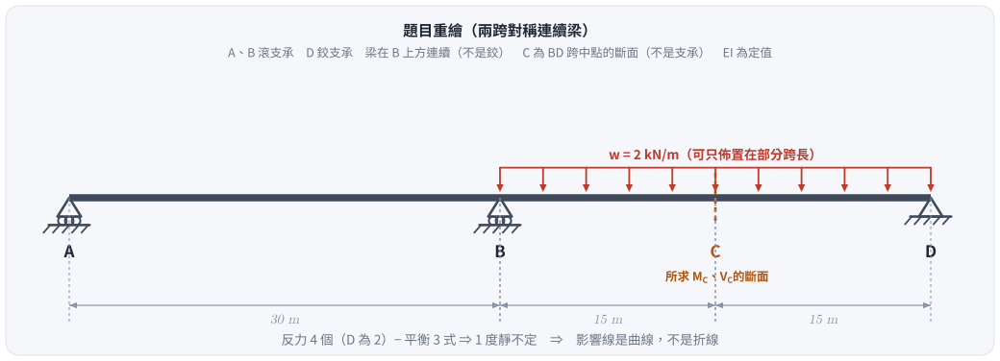
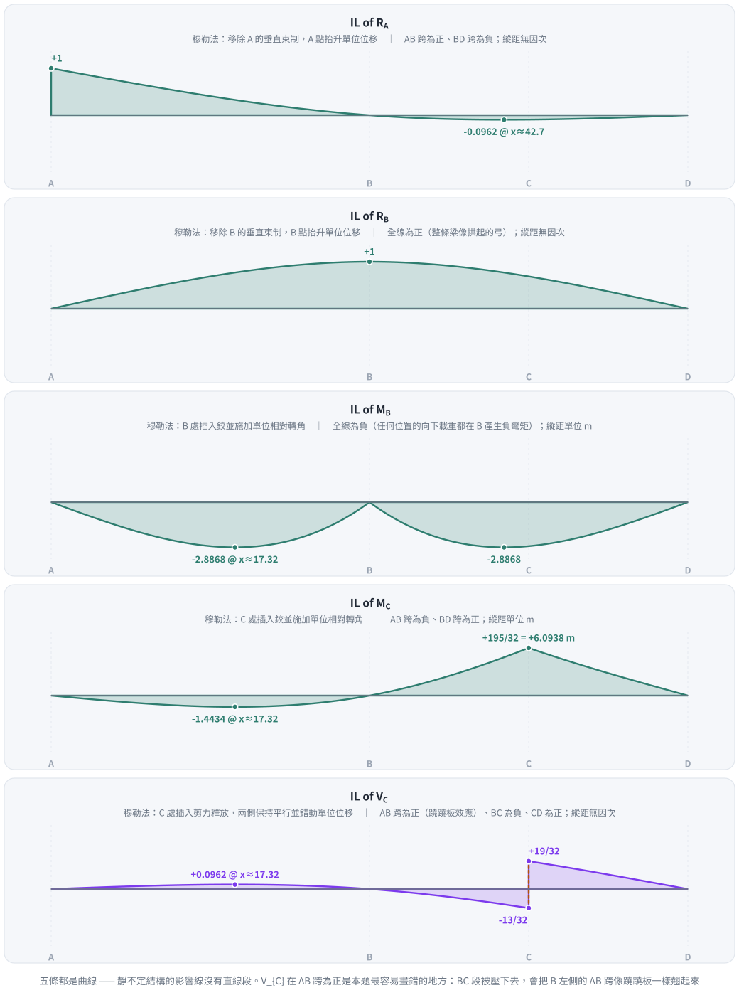
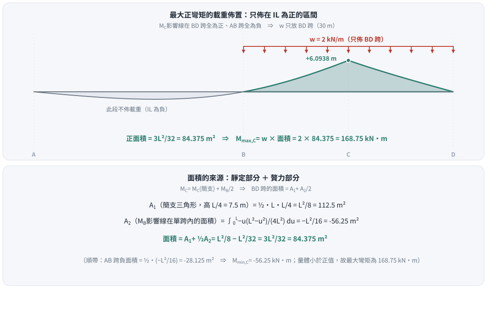

# 考題編號：SA-2011-3

**主分類：** `SA-U1-3` 靜定及靜不定結構影響線
**副分類：** 無
**分析法：** 穆勒法（Müller-Breslau Principle）／力法＋影響線面積積分
**標籤：** `穆勒法` `連續梁` `影響線` `最大彎矩` `載重佈置`

---

## 1. 原始題目重述 (Problem Restatement)

如圖所示為一兩跨連續梁結構，AB 跨距 $30\text{ m}$，BD 跨距 $30\text{ m}$，C 點位於 BD 跨之中央：

(1) 請使用穆勒法（Müller-Breslau method）繪出支承 A 點反力（$R_A$）、支承 B 點反力（$R_B$）、支承 B 點負彎矩（$M_B^-$）、C 點彎矩（$M_C$）及其剪力（$V_C$）之影響線圖。
(2) 假設該梁承受 $2\text{ kN/m}$ 之均布載重可作用於全長或部分跨長，請計算 C 點之最大彎矩（$M_{max,C}$）。（25 分）

*圖說：A、B 為滾支承，D 為鉸支承，總跨長 60 m。**梁在 B 上方是連續的**（不是內鉸）。以 A 為原點：$A(0)$、$B(30)$、$C(45)$、$D(60)$。*

*圖 1　題目重繪（向量版）。這張圖攔兩件事：把 C 當成支承（它只是 BD 跨的中點斷面），以及把結構當成兩根獨立的簡支梁 —— B 上方是連續的，這正是 1 度靜不定的來源，也是第 (1) 小題五條影響線都是曲線的原因。*

---

## 2. 考題核心精神與出題者意圖 (Core Concepts & Examiner's Intent)

本題測驗**靜不定結構影響線**的定性與定量綜合能力：

1. **定性繪製（穆勒法）** —— 解除對應束制、施加單位變形，彈性變形曲線即為影響線形狀。關鍵在對邊界條件（支承處位移為零）與連續性的敏銳度。
2. **靜不定結構的影響線是曲線** —— 本題 1 度靜不定，五條影響線**沒有一段是直線**。把它們畫成折線是最常見的失分。
3. **定量計算（最大效應分析）** —— 「影響線面積 × 均布載重 = 總效應」，而且**只把載重佈在影響線為正的區間**才能得到最大正效應。
4. **贅力效應的疊加** —— 把連續梁的 $M_C$ 拆成「簡支梁部分」＋「端彎矩 $M_B$ 部分」，兩塊面積分別算再相加，避免直接對三次曲線積分。

---

## 3. 解題戰略地圖與陷阱分析 (Strategic Roadmap & Trap Analysis)

**解題策略：**

1. **第一階段：影響線定性繪製（穆勒法）**
    - 逐一解除 $R_A$、$R_B$、$M_B$、$M_C$、$V_C$ 對應的束制；
    - 施加單位正向變形（位移／相對轉角／相對橫向錯動）；
    - 依邊界條件（其餘支承處位移為零）與彎曲連續性，畫出**平滑曲線**。
2. **第二階段：面積積分求最大彎矩**
    - 由 $M_C$ 影響線確認正值區間（僅 BD 跨）；
    - 拆解成「簡支梁 $M_C$」＋「贅力 $M_B$ 效應」；
    - 兩塊面積相加後乘上 $w$。

**陷阱分析：**

| 陷阱 | 為什麼會錯 | 正解 |
|---|---|---|
| **把影響線畫成折線** | 記住了靜定梁 IL 是分段直線的規則 | 本題 1 度靜不定，五條 IL 全是曲線；折線只在 $V_C$ 的斷面處有一個跳躍 |
| **$V_C$ 在 AB 跨的符號（蹺蹺板效應）** | 直覺認為「離 C 那麼遠，應該是 0 或負的」 | C 點正剪力使 BC 段下壓，會把 B 左側的 AB 跨**翹起來** $\Rightarrow$ AB 跨為**正**（極大 $+0.0962$） |
| **均布載重佈滿全長 60 m** | 沒注意「可作用於全長或**部分跨長**」 | 佈滿全長會把 AB 跨的負面積一併計入，答案偏低（$168.75 - 56.25 = 112.5$，不是最大值） |
| 只答 $M_{max}$ 不答形狀 | 第 (1) 小題佔一半分數 | 五條 IL 都要畫，且要標關鍵縱距 |
| 忘記檢查 $M_C$ 的最小值 | 只算正的 | $M_{min,C} = -56.25\text{ kN·m}$（載重只佈 AB 跨）；量體小於正值，故「最大彎矩」仍是 $168.75$ |

---

## 3.5 變數層次分析 (Variable Hierarchy Analysis)

### 最終目標

`繪出五條影響線，並由 M_C 影響線的正面積算出 C 點的最大正彎矩`

### 本題關鍵公式（依計算順序）

> $\boxed{\cdot}$ ＝ 需由前步驟推導，非題目直接給定

$$\text{Step 1: } M_B(u) = -\frac{u\,(L^2 - u^2)}{4L^2}
\quad (u = \text{載重距「所在跨外側支承」的距離})$$

$$\text{Step 2: } M_C(x) = M_C^{\text{simp}}(x) + \tfrac12\,\boxed{M_B(x)}$$

$$\text{Step 3: } A_1 = \tfrac12 \cdot L \cdot \tfrac{L}{4} = \tfrac{L^2}{8},
\qquad A_2 = \int_0^L \boxed{M_B(u)}\,du = -\tfrac{L^2}{16}$$

$$\text{Step 4: } \text{Area}^+_{M_C} = \boxed{A_1} + \tfrac12 \boxed{A_2} = \tfrac{3L^2}{32}$$

$$\text{Step 5: } M_{max,C} = w \times \boxed{\text{Area}^+_{M_C}}$$

### L1：題目直接給定

| 符號 | 數值 | 說明 |
|---|---|---|
| $L$ | $30\text{ m}$ | 單跨跨距（AB = BD） |
| $w$ | $2\text{ kN/m}$ | 均布載重強度（可佈部分跨長） |
| $x_C$ | $45\text{ m}$ | C 為 BD 跨中點 |

### L2：需知識點推導

| 符號 | 公式／來源 | 卡關? |
|---|---|:--:|
| 靜不定度 | 反力 4（D 為 2）− 平衡 3 = **1 度** | |
| $M_B(u)$ | 諧合條件 $\dfrac{2M_B L}{3EI} = \dfrac{u(L^2-u^2)}{6LEI}$ | |
| $A_1$ | $\frac12 L \cdot \frac{L}{4} = \frac{L^2}{8} = 112.5\text{ m}^2$ | |
| $A_2$ | $\int_0^L M_B\,du = -\frac{L^2}{16} = -56.25\text{ m}^2$ | |
| $\text{Area}^+$ | $\frac{L^2}{8} - \frac{L^2}{32} = \frac{3L^2}{32} = 84.375\text{ m}^2$ | |
| $M_{max,C}$ | $w \times \text{Area}^+ = 168.75\text{ kN·m}$ | |

### L3：深層知識（不懂就卡住）

| 知識點 | 說明 | 卡關? |
|---|---|:--:|
| 穆勒法（Müller-Breslau） | 解除束制、施加單位變形，**彈性變形曲線**的形狀即為影響線 | |
| 靜不定 IL 為曲線 | 靜定結構的 IL 才是折線；有贅力時，變形曲線是三次的 | |
| 連續梁影響線拆解 | $M_C$ ＝ 簡支效應 ＋ 端點贅力彎矩效應（線性疊加） | |
| 載重佈置原則 | 求最大正效應 $\Rightarrow$ $w$ 只佈在 IL 縱座標為正的區間 | |
| 蹺蹺板效應 | 連續梁中，某跨被壓下去會使相鄰跨翹起 $\Rightarrow$ 遠處 IL 可以變號 | |

---

## 4. 步驟化詳細計算過程 (Step-by-Step Detailed Calculation)

### 第一部分：五條影響線（第 (1) 小題）

**贅力選擇：** 取 B 點彎矩 $M_B$ 為贅力，基本結構為兩根獨立的簡支梁 AB、BD。由 B 處的轉角諧合條件：

$$\frac{2 M_B L}{3EI} = \frac{u\,(L^2 - u^2)}{6LEI}
\quad\Longrightarrow\quad
\boxed{M_B(u) = -\frac{u\,(L^2 - u^2)}{4L^2}}$$

其中 $u$ 為載重距**所在跨外側支承**的距離（載重在 AB 跨時 $u=x$；在 BD 跨時 $u = 60-x$）。

由此可寫出其餘四條：

$$R_A = \underbrace{\frac{L-x}{L}\Big|_{\text{僅 AB 跨}}}_{\text{簡支值}} + \frac{M_B}{L},
\qquad R_D(x) = R_A(60-x)\ \text{（對稱）},
\qquad R_B = 1 - R_A - R_D$$

$$M_C = M_C^{\text{simp}} + \frac{M_B}{2},
\qquad V_C = R_A + R_B - \begin{cases}1 & x < 45\\ 0 & x > 45\end{cases}$$

*圖 2　五條影響線（穆勒法的定量版本）。這張圖攔兩件事：把靜不定結構的影響線畫成折線，以及漏掉 $V_C$ 在 AB 跨的**正值**（蹺蹺板效應）—— 那一小塊 $+0.0962$ 的面積，正是「BC 段被壓下去、AB 跨被翹起來」的直接證據。*

**各條影響線的穆勒法解讀與關鍵縱距：**

| 影響線 | 解除什麼束制 | 形狀 | 關鍵縱距 |
|---|---|---|---|
| $R_A$ | 移除 A 的垂直束制，A 抬升單位位移 | AB 跨為正、BD 跨為負 | $A: +1$；BD 跨極小 $-0.0962$（$x \approx 42.68$） |
| $R_B$ | 移除 B 的垂直束制，B 抬升單位位移 | 全線為正（整條梁像拱起的弓） | $B: +1$；A、D 為 0 |
| $M_B^-$ | B 處插入鉸，施加單位相對轉角 | **全線為負**（任何位置的向下載重都在 B 產生負彎矩） | 兩跨極小皆為 $-2.887\text{ m}$（$x \approx 17.32$ 與 $42.68$，即 $L/\sqrt3$） |
| $M_C$ | C 處插入鉸，施加單位相對轉角 | AB 跨為負、BD 跨為正 | $C: +\frac{195}{32} = +6.094\text{ m}$；AB 跨極小 $-1.443\text{ m}$（$x \approx 17.32$） |
| $V_C$ | C 處插入剪力釋放，兩側平行錯動 | **AB 跨為正**、BC 為負、CD 為正 | $C^-: -\frac{13}{32}$；$C^+: +\frac{19}{32}$（跳躍 $=1$）；AB 跨極大 $+0.0962$（$x \approx 17.32$） |

> **兩個免費的自我檢查：**
> ① $V_C(C^+) - V_C(C^-) = \frac{19}{32} + \frac{13}{32} = 1$ ✓（單位載重跨過斷面，剪力必跳躍 1）
> ② $M_B$ 在 A、B、D 三個支承處皆為 0 ✓

> **為什麼極值都落在 $x = L/\sqrt3 \approx 17.32$？**
> $M_B(u) = -u(L^2-u^2)/(4L^2)$，微分得 $L^2 - 3u^2 = 0 \Rightarrow u = L/\sqrt3$。
> $R_A$、$M_C$（AB 跨）、$V_C$（AB 跨）都正比於 $M_B$，所以極值位置全部相同。

---

### 第二部分：計算 C 點之最大彎矩（第 (2) 小題）

要使 C 點產生最大正彎矩，$w = 2\text{ kN/m}$ 應**僅佈置於 $M_C$ 影響線為正的區域**。由第一部分可知：**僅 BD 跨（30 m）為正**，AB 跨全為負。

*圖 3　載重佈置與面積分解。這張圖攔的是最貴的一個錯：把 $2\text{ kN/m}$ 佈滿 60 m —— 那會把 AB 跨的 $-28.125\text{ m}^2$ 一併計入，得到 $112.5\text{ kN·m}$，比真正的最大值少了三分之一。*

**1. 疊加分解**

$$M_C(x) = M_C^{\text{simp}}(x) + \tfrac12 M_B(x)$$

（BD 跨的端彎矩為 B 端 $M_B$、D 端 $0$，線性內插到中點即 $M_B/2$。）

**2. 兩塊面積**

- **靜定部分 $A_1$**：頂點在 C、高 $L/4$ 的三角形

$$A_1 = \tfrac12 \times L \times \tfrac{L}{4} = \tfrac{L^2}{8} = \tfrac{900}{8} = 112.5\text{ m}^2$$

- **贅力部分 $A_2$**：$M_B$ 影響線在單跨內的面積

$$A_2 = \int_0^L -\frac{u(L^2-u^2)}{4L^2}\,du
= -\frac{1}{4L^2}\left[\frac{L^2u^2}{2} - \frac{u^4}{4}\right]_0^L
= -\frac{1}{4L^2}\cdot\frac{L^4}{4} = -\frac{L^2}{16} = -56.25\text{ m}^2$$

**3. $M_C$ 影響線的正面積**

$$\text{Area}^+_{M_C} = A_1 + \tfrac12 A_2 = \frac{L^2}{8} - \frac{L^2}{32} = \frac{3L^2}{32}
= \frac{3 \times 900}{32} = 84.375\text{ m}^2$$

**4. 最大正彎矩**

$$\boxed{M_{max,C} = w \times \text{Area}^+_{M_C} = 2 \times 84.375 = 168.75\text{ kN·m}}$$

**5.（補充）最小彎矩** —— 載重只佈 AB 跨時：

$$\text{Area}^-_{M_C} = \tfrac12 A_2 = -\frac{L^2}{32} = -28.125\text{ m}^2
\quad\Longrightarrow\quad
M_{min,C} = 2 \times (-28.125) = -56.25\text{ kN·m}$$

$|{-56.25}| < 168.75$，故「C 點之最大彎矩」為 $\mathbf{168.75\text{ kN·m}}$（正彎矩）。

> **若載重佈滿全長 60 m**（題目沒問，但常被誤答）：
> $M_C = 2 \times (84.375 - 28.125) = 112.5\text{ kN·m}$ —— 比真正的最大值少 $33\%$。

---

## 5. 關鍵爭議點與進階探討 (Critical Issues & Advanced Discussion)

**（一）積分法與速算法的抉擇。** 考場上若記得「對稱兩跨連續梁、單跨滿載均布載重時的端彎矩為 $-wL^2/16$」，可直接得到贅力部分的總面積效應為 $-L^2/16$，省下整段積分。建議把常用的固定端彎矩與連續梁反應背熟 —— 本題的 $A_2$ 就是它的直接應用。

**（二）為什麼要特別強調「$V_C$ 在 AB 跨為正」。** 這是連續性的最直接證據：BC 段被壓下去，B 支承作為支點，把 AB 跨像蹺蹺板一樣翹起來。數量上它只有 $+0.0962$，面積也只有 $+2.887\text{ m}^2$（乘 $w$ 後 $5.77\text{ kN}$），但**符號畫錯就代表對連續梁的變形機制沒有掌握**，閱卷上是重扣項。

**（三）載重佈置與包絡線（Envelope）。** 「切斷載重以避開負效應」是工程設計求極值包絡線的基本操作。實務上活載重本來就可以只出現在部分跨長，設計必須用最不利的佈置；本題把這個觀念用 25 分包裝起來。

**（四）$M_C$ 峰值 $6.094\text{ m}$ 與簡支梁的比較。** 若 BD 是獨立簡支梁，$M_C$ 的 IL 峰值會是 $L/4 = 7.5\text{ m}$。連續性把它壓到 $6.094\text{ m}$（$81\%$）—— 這就是 B 上方的負彎矩把跨中正彎矩「拉回來」的量化結果。

---

## 6. 本題知識點索引

| 知識點 | 概念 ID |
|---|---|
| 影響線 | [[INFLUENCE-LINE]] |
| Müller-Breslau 原理 | [[MULLER-BRESLAU-PRINCIPLE]] |
| 力法（諧合變位） | [[FORCE-METHOD]] |
| 靜不定度判斷 | [[DEGREE-OF-INDETERMINACY]] |

---

## CHANGELOG

| 日期 | 變更 | 原因 |
|---|---|---|
| 2026-07-02 | 初版解析 | — |
| 2026-08-26 | **修正分類**：`SA-U5-1`／`SA-U5-2` → `SA-U1-3`；**補上第 (1) 小題的影響線圖與關鍵縱距**（原文只有文字描述、無縱距、無圖）；補 $M_{min,C} = -56.25\text{ kN·m}$ | SA 命題大綱只有 U1～U3，沒有 U5（`question_index.json` 原本就記為 `SA-U1-3`，是 .md 標頭與索引不一致）；第 (1) 小題要求「繪出」五條影響線，原文以「請依上述定性描述繪製平滑曲線」帶過，等於沒答 |

---

*解析日期：2026-07-02　｜　分類修正＋圖解補繪：2026-08-26（$M_{max,C} = 168.75\text{ kN·m}$ 經梁有限元在 241 個載重位置獨立驗證；向量圖腳本 `gen_SA-2011-3.py`，可重跑）*
