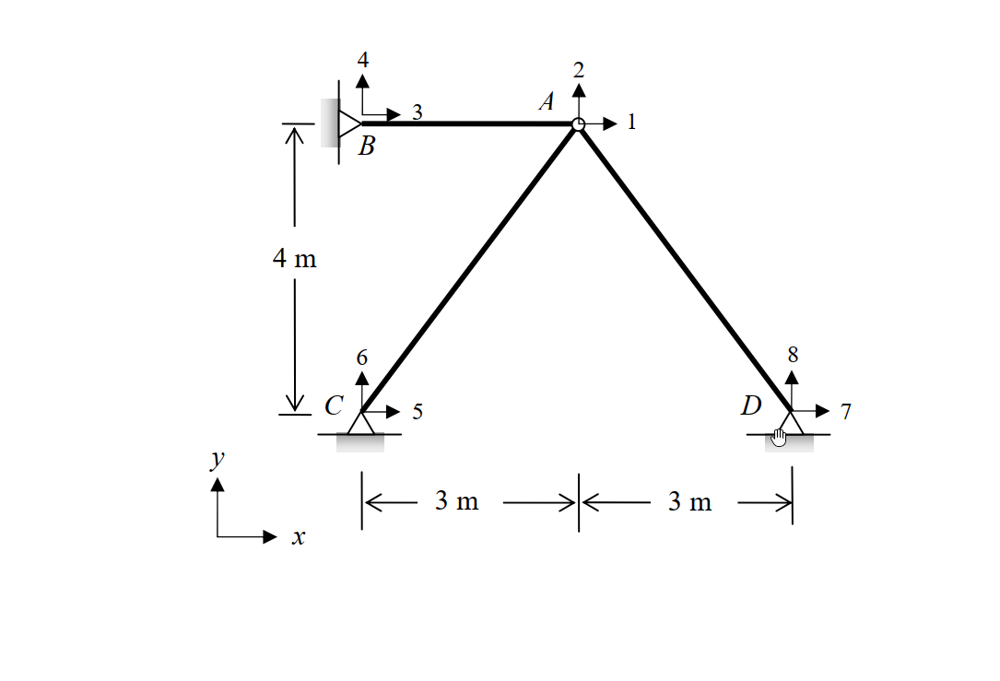

# 考題編號：SA-2011-4

**主分類：** `SA-U4-1` 矩陣勁度法
**副分類：** `SA-U4-2` 桁架矩陣分析
**分析法：** 矩陣直接勁度法 (Direct Stiffness Method)
**標籤：** `矩陣勁度法` `桁架` `製造誤差` `等效節點載重`

---

## 1. 原始題目重述 (Problem Restatement)

如圖所示之桁架結構，若 AC 桿件在組裝前因製造瑕疵短了 $0.02\text{ m}$，試以矩陣直接勁度法 (direct stiffness method) 計算 A 點之水平變位與垂直變位，並計算各桿件之內力。假設各桿件之彈性模數 $E$ 與斷面積 $A$ 皆為常數，且 $EA = 10^4\text{ kN}$。$x-y$ 為全域座標系統 (global coordinates)，圖中帶有箭頭之數字代表節點全域自由度之編號。(若以其他方法計算不予計分) (25 分)

*圖說：三桿桁架結構，節點 B、C、D 均為鉸支承。A 點為自由節點，連接 AB、AC、AD 三桿。B 點座標為 (0, 4)，C 點為 (0, 0)，A 點為 (3, 4)，D 點為 (6, 0)，單位皆為 m。*

## 2. 考題核心精神與出題者意圖 (Core Concepts & Examiner's Intent)

本題的核心精神在於測驗考生對於**矩陣直接勁度法**標準作業流程 (SOP) 的熟練程度，尤其是如何將非外力載重（此處為**製造誤差**）轉換為數值分析可以處理的模型。
出題者意圖包含以下三個層次：
1. **整體勁度矩陣之組裝**：測驗桿件局部座標至全域座標的轉換矩陣應用，以及組合節點 A 的整體勁度矩陣。
2. **製造誤差之處理 (最大痛點)**：檢測考生是否明白「製造短少 (Fabrication Error)」必須先轉換為「等效節點載重向量 (Equivalent Nodal Load Vector)」才能代入矩陣求解。
3. **內力回算機制的完整性**：解出節點位移後，運用桿件的變形關係回算最終內力時，是否記得補回初始強迫裝配所產生的初始張力（固定端反力）。題目特別明訂「若以其他方法計算不予計分」，強烈檢驗步驟標準性與陣列運算邏輯。

## 3. 解題戰略地圖與陷阱分析 (Strategic Roadmap & Trap Analysis)

**解題戰略地圖：**
1. **建立座標與自由度**：定義各節點全域座標，確認系統只有節點 A 存在兩個未知自由度 $D_1$ (水平)、$D_2$ (垂直)。
2. **組裝整體勁度矩陣 $[K]$**：計算 AB、AC、AD 三桿對節點 A 的勁度貢獻並疊加，得 $2 \times 2$ 的 $K_{AA}$ 矩陣。
3. **計算等效節點載重 $\{P_{eq}\}$**：鎖定 A 點，計算強行將短少的 AC 桿拉至 A 點所需的初始力，再將此拉力轉換至全域座標形成等效載重。
4. **解聯立方程式**：利用 $[K]\{D\} = \{P_{eq}\}$ 求解節點 A 的位移 $D_1$ 與 $D_2$。
5. **回算真實內力**：以 $F = \frac{EA}{L} e + F_{fixed}$ 求各桿內力，注意 AC 桿必須包含初始張力 $F_{fixed}$。

**關鍵陷阱分析：**
- 🔴 **陷阱 1：等效節點載重的方向判定（高危險區）**。AC 桿短缺 $0.02\text{ m}$，若將其強行接上節點 A，AC 桿會處於被拉伸狀態，因此會對 A 點產生一個「拉向 C 點」的力量。許多考生會將此方向搞反或誤以為是推力，導致等效載重符號全錯。
- 🔴 **陷阱 2：內力回算的初始力漏算**。在最後計算 AC 桿真實內力時，位移引起的內力變化只是「釋放」過程的改變量。必須加上當初強制拉伸它所產生的初始張力，若僅代入位移公式將導致 AC 桿內力計算嚴重失真。

## 3.5 變數層次分析 (Variable Hierarchy Analysis)

### 最終目標
`求出節點 A 的水平與垂直位移，並回算 AB、AC、AD 三根桿件的最終真實內力。`

### 本題關鍵公式（依計算順序）
**Step 1: 桿件勁度矩陣貢獻**
$$ k_{AA}^{(i)} = \frac{EA}{L} \begin{bmatrix} c^2 & cs \\ cs & s^2 \end{bmatrix} $$

**Step 2: 整體勁度矩陣組裝**
$$ [K] = \sum k_{AA}^{(i)} $$

**Step 3: 等效節點載重計算**
$$ \{P_{eq}\} = T_0 \begin{bmatrix} c \\ s \end{bmatrix} = \left( \frac{EA}{L_{AC}} \Delta \right) \begin{bmatrix} c \\ s \end{bmatrix} $$

**Step 4: 節點位移求解**
$$ \{D\} = \boxed{[K]}^{-1} \boxed{\{P_{eq}\}} $$

**Step 5: 桿件內力回算**
$$ F_i = \frac{EA}{L_i} ( -\boxed{D_1} c - \boxed{D_2} s ) + F_{fixed, i} $$

### L1：題目直接給定
| 符號 | 數值 | 說明 |
|---|---|---|
| $EA$ | $10000\text{ kN}$ | 桿件軸力剛度 |
| $\Delta$ | $0.02\text{ m}$ | AC 桿件短少長度（製造誤差） |

### L2：需知識點推導
**整體勁度矩陣與等效載重**
| 符號 | 公式／來源 | 卡關? |
|---|---|---|
| $c, s$ | 桿件由起點至終點的方向餘弦 | |
| $K_{AA}$ | $\sum \frac{EA}{L} \begin{bmatrix} c^2 & cs \\ cs & s^2 \end{bmatrix}$ | |
| $T_0$ | $\frac{EA}{L_{AC}} \Delta$ | |
| $\{P_{eq}\}$ | $T_0 \begin{bmatrix} c_{A \to C} \\ s_{A \to C} \end{bmatrix}$ | |

**最終解答**
| 符號 | 公式／來源 | 卡關? |
|---|---|---|
| $\{D\}$ | $[K]\{D\} = \{P_{eq}\}$ 解聯立 | |
| $F_i$ | $\frac{EA}{L_i} e_i + F_{fixed, i}$ | |

### L3：深層知識（不懂就卡住）
| 知識點 | 說明 | 卡關? |
|---|---|---|
| 等效載重物理意義 | 製造誤差的處理是先假定節點鎖定，將誤差強行歸位產生初始力，再反向施加於節點上作為等效載重。 | |
| 內力疊加原理 | 最終內力 = 鎖定狀態下的初始力 + 節點位移產生的變形內力。缺少初始力將使答案徹底錯誤。 | |

## 4. 步驟化詳細計算過程 (Step-by-Step Detailed Calculation)

### 步驟 1：建立節點座標與基本參數
以 C 點為原點 $(0, 0)$，建立全域座標系統：
- A 節點：$(3, 4)$，擁有未知自由度 $D_1 (\rightarrow), D_2 (\uparrow)$
- B 節點：$(0, 4)$，固定鉸支承
- C 節點：$(0, 0)$，固定鉸支承
- D 節點：$(6, 0)$，固定鉸支承
已知 $EA = 10000\text{ kN}$。

### 步驟 2：組裝 A 點整體勁度矩陣 $[K]$
對於連接到點 A 的各桿件 $i$，其對 A 節點的勁度貢獻為：
$$ k_{AA}^{(i)} = \frac{EA}{L} \begin{bmatrix} c^2 & cs \\ cs & s^2 \end{bmatrix} $$
其中 $c, s$ 為桿件由 A 指向他端之方向餘弦。

**1. 桿件 AB** ($L = 3\text{ m}$)：
向量 $\vec{AB} = (-3, 0)$，方向餘弦 $c = -1, s = 0$。
$$ k_{AA}^{(AB)} = \frac{10000}{3} \begin{bmatrix} (-1)^2 & 0 \\ 0 & 0 \end{bmatrix} = \begin{bmatrix} 3333.33 & 0 \\ 0 & 0 \end{bmatrix} $$

**2. 桿件 AC** ($L = \sqrt{3^2+4^2} = 5\text{ m}$)：
向量 $\vec{AC} = (-3, -4)$，方向餘弦 $c = -0.6, s = -0.8$。
$$ k_{AA}^{(AC)} = \frac{10000}{5} \begin{bmatrix} (-0.6)^2 & (-0.6)(-0.8) \\ (-0.6)(-0.8) & (-0.8)^2 \end{bmatrix} = 2000 \begin{bmatrix} 0.36 & 0.48 \\ 0.48 & 0.64 \end{bmatrix} = \begin{bmatrix} 720 & 960 \\ 960 & 1280 \end{bmatrix} $$

**3. 桿件 AD** ($L = \sqrt{3^2+4^2} = 5\text{ m}$)：
向量 $\vec{AD} = (3, -4)$，方向餘弦 $c = 0.6, s = -0.8$。
$$ k_{AA}^{(AD)} = \frac{10000}{5} \begin{bmatrix} (0.6)^2 & (0.6)(-0.8) \\ (0.6)(-0.8) & (-0.8)^2 \end{bmatrix} = 2000 \begin{bmatrix} 0.36 & -0.48 \\ -0.48 & 0.64 \end{bmatrix} = \begin{bmatrix} 720 & -960 \\ -960 & 1280 \end{bmatrix} $$

**整體勁度矩陣 $[K]$**：
將三桿勁度貢獻相加：
$$ [K] = k_{AA}^{(AB)} + k_{AA}^{(AC)} + k_{AA}^{(AD)} = \begin{bmatrix} 3333.33+720+720 & 0+960-960 \\ 0+960-960 & 0+1280+1280 \end{bmatrix} = \begin{bmatrix} 4773.33 & 0 \\ 0 & 2560 \end{bmatrix} $$
> **策略註解**：因結構幾何對稱性，非對角線元素剛好相消為零，矩陣解耦合解題大幅簡化。

### 步驟 3：計算等效節點載重向量 $\{P_{eq}\}$
桿件 AC 短缺 $\Delta = 0.02\text{ m}$。若將節點 A 鎖定於原位，強行將 AC 桿拉長連接至 A 點，AC 桿將產生初始張力：
$$ T_0 = \frac{EA}{L_{AC}} \Delta = \frac{10000}{5} \times 0.02 = 40\text{ kN} $$
此張力對節點 A 的作用力方向為由 A 指向 C (即向量方向 $c = -0.6, s = -0.8$)：
$$ \{P_{eq}\} = \begin{bmatrix} P_{x} \\ P_{y} \end{bmatrix} = T_0 \begin{bmatrix} c_{A \to C} \\ s_{A \to C} \end{bmatrix} = 40 \begin{bmatrix} -0.6 \\ -0.8 \end{bmatrix} = \begin{bmatrix} -24 \\ -32 \end{bmatrix} \text{ kN} $$

### 步驟 4：解節點位移 $\{D\}$
由矩陣方程式 $[K]\{D\} = \{P_{eq}\}$ 求位移：
$$ \begin{bmatrix} 14320/3 & 0 \\ 0 & 2560 \end{bmatrix} \begin{bmatrix} D_1 \\ D_2 \end{bmatrix} = \begin{bmatrix} -24 \\ -32 \end{bmatrix} $$

解得：
$$ \boxed{D_1 = -24 \times \frac{3}{14320} = -\frac{9}{1790} \approx -0.00503\text{ m} \text{ (向左)}} $$
$$ \boxed{D_2 = \frac{-32}{2560} = -0.0125\text{ m} \text{ (向下)}} $$

### 步驟 5：回算各桿件內力
桿件因位移產生之伸長量 $e = -(D_1 c + D_2 s)$ (以 A 點為起點之方向餘弦計算，A點位移產生之桿件伸長)。
內力 $F = \frac{EA}{L} e + F_{fixed}$，拉力為正，壓力為負。

**1. 桿件 AB** ($c=-1, s=0$)：
純位移產生的伸長量：$e_{AB} = -[ D_1(-1) + D_2(0) ] = D_1 = -0.005028\text{ m}$
無初始內力：
$$ \boxed{F_{AB} = \frac{10000}{3} \times (-0.005028) = -16.76\text{ kN} \text{ (壓力)}} $$

**2. 桿件 AD** ($c=0.6, s=-0.8$)：
純位移產生的伸長量：$e_{AD} = -[ D_1(0.6) + D_2(-0.8) ] = -[ (-0.005028)(0.6) + (-0.0125)(-0.8) ] = -0.006983\text{ m}$
無初始內力：
$$ \boxed{F_{AD} = \frac{10000}{5} \times (-0.006983) = 2000 \times (-0.006983) = -13.97\text{ kN} \text{ (壓力)}} $$

**3. 桿件 AC** ($c=-0.6, s=-0.8$)：
純位移產生的伸長量：$e_{AC} = -[ D_1(-0.6) + D_2(-0.8) ] = -[ (-0.005028)(-0.6) + (-0.0125)(-0.8) ] = -[-0.003017 + 0.01] = -0.013017\text{ m}$
**注意：必須加上初始強迫組裝的張力 $T_0 = +40\text{ kN}$**：
$$ \boxed{F_{AC} = \frac{EA}{L} e_{AC} + T_0 = 2000 \times (-0.013017) + 40 = -26.03 + 40 = 13.97\text{ kN} \text{ (拉力)}} $$

> **策略註解**：可透過節點 A 進行力平衡驗算確保正確。
> $\sum F_x = 16.76 - 13.97(0.6) - 13.97(0.6) = 16.76 - 16.76 = 0$
> $\sum F_y = 13.97(0.8) - 13.97(0.8) = 11.176 - 11.176 = 0$
> 平衡完美閉合，證明計算無誤。

## 5. 關鍵爭議點與進階探討 (Critical Issues & Advanced Discussion)

1. **製造誤差與溫差載重的相似性**：
   考場上常見的另一種題型是「溫度變化」引起的熱脹冷縮。本質上，溫度變化（如伸長量 $\alpha \Delta T L$）等同於本題的製造誤差（短少或過長）。兩者的處理 SOP 完全相同：(1) 先計算假想將其鎖定所產生的固定端反力（初始內力），(2) 將反力反向施加於節點作為等效節點載重，(3) 最後回算內力時加上初始內力。
   
2. **正負號法則的防錯建議**：
   在處理等效載重時，建議考生多畫一張「鎖定狀態自由體圖」。用物理直覺去想像：AC 桿過短，被強拉到 A 點後，它會像一條被拉緊的橡皮筋，對 A 點施加「朝向 C 點」的拉力。只要這個物理圖像清晰，等效載重向量的方向 $(-0.6, -0.8)$ 就不會出錯，遠比死背公式 $P = -F_{fixed}$ 穩定可靠。
