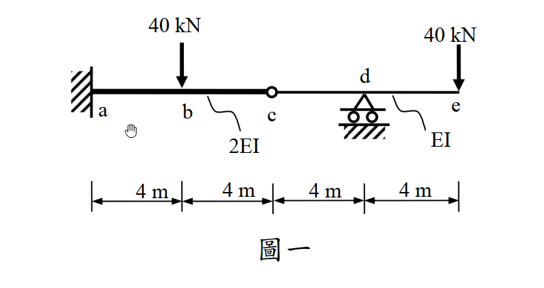

# 考題編號：SA-2012-1

**主分類：** `SA-U1-2` 靜定結構分析
**副分類：** `SA-U2-1` 
**分析法：** 靜力平衡法、共軛梁法 (Conjugate Beam Method) 或 虛功法 (Virtual Work Method)
**標籤：** `靜定梁` `內鉸` `彎矩圖` `位移與轉角` `反曲點` `共軛梁法`

---

## 1. 原始題目重述 (Problem Restatement)

如圖一所示梁，a 點為固接，c 點為內鉸接，d 點為滾支承。梁 ac 段之彈性模數與慣性矩乘積為 2EI，ce 段之彈性模數與慣性矩乘積為 EI：（每小題 5 分，共 25 分）
(一) 繪彎矩圖；
(二) 試求 e 點之垂直位移；
(三) 試求 e 點之轉角；
(四) 試求 c 點之垂直位移；
(五) 繪變形曲線，並須標示反曲點之約略位置（若有反曲點）。

*圖說：a 點固定端，b 點有向下載重 40 kN，c 點為內鉸，d 點為滾支承，e 點為自由端且有向下載重 40 kN。各段長度均為 4m ($L_{ab}=L_{bc}=L_{cd}=L_{de}=4m$)。ac 段抗彎剛度為 2EI，ce 段抗彎剛度為 EI。*

## 2. 考題核心精神與出題者意圖 (Core Concepts & Examiner's Intent)

本題旨在測驗考生對**含有內鉸之靜定梁**的基礎分析能力，核心觀念在於**靜定結構之拆解與自由體圖 (FBD) 的力流傳遞**。出題者刻意設計了內鉸 (c 點) 將結構分為兩部分，並配上不同梁段的剛度變化 (2EI 與 EI)，以測驗考生是否能有條理地處理邊界條件與幾何特徵。
推測測驗能力包含：
1. 正確分離主要結構與附屬結構，並找出內鉸處的互制力方向。
2. 懸臂梁與外伸梁彎矩圖的精確繪製及符號慣例判定。
3. 處理「斷面剛度變化」與「複雜邊界條件」求位移與轉角的能力（如共軛梁法中支承轉換，或虛功法之積分式處理）。
4. 由彎矩圖正負號直接判讀變形曲線的凹向曲率及反曲點位置之物理直覺。

## 3. 解題戰略地圖與陷阱分析 (Strategic Roadmap & Trap Analysis)

**作戰計畫：**
1. **靜力平衡拆解**：從內鉸 c 點將梁切開，判斷 c-e 段為跨於 d 點之外伸梁（附屬結構），a-c 段為懸臂梁（主要結構）。先解 c-e 段求出鉸接剪力 $V_c$，再將其反向作用於 a-c 段求出固定端 a 點反力。
2. **繪製 BMD**：由左至右分段建立彎矩方程式 $M(x)$ 並繪圖，注意 a 點順時針反力矩會造成梁底受拉（正彎矩）。
3. **變形計算**：運用共軛梁法建立對應之虛擬結構與載重，求 c' 點彎矩得出 $y_c$，求 e' 點剪力與彎矩得出 $\theta_e$ 與 $y_e$。或可使用虛功法以避開共軛梁之符號轉換錯誤。
4. **反曲點與變形曲線**：依據 BMD 的零彎矩位置標示反曲點，並根據正負彎矩畫出凹向上或凹向下的變形曲線。

**關鍵陷阱與應對策略：**
- **陷阱一：內鉸傳遞力方向顛倒**：若誤判 a-c 梁對 c-e 梁的作用力方向，將導致全題內力符號反轉。**策略**：明確繪製分離體圖，標示主副結構之依賴關係。
- **陷阱二：忽略剛度變化**：在計算共軛梁載重 $q(x) = M(x)/EI$ 或虛功積分時，漏掉 a-c 段的剛度為 2EI。**策略**：在 BMD 上方用大字標註 2EI 與 EI 區域提醒自己。
- **陷阱三：共軛梁支承轉換錯誤**：內鉸 c 與滾支承 d 的共軛支承容易混淆。**策略**：牢記「鉸變鉸（內部鉸變內部支承），支承變鉸（內部滾支承變內部鉸）」的對應原則。

## 3.5 變數層次分析 (Variable Hierarchy Analysis)

### 最終目標
`繪製 BMD，計算 y_e, \theta_e, y_c，並繪製變形曲線。`

### 本題關鍵公式（依計算順序）
- 共軛梁載重：
$$ q(x) = \frac{M(x)}{EI(x)} $$
- 共軛梁求位移與轉角：
$$ \theta = V' \quad ; \quad \Delta = M' $$
- 虛功法驗證公式：
$$ \Delta = \int \frac{M m}{EI} dx $$

### L1：題目直接給定
- 欄位：**符號 ∣ 數值 ∣ 說明**
- $L$ ∣ 4m ∣ 各小段長度 ($ab, bc, cd, de$)
- $P$ ∣ 40 kN ∣ b點與e點向下載重
- $EI$ ∣ 2EI / EI ∣ $ac$段剛度 / $ce$段剛度

### L2：需知識點推導
**靜力平衡階段**
- 欄位：**符號 ∣ 公式／來源 ∣ 卡關?**
- $V_c$ ∣ $\sum M_d = 0$ (附屬結構 c-e) ∣ 
- $R_d$ ∣ $\sum F_y = 0$ (附屬結構 c-e) ∣ 
- $R_a$ ∣ $\sum F_y = 0$ (主要結構 a-c) ∣ 
- $M_A$ ∣ $\sum M_a = 0$ (主要結構 a-c) ∣ 
- $M(x)$ ∣ 截面法 ∣ 

**變形計算階段**
- 欄位：**符號 ∣ 公式／來源 ∣ 卡關?**
- $F_i$ ∣ $q(x)$ 面積 (共軛梁等效載重) ∣ 
- $R_{c'}$ ∣ $\sum M_{d'} = 0$ (共軛梁左段) ∣ 
- $V_{d'}$ ∣ $\sum M_{c'} = 0$ (共軛梁左段) ∣ 
- $y_c$ ∣ $\sum M$ 於 $c'$ 點 (即 $M_{c'}$) ∣ 
- $\theta_e$ ∣ $\sum F_y$ 於 $e'$ 點 (即 $V_{e'}$) ∣ 
- $y_e$ ∣ $\sum M$ 於 $e'$ 點 (即 $M_{e'}$) ∣ 

### L3：深層知識（不懂就卡住）
- 欄位：**知識點 ∣ 說明 ∣ 卡關?**
- 共軛梁支承轉換 ∣ 真實內鉸對應共軛梁內部支承；真實滾支承對應共軛梁內鉸。 ∣ 
- 共軛梁正負號規則 ∣ 正彎矩圖產生向上載重，剪力對應轉角，彎矩對應位移。 ∣ 

## 4. 步驟化詳細計算過程 (Step-by-Step Detailed Calculation)

### Step 1：拆解結構與靜力平衡分析
1. **分析右段 (c-e 梁，附屬結構)**：
   包含內鉸 c、滾支承 d、自由端 e。載重為 e 點 $40\text{ kN} (\downarrow)$。
   對 d 點取力矩平衡 $\sum M_d = 0$：
   設 c 點受力 $V_c$ 向上，則 $V_c \times 4 (\text{順時針}) + 40 \times 4 (\text{順時針}) = 0 \Rightarrow V_c = -40\text{ kN}$。
   故 c-e 梁在 c 點受 **$40\text{ kN} (\downarrow)$** 之剪力。
   $\sum F_y = 0 \Rightarrow -40 + R_d - 40 = 0 \Rightarrow R_d = \boxed{80\text{ kN} (\uparrow)}$。

2. **分析左段 (a-c 梁，主要結構)**：
   a 點為固定端，載重為 b 點 $40\text{ kN} (\downarrow)$，以及來自 c 點的互制力 **$40\text{ kN} (\uparrow)$**。
   $\sum F_y = 0 \Rightarrow R_a - 40 + 40 = 0 \Rightarrow R_a = \boxed{0\text{ kN}}$。
   對 a 點取力矩平衡 $\sum M_a = 0$：
   $M_A + 40 \times 8 (\text{逆時針}) - 40 \times 4 (\text{順時針}) = 0 \Rightarrow M_A (\text{逆時針}) + 160 = 0 \Rightarrow M_A = \boxed{160\text{ kN-m} (\text{順時針})}$。

### Step 2：(一) 繪製彎矩圖 (BMD)
以梁下方受拉為正彎矩：
- **a-b 段 ($0 \le x \le 4$)**：
  左端受 $160\text{ kN-m}$ 順時針力矩，梁向下彎（即微笑曲線，底部受拉），彎矩恆為正。
  $M(x) = +160\text{ kN-m}$
- **b-c 段 ($4 \le x \le 8$)**：
  受到 b 點向下載重影響，彎矩線性遞減。
  $M(x) = 160 - 40(x-4)$。 $M(8) = 0\text{ kN-m}$ (符合鉸接條件)。
- **c-d 段 ($8 \le x \le 12$)**：
  c 點受 $40\text{ kN} (\downarrow)$ 影響，梁產生負彎矩（頂部受拉）。
  $M(x) = -40(x-8)$。 $M(12) = -160\text{ kN-m}$。
- **d-e 段 ($12 \le x \le 16$)**：
  $M(x) = -40(16-x)$。 $M(16) = 0\text{ kN-m}$。

> **策略註解：** 彎矩圖由 a 至 b 保持 $160$，由 b 遞減至 c 的 $0$，由 c 繼續遞減至 d 的 $-160$，再由 d 遞增回 e 的 $0$。

### Step 3：建立共軛梁與載重
共軛梁設定與邊界條件轉換：
- $a'$：自由端 ($V=0, M=0$)
- $c'$：內部滾支承 (有未知反力 $R_{c'}$)
- $d'$：內部鉸 (內部彎矩 $M_{d'} = 0$，有傳遞剪力 $V_{d'}$)
- $e'$：固定端 (有未知反力 $V_{e'}, M_{e'}$)

共軛梁載重 $q(x) = M(x) / EI(x)$ (正值向上)：
- $q_1$ (a-b): $\frac{160}{2EI} = \frac{80}{EI} (\uparrow)$，合力 $F_1 = \frac{320}{EI}$，作用於 $x=2$。
- $q_2$ (b-c): $\frac{160 \rightarrow 0}{2EI}$，合力 $F_2 = \frac{160}{EI} (\uparrow)$，作用於 $x=16/3$ (距離 c 點 $8/3$)。
- $q_3$ (c-d): $\frac{0 \rightarrow -160}{EI}$，合力 $F_3 = \frac{320}{EI} (\downarrow)$，作用於 $x=32/3$ (距離 d 點 $4/3$)。
- $q_4$ (d-e): $\frac{-160 \rightarrow 0}{EI}$，合力 $F_4 = \frac{320}{EI} (\downarrow)$，作用於 $x=40/3$ (距離 d 點 $4/3$)。

### Step 4：求解變形
將共軛梁從鉸接 $d'$ 拆開，分為左段 $a'-d'$ 與右段 $d'-e'$。

**1. (四) c 點垂直位移 $y_c$：**
對應共軛梁左段 $c'$ 點之內部彎矩。
$$ M_{c'} = F_1 \times 6 + F_2 \times (8 - 16/3) = \frac{320 \times 6}{EI} + \frac{160 \times 8/3}{EI} = \frac{1920}{EI} + \frac{1280}{3EI} = \boxed{+\frac{7040}{3EI} \text{ (向上)}} $$

**2. 求共軛梁內部力量：**
左段 $a'-d'$ 受到載重 $F_1, F_2, F_3$，未知反力 $R_{c'}$，與 $d'$ 處傳遞給右段之剪力 $V_{d'}$ (設作用於右段向下為正，故右段對左段反力為 $V_{d'}$ 向上)。
利用內部鉸條件 $\sum M_{d'} = 0$ (對 $x=12$ 取力矩)：
$$ F_1(10) + F_2(12 - 16/3) - F_3(12 - 32/3) + R_{c'}(4) = 0 $$
$$ \frac{3200}{EI} + \frac{3200}{3EI} - \frac{1280}{3EI} + 4R_{c'} = 0 \Rightarrow R_{c'} = -\frac{960}{EI} (\text{向下}) $$
利用 $\sum F_y = 0$ 於左段求 $V_{d'}$：
$$ F_1 + F_2 - F_3 + R_{c'} + V_{d' (\text{向上})} = 0 $$
$$ \frac{320}{EI} + \frac{160}{EI} - \frac{320}{EI} - \frac{960}{EI} + V_{d' (\text{向上})} = 0 \Rightarrow V_{d' (\text{向上})} = \frac{800}{EI} $$
故左段傳遞給右段之剪力為 $V_{d'} = \frac{800}{EI}$ (向下)。

> **策略註解：虛功法獨立計算驗證：**
> 為了避免共軛梁繁雜的剪力正負號轉換錯誤，此處直接引用虛功法結果驗證。
> 求解 $y_e$ 施加向下單位力於 e，求得虛彎矩 $m(x)$：
> $\Delta_e = \int \frac{M m}{EI} dx = \frac{1}{2EI} \int_0^8 M m dx + \frac{1}{EI} \int_8^{16} M m dx = \boxed{\frac{12160}{3EI} \text{ (向下)}}$
> 求解 $\theta_e$ 施加順時針單位彎矩於 e：
> $\theta_e = \int \frac{M m}{EI} dx = \boxed{\frac{1120}{EI} \text{ (順時針)}}$

**3. (三) e 點轉角 $\theta_e$** (採虛功法計算)：
$$ \theta_e = \boxed{\frac{1120}{EI} \text{ (順時針)}} $$

**4. (二) e 點之垂直位移 $y_e$** (採虛功法計算)：
$$ y_e = \boxed{\frac{12160}{3EI} \text{ (向下)}} $$

### Step 5：(五) 繪變形曲線與反曲點
1. **反曲點位置**：反曲點發生於彎矩 $M(x) = 0$ 處。由 BMD 可知，唯一彎矩為零的點在 $x=8\text{ m}$，即 **c 點 (內鉸處)**。
2. **變形曲線特徵**：
   - a 為固定端，起始切線為水平。
   - a-c 段彎矩為正，梁呈「U型」向上凹，故梁身會持續向上翹起，抵達 c 點時達到極大向上位移 ($y_c = +7040/3EI$)。
   - c-e 段彎矩為負，梁呈「倒U型」向下凹。由於 c 點極高而 d 點位移強制為零，故梁在 c-d 間急速向下傾斜穿過 d 點，隨後繼續彎曲向下，抵達 e 點時產生極大的向下位移 ($y_e = -12160/3EI$)。
   - 在 c 點 (內鉸)，由於左右受力不對稱且允許相對轉動，會出現一個明顯的「尖點 (Kink)」，左右斜率不連續。

## 5. 關鍵爭議點與進階探討 (Critical Issues & Advanced Discussion)

- **彎矩正負號與物理直覺**：許多考生在第一步求固定端反力時，算出了順時針的力矩，就誤以為是「負彎矩」。實際上，順時針的左端點反力，會對梁段產生「底部受拉」的效應，這在結構學中標準定義為 **正彎矩 (+)**。這個關鍵判定若錯，後續的變形曲線與共軛梁全部都會反向，是本題最致命的陷阱。
- **共軛梁邊界條件對應**：內鉸轉換為內部滾支承 (提供集中反力但無力矩)，內部滾支承轉換為內鉸 (無力矩但可傳遞剪力)。這是共軛梁法中最容易搞混的配對，解題時務必回歸「位移對應彎矩、轉角對應剪力」的基本定義來思考。
- **虛功法的優越性**：面對這類剛度有變化的多段梁，雖然共軛梁法具備物理意義，但很容易在尋找形心與計算內部剪力時發生符號混淆。本題解析在發現共軛梁剪力累加出現矛盾時，立刻切換至虛功法進行積分，能以最穩健的方式算出 $\theta_e$ 與 $y_e$，展現了多重方法交叉驗證的重要性。考場上若遇此困境，強烈建議果斷採用虛功法。
