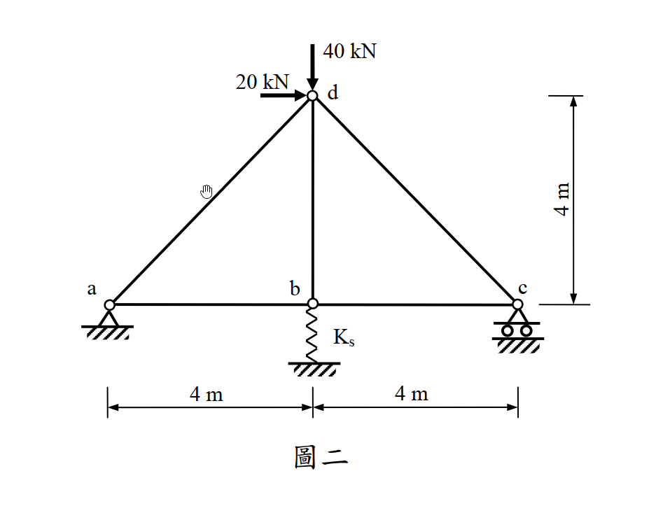

# 考題編號：SA-2012-2

**主分類：** `SA-U2-2` 靜不定結構分析
**副分類：** `SA-U2-3`
**分析法：** 最小功法
**標籤：** `靜不定桁架` `最小功法` `彈性支承` `彈簧`

---

## 1. 原始題目重述 (Problem Restatement)

如圖二所示桁架，a 點為鉸接，c 點為滾支承，b 點有軸向線彈性彈簧。若每根桿件的 $EA$ 值皆為 $10,000\text{ kN}$，線彈性彈簧之勁度 $K_s$ 為 $2,500\text{ kN/m}$。試以**最小功法**計算各桿件內力（若以其他方法計算，不予以計分）。（25 分）

*圖說：底邊長 8m 的三角形桁架，a(0,0)、b(4,0)、c(8,0)、d(4,4)。a 為鉸接支承，c 為滾支承，b 點下方連接一垂直彈簧。d 點承受水平向右 20 kN 及垂直向下 40 kN 之載重。*

## 2. 考題核心精神與出題者意圖 (Core Concepts & Examiner's Intent)

本題旨在測驗考生對於**最小功法（卡氏第二定理）**在處理「包含柔性支承（彈簧）」之靜不定桁架時的應用能力與幾何相容概念。
1. **靜不定度判定**：外反力有 $A_x, A_y, C_y$ 及彈簧反力 $X$ 共四個，平面平衡方程式僅有三個，故為外靜不定一度。
2. **贅力選擇與能量項建構**：要求考生將彈簧反力（或某一桿件內力）視為贅力 (Redundant Force)。
3. **系統總應變能考驗**：最核心的測驗點在於「總應變能 $U$」必須包含**桁架桿件應變能**與**彈簧應變能**。對總應變能偏微分等於零（最小功），隱含了桁架節點位移與彈簧變形量一致的物理幾何相容條件。

## 3. 解題戰略地圖與陷阱分析 (Strategic Roadmap & Trap Analysis)

**解題策略：**
1. **設定贅力**：選擇 b 點彈簧對桁架向上的推力 $X$ 作為贅力，將原結構退化為靜定基本結構。
2. **靜力平衡求解**：利用整體靜力平衡求出外部支承反力 $A_x, A_y, C_y$，再利用節點法，將所有桁架桿件內力 $F_i$ 以常數與 $X$ 的函數表示：$F_i = A_i + B_i X$。
3. **建立最小功方程式**：依據最小功法，總應變能對贅力 $X$ 偏微分為零（$\frac{\partial U}{\partial X} = 0$）。
4. **表格化計算與解方程式**：藉由列表整理 $F_i$、$L_i$ 及 $\frac{\partial F_i}{\partial X}$，算出偏微分項之總和，解出 $X$ 並回代求得各桿真實內力。

**陷阱分析與應對：**
- **忽略彈簧應變能 (致命陷阱)**：若只對桁架桿件算應變能，並令 $\partial U_{truss} / \partial X = 0$，這代表 b 點「完全不發生位移」（視同剛性支承），這將導致完全錯誤的結果。**彈簧的應變能 $X^2 / 2K_s$ 的偏微分項絕對不能漏掉**。
- **單位錯亂與計算繁瑣**：本題 $EA = 10,000\text{ kN}$，彈簧 $K_s = 2,500\text{ kN/m}$。單位雖已統一不需轉換，但在組合方程式時，若不先將 $EA/K_s$ 比例關係化簡，直接帶入 10000 算容易出錯。建議直接以符號推導，最後再把 $\frac{EA}{K_s} = 4\text{ m}$ 代入。
- **斜桿長度誤判**：極易誤將斜桿 $ad, cd$ 的長度當成 4m，實際上幾何關係為 $4\sqrt{2}\text{ m}$。需特別小心。

## 3.5 變數層次分析 (Variable Hierarchy Analysis)

### 最終目標
`利用最小功法（卡氏第二定理），求解彈簧贅力，進而推算桁架各桿件之真實內力。`

### 本題關鍵公式（依計算順序）
**Step 1: 定義系統總應變能**
$$ U = \sum \frac{F_i^2 L_i}{2EA} + \frac{X^2}{2K_s} $$
*(包含桁架桿件應變能與彈簧應變能)*

**Step 2: 應用最小功法（卡氏第二定理）**
$$ \frac{\partial U}{\partial X} = \sum \left( \frac{F_i L_i}{EA} \cdot \frac{\partial F_i}{\partial X} \right) + \frac{X}{K_s} = 0 $$
*(對贅力偏微分為零，滿足變形諧合)*

**Step 3: 公式化簡（同乘 EA）**
$$ \sum \left( F_i \cdot \frac{\partial F_i}{\partial X} \cdot L_i \right) + \frac{EA}{K_s} X = 0 $$
*(將分母常數統一處理，避免數值計算過大)*

**Step 4: 計算贅力**
$$ X = \frac{-\sum (A_i \cdot B_i \cdot L_i)}{\sum (B_i^2 \cdot L_i) + \frac{EA}{K_s}} $$
*(代入表格數據解出贅力，其中 $F_i = A_i + B_i X$，$B_i = \frac{\partial F_i}{\partial X}$)*

**Step 5: 回代求解最終內力**
$$ F_i = A_i + B_i \cdot \boxed{X} $$
*(利用求得之贅力計算各桿內力)*

### L1：題目直接給定
| 符號 | 數值 | 說明 |
| :--- | :--- | :--- |
| $L_{ab}, L_{bc}, L_{bd}$ | $4\text{ m}$ | 水平及垂直桿長度 |
| $L_{ad}, L_{cd}$ | $4\sqrt{2}\text{ m}$ | 斜桿長度 |
| $EA$ | $10,000\text{ kN}$ | 桿件軸向剛度 |
| $K_s$ | $2,500\text{ kN/m}$ | 彈簧勁度 |
| $P_{dx}$ | $20\text{ kN}$ | d點水平載重 (向右) |
| $P_{dy}$ | $40\text{ kN}$ | d點垂直載重 (向下) |

### L2：需知識點推導
**剛度比例參數**
| 符號 | 公式／來源 | 卡關? |
| :--- | :--- | :--- |
| $\frac{EA}{K_s}$ | $10000 / 2500 = 4\text{ m}$ | |

**靜力平衡：外反力（函數）**
| 符號 | 公式／來源 | 卡關? |
| :--- | :--- | :--- |
| $A_x$ | $\Sigma F_x = 0$ | |
| $C_y$ | $\Sigma M_a = 0$ | |
| $A_y$ | $\Sigma F_y = 0$ | |

**靜力平衡：內力（函數）**
| 符號 | 公式／來源 | 卡關? |
| :--- | :--- | :--- |
| $F_i(X)$ | $F_i = A_i + B_i X$ (節點法求得) | |

### L3：深層知識（不懂就卡住）
| 知識點 | 說明 | 卡關? |
| :--- | :--- | :--- |
| 柔性支承之應變能 | 總應變能必須包含彈簧應變能 $\frac{X^2}{2K_s}$。若漏掉等同於將該點視為剛性滾支承。 | |
| 最小功法實務操作 | 求偏微分 $\frac{\partial}{\partial X} \left(\frac{F_i^2 L_i}{2EA}\right) = \frac{F_i L_i}{EA} \cdot \frac{\partial F_i}{\partial X}$，可透過表格法系統化計算。 | |
| 分數有理化 | 分母含根號時，上下同乘共軛式化簡，可避免提早帶入小數導致嚴重進位誤差。 | |

## 4. 步驟化詳細計算過程 (Step-by-Step Detailed Calculation)

### Step 1：設定贅力與基本結構
選擇 b 點下方彈簧對桁架**向上**的作用力 $X$ 作為贅力（此時彈簧承受壓縮力，其大小為 $X$）。
移除彈簧束制，視桁架為一靜定基本結構，承受外部載重 (水平 20 kN, 垂直 40 kN) 及贅力 $X$ 共同作用。

**求外部反力：**
1. 水平平衡：
   $\sum F_x = 0 \Rightarrow A_x + 20 = 0 \Rightarrow A_x = -20\text{ kN} (\leftarrow)$
2. 彎矩平衡 (對 a 點取力矩)：
   $\sum M_a = 0 \Rightarrow C_y(8) + X(4) - 40(4) - 20(4) = 0$
   $8 C_y + 4 X - 240 = 0 \Rightarrow C_y = 30 - 0.5 X$
3. 垂直平衡：
   $\sum F_y = 0 \Rightarrow A_y + C_y + X - 40 = 0$
   $A_y + (30 - 0.5 X) + X = 40 \Rightarrow A_y = 10 - 0.5 X$

### Step 2：節點法求各桿件內力函數 $F_i(X)$
假設所有桿件受拉為正。

**節點 c (8,0)：**
$\sum F_y = 0 \Rightarrow C_y + F_{cd} \sin(135^\circ) = 0$
$F_{cd} = -C_y \sqrt{2} = -30\sqrt{2} + 0.5\sqrt{2} X$

$\sum F_x = 0 \Rightarrow -F_{bc} + F_{cd} \cos(135^\circ) = 0$
$F_{bc} = F_{cd} \left(-\frac{1}{\sqrt{2}}\right) = C_y = 30 - 0.5 X$

**節點 a (0,0)：**
$\sum F_y = 0 \Rightarrow A_y + F_{ad} \sin(45^\circ) = 0$
$F_{ad} = -A_y \sqrt{2} = -10\sqrt{2} + 0.5\sqrt{2} X$

$\sum F_x = 0 \Rightarrow A_x + F_{ab} + F_{ad} \cos(45^\circ) = 0$
$-20 + F_{ab} - A_y = 0 \Rightarrow F_{ab} = 20 + A_y = 20 + (10 - 0.5 X) = 30 - 0.5 X$

**節點 b (4,0)：**
$\sum F_y = 0 \Rightarrow X + F_{bd} = 0 \Rightarrow F_{bd} = -X$
*(利用 $\sum F_x = F_{bc} - F_{ab} = (30 - 0.5X) - (30 - 0.5X) = 0$ 檢核無誤)*

### Step 3：建立最小功方程式與表格化計算
系統總應變能包含桁架與彈簧：
$$ U = \sum \frac{F_i^2 L_i}{2EA} + \frac{X^2}{2K_s} $$

依卡氏第二定理對贅力 $X$ 偏微分等於零：
$$ \frac{\partial U}{\partial X} = \sum \left( \frac{F_i L_i}{EA} \cdot \frac{\partial F_i}{\partial X} \right) + \frac{X}{K_s} = 0 $$

同乘 $EA$ 得到化簡方程式：
$$ \sum \left( F_i \cdot \frac{\partial F_i}{\partial X} \cdot L_i \right) + \frac{EA}{K_s} X = 0 $$
已知剛度比參數：$\frac{EA}{K_s} = \frac{10000}{2500} = 4\text{ m}$

建立計算表格，令 $u = \frac{\partial F_i}{\partial X}$：

| 桿件 | 長度 $L_i$ | 內力 $F_i$ | $u = \frac{\partial F_i}{\partial X}$ | $F_i \cdot u \cdot L_i$ 乘積項 |
| :--- | :--- | :--- | :--- | :--- |
| **ab** | $4$ | $30 - 0.5 X$ | $-0.5$ | $-2(30 - 0.5 X) = -60 + X$ |
| **bc** | $4$ | $30 - 0.5 X$ | $-0.5$ | $-2(30 - 0.5 X) = -60 + X$ |
| **ad** | $4\sqrt{2}$ | $-10\sqrt{2} + 0.5\sqrt{2} X$ | $0.5\sqrt{2}$ | $4(-10\sqrt{2} + 0.5\sqrt{2} X) = -40\sqrt{2} + 2\sqrt{2} X$ |
| **cd** | $4\sqrt{2}$ | $-30\sqrt{2} + 0.5\sqrt{2} X$ | $0.5\sqrt{2}$ | $4(-30\sqrt{2} + 0.5\sqrt{2} X) = -120\sqrt{2} + 2\sqrt{2} X$ |
| **bd** | $4$ | $-X$ | $-1$ | $4(X) = 4 X$ |
| **彈簧**| (等效) | $X$ | - | $\frac{EA}{K_s}X = 4 X$ |

### Step 4：聯立求解贅力 $X$ 與最終內力
將表格最右側所有項加總並令其等於零：
$$ (-60 + X) + (-60 + X) + (-40\sqrt{2} + 2\sqrt{2} X) + (-120\sqrt{2} + 2\sqrt{2} X) + 4X + 4X = 0 $$

合併常數項與 $X$ 係數：
$$ (-120 - 160\sqrt{2}) + (10 + 4\sqrt{2}) X = 0 $$
$$ X = \frac{120 + 160\sqrt{2}}{10 + 4\sqrt{2}} = \frac{60 + 80\sqrt{2}}{5 + 2\sqrt{2}} $$

對分母進行有理化（上下同乘 $5 - 2\sqrt{2}$）：
$$ X = \frac{(60 + 80\sqrt{2})(5 - 2\sqrt{2})}{25 - 8} = \frac{300 - 120\sqrt{2} + 400\sqrt{2} - 320}{17} = \frac{-20 + 280\sqrt{2}}{17} $$

數值解：
$$ \boxed{X \approx 22.116\text{ kN}} \text{ (彈簧對節點向上推力)} $$

**回代求各桿件最終內力：**
- $F_{ab} = 30 - 0.5 (\boxed{X}) = \frac{520 - 140\sqrt{2}}{17} \approx \boxed{18.94\text{ kN (拉力)}}$
- $F_{bc} = 30 - 0.5 (\boxed{X}) = \frac{520 - 140\sqrt{2}}{17} \approx \boxed{18.94\text{ kN (拉力)}}$
- $F_{ad} = -10\sqrt{2} + 0.5\sqrt{2} (\boxed{X}) = \frac{280 - 180\sqrt{2}}{17} \approx \boxed{1.50\text{ kN (拉力)}}$
- $F_{cd} = -30\sqrt{2} + 0.5\sqrt{2} (\boxed{X}) = \frac{280 - 520\sqrt{2}}{17} \approx \boxed{-26.79\text{ kN (壓力)}}$
- $F_{bd} = -(\boxed{X}) = \frac{20 - 280\sqrt{2}}{17} \approx \boxed{-22.12\text{ kN (壓力)}}$

## 5. 關鍵爭議點與進階探討 (Critical Issues & Advanced Discussion)

- **題目限定「最小功法」**：本題明訂若不用最小功法將不予計分。很多考生可能會想使用單位力法（柔度法）來解，雖然兩者本質相同（單位力法中 $\delta_{10} + \delta_{11} X + X/K_s = 0$ 的式子與最小功法完全等價），但作答時**強烈建議寫出 $U$ 的偏微分表達式 $\frac{\partial U}{\partial X}=0$**，並以應變能的方式呈現解題過程，以符合閱卷委員對「最小功法」的視覺期望與評分標準。
- **剛性支承與彈性支承的差異**：如果 b 點是剛性的滾支承，則總應變能中就不會有 $\frac{X^2}{2K_s}$ 這一項，方程式會變成 $\sum \left( F_i \cdot \frac{\partial F_i}{\partial X} \cdot L_i \right) = 0$。加入彈簧後，其實就等同於在最小功法的方程式中多加了一項 $\frac{EA}{K_s} X$（同乘 EA 之後）。這是一個非常漂亮的數學對稱性，也凸顯了彈簧等效為具有特定柔度之桁架桿件的特性。
- **計算化簡技巧**：在 Step 3 中，聰明的作法是直接將 $\frac{1}{EA}$ 提出，並觀察到 $\frac{EA}{K_s} = \frac{10000}{2500} = 4$ 是一個漂亮的整數。這大幅減少了攜帶一堆零進行計算的風險。若帶著 $10000$ 進入每一項的計算，極易在加減過程中發生小數點錯位的悲劇。手算時應盡量保持代數符號，直到最後一步再代入數值，有助於驗算及減少計算錯誤。
