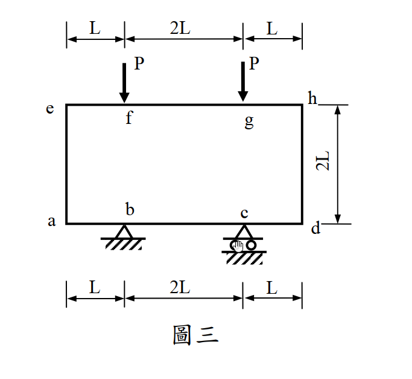

# 考題編號：SA-2012-3

**主分類：** `SA-U3-1` 傾角變位法與剛架分析
**副分類：** `SA-U3-2` 
**分析法：** 傾角變位法 (Slope-Deflection Method) 或 彎矩分配法
**標籤：** `對稱剛架`, `傾角變位法`, `彎矩圖`, `變形曲線`, `懸臂變位`

---

## 1. 原始題目重述 (Problem Restatement)

剛架，如圖三所示。結構之所有梁及柱之斷面性質 ($EI$ 及 $EA$) 皆相同。試繪製剛架之彎矩圖與變形曲線。(25 分)

*(圖三說明：一個封閉的矩形剛架。頂部梁長度為 $4L$ (分為 $L, 2L, L$)，在距左右兩端 $L$ 處 (f, g點) 各承受一向下集中載重 $P$。兩側柱子高度為 $2L$。底部梁長度亦為 $4L$，在距左右兩端 $L$ 處 (b, c點) 有支承，b 為鉸支承，c 為滾支承。)*

*圖說：本題為對稱之剛架，跨度4L，高度2L。頂部承載兩個對稱的P力，底部有不對稱的鉸支撐與滾支撐，但載重對稱故無整體側移。*

## 2. 考題核心精神與出題者意圖 (Core Concepts & Examiner's Intent)

本題為非常經典且具備高度幾何對稱性的封閉剛架問題，核心測驗點在於：
1. **對稱性簡化與側移判斷**：結構幾何與載重完全對稱，無水平外力。雖然底部支承為一鉸一滾（不完全對稱），但在對稱垂直載重作用下，結構不會產生整體的水平側移 (Sway)，因此可以利用對稱性大幅簡化未知數（右半邊轉角為左半邊之反向）。
2. **底梁的懸臂變位與弦位角 ($R$) 處理**：底部的 a-b 段與 c-d 段實質上是「具有垂直位移」的懸臂段。柱子承受頂部傳來的向下軸力，將頂部載重傳遞至 a 點與 d 點，使得 a 點與 d 點產生對稱的垂直下沉 $\Delta$。這會在 a-b 桿件中引入剛體旋轉角 (弦位角) $R$。能否準確列出考慮弦位角的傾角變位方程式是本題的關鍵。
3. **軸向剛度 ($EA$) 相同的迷惑性**：題目特別標註 $EA$ 相同，實為測驗考生是否會被干擾。實際上，因為結構對稱且柱子受壓均勻，軸向變形只會讓頂梁整體平移下沉，**完全不會引入額外的相對桿端位移（無彎曲效應）**，因此在傾角變位法中可忽略軸向變形對彎矩分佈的影響。

## 3. 解題戰略地圖與陷阱分析 (Strategic Roadmap & Trap Analysis)

**解題策略：**
1. **定義節點與參數**：取結構左半邊分析（節點 e, a, b）。令基本剛度參數 $k = EI/L$。利用對稱性設定右半節點轉角。
2. **計算固端彎矩 (FEM)**：頂梁 e-h 承受對稱集中載重，利用公式求出端點 e 的固端彎矩。
3. **建立傾角變位方程式**：
   - 頂梁 e-h：有固端彎矩，無相對變位。
   - 柱 e-a：無側移，無相對變位。
   - 底梁 a-b：a 點下沉 $\Delta_a$，產生弦位角 $R = \Delta_a / L$。
   - 底梁 b-c：跨中央對稱，無相對變位。
4. **設立平衡方程式**：
   - 節點 e 彎矩平衡：$\sum M_e = 0$
   - 節點 a 彎矩平衡：$\sum M_a = 0$
   - 節點 b 彎矩平衡：$\sum M_b = 0$
   - **剪力平衡 (關鍵)**：由整體對稱性，柱 e-a 承受下壓力 $P$。對 a-b 桿件取力矩平衡，可得 $M_{ab} + M_{ba}$ 與 $P$ 的關係。
5. **求解與繪圖**：解出轉角 $\theta$ 與弦位角 $R$，回代求得各端彎矩，繪製彎矩圖 (BMD) 與變形曲線。

**陷阱分析：**
- **陷阱一：忽略底梁 a 點的垂直位移 ($R=0$)**。若誤以為 a 點為固定點，未考慮柱子下壓導致的懸臂下沉，將得到完全錯誤的彎矩分佈。
  > **應對：** 凡是端點未直接受垂直支承的水平桿件，均須檢查端點是否有垂直位移。
- **陷阱二：誤判柱子的剪力與側移**。因為支承為鉸支與滾支，考生可能以為會側移。
  > **應對：** 載重與幾何對稱即可判定無側移。此外，無水平外力代表柱剪力為零，其內部彎矩為常數。
- **陷阱三：受 $EA$ 相同干擾計算軸向變形**。
  > **應對：** 傾角變位法基本假設不考慮軸向變形，除非軸向變形會造成非對稱側移。本題軸向變形僅產生剛體平移，不影響彎矩，直接忽略。

## 3.5 變數層次分析 (Variable Hierarchy Analysis)

### 最終目標
`透過對稱性與傾角變位法，求出結構各桿端彎矩，以繪製精確的彎矩圖與變形曲線。`

### 本題關鍵公式（依計算順序）
- 頂梁固端彎矩計算：
  $$FEM_{eh} = - \left( \frac{P \cdot L \cdot (3L)^2}{(4L)^2} + \frac{P \cdot 3L \cdot (L)^2}{(4L)^2} \right)$$
- 傾角變位方程式 (包含弦位角 $R$)：
  $$M_{ij} = \frac{2EI}{L_{ij}} (2\theta_i + \theta_j - 3R_{ij}) + FEM_{ij}$$
- 節點平衡方程式：
  $$\sum M_{\text{node}} = 0$$
- a-b 桿件剪力平衡 (由柱子傳來的軸力 $P$)：
  $$\sum M_b = 0 \Rightarrow M_{ab} + M_{ba} - P \times L = 0$$

### L1：題目直接給定
| 符號 | 數值 | 說明 |
|---|---|---|
| $P$ | $P$ | 頂部施加的對稱集中載重 |
| $L$ | $L$ | 基本長度單位 |
| $EI$ | $EI$ | 所有桿件抗彎剛度 |

### L2：需知識點推導
| 符號 | 公式／來源 | 卡關? |
|---|---|---|
| **參數定義** | | |
| $k$ | $EI/L$ | |
| $\theta_h$ | $-\theta_e$ (對稱性) | |
| $\theta_d$ | $-\theta_a$ (對稱性) | |
| $\theta_c$ | $-\theta_b$ (對稱性) | |
| **固端彎矩** | | |
| $FEM_{eh}$ | $- \frac{9PL + 3PL}{16} = -0.75 PL$ | |
| **未知變數** | | |
| $R$ | $\Delta_a / L$ (底梁 a-b 段弦位角) | |

### L3：深層知識（不懂就卡住）
| 知識點 | 說明 | 卡關? |
|---|---|---|
| 懸臂變位與弦位角 | a 點因柱子傳來的壓力而下沉，形成順時針的弦位角 $R$，必須在 $M_{ab}, M_{ba}$ 的方程式中加入 $+3R$ 的項（定義順時針位移角時，公式內為 $-3(-R) = +3R$）。 | |
| 局部剪力平衡建立 | 要解出額外的未知數 $R$，必須找到額外的方程式。利用 a-b 段的自由體圖，左端受 $P$ 下壓，對 b 點取矩 $\sum M_b = 0$ 得到 $M_{ab} + M_{ba} = PL$。 | |

## 4. 步驟化詳細計算過程 (Step-by-Step Detailed Calculation)

### Step 1：固端彎矩與參數設定
令 $k = EI/L$。
利用對稱性，右半邊轉角為左半邊的反向：$\theta_h = -\theta_e$, $\theta_d = -\theta_a$, $\theta_c = -\theta_b$。
頂梁 e-h (長度 $4L$) 在距端點 $L$ 處有兩集中力 $P$：
$$FEM_{eh} = - \left( \frac{P(L)(3L)^2}{(4L)^2} + \frac{P(3L)(L)^2}{(4L)^2} \right) = - \frac{9PL + 3PL}{16} = \mathbf{-0.75 PL}$$
*(負號代表逆時針)*

### Step 2：建立傾角變位方程式
1. **頂梁 e-h (長 $4L$)**：
   $$M_{eh} = \frac{2EI}{4L} (2\theta_e + \theta_h) + FEM_{eh} = 0.5k (2\theta_e - \theta_e) - 0.75 PL = \mathbf{0.5k \theta_e - 0.75 PL}$$
2. **柱 e-a (長 $2L$)**：
   $$M_{ea} = \frac{2EI}{2L} (2\theta_e + \theta_a) = \mathbf{k (2\theta_e + \theta_a)}$$
   $$M_{ae} = \frac{2EI}{2L} (2\theta_a + \theta_e) = \mathbf{k (2\theta_a + \theta_e)}$$
3. **底梁懸臂段 a-b (長 $L$)**：
   a 點下沉 $\Delta_a$，弦位角為順時針，定義 $R = \Delta_a / L$ (順時針為負，代入公式為 $-3(-R) = +3R$)：
   $$M_{ab} = \frac{2EI}{L} (2\theta_a + \theta_b + 3R) = \mathbf{2k (2\theta_a + \theta_b + 3R)}$$
   $$M_{ba} = \frac{2EI}{L} (2\theta_b + \theta_a + 3R) = \mathbf{2k (2\theta_b + \theta_a + 3R)}$$
4. **底梁中央段 b-c (長 $2L$)**：
   $$M_{bc} = \frac{2EI}{2L} (2\theta_b + \theta_c) = k (2\theta_b - \theta_b) = \mathbf{k \theta_b}$$

### Step 3：節點平衡與剪力平衡條件
1. **節點 e 彎矩平衡**：
   $$M_{eh} + M_{ea} = 0 \Rightarrow (0.5k \theta_e - 0.75 PL) + k(2\theta_e + \theta_a) = 0$$
   $$\Rightarrow \mathbf{2.5k \theta_e + k \theta_a = 0.75 PL} \quad \cdots (1)$$
2. **節點 a 彎矩平衡**：
   $$M_{ae} + M_{ab} = 0 \Rightarrow k(2\theta_a + \theta_e) + 2k(2\theta_a + \theta_b + 3R) = 0$$
   $$\Rightarrow \mathbf{k \theta_e + 6k \theta_a + 2k \theta_b + 6k R = 0} \quad \cdots (2)$$
3. **節點 b 彎矩平衡**：
   $$M_{ba} + M_{bc} = 0 \Rightarrow 2k(2\theta_b + \theta_a + 3R) + k \theta_b = 0$$
   $$\Rightarrow \mathbf{2k \theta_a + 5k \theta_b + 6k R = 0} \quad \cdots (3)$$
4. **a-b 桿件剪力平衡**：
   由頂梁 e-h 對稱性，柱 e-a 承受軸壓 $P$。該壓力作用於 a 點，使得 a-b 桿件左端承受向下外力 $P$。
   對 b 點取力矩 $\sum M_b = 0 \Rightarrow M_{ab} + M_{ba} - P \times L = 0$
   $$\Rightarrow \mathbf{M_{ab} + M_{ba} = PL}$$
   展開代入：$2k(3\theta_a + 3\theta_b + 6R) = PL \Rightarrow \mathbf{6k \theta_a + 6k \theta_b + 12k R = PL} \quad \cdots (4)$$

### Step 4：聯立求解
由 (4) 式可得：$6k R = 0.5 PL - 3k \theta_a - 3k \theta_b$。代入 (2) 與 (3) 式消去 $R$：
- (2) 代入：$k \theta_e + 3k \theta_a - k \theta_b = -0.5 PL \quad \cdots (5)$
- (3) 代入：$-k \theta_a + 2k \theta_b = -0.5 PL \quad \cdots (6)$

解 (1)、(5)、(6) 三元一次聯立方程式：
由 (6) 得 $\theta_b = 0.5 \theta_a - 0.25 PL/k$
由 (1) 得 $\theta_e = -0.4 \theta_a + 0.3 PL/k$
代入 (5) 整理後得：$2.1 \theta_a = -1.05 PL/k$
求得極簡結果：
- $\mathbf{\theta_a = -0.5 \frac{PL}{k}}$ (逆時針)
- $\mathbf{\theta_b = -0.5 \frac{PL}{k}}$ (逆時針)
- $\mathbf{\theta_e = 0.5 \frac{PL}{k}}$ (順時針)
- $\mathbf{R = \frac{7}{12} \frac{PL}{k}}$

### Step 5：計算各端彎矩
回代傾角變位方程式：
- $M_{eh} = 0.5k(0.5 PL/k) - 0.75 PL = \mathbf{-0.5 PL}$
- $M_{ea} = k(1 - 0.5) PL/k = \mathbf{+0.5 PL}$
- $M_{ae} = k(-1 + 0.5) PL/k = \mathbf{-0.5 PL}$
- $M_{ab} = 2k(-1 - 0.5 + 3(7/12)) PL/k = 2k(0.25) PL/k = \mathbf{+0.5 PL}$
- $M_{ba} = 2k(-1 - 0.5 + 1.75) PL/k = \mathbf{+0.5 PL}$
- $M_{bc} = k(-0.5) PL/k = \mathbf{-0.5 PL}$

> **計算結果總結**：所有桿端的內部彎矩絕對值皆完美等於 $\mathbf{0.5 PL}$，這展現了此對稱結構極高程度的內力分配均勻性。

## 5. 關鍵爭議點與進階探討 (Critical Issues & Advanced Discussion)

### (一) 彎矩圖 (BMD) 分布特徵
以畫在受拉側為原則：
1. **柱 (ea, hd)**：兩端彎矩皆為 $0.5 PL$。左柱 ea 承受常數彎矩，外側 (左側) 受拉；右柱 hd 外側 (右側) 受拉。無剪力。
2. **頂梁 (eh)**：
   - e 點至 f 點：由端點 $-0.5 PL$ (頂部受拉) 線性變化至 f 點 $+0.5 PL$ (底部受拉)，於距 e 點 $0.5L$ 處穿過零點 (反曲點)。
   - f 點至 g 點：受對稱載重影響，維持常數正彎矩 $+0.5 PL$ (底部受拉)。
3. **底梁 (ad)**：
   - a 點至 b 點：由 a 點 $+0.5 PL$ (底部受拉) 線性變化至 b 點 $-0.5 PL$ (頂部受拉)，於距 a 點 $0.5L$ 處穿過反曲點。
   - b 點至 c 點：兩端皆受支承，維持常數負彎矩 $-0.5 PL$ (頂部受拉)。

### (二) 變形曲線 (Elastic Curve) 行為
1. **頂部下陷**：載重 P 使頂梁 e-h 中央下垂。f-g 段呈微笑曲線 (底部受拉)，e-f 與 g-h 呈倒 U 型 (頂部受拉)，各有 1 個反曲點。
2. **柱體外擴**：因柱承受恆定彎矩 (外側受拉)，兩側柱 ea 與 hd 會像燈籠般向外側膨脹彎曲。
3. **底部隆起**：載重 P 經由柱體將 a, d 兩端向下壓。由於 b, c 點被支承托住，底梁如同蹺蹺板，a, d 下沉導致中央 b-c 段向上隆起彎曲 (頂部受拉，呈倒 U 型)。a-b 與 c-d 懸臂段呈 S 型彎曲，各有 1 個反曲點。

### (三) 進階探討：EA 的影響
考題刻意給定「$EA$ 皆相同」，這可能誘使考生引入軸向變形進行複雜的矩陣分析。在手工計算中，傾角變位法通常忽略梁柱的軸向變形。本題中，柱體承受的均勻下壓力確實會導致微小的軸向縮短，但由於結構完全對稱，這僅會造成頂部剛架的剛體平移（整體下沉），並不會引起額外的節點旋轉或非對稱側移。因此，從彎矩分佈的角度來看，$EA$ 的值對最終內力並無影響，僅為煙霧彈。
