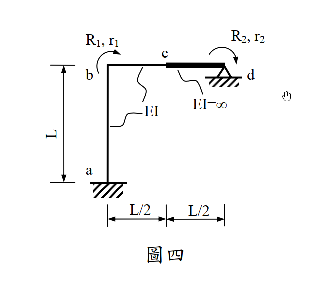

# 考題編號：SA-2012-4

**主分類：** `SA-U4-1` 直接勁度法
**副分類：** `SA-U4-2` 
**分析法：** 直接勁度法 (Direct Stiffness Method) / 傾角變位法原理
**標籤：** `直接勁度法`, `勁度矩陣`, `剛性桿件`, `內部約束`

---

## 1. 原始題目重述 (Problem Restatement)

- **題幹敘述：**
  以直接勁度法 (Direct Stiffness Method) 求下圖剛架之結構勁度矩陣。各桿件之彈性模數 ($E$)、斷面慣性矩 ($I$) 或 ($EI=\infty$) 如圖所示。不考慮軸向變形。(25 分)

- **幾何與條件描述：**
  - a 點為固定端，向上連接長度 $L$、抗彎剛度 $EI$ 的柱 a-b。
  - b 點為左上角節點，向右連接長度 $L/2$、抗彎剛度 $EI$ 的梁 b-c。
  - c 點向右連接長度 $L/2$、抗彎剛度 $EI=\infty$ 的剛性梁 c-d。
  - d 點為鉸支承 (鉸接於地)。
  - 圖中標示兩個自由度：$r_1$ 為 b 點的順時針轉角，$r_2$ 為 d 點的順時針轉角。

*圖說：a 點固定支承，d 點鉸支承。a-b 柱長 $L$、剛度 $EI$，b-c 梁長 $L/2$、剛度 $EI$，c-d 梁為剛性桿長 $L/2$。自由度 $r_1$ 為 b 點順時針轉角，$r_2$ 為 d 點順時針轉角。*

## 2. 考題核心精神與出題者意圖 (Core Concepts & Examiner's Intent)

本題是直接勁度法中極具巧思的「含有無限大剛度桿件 ($EI=\infty$)」題型。出題者的核心測驗點在於：

- **主從自由度 (Master-Slave DOFs) 判別與運動學直覺**：面對剛性桿件 c-d，考生必須具備運動學的直覺。剛性桿不發生撓曲變形，因此 c 點的變位（垂直位移與轉角）完全被 d 點的轉角 $r_2$ 「綁定」（Slave）。系統真正的獨立自由度確切只有題目給定的 $r_1$ 與 $r_2$。
- **形狀函數與幾何相容性 (Geometric Compatibility)**：當系統被施加 $r_2 = 1$ 時，剛性桿 c-d 猶如一個蹺蹺板，帶動 c 點產生向上的垂直位移與相同的轉角。這會在具備柔性的 b-c 桿件中引入相對弦位移（弦角 $\psi$），進而引發額外的剪力與彎矩，這是多數考生最容易忽略的盲點。
- **力矩平衡的轉換與等效節點載重**：在計算勁度矩陣元素 $K_{22}$ 與 $K_{21}$ 時，必須回歸剛性桿 c-d 的靜力平衡，將 b-c 桿件對 c 點施加的剪力與彎矩，精確轉換為對 d 點的等效力矩。

## 3. 解題戰略地圖與陷阱分析 (Strategic Roadmap & Trap Analysis)

**解題戰略：**
1. **確立自由度與運動學邊界條件**：確立獨立自由度向量 $D = [r_1, r_2]^T$。因不考慮軸向變形，故各節點無水平位移，b 點無垂直位移。精確寫出 c 點受 $r_2$ 控制的位移關係式。
2. **求解第一行矩陣元素 ($r_1 = 1, r_2 = 0$)**：鎖定 d 點，使 b 點產生單位旋轉。分析 a-b 柱與 b-c 梁的受力，並藉由節點 b 的力矩平衡求得 $K_{11}$，再透過 c 點的受力對 d 點取力矩求得 $K_{21}$。
3. **求解第二行矩陣元素 ($r_1 = 0, r_2 = 1$)**：鎖定 b 點，使 d 點產生單位旋轉。剛性桿帶動 c 點產生轉角與垂直位移。利用傾角變位方程式求出 b-c 桿的端彎矩與剪力，進而由節點 b 的平衡求 $K_{12}$，對 d 點取力矩求 $K_{22}$。最後藉由 $K_{12} = K_{21}$ 驗證計算。

**關鍵陷阱分析：**
- **陷阱一：忽略 c 點的垂直位移（致命錯誤）**
  - *分析*：若在 $r_2=1$ 時，僅考慮剛性桿傳遞了 $\theta_c=1$ 而遺漏蹺蹺板效應造成的 $v_c = L/2$，將導致 b-c 桿的弦角 $\psi=0$，從而算出完全錯誤的 $K_{22}$ 與 $K_{12}$。
  - *應對*：嚴格畫出剛性桿旋轉後的變形圖，強制標示出所有產生位移的節點坐標變化。
- **陷阱二：剛性桿力臂方向與正負號錯亂**
  - *分析*：計算 d 點的反作用力矩時，b-c 桿對 c 點的剪力方向與力矩正負號極易搞混。
  - *應對*：嚴格遵循「桿端彎矩 $\rightarrow$ 桿件剪力 $\rightarrow$ 節點受力 $\rightarrow$ 對 d 點力矩」的靜力平衡連貫推導，並繪製分離體圖（FBD）。
- **陷阱三：軸向變形假設的誤用**
  - *分析*：若誤將梁或柱的軸向變形納入，會增加不必要的自由度。
  - *應對*：題幹明確指示「不考慮軸向變形」，應直接封鎖 $u_b, v_b, u_c$ 等位移分量。

## 3.5 變數層次分析 (Variable Hierarchy Analysis)

### 最終目標
`精確求出該 2 個自由度系統的 2x2 結構勁度矩陣 [K]`

### 本題關鍵公式（依計算順序）
- 剛性桿位移傳遞：$$ \boxed{v_c} = r_2 \cdot (L_{cd}) $$
- 傾角變位方程式 (無側移)：$$ M_{ij} = \frac{2EI}{L} \left( 2\theta_i + \theta_j \right) $$
- 傾角變位方程式 (含側移弦角)：$$ M_{ij} = \frac{2EI}{L} \left( 2\theta_i + \theta_j - 3\psi \right), \quad \text{其中 } \psi = \frac{\boxed{v_c}}{L_{bc}} $$
- 桿件剪力平衡：$$ V_{c} = \frac{\Sigma M}{L_{bc}} $$
- 剛性桿力矩平衡 (對鉸支承 d)：$$ K_{2j} = \Sigma M_d = M_c + \boxed{V_c} \cdot L_{cd} $$

### L1：題目直接給定
| 符號 | 數值 | 說明 |
|---|---|---|
| $L_{ab}$ | $L$ | a-b 柱長度 |
| $EI_{ab}$ | $EI$ | a-b 柱抗彎剛度 |
| $L_{bc}$ | $L/2$ | b-c 梁長度 |
| $EI_{bc}$ | $EI$ | b-c 梁抗彎剛度 |
| $L_{cd}$ | $L/2$ | c-d 剛性桿長度 |
| $EI_{cd}$ | $\infty$ | c-d 桿抗彎剛度 (剛性) |

### L2：需知識點推導
**狀態一：$r_1=1, r_2=0$**
| 符號 | 公式／來源 | 卡關? |
|---|---|---|
| $K_{11}$ | $\sum M_b = M_{ba} + M_{bc}$ | |
| $V_{c1}$ | $(M_{bc} + M_{cb}) / L_{bc}$ | |
| $K_{21}$ | $M_{cb} (\text{反向}) + V_{c1} \times L_{cd}$ | |

**狀態二：$r_1=0, r_2=1$**
| 符號 | 公式／來源 | 卡關? |
|---|---|---|
| $\psi$ | $v_c / L_{bc}$ | |
| $K_{12}$ | $\sum M_b = M_{ba} + M_{bc}$ | |
| $V_{c2}$ | $(M_{bc} + M_{cb}) / L_{bc}$ | |
| $K_{22}$ | $M_{cb} (\text{反向}) + V_{c2} \times L_{cd}$ | |

### L3：深層知識（不懂就卡住）
| 知識點 | 說明 | 卡關? |
|---|---|---|
| 剛性桿運動學 | $EI=\infty$ 桿件不變形，其端點位移完全由旋轉中心決定（$v = \theta \cdot R$）。 | |
| 弦角 $\psi$ 定義 | 桿件兩端相對垂直位移除以桿長，注意旋轉方向之正負號定義。 | |
| 等效力矩轉換 | 柔性桿對剛性桿施加的內力（彎矩與剪力），必須透過靜力平衡轉換為剛性桿支承點的力矩。 | |

## 4. 步驟化詳細計算過程 (Step-by-Step Detailed Calculation)

### Step 1：定義自由度與變形幾何
- **獨立自由度**：$r_1 = \theta_b$ (順時針)，$r_2 = \theta_d$ (順時針)。
- **運動學約束**：
  - a 為固定端：$\theta_a = 0, u_a = 0, v_a = 0$。
  - 不考慮軸向變形：$u_b = 0, v_b = 0$。
  - c-d 為剛性桿 ($EI=\infty$)，長度 $L/2$，繞 d 點旋轉。當 d 點有順時針轉角 $r_2$ 時，c 點產生對應變形：
    $$ \theta_c = r_2 \quad (\text{順時針}) $$
    $$ v_c = r_2 \cdot (L/2) \quad (\text{因 d 點在右，順時針旋轉使左端 c 點}\textbf{向上}\text{移動}) $$

### Step 2：求勁度矩陣第一行 (令 $r_1 = 1, r_2 = 0$)
> 💡 **策略註解**：此狀態下，b 點順時針旋轉 $1\text{ rad}$，d 點固定。因 $r_2=0$，故剛性桿 c-d 靜止，$v_c = 0, \theta_c = 0$。分別檢視各桿件之受力。

**1. a-b 柱件 (長度 $L$, 剛度 $EI$)**
- $\theta_a = 0, \theta_b = 1, \Delta = 0$。
- 利用傾角變位方程式：
  $$ M_{ba} = \frac{4EI}{L} \theta_b = \frac{4EI}{L} \quad (\text{順時針，作用於梁端}) $$

**2. b-c 梁件 (長度 $L/2$, 剛度 $EI$)**
- $\theta_b = 1, \theta_c = 0, \Delta = 0$。
- 利用傾角變位方程式：
  $$ M_{bc} = \frac{4EI}{L/2} \theta_b = \frac{8EI}{L} \quad (\text{順時針}) $$
  $$ M_{cb} = \frac{2EI}{L/2} \theta_b = \frac{4EI}{L} \quad (\text{順時針}) $$
- **求剪力**：桿件兩端承受順時針彎矩，故需逆時針的剪力力偶平衡。梁左端 b 需受向下力，右端 c 需受向上力。
  $$ V_{c,\text{on\_beam}} = \frac{M_{bc} + M_{cb}}{L/2} = \frac{12EI/L}{L/2} = \frac{24EI}{L^2} \quad (\text{向上}) $$

**3. 組裝 $K_{11}$ 與 $K_{21}$**
- $K_{11}$ 為 b 點對應之約束力矩：
  $$ \mathbf{K_{11}} = \sum M_b = M_{ba} + M_{bc} = \frac{4EI}{L} + \frac{8EI}{L} = \boxed{\frac{12EI}{L}} $$
- $K_{21}$ 為維持 $r_2=0$ 所需施加於 d 點之順時針力矩。
  分析剛性桿 c-d 受 b-c 桿的反作用力：
  - 彎矩：b-c 桿上 $M_{cb}$ 為順時針，故梁對 c 節點施加**逆時針**彎矩 $\frac{4EI}{L}$。
  - 剪力：b-c 桿在 c 端受向上力，故梁對 c 節點施加**向下**力 $\frac{24EI}{L^2}$。
  對 d 點取力矩 (設順時針為正)：
  $$ R_2 = - M_c (\text{逆時針}) + V_c (\text{向下}) \times L/2 $$
  *(注意：c 點在 d 點左側，向下力會對 d 點產生**逆時針**力矩)*
  $$ R_2 = - \left( \frac{4EI}{L} \right) - \left( \frac{24EI}{L^2} \right) \times \frac{L}{2} = - \frac{4EI}{L} - \frac{12EI}{L} = - \frac{16EI}{L} \quad (\text{逆時針}) $$
  因 $r_2$ 定義為順時針，欲維持平衡的外力 $R_2$ 需與內部抵抗力反向，故外部施力：
  $$ \mathbf{K_{21}} = \boxed{+\frac{16EI}{L}} $$

### Step 3：求勁度矩陣第二行 (令 $r_1 = 0, r_2 = 1$)
> 💡 **策略註解**：此狀態下，b 點固定 ($\theta_b=0$)，d 點順時針旋轉 $1\text{ rad}$。剛性桿帶動 c 點產生 $\theta_c = 1$ (順時針) 與 $v_c = L/2$ (向上)。

**1. a-b 柱件**
- 無任何變形，故 $M_{ba} = 0$。

**2. b-c 梁件 (長度 $L/2$)**
- $\theta_b = 0, \theta_c = 1$。
- **計算弦位移與弦角**：右端 c 向上移動 $L/2$，使得弦產生**逆時針**旋轉。
  $$ \psi = \frac{v_c}{L/2} = \frac{L/2}{L/2} = 1 \quad (\text{逆時針}) $$
- 代入傾角變位公式 (設順時針轉角為正)：
  $$ M_{bc} = \frac{2EI}{L/2} \left[ 2\theta_b + \theta_c - 3(-\psi) \right] = \frac{4EI}{L} \left[ 0 + 1 - 3(-1) \right] = \frac{4EI}{L} (4) = \frac{16EI}{L} \quad (\text{順時針}) $$
  $$ M_{cb} = \frac{2EI}{L/2} \left[ 2\theta_c + \theta_b - 3(-\psi) \right] = \frac{4EI}{L} \left[ 2(1) + 0 - 3(-1) \right] = \frac{4EI}{L} (5) = \frac{20EI}{L} \quad (\text{順時針}) $$
- **求剪力**：梁上總順時針彎矩 $= 36EI/L$。平衡需逆時針剪力力偶 $\Rightarrow$ b 端向下，c 端向上。
  $$ V_{c,\text{on\_beam}} = \frac{36EI/L}{L/2} = \frac{72EI}{L^2} \quad (\text{向上}) $$

**3. 組裝 $K_{12}$ 與 $K_{22}$**
- $K_{12}$ 為 b 點對應之約束力矩：
  $$ \mathbf{K_{12}} = \sum M_b = M_{ba} + M_{bc} = 0 + \frac{16EI}{L} = \boxed{\frac{16EI}{L}} $$
  *(與 $K_{21}$ 完美對稱，驗證了麥克斯韋-貝蒂互載定理)*
- $K_{22}$ 為維持 $r_2=1$ 所需施加於 d 點之順時針力矩。
  剛性桿 c-d 受 b-c 桿的反作用力：
  - 彎矩：逆時針 $\frac{20EI}{L}$
  - 剪力：向下 $\frac{72EI}{L^2}$
  對 d 點取力矩 (設順時針為正，計算內部抵抗力矩)：
  $$ M_{\text{internal}} = - \left( \frac{20EI}{L} \right) - \left( \frac{72EI}{L^2} \times \frac{L}{2} \right) = - \frac{20EI}{L} - \frac{36EI}{L} = - \frac{56EI}{L} \quad (\text{逆時針}) $$
  外部平衡力 $R_2$ 需抵抗之，故：
  $$ \mathbf{K_{22}} = \boxed{+\frac{56EI}{L}} $$

### Step 4：統整結構勁度矩陣 $[K]$

將四個元素組合，得到最終結構勁度矩陣：
$$ [K] = \begin{bmatrix} K_{11} & K_{12} \\ K_{21} & K_{22} \end{bmatrix} = \begin{bmatrix} \frac{12EI}{L} & \frac{16EI}{L} \\ \frac{16EI}{L} & \frac{56EI}{L} \end{bmatrix} $$

提出公因式 $\frac{4EI}{L}$，可寫為更簡潔的形式：
$$ \mathbf{[K] = \frac{4EI}{L} \begin{bmatrix} 3 & 4 \\ 4 & 14 \end{bmatrix}} $$

## 5. 關鍵爭議點與進階探討 (Critical Issues & Advanced Discussion)

- **剛性桿的能量觀點 (應變能虛功驗證)**：
  如果在考場上對複雜的靜力平衡正負號感到不安，最強大且絕對無誤的驗證武器是「應變能 (Strain Energy)」。
  在 $r_2 = 1$ 的狀態下，b-c 桿端受力與變形皆為已知，其應變能 $U$ 為端彎矩作功與剪力作功之和：
  $$ U = \frac{1}{2} M_{cb} \theta_c + \frac{1}{2} V_c v_c = \frac{1}{2} \left(\frac{20EI}{L}\right)(1) + \frac{1}{2} \left(\frac{72EI}{L^2}\right)\left(\frac{L}{2}\right) = \frac{10EI}{L} + \frac{18EI}{L} = \frac{28EI}{L} $$
  根據能量守恆定律，外部作功 $W$ 等於內部應變能 $U$：
  $$ W = \frac{1}{2} K_{22} (r_2)^2 = \frac{1}{2} K_{22} (1)^2 = \frac{28EI}{L} $$
  由此可秒殺求得並確認 $K_{22} = \frac{56EI}{L}$ 絕對正確。此方法跳過了容易出錯的力矩方向判斷，是進階考生的必備防呆技巧。
  
- **不考慮軸向變形的前提與影響**：
  題目特別明示「不考慮軸向變形」。若考量軸向變形，b 點與 c 點的水平與垂直位移將不再受到嚴格的幾何約束，矩陣規模將會擴展（例如需要加入 b 點水平、垂直位移及 c 點水平位移等自由度），題目難度與計算量將呈現指數級上升。因此，「不考慮軸向變形」是將系統維度壓縮至 $2 \times 2$ 的絕對核心前提，解題時切勿畫蛇添足將 $u_b, v_b$ 設為未知數。
