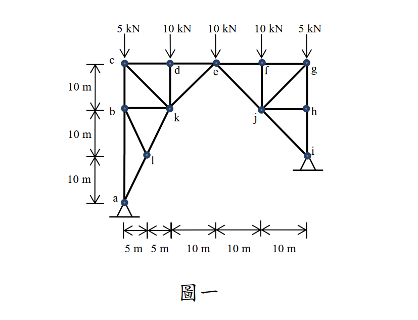

# 考題編號：SA-2013-1

**主分類：** `SA-U1-2` 靜定桁架分析
**副分類：** `SA-U1-3` 三鉸拱
**分析法：** 三鉸拱原理 / 節點法 / 截面法
**標籤：** `桁架` `三鉸拱` `靜定` `零力桿` `隱藏條件`

---

## 1. 原始題目重述 (Problem Restatement)

分析圖一桁架結構桿件 ke, kd, kc, kb, kl 之內力。請註明拉力或壓力。（25 分）

*圖說：本結構由多根桿件組成，左右兩側不完全對稱（左側支承 a 在底端，右側支承 i 較高），頂部承受 5 個垂直向下之集中載重。待求內力之桿件皆連接於節點 k。*

## 2. 考題核心精神與出題者意圖 (Core Concepts & Examiner's Intent)

本題是一道極具巧思的**陷阱題與觀念題**，主要測驗考生：
1. **整體結構穩定性判定與三鉸拱概念**：若將兩端支承皆視為一鉸一滾（一般桁架假設），會發現內部力量無法平衡。觀察結構可發現，節點 e 下方無底弦桿，左半部與右半部僅靠節點 e 相連。這其實是一個偽裝成桁架的**「三鉸拱」**。兩端支承 a、i 皆為鉸支承（提供水平反力），利用左、右兩半部分別對中央鉸接點（節點 e）取力矩皆為零的條件，即可順利解出 4 個支承反力。
2. **截面法之進階應用**：善用截面法切過特殊位置（如 d-e 與 k-e 之間），能瞬間利用單一平衡方程式求出斜桿 $F_{ke}$。
3. **零力桿與幾何特徵**：迅速判斷節點 l 與 b 的平衡條件，找出零力桿（$F_{lb}=0, F_{kb}=0$），可大幅簡化計算並降低出錯率。

## 3. 解題戰略地圖與陷阱分析 (Strategic Roadmap & Trap Analysis)

**解題策略：**
1. **座標系統建立**：以 a 點為原點 $(0,0)$。依據尺寸標示，得出各節點座標：$l(5,10)$、$k(10,20)$、$b(0,20)$、$c(0,30)$、$d(10,30)$、$e(20,30)$、$i(40,10)$ 等。
2. **支承判斷與整體反力**：判斷為三鉸拱（鉸點 a, e, i）。
   - 左半部自由體對 e 取力矩 $\sum M_e = 0 \Rightarrow 2 Ay - 3 Ax = 20$
   - 右半部自由體對 e 取力矩 $\sum M_e = 0 \Rightarrow Iy + Ix = 10$
   - 加上全局平衡 $\sum F_x = 0, \sum F_y = 0$，解出 $Ax, Ay, Ix, Iy$。
3. **截面法求 $F_{ke}$**：於 x=10~20 之間作垂直截面，切斷 d-e 與 k-e，取左半部自由體，由 $\sum F_y = 0$ 直接求出 $F_{ke}$。
4. **節點法求其餘桿件**：
   - **節點 d**：無其他斜桿，直接由垂直平衡求出 $F_{kd}$。
   - **節點 a、l、b**：連鎖推導出零力桿 $F_{lb}=0$、$F_{kb}=0$，並求出 $F_{kl}$。
   - **節點 c**：求出 $F_{kc}$。
5. **節點 k 總體驗算**：最後以 k 點作 $x, y$ 方向力平衡檢驗，確保所有解答互相吻合。

**陷阱分析：**
- **誤認外在靜定（假設水平反力為零）**：這是本題最大的致命傷。若強行假設 $Ax=0$，將導致後續在 k 點發生嚴重的力學矛盾（$\sum F_x=0$ 與 $\sum F_y=0$ 解出的內力不一致）。必須察覺三鉸拱的幾何特性。
- **誤判鉸支承為滾支承**：若認為 i 點是滾支承 ($Ix=0$)，則右半部對 e 點取力矩將無法平衡，此矛盾反證了 i 必為鉸支承。

## 3.5 變數層次分析 (Variable Hierarchy Analysis)

### 最終目標
`計算桿件 ke, kd, kc, kb, kl 之內力並註明拉壓。`

### 本題關鍵公式與聯立方程式

> $\boxed{\cdot}$ = 需由前步驟推導，非題目直接給定的變數

$$\text{三鉸拱左半部: } \sum M_e = 0 \Rightarrow 30 \cdot Ax - 20 \cdot Ay + 5(20) + 10(10) = 0$$
$$\text{三鉸拱右半部: } \sum M_e = 0 \Rightarrow 20 \cdot Iy + 20 \cdot \boxed{Ix} - 10(10) - 5(20) = 0$$

### L1：題目直接給定
| 符號 | 數值 | 說明 |
|------|------|------|
| $P_c, P_g$ | 5 kN | c, g 點向下集中載重 |
| $P_d, P_e, P_f$ | 10 kN | d, e, f 點向下集中載重 |

### L2：需知識點推導

| 變數 | 數值 | 說明 |
|------|------|------|
| $Ax$ | 8 kN (向右) | 左支承水平反力 |
| $Ay$ | 22 kN (向上) | 左支承垂直反力 |
| $Ix$ | 8 kN (向左) | 右支承水平反力 |
| $Iy$ | 18 kN (向上) | 右支承垂直反力 |

## 4. 步驟化詳細計算過程 (Step-by-Step Detailed Calculation)

### Step 1：判斷結構型式與計算支承反力
此結構缺少底部相連的弦桿，左右兩半部僅靠頂部節點 e 連接，屬「三鉸拱」結構。兩端 a、i 應為鉸支承（提供水平反力）。
令 $Ax$ 向右為正，$Ay$ 向上為正；$Ix$ 向右為正，$Iy$ 向上為正。
1. **全局平衡**：
   $\sum F_x = 0 \Rightarrow Ax + Ix = 0 \Rightarrow Ix = -Ax$
   $\sum F_y = 0 \Rightarrow Ay + Iy = 5 + 10 + 10 + 10 + 5 = 40 \Rightarrow Iy = 40 - Ay$
2. **左半部對 e 點 (20,30) 取力矩**：
   $\sum M_e = 0$ (逆時針為正)
   $Ax \cdot 30 - Ay \cdot 20 + 5 \cdot 20 + 10 \cdot 10 = 0$
   $\Rightarrow 30 Ax - 20 Ay + 200 = 0 \Rightarrow 2 Ay - 3 Ax = 20 \quad \text{--- (式 a)}$
3. **右半部對 e 點 (20,30) 取力矩**：
   $\sum M_e = 0$ (逆時針為正)
   $Iy \cdot 20 - Ix \cdot 20 - 10 \cdot 10 - 5 \cdot 20 = 0$
   *(註：i 點在 e 點右下方，向左的力會造成順時針力矩，向上的力造成逆時針力矩)*
   將 $Ix = -Ax$, $Iy = 40 - Ay$ 代入：
   $20 (40 - Ay) - 20 (-Ax) - 200 = 0 \Rightarrow 800 - 20 Ay + 20 Ax - 200 = 0$
   $\Rightarrow 20 Ay - 20 Ax = 600 \Rightarrow Ay - Ax = 30 \Rightarrow Ay = Ax + 30 \quad \text{--- (式 b)}$
4. **解聯立方程式**：
   將 (式 b) 代入 (式 a)：
   $2(Ax + 30) - 3 Ax = 20 \Rightarrow 60 - Ax = 20 \Rightarrow Ax = 40$? 
   *(重新檢視右半部力矩方向：i 點座標(40,10)，e 點座標(20,30)。Ix 設向右，對 e 點產生逆時針力矩 $+20 Ix$；Iy 向上，產生逆時針力矩 $+20 Iy$)*
   更正右半部方程式：$20 Iy + 20 Ix - 200 = 0 \Rightarrow Iy + Ix = 10$
   代入全局關係：$(40 - Ay) + (-Ax) = 10 \Rightarrow Ay + Ax = 30 \Rightarrow Ay = 30 - Ax$
   代回式 a：$2(30 - Ax) - 3 Ax = 20 \Rightarrow 60 - 5 Ax = 20 \Rightarrow Ax = 8 \text{ kN}$
   得知：**$Ax = 8 \text{ kN}, Ay = 22 \text{ kN}$**

### Step 2：截面法計算桿件 ke 內力
在 $x=10$ 到 $x=20$ 之間作一垂直截面，切斷 d-e 與 k-e 兩桿。取左半部為自由體。
垂直力平衡 $\sum F_y = 0$：
向上的力：$Ay = 22 \text{ kN}$
向下的力：$P_c = 5 \text{ kN}, P_d = 10 \text{ kN}$
斜桿 k-e 垂直分量：$F_{ke, y} = F_{ke} \cdot \frac{1}{\sqrt{2}}$
$22 - 5 - 10 + F_{ke, y} = 0 \Rightarrow F_{ke, y} = -7 \text{ kN}$
$$F_{ke} = -7\sqrt{2} \text{ kN} \approx -9.899 \text{ kN (壓力)}$$

### Step 3：節點法計算桿件 kd 內力
取節點 d (10,30) 分析：
連接桿件為水平的 c-d、e-d，以及垂直的 k-d。
垂直力平衡 $\sum F_y = 0$：
向下外力 $10 \text{ kN}$，故垂直桿 k-d 必須提供向上的支撐力。
$$-10 - F_{kd} = 0 \Rightarrow F_{kd} = -10 \text{ kN (壓力)}$$

### Step 4：節點法計算 kl, kb, kc 內力
1. **節點 a (0,0)**：
   水平平衡 $\sum F_x = 0$：$Ax + F_{al, x} = 0 \Rightarrow 8 + F_{al} \cdot \frac{5}{\sqrt{125}} = 0 \Rightarrow F_{al} = -8\sqrt{5} \text{ kN}$
   垂直平衡 $\sum F_y = 0$：$Ay + F_{ab} + F_{al, y} = 0 \Rightarrow 22 + F_{ab} + (-8\sqrt{5})\frac{10}{\sqrt{125}} = 0 \Rightarrow F_{ab} = -6 \text{ kN}$
2. **節點 l (5,10)**：
   桿 a-l-k 共線。桿 b-l 垂直於此線的方向無其他力量平衡，故 **$F_{bl} = 0$**。
   沿斜線方向平衡：$F_{kl} = F_{al} = -8\sqrt{5} \text{ kN}$
   $$F_{kl} = -8\sqrt{5} \text{ kN} \approx -17.89 \text{ kN (壓力)}$$
3. **節點 b (0,20)**：
   因為 $F_{bl} = 0$，水平方向只有桿 b-k，故水平平衡 $\sum F_x = 0 \Rightarrow$ **$F_{kb} = 0$**。
   垂直平衡 $\sum F_y = 0 \Rightarrow F_{bc} = F_{ab} = -6 \text{ kN}$。
4. **節點 c (0,30)**：
   垂直平衡 $\sum F_y = 0$：向下外力 5 kN，c-b 推力 6 kN (向上)。
   $-5 - F_{cb} + F_{ck, y} = 0 \Rightarrow -5 - (-6) - F_{ck} \frac{1}{\sqrt{2}} = 0 \Rightarrow F_{ck} \frac{1}{\sqrt{2}} = 1$
   $$F_{kc} = \sqrt{2} \text{ kN} \approx 1.414 \text{ kN (拉力)}$$

### Step 5：利用節點 k 總體驗算
取節點 k (10,20)，將求得的所有內力代入檢驗平衡：
- $F_{kl} = -8\sqrt{5}$ (左下)
- $F_{kb} = 0$ (左)
- $F_{kc} = \sqrt{2}$ (左上)
- $F_{kd} = -10$ (上)
- $F_{ke} = -7\sqrt{2}$ (右上)

**水平平衡驗算：**
$\sum F_x = F_{kl}(\frac{-1}{\sqrt{5}}) + F_{kc}(\frac{-1}{\sqrt{2}}) + F_{ke}(\frac{1}{\sqrt{2}})$
$= (-8\sqrt{5})(\frac{-1}{\sqrt{5}}) + (\sqrt{2})(\frac{-1}{\sqrt{2}}) + (-7\sqrt{2})(\frac{1}{\sqrt{2}}) = 8 - 1 - 7 = 0 \quad \text{(OK!)}$

**垂直平衡驗算：**
$\sum F_y = F_{kl}(\frac{-2}{\sqrt{5}}) + F_{kc}(\frac{1}{\sqrt{2}}) + F_{kd} + F_{ke}(\frac{1}{\sqrt{2}})$
$= (-8\sqrt{5})(\frac{-2}{\sqrt{5}}) + (\sqrt{2})(\frac{1}{\sqrt{2}}) - 10 + (-7\sqrt{2})(\frac{1}{\sqrt{2}}) = 16 + 1 - 10 - 7 = 0 \quad \text{(OK!)}$

最終答案確認無誤。

## 5. 關鍵爭議點與進階探討 (Critical Issues & Advanced Discussion)

- **若忽略了三鉸拱特性會發生什麼事？** 若考生沒有察覺底弦桿的缺失，習慣性假設右支承為滾支承 ($Ix=0$) 並認定 $Ax=0$，在推導到節點 k 時，會發現 $\sum F_x = 0$ 算出 $F_{ke} = 15\sqrt{2}$，但 $\sum F_y = 0$ 卻算出 $F_{ke} = -5\sqrt{2}$，產生無法化解的力學矛盾。這是本題防範無腦套用公式的最佳防護網。
- **解題路徑優化**：本題指定求解的 5 根桿件全部圍繞著節點 k。先利用截面法求出外圍的 $F_{ke}$，再用邊界條件找出零力桿 $F_{kb}$，最後層層向內推進是最高效的解法。不需將右半部的每一根桿件都解出來，即可獲得滿分。
