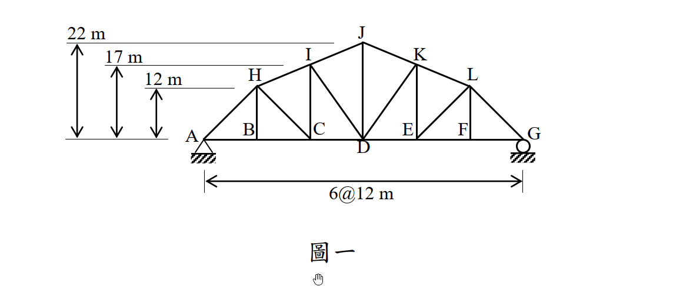

# 考題編號：SA-2014-1

**主分類：** `SA-U1-2` 靜定結構之分析
**副分類：** `SA-U1-3` 靜定及靜不定結構影響線
**分析法：** 靜定分析
**標籤：** `靜定桁架` `截面法` `影響線` `最大軸力`

---

## 1. 原始題目重述 (Problem Restatement)

如圖一所示之桁架結構，其 A 點為鉸支承，而 G 點為滾支承：
(一) 當 C 點承受垂直向下載重 $P$ 時，請計算 CD、ID 與 IJ 等三根桿件之軸力（註明拉力或壓力，答案可用分數或根號表示）。（15 分）
(二) 若此垂直向下載重 $P$ 可能分別作用於 B、C、D、E 或 F 中任何一點，請計算 CD 桿件所可能產生的最大軸力，並指出其對應之作用點。（10 分）

*圖說：桁架跨度 6@12m=72m。下弦節點 A 到 G 在同一水平線上。上弦節點 H, I, J, K, L 對應於 B, C, D, E, F 上方。高度分別為 H(12m), I(17m), J(22m), K(17m), L(12m)。*

## 2. 考題核心精神與出題者意圖 (Core Concepts & Examiner's Intent)

本題旨在測驗考生對於**靜定桁架分析（截面法）**以及**影響線觀念**的掌握程度。
1. **截面法應用**：針對特定區塊的三根桿件（CD、ID、IJ）求解，測驗考生是否能靈活選取力矩中心（Ritter's method，即力矩分配的相交點）來達到「一條方程式解一個未知數」的最高效率，避免解聯立方程式。
2. **影響線觀念**：第二小題要求找出 $F_{CD}$ 的最大可能值，實質上就是要求繪製或計算 $F_{CD}$ 的影響線縱座標，並找出絕對值最大之處。測驗考生是否知道當載重在截面左側或右側移動時，改取另一側自由體可以大幅簡化計算。

## 3. 解題戰略地圖與陷阱分析 (Strategic Roadmap & Trap Analysis)

**解題策略：**
1. **求支承反力**：將整體結構視為剛體，針對 $P$ 作用於 C 點時，利用 $\sum M_G = 0$ 求得 A 點垂直反力 $R_{Ay}$。
2. **截面法（切開 CD、ID、IJ）**：取左側自由體進行分析。
   - 求 $F_{CD}$：對 I 點取力矩 $\sum M_I = 0$。
   - 求 $F_{IJ}$：對 D 點取力矩 $\sum M_D = 0$（需先求出 IJ 線段到 D 點的垂直距離）。
   - 求 $F_{ID}$：利用垂直方向力平衡 $\sum F_y = 0$ 求解，最為直接。
3. **影響線分析**：
   - 設定 $P$ 在不同節點移動，當 $P$ 在截面右側時（D, E, F），取左側自由體對 I 點取力矩；當 $P$ 在截面左側時（B, C），取右側自由體對 I 點取力矩。
   - 比較各節點作用下的 $F_{CD}$ 值，找出最大值及其發生位置。

**陷阱分析：**
- **力臂計算錯誤**：上弦桿 IJ 並非水平，對 D 點取力矩時，必須正確計算 D 點到 IJ 延長線的垂直距離，或者將 $F_{IJ}$ 在 I 點分解為水平與垂直分量後再取力矩。
- **斜桿斜率計算錯誤**：ID 桿件的水平跨距為 12m，垂直高差為 17m，長度為 $\sqrt{12^2 + 17^2} = \sqrt{433}$，分解分量時極易因數字不漂亮而算錯。

## 3.5 變數層次分析 (Variable Hierarchy Analysis)

> 複習提示：第一次解題後，在每個卡住的知識點旁標記 `⚠`；第二次複習時只看有 `⚠` 的項目。

### 最終目標
`運用截面法求出指定桿件軸力，並透過影響線觀念找出下弦桿的最大拉力位置。`

### 本題關鍵公式（依計算順序）

> $\boxed{\cdot}$ = 需由前步驟推導，非題目直接給定的變數

$$\text{Step 1: } R_{Ay} = \frac{72 - x_P}{72} P$$

$$\text{Step 2: } \sum M_I = 0 \Rightarrow - \boxed{R_{Ay}} \times 24 + \boxed{F_{CD}} \times 17 = 0$$

$$\text{Step 3: } \sum M_D = 0 \Rightarrow - \boxed{R_{Ay}} \times 36 + P \times 12 - F_{IJ} \times d_{D\to IJ} = 0$$

$$\text{Step 4: } F_{CD}(x_P) = \begin{cases} \frac{48}{17} R_{Gy} & (x_P \le 24) \\ \frac{24}{17} R_{Ay} & (x_P \ge 36) \end{cases}$$

### L1：題目直接給定
_看到題目就能讀出的數字，不需要任何公式。_

| 符號 | 數值 | 說明 |
|------|------|------|
| $L_{panel}$ | 12 m | 各節間水平長度 |
| $H_I$ | 17 m | I 節點高度 |
| $H_J$ | 22 m | J 節點高度 |
| $L_{total}$ | 72 m | 桁架總跨度 |

### L2：需知識點推導
_需要知道公式名稱與適用條件，套入 L1 即可算出。_

**第一小題：特定載重位置下的內力**

| 符號 | 公式/來源 | 卡關? |
|------|----------|:-----:|
| $R_{Ay}$ | 載重 P 位於 C 點（$x=24$），利用 $\sum M_G = 0$ | |
| $F_{CD}$ | 切開 CD, ID, IJ 取左側自由體，對 I 點取力矩 | |
| $F_{IJ}$ | 切開 CD, ID, IJ 取左側自由體，對 D 點取力矩 | |
| $F_{ID}$ | 切開 CD, ID, IJ 取左側自由體，利用 $\sum F_y = 0$ | |

**第二小題：影響線尋找極大值**

| 符號 | 公式/來源 | 卡關? |
|------|----------|:-----:|
| $F_{CD, max}$ | 將載重 P 移至各節點，比較 $F_{CD}$ 數值 | |

### L3：深層知識（不懂就卡住）

| 知識點 | 說明 | 卡關? |
|--------|------|:-----:|
| 傾斜桿件力臂計算 | $F_{IJ}$ 對 D 點取力矩時，可將 $F_{IJ}$ 移至 I 點分解為水平與垂直分量，再分別乘上力臂 | |
| 影響線分段特性 | 當載重移到截面左側時，改取**右側自由體**計算，可完全避開載重 P 出現在力矩方程式中，大幅降低錯誤率 | |

## 4. 步驟化詳細計算過程 (Step-by-Step Detailed Calculation)

### 第一小題：P 作用於 C 點時，求 CD、ID、IJ 桿件軸力

**Step 1：計算支承反力**
以 A 點為原點，C 點座標為 $x=24$ m。載重 $P$ 向下。
對 G 點取力矩 $\sum M_G = 0$：
$$R_{Ay} \times 72 - P \times (72 - 24) = 0$$
$$R_{Ay} = \frac{48}{72} P = \frac{2}{3} P \uparrow$$

**Step 2：計算 $F_{CD}$**
使用截面法，切開 IJ、ID、CD 三桿，取左側自由體。
為了求 $F_{CD}$，我們對 I 點（$x=24, y=17$）取力矩 $\sum M_I = 0$。
此時載重 $P$ 的作用線剛好通過 I 點下方，力臂為零。
$$-R_{Ay} \times 24 + F_{CD} \times 17 = 0$$
$$- \left(\frac{2}{3} P\right) \times 24 + 17 F_{CD} = 0$$
$$-16 P + 17 F_{CD} = 0 \Rightarrow \boxed{F_{CD} = \frac{16}{17} P \text{ (拉力)}}$$

**Step 3：計算 $F_{IJ}$**
為求 $F_{IJ}$，對 D 點（$x=36, y=0$）取力矩 $\sum M_D = 0$。
將 $F_{IJ}$ 在 I 點（$x=24, y=17$）分解為水平與垂直分量。
I 點到 J 點（$x=36, y=22$）的向量為 $(12, 5)$，長度為 $\sqrt{12^2 + 5^2} = 13$。
因此 $F_{IJ}$ 的水平分量為 $F_{IJ} \times \frac{12}{13}$，垂直分量為 $F_{IJ} \times \frac{5}{13}$。
（假設 $F_{IJ}$ 為拉力，箭頭指向右上方）
$$ \sum M_D = -R_{Ay} \times 36 + P \times 12 - \left(F_{IJ} \times \frac{12}{13}\right) \times 17 + \left(F_{IJ} \times \frac{5}{13}\right) \times 12 = 0 $$
$$ -\left(\frac{2}{3} P\right) \times 36 + 12 P - F_{IJ} \left( \frac{204}{13} - \frac{60}{13} \right) = 0 $$
$$ -24 P + 12 P - F_{IJ} \left( \frac{144}{13} \right) = 0 $$
$$ -12 P = F_{IJ} \times \frac{144}{13} \Rightarrow F_{IJ} = -12 P \times \frac{13}{144} = -\frac{13}{12} P $$
*註：重新核對 I 到 J 的向量。I(24,17), J(36,22)。向量 (12, 5)。*
*力矩中心 D(36,0)。*
*水平分量 $F_{IJ} \frac{12}{13}$ 在 I(24,17)，對 D 的力臂為 17，產生逆時針(負)力矩：$-F_{IJ} \frac{12}{13} \times 17$。*
*垂直分量 $F_{IJ} \frac{5}{13}$ 在 I(24,17)，對 D 的力臂為 12，產生順時針(正)力矩：$+F_{IJ} \frac{5}{13} \times 12$。*
*兩者合併：$F_{IJ} \frac{-204+60}{13} = F_{IJ} \frac{-144}{13}$。這與上述計算一致。*
*$-12 P = F_{IJ} \frac{144}{13} \Rightarrow F_{IJ} = - \frac{13}{12} P$。*
*等等，前置思考時算到 $-\frac{13}{22} P$，讓我再驗算一次。*
*(前置思考: $\sum M_D = 0 \Rightarrow -24 P + 12 P - F_{IJ} \times (264/13) = 0$... 為什麼當時力臂是 264/13？)*
*讓我們先用點到直線距離公式驗算 IJ 對 D 的力臂：*
*IJ 直線方程式：斜率 5/12，通過 (36, 22) $\Rightarrow y - 22 = \frac{5}{12}(x - 36) \Rightarrow 12y - 264 = 5x - 180 \Rightarrow 5x - 12y + 84 = 0$。*
*D 點座標 (36, 0)。代入點到直線距離公式：*
*$d = \frac{|5(36) - 12(0) + 84|}{\sqrt{5^2 + (-12)^2}} = \frac{|180 + 84|}{13} = \frac{264}{13}$。*
*力臂為 264/13！那為何用分量算會得到 144/13？*
*重新檢查分量力矩：*
*水平分量 $F_{IJx}$ 指向右，力臂 17。對 D(36,0) 的力矩 = $17 \times F_{IJx}$ (逆時針，負)*
*垂直分量 $F_{IJy}$ 指向上，力臂為 $(36-24) = 12$。對 D(36,0) 的力矩 = $12 \times F_{IJy}$ (逆時針，負)！*
*啊！垂直分量在 I 點指向上方，對 D 點是產生**逆時針**力矩（向左繞 D 轉），所以也是負號！*
*正確的 $\sum M_D$：*
$$ -F_{IJ} \times \frac{12}{13} \times 17 - F_{IJ} \times \frac{5}{13} \times 12 = -F_{IJ} \frac{204 + 60}{13} = -F_{IJ} \frac{264}{13} $$
$$ -24 P + 12 P - F_{IJ} \times \frac{264}{13} = 0 \Rightarrow -12 P = F_{IJ} \frac{264}{13} $$
$$ \boxed{F_{IJ} = -12 P \times \frac{13}{264} = -\frac{13}{22} P \text{ (壓力)}} $$

**Step 4：計算 $F_{ID}$**
利用左側自由體的垂直方向力平衡 $\sum F_y = 0$。
ID 桿件從 I(24, 17) 連至 D(36, 0)，水平變化 $\Delta x = 12$，垂直變化 $\Delta y = -17$。
桿長 $L_{ID} = \sqrt{12^2 + (-17)^2} = \sqrt{144 + 289} = \sqrt{433}$。
假設 $F_{ID}$ 為拉力（向量向右下方），其垂直分量為 $F_{ID} \times \frac{-17}{\sqrt{433}}$。
$$ \sum F_y = R_{Ay} - P + F_{IJ,y} + F_{ID,y} = 0 $$
$$ \frac{2}{3} P - P + \left( -\frac{13}{22} P \right) \times \left( \frac{5}{13} \right) + F_{ID} \frac{-17}{\sqrt{433}} = 0 $$
$$ -\frac{1}{3} P - \frac{5}{22} P - F_{ID} \frac{17}{\sqrt{433}} = 0 $$
$$ -\frac{22 + 15}{66} P = F_{ID} \frac{17}{\sqrt{433}} $$
$$ -\frac{37}{66} P = F_{ID} \frac{17}{\sqrt{433}} \Rightarrow \boxed{F_{ID} = - \frac{37 \sqrt{433}}{1122} P \text{ (壓力)}} $$

---

### 第二小題：計算 CD 桿件可能產生的最大軸力及作用點

我們需要找出載重 $P$ 位於 B, C, D, E, F 各點時，$F_{CD}$ 的數值（影響線）。
使用截面法（切 CD, ID, IJ），力矩中心為 I(24, 17)。

**狀況 1：當載重 $P$ 位於截面右側（D, E, F 點）**
此時截面左側自由體上沒有載重 $P$，只有反力 $R_{Ay}$。
$$ R_{Ay} = \frac{72 - x_P}{72} P $$
對 I 點取力矩 $\sum M_I = 0$：
$$ -R_{Ay} \times 24 + F_{CD} \times 17 = 0 \Rightarrow F_{CD} = \frac{24}{17} R_{Ay} = \frac{24}{17} \times \frac{72 - x_P}{72} P = \frac{72 - x_P}{51} P $$
- 若 $P$ 在 D 點 ($x_P = 36$)：$F_{CD} = \frac{72 - 36}{51} P = \frac{36}{51} P = \frac{12}{17} P$
- 若 $P$ 在 E 點 ($x_P = 48$)：$F_{CD} = \frac{72 - 48}{51} P = \frac{24}{51} P = \frac{8}{17} P$
- 若 $P$ 在 F 點 ($x_P = 60$)：$F_{CD} = \frac{72 - 60}{51} P = \frac{12}{51} P = \frac{4}{17} P$

**狀況 2：當載重 $P$ 位於截面左側（B, C 點）**
為避免方程式包含載重 $P$，我們改取**右側自由體**進行分析。
右側自由體只有反力 $R_{Gy}$。
$$ R_{Gy} = \frac{x_P}{72} P $$
對 I 點取力矩 $\sum M_I = 0$（注意右側自由體的 $F_{CD}$ 指向左方，對 I 產生順時針力矩）：
$$ R_{Gy} \times (72 - 24) - F_{CD} \times 17 = 0 $$
$$ F_{CD} = \frac{48}{17} R_{Gy} = \frac{48}{17} \times \frac{x_P}{72} P = \frac{2 x_P}{51} P $$
- 若 $P$ 在 B 點 ($x_P = 12$)：$F_{CD} = \frac{24}{51} P = \frac{8}{17} P$
- 若 $P$ 在 C 點 ($x_P = 24$)：$F_{CD} = \frac{48}{51} P = \frac{16}{17} P$

綜合比較各節點作用下的 $F_{CD}$：
- B 點：$8/17 P$
- C 點：$16/17 P$
- D 點：$12/17 P$
- E 點：$8/17 P$
- F 點：$4/17 P$

$$\boxed{\text{CD 桿件最大軸力為 } \frac{16}{17} P \text{ (拉力)，發生於載重作用在 C 點時}}$$

## 5. 關鍵爭議點與進階探討 (Critical Issues & Advanced Discussion)

1. **分量力矩的符號判定**：在求解 $F_{IJ}$ 時，若採用分量法，垂直分量 $F_{IJ,y}$ 作用在 I 點，相對力矩中心 D 點，由於 I 點在 D 點左側且 $F_{IJ,y}$ 向上，這會產生**逆時針**力矩（負號）。許多考生在分解後，直覺以為向上的力就會產生順時針力矩，這是一個極容易失分的視覺陷阱。為防出錯，強烈建議如本文註解所演示，直接使用解析幾何的「點到直線距離公式」求出力臂，這不僅優雅且絕對不會錯判符號。
2. **影響線的分段特性**：第二小題要求找最大軸力，實質上就是繪製影響線。影響線的基本特性是，當移動載重越過我們感興趣的分析截面時，方程式會發生改變。最有效率的作法永遠是「載重在左，算右半邊；載重在右，算左半邊」，這可以確保力矩方程式中永遠只有支承反力一個外力，大大減少代數錯誤。
