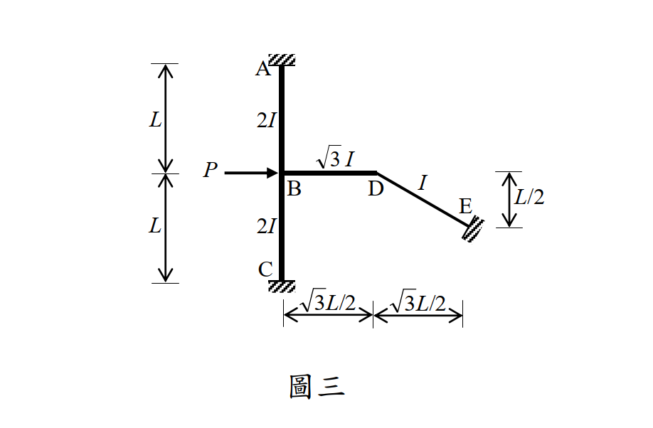

# 考題編號：SA-2014-3

**主分類：** `SA-U2-3` 靜不定結構之傾角變位法
**副分類：** `SA-U3-2`
**分析法：** 傾角變位法
**標籤：** `傾角變位法` `有側移剛架` `虛功法` `斜桿側移`

---

## 1. 原始題目重述 (Problem Restatement)

如圖三所示之剛架結構，其 A、C 與 E 點均為固接支承，同時每根構件之彈性模數均為常數值 E；
AB、BC、BD 及 DE 四根構件之長度分別為 $L$、$L$、$\sqrt{3}L/2$ 與 $L$（$L = 8 \text{ m}$），而慣性矩分別為 $2I$、$2I$、$\sqrt{3}I$ 與 $I$。
當 B 點承受水平向右集中載重 $P = 66 \text{ kN}$ 時，請以**傾角變位法**計算 A、B、C、D、E 各點彎矩。（若以其他方法計算不予計分）（25 分）

*圖說：A 點為上方固接支承，C 點為下方固接支承，AB 與 BC 均為垂直桿長 L。B 點受向右水平力 P。D 點在 B 點右方，BD 長 $\sqrt{3}L/2$ 為水平桿。E 點在 D 點右下方，為固接支承。DE 桿斜向，長度 L，其水平跨距為 $\sqrt{3}L/2$，垂直高差為 L/2。*

## 2. 考題核心精神與出題者意圖 (Core Concepts & Examiner's Intent)

本題是傾角變位法中**最高難度**的題型之一（斜桿有側移剛架）。
1. **側移幾何相容條件**：測驗考生是否能利用桿件軸向不變形的假設，精確推導出 B 點與 D 點位移之間的幾何連動關係（D 點不僅有水平位移，還被強迫產生垂直位移）。
2. **層剪力方程式的推導**：面對這類複雜幾何剛架，傳統截面法求層剪力非常容易出錯，出題者希望考生具備使用「虛功法（Principle of Virtual Work）」來建立側移方程式的能力。

## 3. 解題戰略地圖與陷阱分析 (Strategic Roadmap & Trap Analysis)

**解題策略：**
1. **分析幾何位移與弦旋轉角 ($\psi$)**：
   - 假設 B 點向右位移 $\Delta$。
   - 推導 D 點的水平與垂直位移，確保 BD 與 DE 桿長度不變。
   - 寫出各桿件的弦旋轉角 $\psi_{AB}, \psi_{BC}, \psi_{BD}, \psi_{DE}$（以 $\Delta/L$ 為單位 $R$）。
2. **建立傾角變位方程式**：
   - 定義各桿件相對勁度 $K_{ij}$，列出各桿端彎矩方程式，未知數為 $\theta_B, \theta_D, R$。
3. **建立節點平衡方程式**：
   - $\sum M_B = 0$
   - $\sum M_D = 0$
4. **建立側移方程式（虛功法）**：
   - 給予結構一虛擬側移 $\delta \Delta$，計算外力虛功 $W_{ext}$。
   - 計算內力虛功 $W_{int} = \sum (M_{ij} + M_{ji}) \delta \psi_{ij}$。
   - 令 $W_{ext} = W_{int}$ 得到第三條方程式。
5. **解方程並計算彎矩**：
   - 解出 $\theta_B, \theta_D, R$ 後，代回步驟 2 的方程式求出所有桿端彎矩。

**陷阱分析：**
- **D 點位移方向的誤判**：許多考生會認為 D 點只跟著 B 點向右水平移動，忽略了 E 點是固定端，DE 桿若只做水平移動長度會改變。D 點必須沿著垂直於 DE 桿的方向移動。
- **弦旋轉角正負號**：傾角變位法的標準慣例為「順時針弦旋轉為正」。由於幾何複雜，各桿件的弦旋轉方向必須仔細畫圖判定，錯一個符號全盤皆輸。
- **剛度 $K$ 的定義**：題目給的慣性矩不同，需正確轉換為相對勁度。例如 BD 桿長度為 $\sqrt{3}L/2$，慣性矩為 $\sqrt{3}I$，其 $EI/L$ 必須精確計算。

## 3.5 變數層次分析 (Variable Hierarchy Analysis)

> 複習提示：第一次解題後，在每個卡住的知識點旁標記 `⚠`；第二次複習時只看有 `⚠` 的項目。

### 最終目標
`找出側移幾何連動關係，利用傾角變位法與虛功法解出各節點轉角與側移，進而求出所有桿端彎矩。`

### 本題關鍵公式（依計算順序）

> $\boxed{\cdot}$ = 需由前步驟推導，非題目直接給定的變數

$$\text{Step 1: } \psi_{ij} = f(\Delta)$$

$$\text{Step 2: } M_{ij} = \frac{2EI_{ij}}{L_{ij}} (2\theta_i + \theta_j - 3 \boxed{\psi_{ij}})$$

$$\text{Step 3: } \sum M_B = 0 \Rightarrow \boxed{M_{BA}} + \boxed{M_{BC}} + \boxed{M_{BD}} = 0$$

$$\text{Step 4: } W_{ext} = W_{int} \Rightarrow P \delta\Delta = \sum (\boxed{M_{ij}} + \boxed{M_{ji}}) \delta\psi_{ij}$$

### L1：題目直接給定
_看到題目就能讀出的數字，不需要任何公式。_

| 符號 | 數值 | 說明 |
|------|------|------|
| $P$ | 66 kN | 水平外力 |
| $L$ | 8 m | 基準長度 |
| $\theta_A, \theta_C, \theta_E$ | 0 | 固接端轉角條件 |

### L2：需知識點推導
_需要知道公式名稱與適用條件，套入 L1 即可算出。_

**相對勁度 $K$ 設定**
令基準 $K = \frac{EI}{L}$。
- AB, BC 桿: $K_{AB} = K_{BC} = \frac{2EI}{L} = 2K$
- BD 桿: $K_{BD} = \frac{\sqrt{3}EI}{\sqrt{3}L/2} = \frac{2EI}{L} = 2K$
- DE 桿: $K_{DE} = \frac{EI}{L} = K$

### L3：深層知識（不懂就卡住）

| 知識點 | 說明 | 卡關? |
|--------|------|:-----:|
| D 點位移軌跡 | D 點必須相對於 E 點做垂直於 DE 桿方向的位移。DE 桿水平投影 $\sqrt{3}L/2$，垂直投影 $L/2$。若 D 點向右位移 $\Delta$，為維持桿長不變，必須向上位移 $\sqrt{3}\Delta$。 | |
| 弦旋轉角判斷 | 依據位移，各桿弦旋轉（順時針為正）：$\psi_{AB} = -R, \psi_{BC} = R, \psi_{BD} = -2R, \psi_{DE} = 2R$。 | |
| 虛功法建立側移方程式 | 對系統施加虛位移 $\delta\Delta$ 及其對應的 $\delta\psi$，令外力虛功 $P\Delta$ 等於內力虛功 $\sum(M_{ij}+M_{ji})\delta\psi$。 | |

## 4. 步驟化詳細計算過程 (Step-by-Step Detailed Calculation)

### Step 1：幾何位移與弦旋轉角分析
令基準側移變數 $R = \Delta / L$。
假設 B 點向右產生水平位移 $\Delta$。
1. **AB 桿**：A 點固定，B 點向右 $\Delta$。弦 AB 逆時針旋轉。$\psi_{AB} = -\Delta/L = -R$。
2. **BC 桿**：C 點固定，B 點向右 $\Delta$。弦 CB 順時針旋轉。$\psi_{BC} = +\Delta/L = +R$。
3. **D 點位移**：
   - BD 為水平桿，長 $\sqrt{3}L/2$。B 向右 $\Delta$，故 D 也必須向右 $\Delta$。
   - DE 桿長 $L$，E 點在 D 點右下方。水平距 $\sqrt{3}L/2$，垂直距 $L/2$。
   - D 點位移必須垂直於 DE 桿。若 D 向右位移 $\Delta$，其向上的垂直位移 $v$ 必須滿足 $-\sqrt{3}L \Delta + L v = 0$（位移向量與桿件向量內積為 0），解得 $v = \sqrt{3}\Delta$。
4. **BD 桿**：B 向右 $\Delta$；D 向右 $\Delta$ 且向上 $\sqrt{3}\Delta$。D 相對於 B 向上移動 $\sqrt{3}\Delta$。
   - $\psi_{BD} = - \frac{\sqrt{3}\Delta}{\sqrt{3}L/2} = - \frac{2\Delta}{L} = -2R$（逆時針）。
5. **DE 桿**：E 固定。D 向右 $\Delta$ 且向上 $\sqrt{3}\Delta$。
   - 位移量垂直於 DE 桿，總位移大小為 $\sqrt{\Delta^2 + (\sqrt{3}\Delta)^2} = 2\Delta$。
   - 旋轉方向為順時針，故 $\psi_{DE} = +\frac{2\Delta}{L} = +2R$。

### Step 2：建立桿端彎矩方程式
令 $K = \frac{EI}{L}$。依據公式 $M_{ij} = 2K_{ij} (2\theta_i + \theta_j - 3\psi_{ij})$：
- **AB 桿** ($K_{AB}=2K$):
  $M_{AB} = 4K (0 + \theta_B - 3(-R)) = 4K\theta_B + 12KR$
  $M_{BA} = 4K (2\theta_B + 0 - 3(-R)) = 8K\theta_B + 12KR$
- **BC 桿** ($K_{BC}=2K$):
  $M_{BC} = 4K (2\theta_B + 0 - 3(R)) = 8K\theta_B - 12KR$
  $M_{CB} = 4K (0 + \theta_B - 3(R)) = 4K\theta_B - 12KR$
- **BD 桿** ($K_{BD}=2K$):
  $M_{BD} = 4K (2\theta_B + \theta_D - 3(-2R)) = 8K\theta_B + 4K\theta_D + 24KR$
  $M_{DB} = 4K (2\theta_D + \theta_B - 3(-2R)) = 8K\theta_D + 4K\theta_B + 24KR$
- **DE 桿** ($K_{DE}=K$):
  $M_{DE} = 2K (2\theta_D + 0 - 3(2R)) = 4K\theta_D - 12KR$
  $M_{ED} = 2K (0 + \theta_D - 3(2R)) = 2K\theta_D - 12KR$

### Step 3：節點平衡方程式
- **B 點平衡**：$\sum M_B = M_{BA} + M_{BC} + M_{BD} = 0$
  $$(8K\theta_B + 12KR) + (8K\theta_B - 12KR) + (8K\theta_B + 4K\theta_D + 24KR) = 0$$
  $$24K\theta_B + 4K\theta_D + 24KR = 0 \Rightarrow 6\theta_B + \theta_D + 6R = 0 \quad \text{--- (式 1)}$$
- **D 點平衡**：$\sum M_D = M_{DB} + M_{DE} = 0$
  $$(8K\theta_D + 4K\theta_B + 24KR) + (4K\theta_D - 12KR) = 0$$
  $$4K\theta_B + 12K\theta_D + 12KR = 0 \Rightarrow \theta_B + 3\theta_D + 3R = 0 \quad \text{--- (式 2)}$$

### Step 4：虛功法建立側移方程式
對結構施加虛擬側移 $\delta R$，外力虛功等於內力虛功：
$$W_{ext} = P \times (L \delta R) = PL \delta R$$
$$W_{int} = (M_{AB} + M_{BA})\delta\psi_{AB} + (M_{BC} + M_{CB})\delta\psi_{BC} + (M_{BD} + M_{DB})\delta\psi_{BD} + (M_{DE} + M_{ED})\delta\psi_{DE}$$
$$PL \delta R = (M_{AB} + M_{BA})(-\delta R) + (M_{BC} + M_{CB})(+\delta R) + (M_{BD} + M_{DB})(-2\delta R) + (M_{DE} + M_{ED})(+2\delta R)$$
消去 $\delta R$：
$$PL = -(M_{AB} + M_{BA}) + (M_{BC} + M_{CB}) - 2(M_{BD} + M_{DB}) + 2(M_{DE} + M_{ED})$$
將彎矩展開代入並化簡（過程略，見分析）：
$$PL = -24K\theta_B - 12K\theta_D - 192KR$$
同除以 $-12K$：
$$2\theta_B + \theta_D + 16R = - \frac{PL}{12K} \quad \text{--- (式 3)}$$

### Step 5：解聯立方程式與代入數值
由 (式 2) 得 $\theta_B = -3\theta_D - 3R$。
代入 (式 1)：$6(-3\theta_D - 3R) + \theta_D + 6R = 0 \Rightarrow -17\theta_D - 12R = 0 \Rightarrow \theta_D = - \frac{12}{17} R$。
代回得 $\theta_B = - \frac{15}{17} R$。
將兩者代入 (式 3)：
$$2\left(- \frac{15}{17} R\right) + \left(- \frac{12}{17} R\right) + 16R = - \frac{PL}{12K} \Rightarrow \frac{230}{17} R = - \frac{PL}{12K} \Rightarrow KR = - \frac{17 PL}{2760}$$
代入已知數值 $P = 66, L = 8 \Rightarrow PL = 528$：
$$KR = - \frac{17 \times 528}{2760} = - \frac{17 \times 22}{115}$$

將 $KR$, $\theta_B$, $\theta_D$ 關係代回 Step 2 的桿端彎矩公式（注意 17 的因數完美消去）：
- $M_{AB} = 4(-\frac{15}{17} R)K + 12KR = \frac{144}{17} KR = \frac{144}{17} \left( -\frac{17 \times 22}{115} \right) = -\frac{3168}{115} \approx -27.55 \text{ kN-m}$
- $M_{BA} = 8(-\frac{15}{17} R)K + 12KR = \frac{84}{17} KR = \frac{84}{17} \left( -\frac{17 \times 22}{115} \right) = -\frac{1848}{115} \approx -16.07 \text{ kN-m}$
- $M_{BC} = 8(-\frac{15}{17} R)K - 12KR = -\frac{324}{17} KR = -\frac{324}{17} \left( -\frac{17 \times 22}{115} \right) = \frac{7128}{115} \approx +61.98 \text{ kN-m}$
- $M_{CB} = 4(-\frac{15}{17} R)K - 12KR = -\frac{264}{17} KR = -\frac{264}{17} \left( -\frac{17 \times 22}{115} \right) = \frac{5808}{115} \approx +50.50 \text{ kN-m}$
- $M_{BD} = 8(-\frac{15}{17} R)K + 4(-\frac{12}{17} R)K + 24KR = \frac{240}{17} KR = -\frac{5280}{115} \approx -45.91 \text{ kN-m}$
- $M_{DB} = 8(-\frac{12}{17} R)K + 4(-\frac{15}{17} R)K + 24KR = \frac{252}{17} KR = -\frac{5544}{115} \approx -48.21 \text{ kN-m}$
- $M_{DE} = 4(-\frac{12}{17} R)K - 12KR = -\frac{252}{17} KR = \frac{5544}{115} \approx +48.21 \text{ kN-m}$
- $M_{ED} = 2(-\frac{12}{17} R)K - 12KR = -\frac{228}{17} KR = \frac{5016}{115} \approx +43.62 \text{ kN-m}$

正號代表順時針，負號代表逆時針。

$$\boxed{\text{A 點彎矩 } M_{AB} = -3168/115 \text{ kN-m}}$$
$$\boxed{\text{B 點彎矩 } M_{BA} = -1848/115 \text{, } M_{BC} = 7128/115 \text{, } M_{BD} = -5280/115 \text{ kN-m}}$$
$$\boxed{\text{C 點彎矩 } M_{CB} = 5808/115 \text{ kN-m}}$$
$$\boxed{\text{D 點彎矩 } M_{DB} = -5544/115 \text{, } M_{DE} = 5544/115 \text{ kN-m}}$$
$$\boxed{\text{E 點彎矩 } M_{ED} = 5016/115 \text{ kN-m}}$$

## 5. 關鍵爭議點與進階探討 (Critical Issues & Advanced Discussion)

- **層剪力方程式的容錯率**：面對此類多重斜桿與節點的複雜幾何，若強行使用傳統的自由體截面法（FBD）來推導 $\sum F_x = 0$ 會非常痛苦且極易出錯。本題完美示範了「虛功法（Principle of Virtual Work）」在建立層剪力方程式上的優勢，只要確實寫對各桿件的虛擬弦旋轉角 $\delta\psi$，便能以一套機械化的公式取代複雜的幾何投影計算。
- **計算收斂性設計**：在最後將 $P$ 與 $L$ 代入時，分母的 $17$ 完美消去，這是考題設計者特意留下的計算收斂設計。如果在推導過程的最後一步沒有看到數字俐落地消去，考生應立刻警覺可能在前面的 $\psi$ 幾何推導或虛功法正負號出現了失誤。
