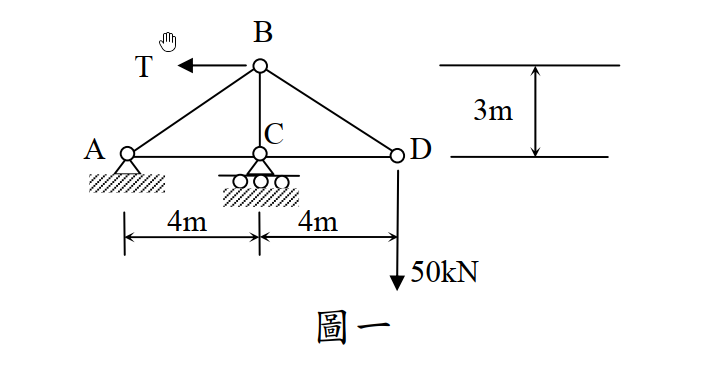

# 考題編號：SA-2015-1

**主分類：** `SA-U1-2` 靜定桁架分析
**副分類：**
**分析法：** 單位力法（虛功原理）
**標籤：** `靜定桁架` `單位力法` `製造誤差` `支承沉陷` `垂直位移`

---

## 1. 原始題目

一平面桁架如圖一所示，點 A 為鉸支承，點 C 為滾支承，點 D 承受一往下垂直載重 $50 \text{ kN}$。若桿件 BD 較原設計縮短 $0.5 \text{ cm}$，點 C 支承下陷 $0.4 \text{ cm}$，假設所有桿件彈性模數與斷面積乘積 $EA = 2 \times 10^5 \text{ kN}$，為使點 D 垂直位移為零，試求點 B 所需施加之水平力量 T。（25 分）

*圖說：A為鉸支承，C為滾支承。跨度AC=4m，CD=4m，高度BC=3m。BD桿有-0.5cm製造誤差，C點有-0.4cm支承沉陷。*

---

## 2. 核心考點

本題為靜定桁架的綜合位移求解問題。要求 D 點垂直位移為零，必須綜合考慮**外力載重**、**製造誤差**以及**支承沉陷**三者對 D 點位移的疊加影響。

---

## 3. 解題戰略地圖

1. **真實系統分析**：建立包含 T 與 50 kN 載重的真實系統，解出支承反力與各桿件內力 $S_i$（以 T 的函數表示）。
2. **虛設系統分析**：在要求位移的 D 點施加向下單位虛力 $1$，解出虛反力 $r_j$ 與虛內力 $u_i$。
3. **虛功原理疊加**：利用外部虛功等於內部虛功的方程式，將真實位移（包含支承沉陷）、真實內力彈性變形、以及製造誤差三者的貢獻代入。
4. **邊界條件求解**：令 D 點總位移 $\Delta_{Dy} = 0$，解出所需水平外力 T。

---

## 3.5 變數層次分析（Variable Hierarchy Analysis）

> 複習提示：第一次解題後，在每個卡住的知識點旁標記 `⚠`；第二次複習時只看有 `⚠` 的項目。

### 最終目標
求出 B 點所需施加的向左水平力 $T$，使得 D 點垂直位移 $\Delta_{Dy} = 0$。

### 本題關鍵公式（依計算順序）

> $\boxed{\cdot}$ = 需由前步驟推導，非題目直接給定的變數

$$\text{Step 1: } S_i = f_i(\boxed{T})$$
$$\text{Step 2: } u_i \text{ (由 } P=1 \text{ 向下求得)}$$
$$\text{Step 3: } 1 \cdot \Delta_{Dy} + \sum \boxed{r_j} \cdot \Delta_j = \sum \boxed{u_i} \left( \frac{\boxed{S_i} L_i}{EA} + \Delta L_{error, i} \right)$$
$$\text{Step 4: } \Delta_{Dy} = 0 \Rightarrow \text{解出 } \boxed{T}$$

### L1：題目直接給定
_看到題目就能讀出的數字，不需要任何公式。_

| 符號 | 數值 | 說明 |
|------|------|------|
| $EA$ | $2 \times 10^5 \text{ kN}$ | 彈性模數與斷面積乘積 |
| $P_D$ | $50 \text{ kN}$ | D點向下外力 |
| $\Delta L_{BD}$ | $-0.005 \text{ m}$ | BD桿縮短誤差（0.5 cm） |
| $\Delta_{Cy}$ | $-0.004 \text{ m}$ | C點支承下陷（0.4 cm） |

### L2：需知識點推導
_需要知道公式名稱與適用條件，套入 L1 即可算出。_

**Step 1：真實系統內力 ($S_i$) 計算**

| 符號 | 公式/來源 | 卡關? |
|------|----------|:-----:|
| $C_y$ | $\sum M_A = 0 \Rightarrow 4 C_y - 50 \times 8 + T \times 3 = 0$ | |
| $A_y$ | $\sum F_y = 0 \Rightarrow A_y = 50 - C_y$ | |
| $S_i$ | 節點平衡法，依序由 D、B、A 節點求出各桿內力 | |

**Step 2：虛設系統內力 ($u_i$) 計算**

| 符號 | 公式/來源 | 卡關? |
|------|----------|:-----:|
| $u_i$ | 於 D 點施加向下單位力 1，其餘外力與 T 皆設為 0 | |
| $r_{Cy}$ | 虛反力 $C_y$ | |

### L3：深層知識（不懂就卡住）
_L2 中某些公式本身需要背景概念才能正確應用的知識點。_

| 知識點 | 說明 | 卡關? |
|--------|------|:-----:|
| 單位力法之虛功方程式 | $W_{ext} = W_{int}$。必須注意虛反力與真實支承沉陷作功的正負號。 | |
| 製造誤差作功正負號 | 虛內力 $u_i$ 為拉力（正）時，配上縮短誤差（負），內部虛功為負值。 | |

---

## 4. 步驟化詳細計算

### 步驟 1：建立真實系統與求取真實內力 ($S_i$)

首先計算支承反力：
由整體平衡 $\sum M_A = 0$（設逆時針為正）：
$$ C_y \times 4 - 50 \times 8 + T \times 3 = 0 \quad \Rightarrow \quad C_y = 100 - 0.75T \text{ (向上)} $$
$$ \sum F_x = 0 \quad \Rightarrow \quad A_x = T \text{ (向右)} $$
$$ \sum F_y = 0 \quad \Rightarrow \quad A_y = 50 - C_y = -50 + 0.75T \text{ (向上)} $$

利用節點法求各桿件真實內力 $S_i$（拉力為正，壓力為負）：
- **節點 D**：
  $$ \sum F_y = 0 \Rightarrow S_{BD} \cdot \frac{3}{5} - 50 = 0 \quad \Rightarrow \quad S_{BD} = \frac{250}{3} \text{ kN} $$
  $$ \sum F_x = 0 \Rightarrow -S_{CD} - S_{BD} \cdot \frac{4}{5} = 0 \quad \Rightarrow \quad S_{CD} = -\frac{200}{3} \text{ kN} $$
- **節點 B**：
  $$ \sum F_x = 0 \Rightarrow -S_{AB} \cdot \frac{4}{5} + S_{BD} \cdot \frac{4}{5} - T = 0 \quad \Rightarrow \quad S_{AB} = \frac{250}{3} - 1.25T \text{ kN} $$
  $$ \sum F_y = 0 \Rightarrow -S_{AB} \cdot \frac{3}{5} - S_{BC} - S_{BD} \cdot \frac{3}{5} = 0 \quad \Rightarrow \quad S_{BC} = -100 + 0.75T \text{ kN} $$
- **節點 A**：
  $$ \sum F_x = 0 \Rightarrow A_x + S_{AC} + S_{AB} \cdot \frac{4}{5} = 0 \quad \Rightarrow \quad S_{AC} = -\frac{200}{3} \text{ kN} $$

### 步驟 2：建立虛設系統與求取虛內力 ($u_i$)

為求 D 點之垂直位移，於虛設系統的 **D 點施加單位力 $1$ (向下)**。
此狀態等同於真實系統中令 $T=0$ 且將 $50 \text{ kN}$ 替換為 $1$，故可直接將上述與 $T$ 無關之項次除以 $50$ 得到虛內力：
- 虛反力：$r_{Cy} = \frac{100}{50} = 2 \text{ (向上)}$
- 虛內力：
  - $u_{BD} = \frac{5}{3}$
  - $u_{CD} = -\frac{4}{3}$
  - $u_{AB} = \frac{5}{3}$
  - $u_{BC} = -2$
  - $u_{AC} = -\frac{4}{3}$

### 步驟 3：虛功方程式計算 D 點垂直位移 ($\Delta_{Dy}$)

根據虛功原理：
$$ W_{ext} = W_{int} $$
$$ 1 \cdot \Delta_{Dy} + \sum r_j \Delta_j = \sum u_i \left( \frac{S_i L_i}{EA} + \Delta L_{error, i} \right) $$

**1. 外部虛功 ($W_{ext}$)**：
包含單位力作功與虛反力在真實支承變位上所作之功。
$$ W_{ext} = 1 \cdot \Delta_{Dy} + r_{Cy} \cdot \Delta_{Cy} = \Delta_{Dy} + (2) \cdot (-0.004) = \Delta_{Dy} - 0.008 \text{ (m)} $$

**2. 內部虛功 ($W_{int}$)**：
包含載重造成的彈性變形與製造誤差作功。
- **製造誤差作功**：
  $$ \sum u_i \Delta L_{error, i} = u_{BD} \cdot \Delta L_{BD} = \left(\frac{5}{3}\right) \cdot (-0.005) = -\frac{1}{120} \text{ m} $$
- **彈性變形作功**：
  彙整各桿件的 $u_i \cdot S_i \cdot L_i$：
  - AB: $\frac{5}{3} \cdot \left(\frac{250}{3} - \frac{5}{4}T\right) \cdot 5 = \frac{6250}{9} - \frac{125}{12}T$
  - BC: $(-2) \cdot \left(-100 + \frac{3}{4}T\right) \cdot 3 = 600 - \frac{54}{12}T$
  - BD: $\frac{5}{3} \cdot \left(\frac{250}{3}\right) \cdot 5 = \frac{6250}{9}$
  - AC: $\left(-\frac{4}{3}\right) \cdot \left(-\frac{200}{3}\right) \cdot 4 = \frac{3200}{9}$
  - CD: $\left(-\frac{4}{3}\right) \cdot \left(-\frac{200}{3}\right) \cdot 4 = \frac{3200}{9}$
  
  加總上述各項並除以 $EA = 200000 \text{ kN}$：
  $$ \sum u_i \frac{S_i L_i}{EA} = \frac{1}{200000} \left[ \left(\frac{6250 \times 2 + 3200 \times 2}{9} + 600\right) - \left(\frac{125 + 54}{12}\right)T \right] $$
  $$ = \frac{1}{200000} \left( 2700 - \frac{179}{12}T \right) $$

**3. 代入邊界條件求解 T**：
題目要求 D 點垂直位移為零 ($\Delta_{Dy} = 0$)，代回虛功方程式：
$$ 0 - 0.008 = \frac{2700 - \frac{179}{12}T}{200000} - \frac{1}{120} $$
$$ \frac{1}{120} - \frac{8}{1000} = \frac{2700 - \frac{179}{12}T}{200000} \quad \Rightarrow \quad \frac{1}{120} - \frac{1}{125} = \frac{2700 - \frac{179}{12}T}{200000} $$
$$ \frac{1}{3000} = \frac{2700 - \frac{179}{12}T}{200000} $$
$$ \frac{200000}{3000} = 2700 - \frac{179}{12}T \quad \Rightarrow \quad \frac{200}{3} = 2700 - \frac{179}{12}T $$
$$ \frac{179}{12}T = 2700 - \frac{200}{3} = \frac{7900}{3} $$
$$ T = \frac{7900}{3} \times \frac{12}{179} = \frac{31600}{179} \approx 176.54 \text{ kN} $$

---

## 5. 結論

為使 D 點之垂直位移為零，B 點所需施加之向左水平力量為：
**$T = \frac{31600}{179} \text{ kN} \approx 176.54 \text{ kN}$**
