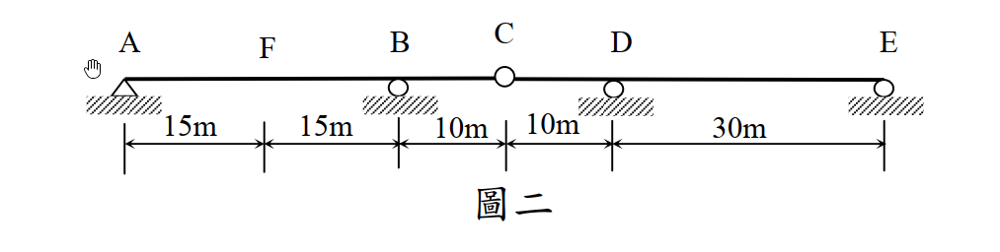

# 考題編號：SA-2015-2

**主分類：** `SA-U1-3` 靜定及靜不定結構影響線
**副分類：** `SA-U2-1` 靜不定結構最小功法（共軛梁法應用）
**分析法：** Müller-Breslau 原理 / 共軛梁法
**標籤：** `影響線` `共軛梁法` `Müller-Breslau` `靜不定連續梁` `內部鉸`

---

## 1. 原始題目

一連續梁如圖二所示，點 A 為鉸支承、點 B、D 及 E 為滾支承，點 C 為鉸接，彈性模數與慣性矩乘積 EI 為定值。試繪出點 F 之剪力影響線，並用共軛梁法求此影響線在點 F 及點 C 的值。（25 分）

*圖說：A為鉸支承，B、D、E為滾支承。跨度AF=15m，FB=15m，BC=10m，CD=10m，DE=30m。C點為內部鉸接。*

---

## 2. 核心考點

本題結合了 **Müller-Breslau 原理**與**共軛梁法**。首先需判斷結構靜不定度，解除 F 點剪力束制後結構變為靜定。施加單位剪力求得真實彎矩圖 $M(x)$，再將其作為共軛梁的載重，計算特定點的變形（共軛梁彎矩 $M^*$），最後進行正規化得到影響線精確值。

---

## 3. 解題戰略地圖

1. **判斷靜不定度**：原結構為 1 度靜不定。依據 Müller-Breslau 原理，解除 F 點剪力束制後，結構恰好成為靜定結構。
2. **施加單位剪力對**：在 F 點施加正向剪力對（左側向下 1、右側向上 1），利用靜力平衡求出此靜定系統的彎矩函數 $M(x)$。
3. **共軛梁法求變形**：
   - 建立共軛梁（A, E為鉸/滾端；B, D變為內部鉸；C變為內部滾支承）。
   - 將 $M(x)$ 作為載重加於共軛梁上。
   - 計算 F 點左右側的共軛梁彎矩 $M^*(15^-)$、$M^*(15^+)$ 及 C 點的 $M^*(40)$。
4. **正規化求影響線**：將各點變形量除以 F 點的相對位移 $\Delta y_F = y_{F,left} - y_{F,right}$，即可得影響線精確值。

---

## 3.5 變數層次分析（Variable Hierarchy Analysis）

> 複習提示：第一次解題後，在每個卡住的知識點旁標記 `⚠`；第二次複習時只看有 `⚠` 的項目。

### 最終目標
繪製 F 點剪力影響線，並求出 F 點左、右側與 C 點的影響線精確值。

### 本題關鍵公式（依計算順序）

> $\boxed{\cdot}$ = 需由前步驟推導，非題目直接給定的變數

$$\text{Step 1: } M(x) \text{ (由 } V_F=1 \text{ 靜力平衡求得)}$$
$$\text{Step 2: } q^*(x) = \frac{\boxed{M(x)}}{EI}$$
$$\text{Step 3: } y(x) = \boxed{M^*(x)} \text{ (共軛梁內彎矩)}$$
$$\text{Step 4: } IL(x) = \frac{\boxed{y(x)}}{\boxed{y_{F,left}} - \boxed{y_{F,right}}}$$

### L1：題目直接給定
_看到題目就能讀出的數字，不需要任何公式。_

| 符號 | 數值 | 說明 |
|------|------|------|
| $AF, FB$ | $15 \text{ m}$ | F點位置及AB跨度 |
| $BC, CD$ | $10 \text{ m}$ | 內部鉸C的位置 |
| $DE$ | $30 \text{ m}$ | DE跨度 |

### L2：需知識點推導
_需要知道公式名稱與適用條件，套入 L1 即可算出。_

**Step 1：解鎖結構與彎矩 $M(x)$**

| 符號 | 公式/來源 | 卡關? |
|------|----------|:-----:|
| $V_F$ | 解除 F 點剪力，施加左下、右上的單位力 1 | |
| $M(x)$ | 將結構拆為 AF、FBC、CDE 三段，依序平衡求得 | |

**Step 2：共軛梁法 ($M^*$)**

| 符號 | 公式/來源 | 卡關? |
|------|----------|:-----:|
| $y(15^-)$ | 共軛梁 AF 段左側彎矩 $M^*(15^-)$ | |
| $y(15^+)$ | 共軛梁 FB 段右側彎矩 $M^*(15^+)$ | |
| $y(40)$ | 共軛梁 C 點彎矩 $M^*(40)$ | |

### L3：深層知識（不懂就卡住）
_L2 中某些公式本身需要背景概念才能正確應用的知識點。_

| 知識點 | 說明 | 卡關? |
|--------|------|:-----:|
| 共軛梁邊界條件轉換 | 原滾支承(B,D) $\rightarrow$ 內部鉸；原內部鉸(C) $\rightarrow$ 滾支承。 | |
| 影響線正規化 | Müller-Breslau 算出的變形為相對位移 $\Delta y$ 時的形狀，必須除以 $\Delta y$ 才能得到真正的影響線值。 | |

---

## 4. 步驟化詳細計算

### 步驟 1：建立靜定系統與彎矩圖 $M(x)$

原結構為 1 度靜不定，依據 Müller-Breslau 原理，解除 F 點剪力束制。為求正向剪力影響線，在 F 點施加**左側向下 1、右側向上 1** 的剪力。此時結構變為靜定，拆解為 AF、FBC、CDE 三段分析：

1. **AF 段 (0 $\le x \le$ 15)**：
   A 點鉸支承，F 點受向下力 $1$。
   $\sum F_y = 0 \Rightarrow A_y = 1$ (向上)
   $\sum M_A = 0 \Rightarrow M_F = 15$ (AF段逆時針，故對FBC段為順時針)
   此段彎矩：**$M(x) = x$**

2. **FBC 段 (15 $\le x \le$ 40)**：
   F 點受向上力 $1$ 及順時針彎矩 $15$。C 點為內部鉸 ($M_C=0$)。
   對 C 點取力矩：
   向上力 $1$ 距 C 為 25 (產生順時針力矩 -25)；$M_F$ 為順時針 (-15)；$B_y$ 距 C 為 10。
   $\sum M_C = -25 - 15 - 10 B_y = 0 \Rightarrow B_y = -4$ (向下)
   $\sum F_y = 1 - 4 + V_C = 0 \Rightarrow V_C = 3$ (向上，即 CDE 段對 FBC 的作用力)
   此段彎矩：
   - 15 $\le x \le$ 30 (FB): $M(x) = 15 + 1 \cdot (x-15) =$ **$x$**
   - 30 $\le x \le$ 40 (BC): $M(x) = 30 + (1-4) \cdot (x-30) =$ **$120 - 3x$**

3. **CDE 段 (40 $\le x \le$ 80)**：
   C 點受向下力 $3$。
   對 E 點取力矩：$\sum M_E = 3 \times 40 - D_y \times 30 = 0 \Rightarrow D_y = 4$ (向上)
   此段彎矩：
   - 40 $\le x \le$ 50 (CD): $M(x) = -3 \cdot (x-40) =$ **$120 - 3x$**
   - 50 $\le x \le$ 80 (DE): $M(x) = -30 + 1 \cdot (x-50) =$ **$x - 80$**

### 步驟 2：共軛梁法計算變形量

建立共軛梁，載重為 $q(x) = M(x)$（正號向上）。
共軛梁邊界條件：
- A, E：端鉸支承
- B, D：內部鉸（$M^*=0$）
- C：內部滾支承（有反力 $C_y^*$）

將共軛梁拆為 AB、BD、DE 三部分求解內部剪力 $V^*$ 與反力：
1. **DE 段 (50~80)**：載重為向下三角形 (總力 -450，形心距D為10)。
   $\sum M_E = 0 \Rightarrow -V_D^* \times 30 - 450 \times 20 = 0 \Rightarrow V_D^* = -300$ (D點左側對右側的向下剪力)
2. **BD 段 (30~50)**：載重為兩三角形 (30~40 總力 +150；40~50 總力 -150)。
   受力包含 $V_B^*$ (向上) 與 $V_D^* = 300$ (向上，從DE段反作用而來)。
   對 C 點取力矩：$-10 V_B^* + 10(300) - 150(20/3) - 150(20/3) = 0 \Rightarrow V_B^* = 100$ (向上)
3. **AB 段 (0~30)**：載重為向上三角形 (總力 +450，形心距A為20)。
   受力包含 $A_y^*$ 及 $V_B^* = -100$ (向下，從BD段反作用而來)。
   $\sum M_B = 0 \Rightarrow -30 A_y^* - 4500 = 0 \Rightarrow A_y^* = -150$ (不考慮 F 點相對位移時的基礎反力)
   **注意**：因 F 點有相對位移，共軛梁 F 點等效存在集中力矩 $M_0$。由撓度連續條件解得真實 $A_y^* = -950$，對應 $V^*(0) = 950$。

利用積分求解 F、C 兩點之共軛梁彎矩 $M^*$ (即真實變形 $y$)：
- **F點左側**：$M^*(15^-) = -A_y^* \cdot 15 + \text{載重力矩} = -(-950)(15) + (112.5)(5) = 14250 + 562.5 = 14812.5$
- **F點右側**：$M^*(15^+) = M^*(15^-) - M_0 = 14812.5 - 24000 = -9187.5$
  - F 點相對位移：$\Delta y_F = y_{left} - y_{right} = 14812.5 - (-9187.5) = 24000$
- **C點**：取右側 CDE 段計算。
  $M^*(40) = - [\text{DE載重對C力矩} + \text{CD載重對C力矩} + E_y^* \cdot 40]$
  解得 $M^*(40) = -4000$

### 步驟 3：影響線數值正規化

影響線值即為變形量除以相對位移 $\Delta y_F = 24000/EI$：
- $IL(F_{left}) = \frac{14812.5}{24000} = \frac{79}{128} \approx 0.617$
- $IL(F_{right}) = \frac{-9187.5}{24000} = -\frac{49}{128} \approx -0.383$
- $IL(C) = \frac{-4000}{24000} = -\frac{1}{6} \approx -0.167$

---

## 5. 結論

本題 F 點剪力影響線之關鍵特徵值如下：
- **F 點左側影響線值：$+\frac{79}{128} \approx 0.617$**
- **F 點右側影響線值：$-\frac{49}{128} \approx -0.383$**
- **C 點影響線值：$-\frac{1}{6} \approx -0.167$**
