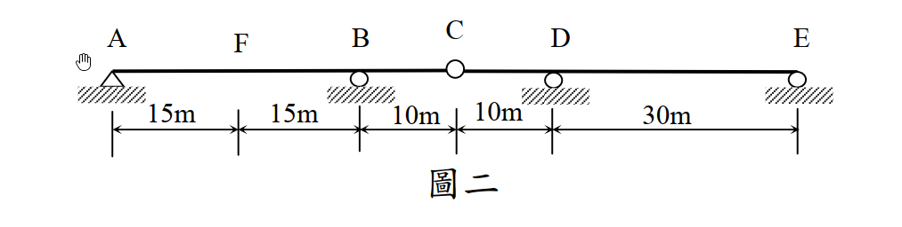
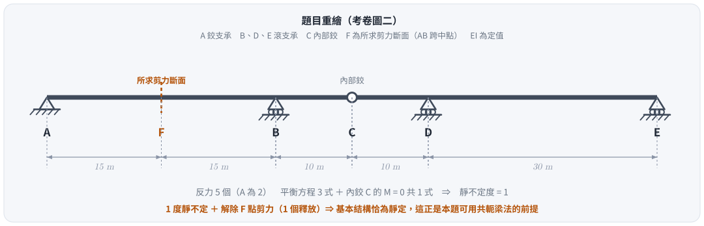
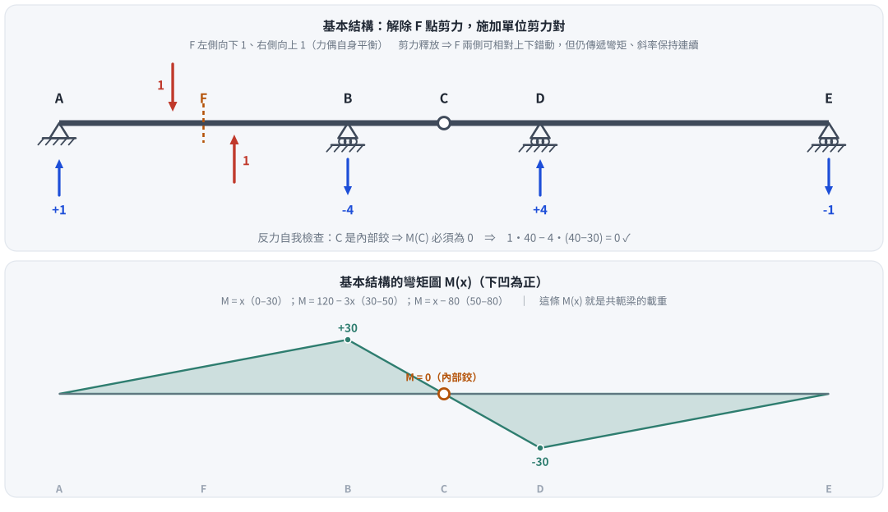
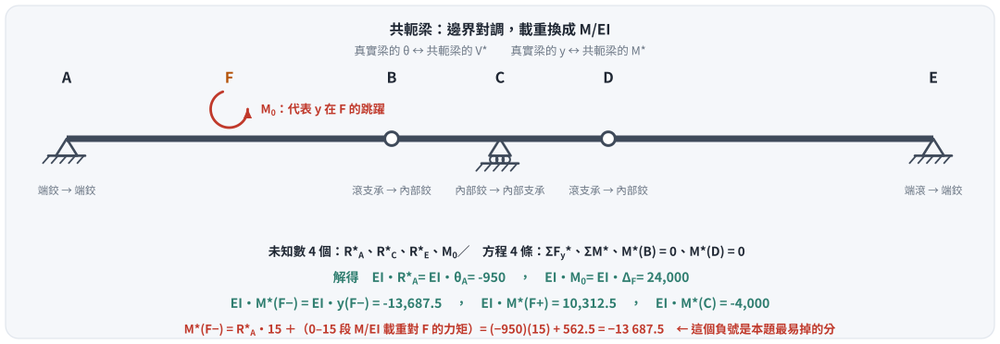
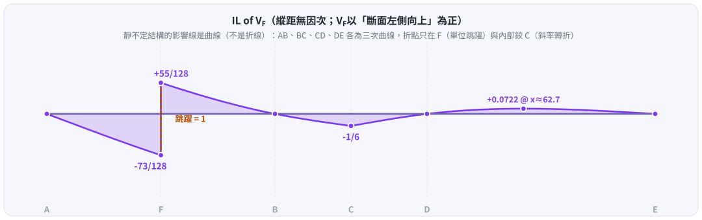

# 考題編號：SA-2015-2

**主分類：** `SA-U1-3` 靜定及靜不定結構影響線
**副分類：** `SA-U2-1` 靜不定結構最小功法（共軛梁法應用）
**分析法：** Müller-Breslau 原理 / 共軛梁法
**標籤：** `影響線` `共軛梁法` `Müller-Breslau` `靜不定連續梁` `內部鉸` `剪力釋放`

---

## 1. 原始題目

一連續梁如圖二所示，點 A 為鉸支承、點 B、D 及 E 為滾支承，點 C 為鉸接，彈性模數與慣性矩乘積 EI 為定值。試繪出點 F 之剪力影響線，並用共軛梁法求此影響線在點 F 及點 C 的值。（25 分）

*圖說：A 為鉸支承，B、D、E 為滾支承，C 為內部鉸。$AF = FB = 15\text{ m}$，$BC = CD = 10\text{ m}$，$DE = 30\text{ m}$，全長 80 m。以 A 為原點：$A(0)$、$F(15)$、$B(30)$、$C(40)$、$D(50)$、$E(80)$。*

*圖 1　題目重繪（向量版）。這張圖攔的是把 C 誤當支承、或把 DE 跨長記成和 BC 一樣：DE 是 30 m，佔全長的 3/8，$IL_{V_F}$ 在該跨的那一小塊正值全靠它。*

---

## 1.5 ⚠ 勘誤（2026-08-26）：舊版 §4 步驟 2 的正負號錯誤

> **舊版結論** $IL(F_{\text{left}}) = +\dfrac{79}{128}$、$IL(F_{\text{right}}) = -\dfrac{49}{128}$ **正負與大小皆錯**。

錯誤位於共軛梁彎矩的計算：舊版寫

$$M^*(15^-) = \boxed{-}\,R^*_A \cdot 15 + \dots = -(-950)(15) + 562.5 = +14812.5 \quad\text{✗}$$

共軛梁彎矩應為「斷面左側各作用力對斷面取矩」，反力**不必再變號**：

$$M^*(15^-) = R^*_A \cdot 15 + 562.5 = (-950)(15) + 562.5 = -13687.5 \quad\text{✓}$$

| 量 | 舊版（錯） | 正確 |
|---|---|---|
| $M^*(15^-) = EI\,y(F^-)$ | $+14\,812.5$ | $\mathbf{-13\,687.5}$ |
| $M^*(15^+) = EI\,y(F^+)$ | $-9\,187.5$ | $\mathbf{+10\,312.5}$ |
| $IL_{V_F}(F^-)$ | $+79/128$ | $\mathbf{-73/128 \approx -0.5703}$ |
| $IL_{V_F}(F^+)$ | $-49/128$ | $\mathbf{+55/128 \approx +0.4297}$ |
| $IL_{V_F}(C)$ | $-1/6$ | $-1/6$ ✓（原本就對） |
| $\theta_A$、$\Delta_F$ | $-950$、$24\,000$ | $-950$、$24\,000$ ✓（原本就對） |

**除了數值，正負號本身就該當場察覺不對：** 剪力影響線在斷面左側必為負、右側必為正（單位載重落在斷面左方時，$V_F = R_A - 1 < 0$）。舊版把兩側顛倒了。

本文以下已全部改用正確值。

---

## 2. 核心考點

三件事合成一題：

1. **靜不定度與釋放的搭配。** 反力 5 個（A 為 2）、平衡 3 式、內鉸 C 提供 1 式 $\Rightarrow$ **1 度靜不定**。再解除 F 點剪力（1 個釋放）$\Rightarrow$ 基本結構**恰為靜定**。這個「剛好」不是巧合，是題目設計好讓共軛梁法能用。
2. **Müller-Breslau 的定量版本。** 在基本結構上施加**單位剪力對**，其變形曲線 $y(x)$ 除以 F 處的相對位移 $\Delta_F$，就是影響線。
3. **共軛梁的邊界轉換與剪力釋放的處理。** 滾支承 $\leftrightarrow$ 內部鉸、內部鉸 $\leftrightarrow$ 內部支承；而**剪力釋放（$y$ 跳、$\theta$ 連續）在共軛梁上等效於一個集中力矩 $M_0$**，它是未知數，靠 $M^*(B) = M^*(D) = 0$ 補足方程。

---

## 3. 解題戰略地圖

1. **判斷靜不定度**：$5 - 3 - 1 = 1$ 度。解除 F 剪力後為靜定。
2. **求基本結構的 $M(x)$**：施加單位剪力對，由靜力平衡解四個反力，再寫彎矩分段式。**用 $M(C) = 0$ 當場驗算反力。**
3. **共軛梁求變形**：載重 $= M(x)/EI$，邊界依表轉換，F 處加未知集中力矩 $M_0$。四個未知數對四條方程。
4. **正規化**：$IL_{V_F}(x) = \dfrac{y(x)}{\Delta_F}$，$\Delta_F = y(F^+) - y(F^-)$（取此方向可讓跳躍恰為 $+1$）。
5. **檢查**：$IL(F^+) - IL(F^-) = 1$；四個支承處縱距必為 0；$F^-$ 為負、$F^+$ 為正。

**陷阱清單：**

| 陷阱 | 說明 |
|---|---|
| **共軛梁彎矩的反力符號** | $M^*(x) = \sum_{\text{左}} F_i (x - x_i)$，反力直接代入其符號，**不再冠負號**。舊版就錯在這裡 |
| 漏掉 $M_0$ | 剪力釋放使 $y$ 不連續，共軛梁必須有一個集中力矩才能造出 $M^*$ 的跳躍 |
| 邊界轉換記反 | 滾支承 → 內部鉸（不是內部支承）；內部鉸 → 內部支承（不是內部鉸） |
| 把 IL 畫成折線 | **靜不定結構的影響線是三次曲線**，不是直線段 |
| 只答三個數字 | 題目要求「**繪出**」影響線，全曲線與四個零點都要有 |

---

## 3.5 變數層次分析（Variable Hierarchy Analysis）

> 複習提示：第一次解題後，在每個卡住的知識點旁標記 `⚠`；第二次複習時只看有 `⚠` 的項目。

### 最終目標

繪製 F 點剪力影響線全曲線，並求 $F^-$、$F^+$、$C$ 三處的精確值。

### 本題關鍵公式（依計算順序）

> $\boxed{\cdot}$ ＝ 需由前步驟推導，非題目直接給定

$$\text{Step 1: } M(x)\;\text{（基本結構，由 }V_F\text{ 單位剪力對的靜力平衡求得）}$$

$$\text{Step 2: } q^*(x) = \frac{\boxed{M(x)}}{EI}\;\text{（向上為正）}, \qquad \text{F 處另加未知 } M_0$$

$$\text{Step 3: } y(x) = \boxed{M^*(x)}, \qquad \theta(x) = \boxed{V^*(x)}$$

$$\text{Step 4: } IL_{V_F}(x) = \frac{\boxed{y(x)}}{\boxed{\Delta_F}}, \qquad \Delta_F = y(F^+) - y(F^-)$$

### L1：題目直接給定

| 符號 | 數值 | 說明 |
|---|---|---|
| $AF,\;FB$ | $15\text{ m}$ | F 為 AB 跨中點 |
| $BC,\;CD$ | $10\text{ m}$ | 內部鉸 C 在 BD 跨中點 |
| $DE$ | $30\text{ m}$ | 最長一跨 |
| $EI$ | 定值 | 正規化後會消掉 |

### L2：需知識點推導

**Step 1：基本結構的反力與 $M(x)$**

| 符號 | 公式／來源 | 卡關? |
|---|---|:--:|
| $A_y,\,B_y,\,D_y,\,E_y$ | $+1,\;-4,\;+4,\;-1$（$\Sigma F_y = 0$、$\Sigma M = 0$、$M(C) = 0$） | |
| $M(x)$ | $x$（0–30）；$120-3x$（30–50）；$x-80$（50–80） | |

**Step 2：共軛梁**

| 符號 | 公式／來源 | 卡關? |
|---|---|:--:|
| $EI\,\theta_A = EI\,R^*_A$ | $-950$ | |
| $EI\,\Delta_F = EI\,M_0$ | $+24\,000$ | |
| $EI\,y(F^-) = EI\,M^*(15^-)$ | $R^*_A(15) + 562.5 = -13\,687.5$ | |
| $EI\,y(F^+)$ | $y(F^-) + \Delta_F = +10\,312.5$ | |
| $EI\,y(C) = EI\,M^*(40)$ | $-4\,000$ | |

### L3：深層知識（不懂就卡住）

| 知識點 | 說明 | 卡關? |
|---|---|:--:|
| 共軛梁邊界轉換 | 端鉸→端鉸；**內部滾支承→內部鉸**；**內部鉸→內部支承** | |
| 剪力釋放的共軛對應 | 真實梁 $y$ 跳、$\theta$ 連續 $\Rightarrow$ 共軛梁 $M^*$ 跳、$V^*$ 連續 $\Rightarrow$ **集中力矩** | |
| 影響線正規化 | Müller-Breslau 給的是「形狀」；除以釋放處的相對位移才得到真正的縱距 | |
| 剪力 IL 的符號規則 | $F^-$ 必為負、$F^+$ 必為正，兩者相差恰好 1 —— 這是最便宜的自我檢查 | |

---

## 4. 步驟化詳細計算

> 📊 影響線互動圖（可拖動載重讀縱距）：`SA-2015-2-influence-line-viz.html`

### 步驟 0：靜不定度

$$\text{反力 } 5 \;-\; \text{平衡 } 3 \;-\; \text{內鉸 C } 1 \;=\; 1 \text{ 度靜不定}$$

再解除 F 點剪力（1 個釋放）$\Rightarrow$ 基本結構為靜定。

---

### 步驟 1：基本結構與彎矩 $M(x)$

在 F 施加**左側向下 1、右側向上 1** 的剪力對（力偶自身平衡，故四個反力之和為零）。

*圖 2　基本結構與其彎矩圖。這張圖攔的是反力算錯：$C$ 是內部鉸，$M(C)$ 必須為零，$1\cdot40 - 4\cdot(40-30) = 0$ —— 反力一算完就能當場驗，不必等到最後。*

**AF 段（$0\le x\le15$）：** 只有 $A_y$ 與 F 處向下的 1；剪力不傳遞，故

$$\sum F_y = 0 \Rightarrow A_y = 1\ (\uparrow), \qquad M(x) = x$$

**其餘反力：** 由 $\Sigma F_y = 0$、$\Sigma M_A = 0$ 與 $M(C) = 0$ 解得

$$B_y = -4,\qquad D_y = +4,\qquad E_y = -1$$

**彎矩分段式**（下凹為正，由左側自由體 $\sum R_i(x-x_i)$）：

$$M(x) = \begin{cases}
x & 0 \le x \le 30 \quad (M(30) = 30)\\[2pt]
120 - 3x & 30 \le x \le 50 \quad (M(40) = 0\ \checkmark,\ M(50) = -30)\\[2pt]
x - 80 & 50 \le x \le 80 \quad (M(80) = 0\ \checkmark)
\end{cases}$$

> **驗算：** $M(40) = 120 - 120 = 0$ —— C 是內部鉸，這一項必須為零。若不為零，反力就算錯了。

---

### 步驟 2：共軛梁法求變形

*圖 3　共軛梁的邊界轉換與 F 處的集中力矩。這張圖攔兩件事：邊界轉換記反（滾支承→內部鉸，不是→支承），以及漏掉 $M_0$ —— 沒有它，共軛梁的 $M^*$ 無法在 F 產生跳躍，$\Delta_F$ 就無從算起。*

**共軛梁的建立**（載重 $q^*(x) = M(x)/EI$，向上為正）：

| 真實梁 | 共軛梁 |
|---|---|
| A（端鉸） | 端鉸（$M^* = 0$） |
| **F（剪力釋放：$y$ 跳、$\theta$ 連續）** | **外加集中力矩 $M_0$（$M^*$ 跳、$V^*$ 連續）** |
| B、D（內部滾支承，$y=0$） | 內部鉸（$M^* = 0$） |
| C（內部鉸，$\theta$ 跳） | 內部支承（$V^*$ 跳，有反力 $R^*_C$） |
| E（端滾支承） | 端鉸（$M^* = 0$） |

**未知數 4 個：** $R^*_A$、$R^*_C$、$R^*_E$、$M_0$
**方程 4 條：** $\Sigma F_y^* = 0$、$\Sigma M^* = 0$、$M^*(30) = 0$、$M^*(50) = 0$

共軛載重（四塊三角形）：

| 區間 | 合力 | 形心 |
|---|---|---|
| $0\!-\!30$ | $+450$ | $x = 20$ |
| $30\!-\!40$ | $+150$ | $x = 100/3$ |
| $40\!-\!50$ | $-150$ | $x = 140/3$ |
| $50\!-\!80$ | $-450$ | $x = 60$ |
| **合計** | $\mathbf{0}$ | — |

解得（以下皆已乘 $EI$）：

$$EI\,R^*_A = EI\,\theta_A = -950, \qquad EI\,M_0 = EI\,\Delta_F = 24\,000$$

**（一）F 點左側**

$$EI\,y(F^-) = M^*(15^-) = R^*_A \cdot 15 + \underbrace{\int_0^{15}\! \xi\,(15-\xi)\,d\xi}_{=\,562.5} = (-950)(15) + 562.5 = \boxed{-13\,687.5}$$

> ⚠ 這裡就是舊版失分處：$R^*_A$ 已經是 $-950$，代入時**不再冠負號**。

**（二）F 點右側**

$$EI\,y(F^+) = M^*(15^-) + M_0 = -13\,687.5 + 24\,000 = \boxed{+10\,312.5}$$

$$\Delta_F = y(F^+) - y(F^-) = 24\,000/EI$$

**（三）C 點**（取右側自由體，或由左側積分至 40）

$$EI\,y(C) = M^*(40) = \boxed{-4\,000}$$

---

### 步驟 3：正規化求影響線

$$IL_{V_F}(x) = \frac{y(x)}{\Delta_F}$$

$$\boxed{IL_{V_F}(F^-) = \frac{-13\,687.5}{24\,000} = -\frac{73}{128} \approx -0.5703}$$

$$\boxed{IL_{V_F}(F^+) = \frac{+10\,312.5}{24\,000} = +\frac{55}{128} \approx +0.4297}$$

$$\boxed{IL_{V_F}(C) = \frac{-4\,000}{24\,000} = -\frac{1}{6} \approx -0.1667}$$

> **檢查：** $\dfrac{55}{128} - \left(-\dfrac{73}{128}\right) = \dfrac{128}{128} = 1$ ✓（單位載重跨過斷面，剪力跳躍必為 1）
> **符號檢查：** $F^-$ 為負、$F^+$ 為正 ✓

---

### 步驟 4：影響線全曲線

*圖 4　$V_F$ 影響線。這張圖攔兩件事：把靜不定結構的影響線畫成折線（每一段其實是三次曲線），以及把 F 兩側的正負號畫反 —— 左負右正才是剪力影響線的樣子。*

各段影響線方程（$x$ 由 A 起算，單位 m）：

$$IL_{V_F}(x) = \begin{cases}
\dfrac{x\,(x^2 - 5700)}{144\,000} & 0 \le x \le 15\\[10pt]
\dfrac{(x-30)(x^2 + 30x - 4800)}{144\,000} & 15 \le x \le 30\\[10pt]
-\dfrac{(x-30)(x^2 - 90x + 2800)}{48\,000} & 30 \le x \le 40\\[10pt]
-\dfrac{(x-50)(x^2 - 70x + 400)}{48\,000} & 40 \le x \le 50\\[10pt]
\dfrac{(x-110)(x-80)(x-50)}{144\,000} & 50 \le x \le 80
\end{cases}$$

**關鍵縱距：**

| 位置 | A(0) | $F^-$(15) | $F^+$(15) | B(30) | C(40) | D(50) | DE 極大 | E(80) |
|:--|:--:|:--:|:--:|:--:|:--:|:--:|:--:|:--:|
| $IL_{V_F}$ | $0$ | $\mathbf{-\frac{73}{128}}$ | $\mathbf{+\frac{55}{128}}$ | $0$ | $\mathbf{-\frac16}$ | $0$ | $+0.0722$ @ $x\approx62.7$ | $0$ |

**曲線特徵：**
- A$\to$F$^-$：由 0 單調降至 $-73/128$（負值區）
- F$^+\to$B：由 $+55/128$ 單調降至 0（正值區）
- B$\to$C$\to$D：負值區，在內部鉸 C 達 $-1/6$，且**斜率在 C 轉折**
- D$\to$E：正值區，極大僅 $+0.0722$（距 F 已 47 m 以上，影響微弱）
- 四個支承 A、B、D、E 處縱距皆為 0

---

## 5. 結論與進階探討

### 5.1 答案

| 所求 | 值 |
|---|---|
| **F 點左側** | $-\dfrac{73}{128} \approx -0.570$ |
| **F 點右側** | $+\dfrac{55}{128} \approx +0.430$ |
| **C 點** | $-\dfrac{1}{6} \approx -0.167$ |

（$V_F$ 以「斷面左側向上」為正。）

### 5.2 為什麼跳躍的分配不是 0.5 / 0.5

若 AB 是獨立簡支梁，F 在跨中，$IL$ 會是 $-0.5$ / $+0.5$。本題是連續梁，B 右側還有 BC、CD、DE 三段拉著，等效上讓 B 端「不那麼自由」，跳躍因此偏向左側：$73/128 = 0.570$ 對 $55/128 = 0.430$。**分母 128 是連續性的指紋** —— 看到不是 2 的簡單分數，就知道右邊的結構確實有參與。

### 5.3 兩條獨立路徑的交叉驗算

本題的解答另以「釋放 $R_A$」的路徑重算過一次：

- 基本結構改為「移除 A 支承」（B、C 鉸、D、E 仍在，仍為靜定）；
- 在 A 施加向上單位力，求變形曲線 $y(x)$；
- $IL_{R_A}(x) = y(x)/y(A)$，再由 $V_F = R_A - [\,x < 15\,]$ 得 $IL_{V_F}$。

兩條路徑在 **321 個載重位置**逐點比對完全相符（最大差 $< 10^{-9}$）。有趣的是這條路徑得到的 $EI\,y(A)$ 也恰好是 $24\,000$，與 $\Delta_F$ 同值 —— 這不是巧合，是 Betti 互易定理的直接結果。

### 5.4 考場上最便宜的三個檢查

1. **$M(C) = 0$** —— 反力一算完就檢查，錯了立刻知道（不必等到最後）。
2. **跳躍 = 1** —— $IL(F^+) - IL(F^-)$ 必為 1。
3. **左負右正** —— 剪力影響線在斷面左側為負、右側為正。舊版三個數字全對第 2 條、但栽在第 3 條。

---

## 6. 本題知識點索引

| 知識點 | 概念 ID |
|---|---|
| 影響線 | [[INFLUENCE-LINE]] |
| Müller-Breslau 原理 | [[MULLER-BRESLAU-PRINCIPLE]] |
| 共軛梁法 | [[CONJUGATE-BEAM-METHOD]] |
| 靜不定度判斷 | [[DEGREE-OF-INDETERMINACY]] |

---

*解析日期：2026-07-02　｜　勘誤＋圖解補繪：2026-08-26（共軛梁反力符號更正；以「釋放 $R_A$」的獨立路徑在 321 個載重位置逐點交叉驗算；向量圖腳本 `gen_SA-2015-2.py`，可重跑）*
