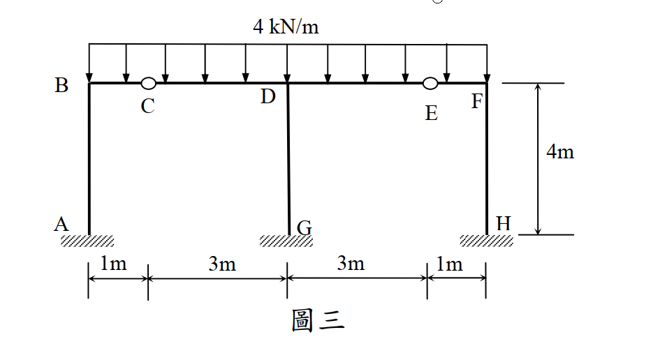
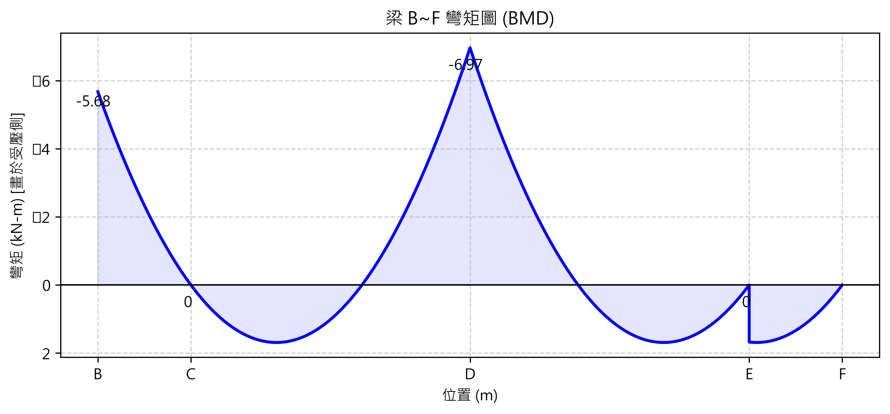

# 考題編號：SA-2015-3

**主分類：** `SA-U3-1` 傾角變位法
**副分類：**
**分析法：** 傾角變位法 (Slope-deflection method)
**標籤：** `對稱剛架` `傾角變位法` `內部鉸` `相對位移`

---

## 1. 原始題目

圖三為一平面構架，點 A、G 及 H 為固定支承，點 C 及 E 為鉸接，此構架點 B 至 F 間梁桿件承受一垂直均佈載重 $4 \text{ kN/m}$。設所有桿件 EI 為定值，且忽略桿件軸向變形，試用傾角變位法，求各桿件端點彎矩及支承 G 之反力，並繪出 B 至 F 間梁桿件之彎矩圖。（25 分）

*圖說：A、G、H為固定端柱底。AB=GD=HF=4m。上方梁B-C-D-E-F承受4kN/m均佈載重，其中C、E為內部鉸。BC=1m, CD=3m, DE=3m, EF=1m。*

---

## 2. 核心考點

本題的核心在於**處理對稱剛架中的內部鉸**。利用對稱性可大幅減少未知數，但考生常犯的致命錯誤是「忽略內部鉸會產生垂直相對位移（下垂或上拱）」。必須引入鉸節點的垂直位移 $\delta$，並利用鉸接處的剪力平衡來建立方程式，才能得到正確解。

---

## 3. 解題戰略地圖

1. **對稱性簡化**：結構與載重均完全對稱於中心柱 GD。因此無側移 ($\Delta = 0$)，且中心節點 D 不旋轉 ($\theta_D = 0$)。
2. **定義未知數**：因 C、E 為鉸接，其彎矩為零，可採用修正傾角變位方程式消去 $\theta_C$。真正獨立的未知數僅剩 B 點轉角 $\theta_B$，以及鉸 C 的垂直變位量 $\delta$（進而產生弦轉角 $\psi$）。
3. **建立節點方程式**：
   - B 點力矩平衡：$\sum M_B = 0 \Rightarrow M_{BA} + M_{BC} = 0$
   - C 點剪力平衡（鉸點無外加集中力）：左側 BC 傳遞的剪力與右側 CD 傳遞的剪力必須達成靜力平衡。
4. **解聯立方程式**：解出 $\theta_B$ 與 $\delta$，代回求得所有桿端彎矩。
5. **求解反力 G**：計算梁 CD 與 DE 在 D 點的剪力反力，加總即為中心柱 GD 所承受的軸力（即 $G_y$）。
6. **繪製 BMD**：依據求得之端彎矩，疊加均佈載重之拋物線，繪製 B~F 之彎矩圖。

---

## 3.5 變數層次分析（Variable Hierarchy Analysis）

> 複習提示：第一次解題後，在每個卡住的知識點旁標記 `⚠`；第二次複習時只看有 `⚠` 的項目。

### 最終目標
求得 $\theta_B$ 與 $\delta$，進而計算所有桿端彎矩與 G 點反力。

### 本題關鍵公式（依計算順序）

> $\boxed{\cdot}$ = 需由前步驟推導，非題目直接給定的變數

$$\text{Step 1: } M_{ij} = \frac{3EI}{L} (\theta_i - \psi) + FEM_{ij} \text{ (修正型方程式)}$$
$$\text{Step 2: } \sum M_B = 0 \Rightarrow \boxed{M_{BA}} + \boxed{M_{BC}} = 0$$
$$\text{Step 3: } \sum V_{C,up} = 0 \Rightarrow \boxed{V_{C, left}} + \boxed{V_{C, right}} = 0 \text{ (施加於鉸上的力量)}$$
$$\text{Step 4: 解聯立得 } \theta_B, \delta \Rightarrow \text{代回求 } M_{ij} \text{ 與 } G_y$$

### L1：題目直接給定
| 符號 | 數值 | 說明 |
|------|------|------|
| $w$ | $4 \text{ kN/m}$ | 梁 B~F 的均佈載重 |
| $L_{AB}$ | $4 \text{ m}$ | 左側柱高 |
| $L_{BC}$ | $1 \text{ m}$ | 左外側梁長 |
| $L_{CD}$ | $3 \text{ m}$ | 左內側梁長 |

### L2：需知識點推導
**Step 1：固端彎矩 (FEM) 與弦轉角 ($\psi$)**

| 符號 | 公式/來源 | 卡關? |
|------|----------|:-----:|
| $FEM_{BC}$ | $-\frac{w L_{BC}^2}{8} = -0.5$ | B固定C鉸接之固端彎矩 (逆時針為負) |
| $FEM_{DC}$ | $+\frac{w L_{CD}^2}{8} = +4.5$ | D固定C鉸接之固端彎矩 (順時針為正) |
| $\psi_{BC}$ | $\delta / 1 = \delta$ | C 點下陷 $\delta$，弦轉動為順時針(正) |
| $\psi_{CD}$ | $-\delta / 3$ | C 點下陷 $\delta$，弦轉動為逆時針(負) |

**Step 2 & 3：彎矩與剪力表示式**

| 符號 | 公式/來源 | 卡關? |
|------|----------|:-----:|
| $M_{BC}$ | $3EI(\theta_B - \delta) - 0.5$ | 代入修正傾角方程式 |
| $M_{DC}$ | $EI(\delta/3) + 4.5$ | 代入修正傾角方程式 ($\theta_D=0$) |
| $V_{C,left}$ | $M_{BC} + 2$ | 取 BC 段對 B 取力矩求得 (鉸施於左側梁之向上力) |
| $V_{C,right}$ | $6 - M_{DC}/3$ | 取 CD 段對 D 取力矩求得 (鉸施於右側梁之向上力) |

### L3：深層知識（不懂就卡住）
| 知識點 | 說明 | 卡關? |
|--------|------|:-----:|
| **對稱性無側移** | 結構幾何與載重皆完全對稱於 GD 柱，故無側移 ($\Delta_x = 0$)，中心點 D 不旋轉 ($\theta_D = 0$)。 | |
| **內部鉸的垂直位移** | 內部鉸 C 缺乏垂直支承，必然產生垂直位移 $\delta$，進而引發相鄰桿件的弦轉角 $\psi \neq 0$。這是本題最常掉入的陷阱。 | |

---

## 4. 步驟化詳細計算過程

### 步驟 1：建立傾角變位方程式

設順時針轉角與彎矩為正。C 點下陷量為 $\delta$ (向下為正)。
- **AB 柱** ($\theta_A = 0, \Delta = 0$):
  $M_{AB} = \frac{2EI}{4}(\theta_B) = 0.5 EI \theta_B$
  $M_{BA} = \frac{2EI}{4}(2\theta_B) = EI \theta_B$
- **BC 梁** ($\theta_C$ 為鉸, 修正型):
  $\psi_{BC} = \frac{\delta - 0}{1} = \delta$
  $M_{BC} = \frac{3EI}{1}(\theta_B - \psi_{BC}) + FEM_{BC} = 3EI(\theta_B - \delta) - 0.5$
- **CD 梁** ($\theta_D = 0, \theta_C$ 為鉸, 修正型):
  $\psi_{CD} = \frac{0 - \delta}{3} = -\frac{\delta}{3}$
  $M_{DC} = \frac{3EI}{3}(\theta_D - \psi_{CD}) + FEM_{DC} = EI\left(\frac{\delta}{3}\right) + 4.5$

### 步驟 2：節點 B 彎矩平衡方程式

$$ \sum M_B = 0 \Rightarrow M_{BA} + M_{BC} = 0 $$
$$ EI\theta_B + 3EI\theta_B - 3EI\delta - 0.5 = 0 $$
$$ 4EI\theta_B - 3EI\delta = 0.5 \quad \text{--- (式 1)} $$

### 步驟 3：內部鉸 C 剪力平衡方程式

C 為內部鉸，其左右兩側傳遞之剪力必須平衡（即 C 點無不平衡外加集中力）。
1. **分析 BC 段 (取對 B 力矩)**：
   設 $V_{C, left}$ 為內部鉸對 BC 段施加的向上力。
   $$ \sum M_B = 0 \Rightarrow V_{C, left} \times 1 - M_{BC} \text{ (順時針)} - 4 \times 1 \times 0.5 = 0 $$
   $$ \Rightarrow V_{C, left} = M_{BC} + 2 \text{ (向上)} $$
2. **分析 CD 段 (取對 D 力矩)**：
   設 $V_{C, right}$ 為內部鉸對 CD 段施加的向上力。
   $$ \sum M_D = 0 \Rightarrow V_{C, right} \times 3 - M_{DC} \text{ (順時針)} - 4 \times 3 \times 1.5 = 0 $$
   $$ \Rightarrow V_{C, right} = 6 - \frac{M_{DC}}{3} \text{ (向上)} $$
3. **鉸接點本身平衡**：
   梁施於鉸的力必須抵消，亦即鉸對左梁的向上力與鉸對右梁的向上力總和為零：
   $$ V_{C, left} + V_{C, right} = 0 \Rightarrow (M_{BC} + 2) + \left(6 - \frac{M_{DC}}{3}\right) = 0 $$
   $$ M_{BC} - \frac{M_{DC}}{3} = -8 $$
   代入傾角方程式：
   $$ (3EI\theta_B - 3EI\delta - 0.5) - \left( \frac{EI\delta}{9} + 1.5 \right) = -8 $$
   $$ 3EI\theta_B - \frac{28}{9}EI\delta = -6 \quad \text{--- (式 2)} $$

### 步驟 4：解聯立方程式與求彎矩

由式 1 得：$EI\delta = \frac{4}{3}EI\theta_B - \frac{1}{6}$
代入式 2：
$$ 3EI\theta_B - \frac{28}{9}\left(\frac{4}{3}EI\theta_B - \frac{1}{6}\right) = -6 $$
$$ \left(3 - \frac{112}{27}\right)EI\theta_B = -6 - \frac{14}{27} $$
$$ -\frac{31}{27}EI\theta_B = -\frac{176}{27} \Rightarrow \mathbf{EI\theta_B = \frac{176}{31} \approx 5.677} $$
回代求 $\delta$：
$$ EI\delta = \frac{4}{3}\left(\frac{176}{31}\right) - \frac{1}{6} = \frac{704}{93} - \frac{1}{6} = \mathbf{\frac{459}{62} \approx 7.403} \text{ (正值表 C 點確實下陷)} $$

**計算左半部桿端彎矩**：
- $M_{AB} = 0.5 \times \frac{176}{31} = \mathbf{\frac{88}{31} \approx 2.84 \text{ kN-m (順)}}$
- $M_{BA} = 1.0 \times \frac{176}{31} = \mathbf{\frac{176}{31} \approx 5.68 \text{ kN-m (順)}}$
- $M_{BC} = 3\left(\frac{176}{31}\right) - 3\left(\frac{459}{62}\right) - 0.5 = \mathbf{-\frac{176}{31} \approx -5.68 \text{ kN-m (逆)}}$
- $M_{DC} = \frac{1}{3}\left(\frac{459}{62}\right) + 4.5 = \mathbf{\frac{216}{31} \approx 6.97 \text{ kN-m (順)}}$

由對稱性直接寫出右半部彎矩：
- $M_{FE} = \mathbf{\frac{176}{31} \text{ kN-m (順)}}$
- $M_{FH} = \mathbf{-\frac{176}{31} \text{ (逆)}}$
- $M_{HF} = \mathbf{-\frac{88}{31} \text{ (逆)}}$
- $M_{DE} = \mathbf{-\frac{216}{31} \text{ kN-m (逆)}}$
- 中心柱因 $\theta_D = 0, \Delta = 0$ 且無載重，故 $M_{GD} = M_{DG} = \mathbf{0}$
- 鉸接點 $M_{CB} = M_{CD} = M_{ED} = M_{EF} = \mathbf{0}$

### 步驟 5：求 G 點反力

中心柱 GD 沒有彎矩與水平剪力，故 $G_x = 0, M_G = 0$。
垂直反力 $G_y$ 來自 D 點左右兩側梁傳遞的剪力：
1. **CD 段 D 點剪力 ($V_D$)**：
   對 C 取力矩：$V_D \times 3 - M_{DC} - 12 \times 1.5 = 0 \Rightarrow V_D = 6 + \frac{216/31}{3} = \frac{258}{31} \text{ kN (向上)}$
2. **總反力**：
   對稱結構下，右半側 DE 段亦貢獻 $\frac{258}{31} \text{ kN}$ 壓於中心柱上。
   $$ G_y = 2 \times \frac{258}{31} = \mathbf{\frac{516}{31} \text{ kN} \approx 16.65 \text{ kN (向上)}} $$

### 步驟 6：繪製彎矩圖 (BMD)

根據算出的桿端彎矩以及 4 kN/m 的均佈載重，疊加各段拋物線。

*圖說：上方梁 B-C-D-E-F 的彎矩圖 (BMD)。於 B 點內彎矩為 -5.68 (上方受拉)，在鉸 C 點彎矩歸零，至 D 點達 -6.97 (上方受拉)。全段受 4 kN/m 均佈載重呈拋物線變化。*

---

## 5. 關鍵爭議點與進階探討

**為什麼必須考慮 $\delta \neq 0$？**
初學者看到對稱與無側移 ($\Delta_x = 0$)，常誤以為內部所有節點的相對位移都是 0。但內部鉸 (Internal Hinge) 打破了梁的連續性，且底下**沒有柱子支撐**，這意味著它就像吊橋的中間節點一樣，在重力作用下必然產生下陷。如果不考慮 $\delta$，即預設 $\psi = 0$，算出來的 $V_{C, left}$ 與 $V_{C, right}$ 絕對不會平衡，會導致整個結構的自由體圖不滿足靜力平衡法則。這正是本題的核心考驗。
