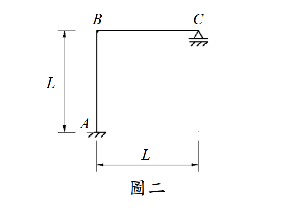

# 考題編號：SA-2016-2

**主分類：** `SA-U1-3` 靜定及靜不定結構影響線
**副分類：** `SA-U2-3` 靜不定結構之傾角變位法
**分析法：** 柔度法（Müller-Breslau原理） / 傾角變位法
**標籤：** `影響線` `靜不定剛架` `Müller-Breslau原理` `有側移剛架` `移動載重`

---

## 1. 原始題目重述 (Problem Restatement)

圖二剛架 ABC 使用材料之彈性模數為 E，斷面慣性矩為 I，EI = 常數。已知移動載重在 B 點及 C 點之間，不考慮桿件之軸向變形，試繪 C 點反力的影響線（influence line），並列出其方程式。（25 分）

**結構幾何與條件：**
- A：固定端支承（Fixed support）。
- B：剛接節點（Rigid joint）。
- C：滾支承（Roller support，位於水平面上，提供垂直反力）。
- 桿件 AB（柱）長度為 L；桿件 BC（梁）長度為 L。
- 移動載重作用於 BC 梁上。

*圖說：剛架 ABC，A 為底端固定支承，AB 垂直柱長 L；B 為頂端剛接點，BC 水平梁長 L；C 為右端滾支承（水平面）。*

---

## 2. 考題核心精神與出題者意圖 (Core Concepts & Examiner's Intent)

**核心觀念：** 靜不定結構的影響線分析。
靜不定度：反力 4 個（A 端 3 個 + C 端 1 個），方程式 3 個 $\Rightarrow$ 1 度靜不定。

**出題者意圖：** 測驗考生能否靈活運用「Müller-Breslau 原理」或「傾角變位法」推導影響線方程式。

**關鍵陷阱：**
本題最大的陷阱在於 **「側移（Sway）」** 的判斷。許多考生看到載重只有垂直向，會誤以為這是一個無側移剛架。事實上，因為 C 點是滾支承（無水平束制），當 BC 梁受壓彎曲時，B 節點會發生旋轉，帶動柱 AB 變形；而為了維持柱 AB 的彎矩平衡（基底無水平力），剛架**必然會發生水平側移**。若使用傾角變位法未列入側移方程式，將得到錯誤答案。

---

## 3. 解題戰略地圖與陷阱分析 (Strategic Roadmap & Trap Analysis)

**作戰計畫（採用單位力法 / Müller-Breslau 原理）：**
此方法思維最直觀，且自然包含了側移效應（基本結構為懸臂剛架，不受水平拘束）。
1. **建立基本結構：** 移除 C 點垂直束制，取 A 端固定的懸臂剛架 ABC 為基本結構，以 C 點垂直反力 $V_C$ 為贅力。
2. **求柔度係數 $f_{CC}$：** 於 C 點施加向上單位力 $V_C=1$，利用單位力法（虛功原理）求 C 點的向上位移。
3. **求變形曲線 $v(x)$：** 於 C 點施加 $V_C=1$ 的狀態下，求出 BC 桿上任意點 $x$ 的垂直位移方程式。
4. **求影響線方程式：** 根據位移諧合條件 $v(x) - V_C \cdot f_{CC} = 0$，得到影響線方程式 $IL_{V_C}(x) = v(x) / f_{CC}$。

*(註：本題亦可使用傾角變位法求解，見第 5 節進階探討)*

**陷阱清單：**
- **側移誤判：** 誤認無側移，導致使用傾角變位法時少算 $\psi$ 項。
- **積分區間與坐標系混淆：** 在單位力法中，BC 梁的坐標 $x$ 需清楚定義原點（從 B 起算最不易出錯）。

---

## 3.5 變數層次分析 (Variable Hierarchy Analysis)

> 複習提示：第一次解題後，在每個卡住的知識點旁標記 `⚠`；第二次複習時只看有 `⚠` 的項目。

### 最終目標
`求出 C 點垂直反力影響線方程式 IL(x) 並繪圖`

### 本題關鍵公式（依計算順序）

$$\text{Step 1: } f_{CC} = \int \frac{m_C \cdot m_C}{EI} ds$$

$$\text{Step 2: } v(x) = \int \frac{m_C \cdot m_x}{EI} ds$$

$$\text{Step 3: } V_C(x) = \frac{\boxed{v(x)}}{\boxed{f_{CC}}}$$

### L1：題目直接給定
| 符號 | 數值 | 說明 |
|------|------|------|
| $L$ | L | 柱與梁的長度 |
| $EI$ | 常數 | 撓度剛度 |
| $P$ | 1 | 移動單位載重 |

### L2：需知識點推導

**Step 1：單位贅力 $V_C=1$ 作用下的彎矩**
| 符號 | 公式／來源 | 卡關? |
|------|-----------|:-----:|
| $m_C(x')$ | $1 \cdot (L - x')$ | BC 梁，距 B 點 $x'$ 處，使梁下側受拉 |
| $m_C(y)$ | $1 \cdot L = L$ | AB 柱，距 B 點向下 $y$ 處，使柱右側受拉 |

**Step 2：求柔度係數與變形曲線（虛功法積分）**
| 符號 | 公式／來源 | 卡關? |
|------|-----------|:-----:|
| $f_{CC}$ | $\int_0^L \frac{(L-x')^2}{EI} dx' + \int_0^L \frac{L^2}{EI} dy = \frac{4L^3}{3EI}$ | |
| $v(x)$ | $\int_0^x \frac{(L-x')(x-x')}{EI} dx' + \int_0^L \frac{L \cdot x}{EI} dy$ | |

### L3：深層知識（不懂就卡住）
| 知識點 | 說明 | 卡關? |
|--------|------|:-----:|
| **Müller-Breslau 原理** | 欲求某反力的影響線，將該方向束制解除，並給予一單位位移，結構的變形曲線即為該反力的影響線。（數學本質為位移諧合：$V_C = \Delta_{xC} / \Delta_{CC}$） | |
| **剛架側移判斷** | C 點雖有滾支承但僅限垂直向，全結構無水平束制對抗柱的剪力，因此必然產生側移。 | |

---

## 4. 步驟化詳細計算過程 (Step-by-Step Detailed Calculation)

> 📊 影響線互動圖：`SA-2016-2-influence-line-viz.html`

本題採用**柔度法（Müller-Breslau 原理的數學推導）**進行求解。

**坐標系設定：**
- 對 BC 梁：以 B 為原點，向右為 $x$ 軸正向 ($0 \le x \le L$)。
- 對 AB 柱：以 B 為原點，向下為 $y$ 軸正向 ($0 \le y \le L$)。

### Step 1：建立基本結構與單位贅力彎矩 ($m_C$)
解除 C 點垂直滾支承，將其視為贅力 $V_C$。基本結構為 A 點固定的懸臂剛架 ABC。
於 C 點施加向上單位力 $V_C = 1$。
各桿段之彎矩函數（定義使內側/下側受拉為正）：
- **BC 梁 ($0 \le x' \le L$)：** $m_C(x') = 1 \cdot (L - x')$
- **AB 柱 ($0 \le y \le L$)：** $m_C(y) = 1 \cdot L = L$ （常數）

### Step 2：計算 C 點柔度係數 $f_{CC}$
$f_{CC}$ 為 C 點受向上單位力時，C 點的向上位移：
$$f_{CC} = \int \frac{m_C^2}{EI} ds = \int_0^L \frac{(L-x')^2}{EI} dx' + \int_0^L \frac{L^2}{EI} dy$$

$$f_{CC} = \frac{1}{EI} \left[ -\frac{(L-x')^3}{3} \right]_0^L + \frac{1}{EI} \left[ L^2 y \right]_0^L$$

$$f_{CC} = \frac{1}{EI} \left( 0 - \left(-\frac{L^3}{3}\right) \right) + \frac{L^3}{EI} = \frac{L^3}{3EI} + \frac{L^3}{EI} = \boxed{\frac{4L^3}{3EI}}$$

### Step 3：計算變形曲線方程式 $v(x)$
當 C 點受向上單位力 $V_C = 1$ 時，求 BC 梁上距 B 點 $x$ 處的向上位移 $v(x)$。
依虛功原理，在 $x$ 處施加向上單位虛力。
虛彎矩 $m'$ 函數：
- **BC 梁 ($0 \le x' \le L$)：** 
  - $x' \in [0, x]$：$m'(x') = 1 \cdot (x - x')$
  - $x' \in (x, L]$：$m'(x') = 0$
- **AB 柱 ($0 \le y \le L$)：** $m'(y) = 1 \cdot x = x$ （常數）

$$v(x) = \int \frac{m_C \cdot m'}{EI} ds = \int_0^x \frac{(L-x')(x-x')}{EI} dx' + \int_0^L \frac{L \cdot x}{EI} dy$$

展開第一項積分：
$$\int_0^x (L-x')(x-x') dx' = \int_0^x (Lx - Lx' - xx' + x'^2) dx'$$
$$= \left[ Lx \cdot x' - \frac{L+x}{2} x'^2 + \frac{1}{3} x'^3 \right]_0^x$$
$$= Lx^2 - \frac{Lx^2 + x^3}{2} + \frac{x^3}{3} = \frac{L}{2}x^2 - \frac{1}{6}x^3$$

第二項積分：
$$\int_0^L \frac{Lx}{EI} dy = \frac{L^2 x}{EI}$$

合併得到：
$$v(x) = \frac{1}{EI} \left( \frac{L}{2}x^2 - \frac{1}{6}x^3 + L^2 x \right)$$

### Step 4：求影響線方程式
當移動載重 $P=1$（向下）作用於 $x$ 處時，依位移諧合條件，C 點淨位移為零：
$$- v(x) \cdot P + f_{CC} \cdot V_C = 0 \Rightarrow V_C(x) = \frac{v(x)}{f_{CC}}$$

$$IL_{V_C}(x) = \frac{\frac{1}{EI}(\frac{L}{2}x^2 - \frac{1}{6}x^3 + L^2 x)}{\frac{4L^3}{3EI}} = \frac{3}{4L^3} \left( L^2 x + \frac{L}{2}x^2 - \frac{1}{6}x^3 \right)$$

整理後得到最終方程式：
$$\boxed{ IL_{V_C}(x) = \frac{6L^2 x + 3Lx^2 - x^3}{8L^3} } \quad (0 \le x \le L, \text{由 B 點向右起算})$$

**特例檢驗：**
- 在 B 點 ($x=0$)：$IL_{V_C}(0) = 0$
- 在 C 點 ($x=L$)：$IL_{V_C}(L) = \frac{6L^3 + 3L^3 - L^3}{8L^3} = \frac{8L^3}{8L^3} = 1$
- 檢驗正確，符合物理邊界條件。

---

## 5. 關鍵爭議點與進階探討 (Critical Issues & Advanced Discussion)

**採用「傾角變位法」的交叉驗證：**
如果在考場上想用傾角變位法建立 $V_C$ 函數，必須考慮**側移** $\psi = \Delta / L$。
1. 柱 AB 基底無剪力 $\Rightarrow M_{AB} + M_{BA} = 0 \Rightarrow \frac{2EI}{L}(3\theta_B - 6\psi) = 0 \Rightarrow \psi = \frac{1}{2}\theta_B$。
2. $M_{BA} = \frac{2EI}{L}(2\theta_B - 3\psi) = \frac{EI}{L}\theta_B$。
3. C 為滾支承，使用修正傾角變位：$M_{BC} = \frac{3EI}{L}\theta_B + FEM'_{BC}$。
4. $FEM'_{BC} = -\frac{x(L-x)(2L-x)}{2L^2}$ （$x$ 為載重距 B 的距離）。
5. 節點 B 平衡：$M_{BA} + M_{BC} = 0 \Rightarrow \frac{4EI}{L}\theta_B = -FEM'_{BC} \Rightarrow \theta_B = \frac{-L}{4EI}FEM'_{BC}$。
6. $M_{BC} = \frac{1}{4}FEM'_{BC} = -\frac{x(L-x)(2L-x)}{8L^2}$。
7. 取 BC 桿力矩平衡（對 B 點）：$M_{BC} - V_C \cdot L + 1 \cdot x = 0 \Rightarrow V_C = \frac{x + M_{BC}}{L}$。
8. 將 $M_{BC}$ 代入，同樣可得出 $V_C(x) = \frac{6L^2 x + 3Lx^2 - x^3}{8L^3}$。

**結論：** 無論是用柔度法或傾角變位法，**考慮側移**是破題關鍵。柔度法直接從能量積分著手，自然包容了側移變形，是影響線題型中防呆且強大的武器。
