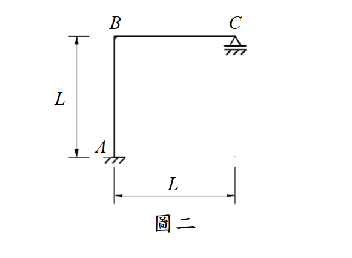
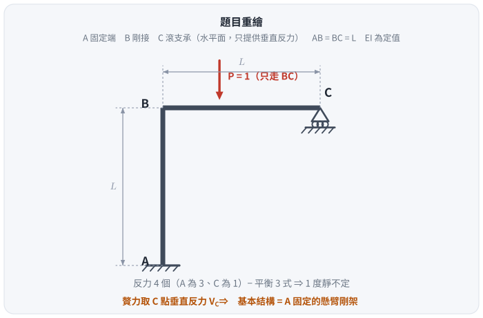
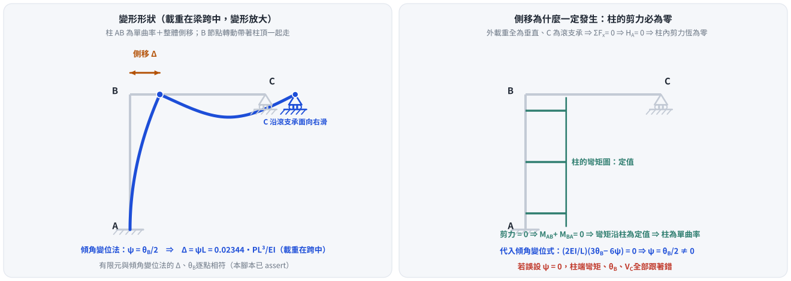
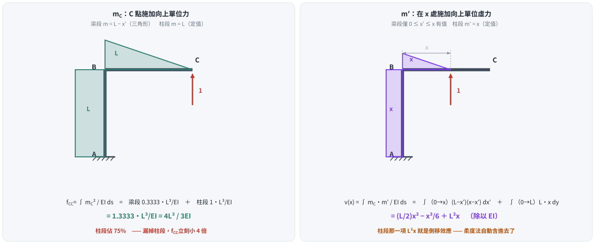
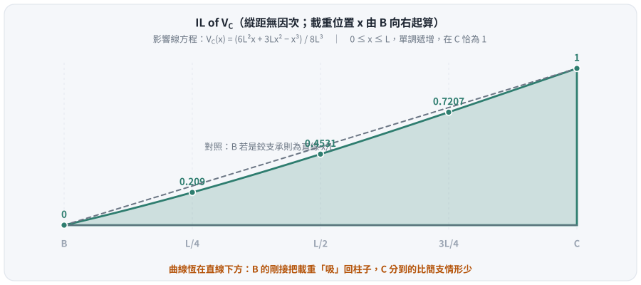

# 考題編號：SA-2016-2

**主分類：** `SA-U1-3` 靜定及靜不定結構影響線
**副分類：** `SA-U2-3` 靜不定結構之傾角變位法
**分析法：** 柔度法（Müller-Breslau 原理）／傾角變位法
**標籤：** `影響線` `靜不定剛架` `Müller-Breslau原理` `有側移剛架` `移動載重`

---

## 1. 原始題目重述 (Problem Restatement)

圖二剛架 ABC 使用材料之彈性模數為 E，斷面慣性矩為 I，EI = 常數。已知移動載重在 B 點及 C 點之間，不考慮桿件之軸向變形，試繪 C 點反力的影響線（influence line），並列出其方程式。（25 分）

**結構幾何與條件：**

- **A**：固定端支承（Fixed support）
- **B**：剛接節點（Rigid joint）
- **C**：滾支承（Roller，位於水平面上，**只提供垂直反力**）
- 桿件 AB（柱）長度為 $L$；桿件 BC（梁）長度為 $L$
- 移動載重**只作用於 BC 梁上**

*圖說：剛架 ABC，A 為底端固定支承，AB 垂直柱長 $L$；B 為頂端剛接點，BC 水平梁長 $L$；C 為右端滾支承（水平面）。*

*圖 1　題目重繪（向量版）。這張圖攔兩件事：把 C 當成鉸支承（它只束制垂直、水平可以滑動 —— 這正是側移的來源），以及漏掉「移動載重只走 BC」這個限制條件。*

---

## 2. 考題核心精神與出題者意圖 (Core Concepts & Examiner's Intent)

**核心觀念：** 靜不定結構的影響線分析。

$$\text{反力 } 4 \text{ 個（A 端 3 ＋ C 端 1）} - \text{平衡 } 3 \text{ 式} = \mathbf{1 \text{ 度靜不定}}$$

**出題者意圖：** 測驗考生能否靈活運用 Müller-Breslau 原理（柔度法）或傾角變位法推導影響線**方程式**（不只是形狀）。

**關鍵陷阱 —— 側移（Sway）：**

許多考生看到載重全為垂直向，會誤以為這是無側移剛架。事實上：

- C 是滾支承（無水平束制），外載重也全為垂直 $\Rightarrow$ $\Sigma F_x = 0$ 給出 $H_A = 0$；
- 柱 AB 沿全長無水平載重 $\Rightarrow$ **柱內剪力恆為零**；
- 剪力為零 $\Rightarrow$ $M_{AB} + M_{BA} = 0$ $\Rightarrow$ 柱的彎矩沿全長為**定值**、柱為**單曲率**；
- 代回傾角變位式：$\frac{2EI}{L}(3\theta_B - 6\psi) = 0 \Rightarrow \psi = \frac{\theta_B}{2} \ne 0$ —— **側移必然發生**。

若使用傾角變位法而未列入 $\psi$ 項，柱端彎矩、$\theta_B$、$V_C$ 全部跟著錯。

---

## 3. 解題戰略地圖與陷阱分析 (Strategic Roadmap & Trap Analysis)

**作戰計畫（採用柔度法／Müller-Breslau 原理）：** 此路徑最直觀，且**自然包含側移效應**（基本結構為懸臂剛架，本來就不受水平拘束）。

1. **建立基本結構：** 移除 C 點垂直束制，取 A 端固定的懸臂剛架 ABC，以 $V_C$ 為贅力。
2. **求柔度係數 $f_{CC}$：** 於 C 施加向上單位力，用單位力法（虛功）求 C 點向上位移。
3. **求變形曲線 $v(x)$：** 同一狀態下，求 BC 梁上任意點 $x$ 的垂直位移方程式。
4. **求影響線方程式：** 由位移諧合 $v(x) = V_C \cdot f_{CC}$ 得 $IL_{V_C}(x) = v(x)/f_{CC}$。

*(本題亦可用傾角變位法求解，見第 5 節交叉驗證。)*

**陷阱清單：**

| 陷阱 | 說明 | 應對 |
|---|---|---|
| **側移誤判** | 誤認無側移，傾角變位法少算 $\psi$ 項 | 先驗「柱內剪力是否為零」，零剪力就一定有側移 |
| **漏掉柱段的積分** | 只算梁段的 $\int (L-x')^2 dx'$ | 柱段貢獻 $L^3/EI$，佔 $f_{CC}$ 的 **75%**；漏掉答案小 4 倍 |
| 積分區間與坐標系混淆 | $x$ 從哪端起算 | 一律從 B 起算（$0 \le x \le L$），柱段用 $y$ 由 B 向下 |
| 只給形狀不給方程式 | 題目明說「列出其方程式」 | 必須寫出 $IL_{V_C}(x)$ 的多項式 |
| 把 IL 畫成直線 | 直覺套用簡支梁的 $x/L$ | 本題是三次曲線，且**恆在 $x/L$ 之下** |

---

## 3.5 變數層次分析 (Variable Hierarchy Analysis)

> 複習提示：第一次解題後，在每個卡住的知識點旁標記 `⚠`；第二次複習時只看有 `⚠` 的項目。

### 最終目標

`求出 C 點垂直反力影響線方程式 IL(x) 並繪圖`

### 本題關鍵公式（依計算順序）

$$\text{Step 1: } f_{CC} = \int \frac{m_C \cdot m_C}{EI}\,ds$$

$$\text{Step 2: } v(x) = \int \frac{m_C \cdot m'}{EI}\,ds$$

$$\text{Step 3: } V_C(x) = \frac{\boxed{v(x)}}{\boxed{f_{CC}}}$$

### L1：題目直接給定

| 符號 | 數值 | 說明 |
|---|---|---|
| $L$ | $L$ | 柱與梁的長度（相等） |
| $EI$ | 常數 | 撓曲剛度 |
| $P$ | $1$ | 移動單位載重（只走 BC） |

### L2：需知識點推導

**Step 1：單位贅力 $V_C = 1$ 作用下的彎矩**

| 符號 | 公式／來源 | 卡關? |
|---|---|:--:|
| $m_C(x')$ | $1 \cdot (L - x')$ | BC 梁，距 B 點 $x'$ 處 |
| $m_C(y)$ | $1 \cdot L = L$ | AB 柱，**定值**（力臂恆為 $L$） |

**Step 2：柔度係數與變形曲線（虛功積分）**

| 符號 | 公式／來源 | 卡關? |
|---|---|:--:|
| $f_{CC}$ | $\displaystyle\int_0^L \frac{(L-x')^2}{EI}dx' + \int_0^L \frac{L^2}{EI}dy = \frac{L^3}{3EI} + \frac{L^3}{EI} = \frac{4L^3}{3EI}$ | |
| $v(x)$ | $\displaystyle\int_0^x \frac{(L-x')(x-x')}{EI}dx' + \int_0^L \frac{L\cdot x}{EI}dy$ | |

### L3：深層知識（不懂就卡住）

| 知識點 | 說明 | 卡關? |
|---|---|:--:|
| **Müller-Breslau 原理** | 解除某反力的束制、給予單位位移，變形曲線即為該反力的影響線。數學本質是位移諧合：$V_C = \delta_{Cx}/f_{CC}$ | |
| **Maxwell 互易定理** | 「C 受單位力時 $x$ 處的位移」＝「$x$ 處受單位力時 C 的位移」—— 一次積分同時給出整條影響線 | |
| **剛架側移判斷** | 柱內剪力為零 $\Rightarrow$ 彎矩為定值 $\Rightarrow$ $\psi = \theta_B/2 \ne 0$ | |
| **柱段對柔度的貢獻** | $m_C$ 在柱上是定值 $L$，積分得 $L^3/EI$ —— 比梁段大三倍 | |

---

## 4. 步驟化詳細計算過程 (Step-by-Step Detailed Calculation)

> 📊 影響線互動圖：`SA-2016-2-influence-line-viz.html`

**坐標系設定：**

- BC 梁：以 B 為原點，向右為 $x$ 軸正向（$0 \le x \le L$）
- AB 柱：以 B 為原點，向下為 $y$ 軸正向（$0 \le y \le L$）

---

### Step 0：先確認「一定有側移」

*圖 2　側移不是選項，是必然。這張圖攔的是本題最大的陷阱：外載重全為垂直，直覺會說「沒有水平力就沒有側移」—— 但沒有水平力代表柱內**剪力為零**，剪力為零的柱只能是「單曲率＋整體平移」，$\psi$ 必不為零。右格的柱彎矩圖是定值，就是零剪力的直接證據。*

---

### Step 1：建立基本結構與單位贅力彎矩 $m_C$

解除 C 點垂直滾支承，將其視為贅力 $V_C$。基本結構為 A 點固定的**懸臂剛架** ABC。於 C 點施加向上單位力 $V_C = 1$，各桿段的彎矩函數：

- **BC 梁（$0 \le x' \le L$）：** $m_C(x') = 1 \cdot (L - x')$
- **AB 柱（$0 \le y \le L$）：** $m_C(y) = 1 \cdot L = L$（**定值**，因力臂恆為水平距離 $L$）

### Step 2：計算 C 點柔度係數 $f_{CC}$

*圖 3　$m_C$ 與 $m'$ 兩張彎矩圖，以及 $f_{CC}$ 的組成。這張圖攔的是「只算梁段」：柱段那塊矩形（$m_C = L$ 定值）貢獻 $L^3/EI$，佔 $f_{CC}$ 的 **75%** —— 漏掉它，$f_{CC}$ 直接小 4 倍。右格也順帶說明了柔度法為什麼自動含側移：$v(x)$ 裡的 $L^2 x$ 就是柱段的貢獻。*

$$f_{CC} = \int \frac{m_C^2}{EI}ds
= \underbrace{\int_0^L \frac{(L-x')^2}{EI}dx'}_{\text{梁段}} + \underbrace{\int_0^L \frac{L^2}{EI}dy}_{\text{柱段}}$$

$$= \frac{1}{EI}\left[-\frac{(L-x')^3}{3}\right]_0^L + \frac{L^3}{EI}
= \frac{L^3}{3EI} + \frac{L^3}{EI} = \boxed{\frac{4L^3}{3EI}}$$

> **柱段 $\dfrac{L^3}{EI}$ 是梁段 $\dfrac{L^3}{3EI}$ 的三倍** —— 這個結構的柔度主要來自柱，不是梁。

### Step 3：計算變形曲線方程式 $v(x)$

當 C 點受向上單位力時，求梁上距 B 為 $x$ 處的向上位移 $v(x)$。依虛功原理，在 $x$ 處施加向上單位虛力，虛彎矩：

- **BC 梁：** $x' \in [0, x]$：$m'(x') = 1 \cdot (x - x')$；$x' \in (x, L]$：$m' = 0$
- **AB 柱：** $m'(y) = 1 \cdot x = x$（定值）

$$v(x) = \int \frac{m_C \cdot m'}{EI}ds
= \int_0^x \frac{(L-x')(x-x')}{EI}dx' + \int_0^L \frac{L \cdot x}{EI}dy$$

**第一項：**

$$\int_0^x (L-x')(x-x')dx' = \int_0^x \left(Lx - Lx' - xx' + x'^2\right)dx'
= Lx^2 - \frac{Lx^2 + x^3}{2} + \frac{x^3}{3} = \frac{L}{2}x^2 - \frac{1}{6}x^3$$

**第二項：** $\displaystyle\int_0^L \frac{Lx}{EI}dy = \frac{L^2 x}{EI}$

**合併：**

$$v(x) = \frac{1}{EI}\left(\frac{L}{2}x^2 - \frac{1}{6}x^3 + L^2 x\right)$$

### Step 4：求影響線方程式

當移動載重 $P = 1$（向下）作用於 $x$ 處時，依 Maxwell 互易定理，C 點下沉量即為 $v(x)$；再由 $V_C$ 頂回：

$$V_C \cdot f_{CC} = v(x) \quad\Longrightarrow\quad V_C(x) = \frac{v(x)}{f_{CC}}$$

$$IL_{V_C}(x)
= \frac{\frac{1}{EI}\left(L^2 x + \frac{L}{2}x^2 - \frac{1}{6}x^3\right)}{\frac{4L^3}{3EI}}
= \frac{3}{4L^3}\left(L^2 x + \frac{L}{2}x^2 - \frac{1}{6}x^3\right)$$

$$\boxed{\;IL_{V_C}(x) = \frac{6L^2 x + 3Lx^2 - x^3}{8L^3}\;}
\qquad (0 \le x \le L,\ x \text{ 由 B 向右起算})$$

### Step 5：影響線圖與特例檢驗

*圖 4　$V_C$ 影響線。這張圖攔的是「把它畫成直線 $x/L$」（那是 B 為鉸支承時的答案）。曲線**恆在直線下方**：B 的剛接把載重「吸」回柱子，C 分到的比簡支情形少 —— 在 $x = L/2$ 少了約 $9.4\%$。*

**縱距表：**

| $x$ | $0$（B） | $L/4$ | $L/2$ | $3L/4$ | $L$（C） |
|:--|:--:|:--:|:--:|:--:|:--:|
| $IL_{V_C}$ | $0$ | $\dfrac{107}{512} = 0.2090$ | $\dfrac{29}{64} = 0.4531$ | $\dfrac{369}{512} = 0.7207$ | $1$ |
| 簡支對照 $x/L$ | $0$ | $0.25$ | $0.5$ | $0.75$ | $1$ |

**特例檢驗：**

- $x = 0$（載重在 B）：$IL = 0$ ✓ —— 載重直接沿柱傳到 A，C 完全不分擔
- $x = L$（載重在 C）：$IL = \dfrac{6L^3 + 3L^3 - L^3}{8L^3} = 1$ ✓
- $\dfrac{d}{dx}(6L^2x + 3Lx^2 - x^3) = 6L^2 + 6Lx - 3x^2 > 0$ 於 $0 \le x \le L$ ✓ 單調遞增，最大值即 $1$

---

## 5. 關鍵爭議點與進階探討 (Critical Issues & Advanced Discussion)

### 5.1 採用「傾角變位法」的交叉驗證

若在考場上想用傾角變位法建立 $V_C$ 函數，**必須考慮側移** $\psi = \Delta/L$：

1. 柱 AB 基底無剪力 $\Rightarrow M_{AB} + M_{BA} = 0 \Rightarrow \dfrac{2EI}{L}(3\theta_B - 6\psi) = 0 \Rightarrow \psi = \dfrac{1}{2}\theta_B$
2. $M_{BA} = \dfrac{2EI}{L}(2\theta_B - 3\psi) = \dfrac{EI}{L}\theta_B$
3. C 為滾支承，使用修正傾角變位式：$M_{BC} = \dfrac{3EI}{L}\theta_B + FEM'_{BC}$
4. $FEM'_{BC} = -\dfrac{x(L-x)(2L-x)}{2L^2}$（$x$ 為載重距 B 的距離）
5. 節點 B 平衡：$M_{BA} + M_{BC} = 0 \Rightarrow \dfrac{4EI}{L}\theta_B = -FEM'_{BC} \Rightarrow \theta_B = -\dfrac{L}{4EI}FEM'_{BC}$
6. $M_{BC} = \dfrac{1}{4}FEM'_{BC} = -\dfrac{x(L-x)(2L-x)}{8L^2}$
7. BC 桿對 B 取矩：$M_{BC} + 1\cdot x - V_C \cdot L = 0 \Rightarrow V_C = \dfrac{x + M_{BC}}{L}$
8. 代入化簡：

$$V_C = \frac{x}{L} - \frac{2L^2x - 3Lx^2 + x^3}{8L^3} = \frac{6L^2x + 3Lx^2 - x^3}{8L^3} \quad\checkmark$$

**與柔度法完全相同。**

### 5.2 驗算紀錄（2026-08-26）

本題的答案已由**四條互相獨立的路徑**確認：

| 路徑 | 說明 | 與解析式的最大差 |
|---|---|---|
| ① 柔度法 | $v(x)/f_{CC}$ | — |
| ② 解析式 | $(6L^2x+3Lx^2-x^3)/8L^3$ | $2.2\times10^{-16}$ |
| ③ 傾角變位法（含側移） | $\S5.1$ 的 8 個步驟 | $2.2\times10^{-16}$ |
| ④ 剛架有限元 | 2 桿 80 元素，$EA$ 取極大以模擬「忽略軸向變形」 | $9.1\times10^{-8}$ |

有限元同時驗證了側移量：載重在梁跨中時 $\Delta = 0.02344\,PL^3/EI$、$\theta_B = 0.04688\,PL^2/EI$，與 $\psi = \theta_B/2$ 相符。

### 5.3 結論：柔度法是這類題目的防呆武器

無論用柔度法或傾角變位法，**考慮側移**都是破題關鍵。差別在於：

- **傾角變位法**要你「先意識到有側移」，才會把 $\psi$ 寫進方程 —— 沒意識到就整題錯；
- **柔度法**從能量積分著手，柱段的 $m_C = L$ 自然把側移效應含進去，**你不必先想到它**。

這就是為什麼影響線題型優先建議柔度法：它把一個需要洞察的步驟，變成一個只要不漏掉積分區間就不會錯的步驟。

### 5.4 為什麼曲線恆在 $x/L$ 之下

若 B 是鉸支承（柱只是一根二力桿），BC 就是簡支梁，$IL = x/L$。本題 B 是剛接，柱能吸收彎矩：載重放在梁上時，一部分透過 B 的彎矩傳給柱，C 分到的自然變少。差距在 $x = L/2$ 最明顯（$0.4531$ vs $0.5$，少 $9.4\%$），在兩端則因邊界條件而歸零／歸一。

---

## 6. 本題知識點索引

| 知識點 | 概念 ID |
|---|---|
| 影響線 | [[INFLUENCE-LINE]] |
| Müller-Breslau 原理 | [[MULLER-BRESLAU-PRINCIPLE]] |
| 柔度法（單位力法） | [[FORCE-METHOD]] |
| 傾角變位法 | [[SLOPE-DEFLECTION-EQUATION]] |
| 有側移剛架 | [[SWAY-FRAME]] |

---

*解析日期：2026-07-02　｜　複核＋圖解補繪：2026-08-26（四條獨立路徑驗算相符，見 §5.2；向量圖腳本 `gen_SA-2016-2.py`，可重跑）*
