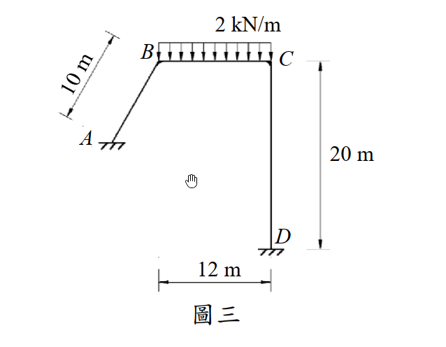

# 考題編號：SA-2016-3

**主分類：** `SA-U2-1` 靜不定結構最小功法
**副分類：** `SA-U2-2` 靜不定結構諧合變位
**分析法：** 單位力法（虛功原理） / 圖形積分法
**標籤：** `虛功法` `單位力法` `側移變位` `基本結構選取` `圖形積分法`

---

## 1. 原始題目重述 (Problem Restatement)

圖三剛架使用材料之彈性模數為 E，斷面慣性矩為 I，EI = 常數。已知於 BC 間受 2 kN/m 的均佈載重時，各桿端彎矩為：
- $M_{AB} = -23.2$ kN-m
- $M_{BC} = 5.63$ kN-m
- $M_{CD} = -25.3$ kN-m
- $M_{DC} = -17.0$ kN-m

試求此時 C 點的變位。（25 分）

**結構幾何：**
- A：固定支承（或鉸支承，依圖示有斜線，但AB桿僅標示長度 10m，未標示確切座標與傾角）。
- B：剛接節點。
- C：剛接節點。
- D：固定支承。
- 桿件 AB 長 10m；BC 為水平梁，長 12m；CD 為垂直柱，長 20m。

*圖說：剛架結構，AB 桿長 10 m，BC 梁長 12 m 且受 2 kN/m 向下均佈載重，CD 柱長 20 m。D 為固定支承。已知各節點的端彎矩。*

---

## 2. 考題核心精神與出題者意圖 (Core Concepts & Examiner's Intent)

**核心觀念：** 虛功原理（單位力法）中「虛力系統基本結構」的任意性。

**出題者意圖與破題關鍵：**
這是一道極具鑑別度的「觀念題」。
1. 題目並**沒有給定 A 點的確切座標或 AB 桿的傾角**，這意味著考生無法對全剛架進行完整的幾何與靜力分析。
2. 題目卻給了「所有的桿端彎矩」。
3. 根據虛功原理 $1 \cdot \Delta = \int \frac{M m}{EI} ds$，真實彎矩 $M$ 已經完全已知。而虛彎矩 $m$ 可以建立在**任何滿足靜力平衡的靜定基本結構**上。
4. 若我們巧妙地選擇「**將 CD 視為固定於 D 的懸臂柱**」作為虛力系統的基本結構（相當於切斷 C 點左側），並在 C 點施加虛力，則虛彎矩 $m$ **僅存在於 CD 桿**。
5. 如此一來，積分式中 AB 桿與 BC 桿的 $m = 0$，完全不需要知道 AB 桿的幾何資訊，僅用 CD 桿的已知彎矩即可解出 C 點變位！

**關鍵陷阱：** 給定的 $M_{AB}$ 與 $M_{BC}$ 實際上是**干擾資訊（Distractors）**，用來迷惑觀念不夠清晰的考生，讓他們陷入試圖解出全結構反力與幾何的泥淖中。

---

## 3. 解題戰略地圖與陷阱分析 (Strategic Roadmap & Trap Analysis)

**作戰計畫：**
1. **確認變位方向：** 因不考慮軸向變形，且 CD 為長度 20m 的垂直桿（D 點固定），故 C 點無垂直位移（$\Delta_{Cy} = 0$）。「C 點變位」即指水平側移 $\Delta_{Cx}$。
2. **建立真實彎矩 $M(y)$：** 利用給定的 $M_{CD}$ 與 $M_{DC}$，畫出 CD 桿的彎矩圖。
3. **建立虛力系統 $m(y)$：** 選擇 D 端固定的懸臂柱 CD 為基本結構，於 C 點施加向右的單位力 $P'=1$，求虛彎矩分佈。
4. **圖形積分：** 使用圖形積分法（Simpson's Rule 簡化公式）將 $M$ 圖與 $m$ 圖相乘，求得 $\Delta_{Cx}$。
5. **補充計算轉角：** 實務上「變位」通常指位移，但為求周全，可同理施加單位虛力矩求出 C 點轉角 $\theta_C$。

---

## 3.5 變數層次分析 (Variable Hierarchy Analysis)

> 複習提示：第一次解題後，在每個卡住的知識點旁標記 `⚠`；第二次複習時只看有 `⚠` 的項目。

### 最終目標
`利用單位力法，僅對 CD 桿進行虛功積分，求出 C 點水平位移`

### 本題關鍵公式（依計算順序）

$$\text{Step 1: 定義 } M(y) \text{ 與 } m(y) \text{，以左側受拉為正}$$

$$\text{Step 2: } \Delta_{Cx} = \int_0^{20} \frac{M(y) \cdot m(y)}{EI} dy$$

$$\text{Step 3: 圖形積分 } \int Mm dy = \frac{L}{6}(M_t m_t + 4 M_m m_m + M_b m_b)$$

### L1：題目直接給定
| 符號 | 數值 | 說明 |
|------|------|------|
| $M_{CD}$ | -25.3 kN-m | 依傾角變位法慣例，負號表逆時針作用於桿端 |
| $M_{DC}$ | -17.0 kN-m | 逆時針作用於桿端 D |
| $L_{CD}$ | 20 m | CD 柱長度 |

### L2：需知識點推導
**Step 1：真實彎矩 $M$ 的受拉側判斷**
| 符號 | 公式／來源 | 卡關? |
|------|-----------|:-----:|
| $M_t$ (頂端) | +25.3 kN-m | 頂端受逆時針力矩 $\Rightarrow$ 柱向左彎 $\Rightarrow$ 左側受拉 |
| $M_b$ (底端) | -17.0 kN-m | 底端受逆時針力矩 $\Rightarrow$ 柱向右彎 $\Rightarrow$ 右側受拉 |

**Step 2：虛彎矩 $m$ 的建立（懸臂柱模型）**
| 符號 | 公式／來源 | 卡關? |
|------|-----------|:-----:|
| $m(y)$ | $-1 \cdot y = -y$ | 頂端受向右單位力 $\Rightarrow$ 柱向右彎 $\Rightarrow$ 右側受拉（負值） |

### L3：深層知識（不懂就卡住）
| 知識點 | 說明 | 卡關? |
|--------|------|:-----:|
| **虛功基本結構的任意性** | 虛力系統不需要與原結構有相同的靜不定度，只要滿足靜力平衡與邊界條件即可。這是本題能捨棄 AB、BC 桿的理論基礎。 | |
| **圖形積分法** | 兩個線性函數相乘的定積分，可完美展開為 $\frac{L}{6}(y_1 y_1' + 4 y_m y_m' + y_2 y_2')$，大幅降低計算錯誤率。 | |

---

## 4. 步驟化詳細計算過程 (Step-by-Step Detailed Calculation)

> 📊 互動圖：`SA-2016-3-frame-viz.html`

### Step 1：定義座標系與符號慣例
- 關注 CD 桿，設 $y$ 座標由 C 點（頂端）向下起算，$0 \le y \le 20$ m。
- **彎矩正負號：定義使「左側受拉」為正彎矩。**

### Step 2：解析真實彎矩 $M(y)$
已知桿端彎矩（依傾角變位法，逆時針為負）：
- **C 端 (頂部)：** $M_{CD} = -25.3$ kN-m（逆時針）。逆時針力矩作用於柱頂，會使柱身左側突起（受拉），故 $M_{top} = +25.3$。
- **D 端 (底部)：** $M_{DC} = -17.0$ kN-m（逆時針）。逆時針力矩作用於柱底，會使柱身右側突起（受拉），故 $M_{bot} = -17.0$。
- **中點 ($y=10$)：** 呈線性分佈， $M_{mid} = \frac{25.3 + (-17.0)}{2} = +4.15$。

### Step 3：建立虛力系統與虛彎矩 $m(y)$
- **基本結構：** 移除 A、B 節點的約束，將 CD 視為固定於 D 的懸臂柱。
- **虛載重：** 於 C 點施加水平向右的單位力 $P'=1$。
- **虛彎矩 $m(y)$：** 距 C 點 $y$ 處，力矩為 $1 \cdot y$。向右推會使柱的右側受拉，依慣例為負。
  - $m_{top} = 0$
  - $m_{bot} = -20$
  - $m_{mid} = -10$

### Step 4：圖形積分法求水平位移 $\Delta_{Cx}$
根據虛功原理：
$$1 \cdot \Delta_{Cx} = \int_0^{20} \frac{M(y) \cdot m(y)}{EI} dy$$

使用圖形積分公式：
$$\int Mm dy = \frac{L}{6} \left( M_{top} m_{top} + 4 M_{mid} m_{mid} + M_{bot} m_{bot} \right)$$

代入數值：
$$\Delta_{Cx} = \frac{20}{6EI} \left[ (25.3)(0) + 4(4.15)(-10) + (-17.0)(-20) \right]$$
$$\Delta_{Cx} = \frac{10}{3EI} \left[ 0 - 166 + 340 \right]$$
$$\Delta_{Cx} = \frac{10}{3EI} \left[ 174 \right] = \frac{1740}{3EI} = \boxed{ \frac{580}{EI} }$$

由於結果為正，表示變位方向與虛力 $P'=1$ 相同，即**向右**。

---
**（補充）求 C 點轉角 $\theta_C$**
雖一般「變位」指平移位移，但為求完整，同理可求轉角：
- 虛設系統：於 C 點施加逆時針（使左側受拉，正向）單位力矩 $M'=1$。
- 虛彎矩分佈為常數：$m_\theta(y) = +1$。
- $\theta_C = \int_0^{20} \frac{M(y) \cdot 1}{EI} dy = \text{M圖面積} / EI$
- $\theta_C = \frac{1}{EI} \left( \frac{25.3 + (-17.0)}{2} \right) \times 20 = \frac{4.15 \times 20}{EI} = \boxed{ \frac{83}{EI} \text{ (逆時針)} }$

---

## 5. 關鍵爭議點與進階探討 (Critical Issues & Advanced Discussion)

**干擾資訊的識別：**
本題給定了 $M_{AB} = -23.2$ 與 $M_{BC} = 5.63$，以及 BC 上的載重 2 kN/m。這些資訊對於計算 C 點變位是**完全不需要**的。這凸顯了結構學考試中，不只要會「算」，更要會「選」——選擇最簡單、最不易出錯的虛功基本結構路徑。

**幾何條件的暗示：**
當題目刻意不給定 AB 桿的傾角與 A 點的精確座標時，就是在暗示考生「不要試圖計算全結構」。這種「資訊不足但仍可解」的題型，是國考常見的巧思，旨在獎勵觀念透徹的考生。
