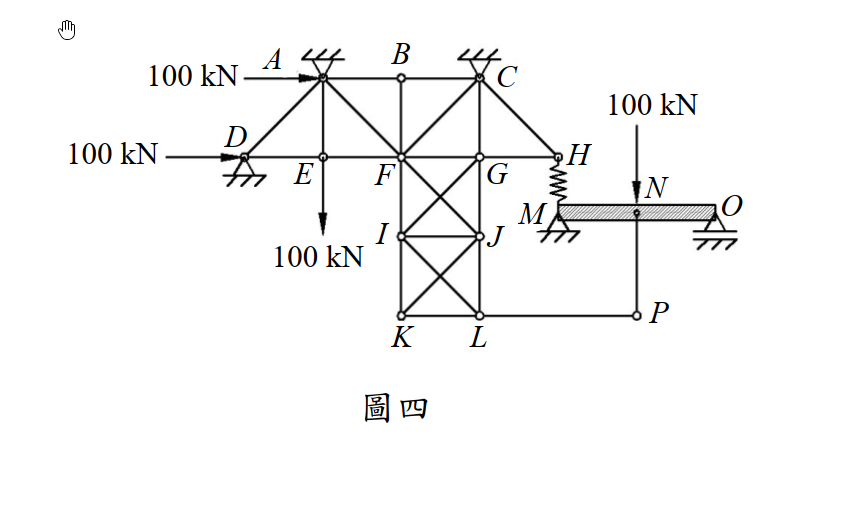

# 考題編號：SA-2016-4

**主分類：** `SA-U1-1` 桁架分析
**副分類：** `SA-U1-1-1` 零力桿件判斷
**分析法：** 節點平衡法 (Method of Joints)
**標籤：** `零力桿件` `桁架` `節點平衡`

---

## 1. 原始題目重述 (Problem Restatement)

圖四右側 MNO 梁在 M 點以彈簧與左側桁架的 H 點連接，彈簧之彈簧常數為 k。在圖示的載重下，試判斷此構造中，那些桿件為零桿（zero-force member）。（25 分）

**結構幾何與載重特徵：**
- 左側為一複雜桁架系統，右側為一 MNO 梁。
- A、C、D、M、O 皆設有支承。
- A、D 點承受 100 kN 向右水平力。
- E、I、N 點承受 100 kN 向下垂直力。
- 節點 B 僅連接 AB、BC、BF 三桿。
- 節點 P 懸空，僅連接 LP、NP 兩桿。

*圖說：左側為含 X 型交叉斜撐之桁架，右側為 MNO 梁。H 點與 M 點間有彈簧。P 點為懸空節點。*

---

## 2. 考題核心精神與出題者意圖 (Core Concepts & Examiner's Intent)

**核心觀念：** 零力桿件（Zero-Force Member）的視覺判斷法則。
**出題者意圖：** 這是一道經典的「找碴題」。出題者畫了一個看起來極度複雜的桁架，加上彈簧、梁以及多個載重，試圖讓考生眼花撩亂。但只要熟記並冷靜應用零力桿件的兩大法則，即可在幾秒鐘內找出答案，完全不需要動筆計算反力或解聯立方程式。

**兩大基本法則：**
1. **二桿節點法則**：無外力且無支承的節點，若僅連接兩根非共線桿件，則此兩桿皆為零力桿。
2. **三桿節點法則**：無外力且無支承的節點，若連接三根桿件且其中兩根共線，則第三根不共線桿件為零力桿。

**關鍵陷阱：**
- **N 點與 P 點的連接：** MNO 梁在 N 點承受 100 kN 載重，許多考生會直覺認為 NP 桿會將此力傳導至桁架。但實際上，**P 點完全沒有其他垂直約束或桿件**來抵抗這個力。如果 NP 桿有受力，P 點就無法平衡。因此，NP 桿必定是零力桿，這是一個「無效懸吊」的陷阱。

---

## 3. 解題戰略地圖與陷阱分析 (Strategic Roadmap & Trap Analysis)

**作戰計畫：**
1. **掃描外圍與懸空節點**：尋找「無外力、無支承」的邊緣節點。
2. **分析 P 點（二桿節點）**：確認 LP 與 NP 的受力狀態。
3. **分析 B 點（三桿節點）**：確認 BF 的受力狀態。
4. **移除零力桿後的二次掃描**：檢查移除上述桿件後，是否會產生新的零力桿。

---

## 3.5 變數層次分析 (Variable Hierarchy Analysis)

> 複習提示：第一次解題後，在每個卡住的知識點旁標記 `⚠`；第二次複習時只看有 `⚠` 的項目。

### 最終目標
`找出所有零力桿件 (Zero-Force Members)`

### L1：題目直接給定
| 符號 | 狀態 | 說明 |
|------|------|------|
| 節點 P | 無外力、無支承 | 僅連接 LP、NP 兩桿 |
| 節點 B | 無外力、無支承 | 連接 AB、BC (共線) 與 BF 三桿 |

### L2：需知識點推導
**零力桿法則應用**
| 節點 | 平衡方程式 | 結論 | 卡關? |
|------|-----------|------|:-----:|
| P 點 | $\Sigma F_x = 0$, $\Sigma F_y = 0$ | $F_{LP} = 0$, $F_{NP} = 0$ | |
| B 點 | $\Sigma F_y = 0$ (垂直於共線桿) | $F_{BF} = 0$ | |

### L3：深層知識（不懂就卡住）
| 知識點 | 說明 | 卡關? |
|--------|------|:-----:|
| **「無效傳力」陷阱** | N 點雖有載重，但因 P 點自由，NP 桿無法產生反作用力，故 NP 不受力，載重 100 kN 完全由梁 MNO 承受。 | |

---

## 4. 步驟化詳細計算過程 (Step-by-Step Detailed Calculation)

本題只需透過節點平衡的觀念進行判斷，無需數值計算。

### Step 1：判斷節點 P (應用二桿節點法則)
- **觀察：** 結構右下角的節點 P。
- **條件：** 節點 P 僅連接兩根桿件（水平桿 LP 與垂直桿 NP）。節點 P 上**沒有**作用任何外部載重，也**沒有**任何支承。
- **推導：** 
  - 水平方向力平衡：$\Sigma F_x = 0 \Rightarrow F_{LP} = 0$
  - 垂直方向力平衡：$\Sigma F_y = 0 \Rightarrow F_{NP} = 0$
- **結論：** **LP 桿**與 **NP 桿**為零力桿。

### Step 2：判斷節點 B (應用三桿節點法則)
- **觀察：** 結構頂部的節點 B。
- **條件：** 節點 B 連接三根桿件（AB、BC、BF）。其中 AB 桿與 BC 桿共線（皆為水平）。節點 B 上**沒有**作用任何外部載重，也**沒有**任何支承。
- **推導：** 
  - 取垂直於共線桿（即垂直向）的力平衡：$\Sigma F_y = 0 \Rightarrow F_{BF} = 0$
- **結論：** **BF 桿**為零力桿。

### Step 3：進行二次掃描 (檢查是否有連鎖效應)
- 將已確認的零力桿 (LP, NP, BF) 從結構中假想移除，檢查其他節點。
- **節點 L：** 移除 LP 後，剩下 KL (水平)、JL (垂直) 與 IL (斜向)。由於包含斜桿且大於兩桿，無法判定為零力桿。
- **節點 F：** 移除 BF 後，仍有 AF, EF, FG, FI, FJ, CF 多桿交會，無法判定。
- **節點 E、I：** 皆有外部垂直載重 100 kN 作用，因此連接的垂直桿 AE、FI 等必然會承受內力，非零力桿。
- **節點 H：** 連接 GH、CH 及彈簧 HM。雖然結構複雜，但無法直接判斷為零。
- **支承節點 A, C, D：** 具有支承反力，無法直接應用零力桿法則判斷相鄰桿件。
- 經過二次掃描，未發現新的零力桿。

---

## 5. 結論與最終答案 (Conclusion)

本構造中，零力桿件共有 3 根，分別為：
- **BF 桿**
- **LP 桿**
- **NP 桿**
