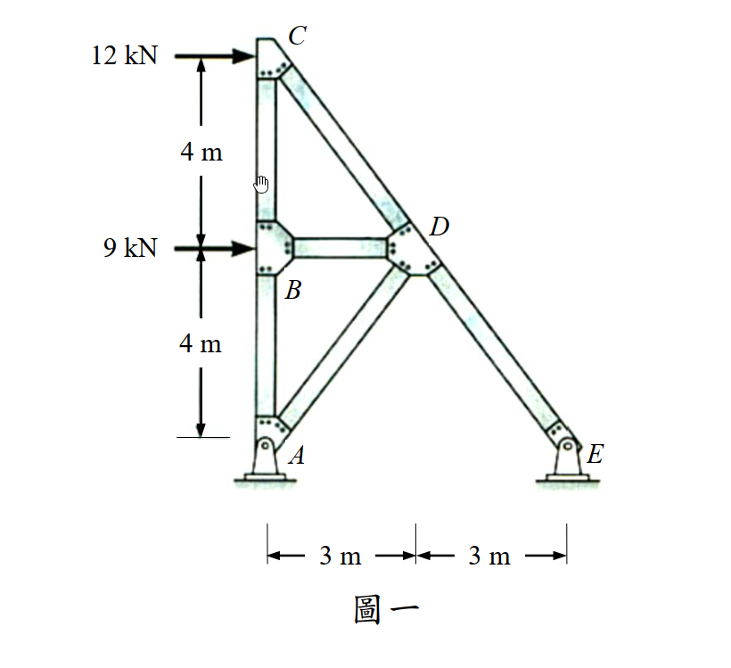

# 考題編號：SA-2017-1

**主分類：** 靜定桁架分析 (SA-U1-2)
**副分類：** 虛功法求位移 (SA-U1-5)
**分析法：** 節點法 + 虛功法（單位力法）
**標籤：** `靜定桁架` `節點法` `零桿判斷` `虛功法` `水平位移`

---

## 1. 原始題目重述 (Problem Restatement)

*圖說：平面桁架，節點坐標（以 A 為原點）：A=(0,0)鉸支承、B=(0,4)m、C=(0,8)m、D=(3,4)m、E=(6,0)m鉸支承。桿件：AB、BC（垂直柱，各 4m）、AC（垂直全高柱，8m）、BD（水平桿，3m）、CD（斜桿，5m）、BE（斜桿，$2\sqrt{13}$m）、DE（斜桿，5m）。外力：C 點受 12kN 向右，B 點受 9kN 向右。所有桿件彈性模數 E 與斷面積 A 皆為定值。*

**子問題：**
1. 判斷各桿件受拉或受壓（15分）
2. 求 C 點的水平位移，需標明方向（15分）

---

## 2. 考題核心精神與出題者意圖 (Core Concepts & Examiner's Intent)

**核心觀念：** 靜定桁架的完整解析流程——從平衡方程式求支承反力，到節點法逐一求各桿內力，再到虛功法（單位力法）求特定點位移。

**出題者意圖：**
- 測驗考生能否**正確識別零桿**（AC、BD），這是桁架分析中的速解技巧，但容易被忽略導致做多餘計算。
- 測驗**節點法的執行順序**——需從只連兩桿的節點（如 D、E）開始解，逐步推進。
- 測驗**虛功法的完整應用**：在虛擬載重體系下重新解一次桁架，再帶入公式計算位移。

**潛在陷阱：**
- 斜桿 BE 的長度為 $\sqrt{6^2+4^2} = 2\sqrt{13}$，不是整數，容易算錯分量比例。
- 虛擬內力體系的節點法容易抄錯原始體系的解，造成虛功計算出錯。

---

## 3. 解題戰略地圖與陷阱分析 (Strategic Roadmap & Trap Analysis)

**步驟化作戰計畫：**
1. 整體平衡求 $A_y, E_y$（對 A 取矩）
2. 節點 D → 求 $F_{CD}, F_{DE}, F_{BD}$
3. 節點 E → 求 $F_{BE}$（帶入 $E_y$）
4. 節點 C → 求 $F_{AC}$
5. 節點 A → 求 $F_{AB}$；節點 B → 驗算 $F_{BC}$
6. 虛擬載重（C點施加1kN向右）→ 重複步驟1–5 求 $\bar{f}_i$
7. 虛功原理求 $\delta_C$

**⚠ 陷阱一：斜桿方向角**
BE 長 $2\sqrt{13}$，方向餘弦 $(3/\sqrt{13}, -2/\sqrt{13})$，非 3-4-5 桿。

**⚠ 陷阱二：AC 與 BD 為零桿**
AC 竪直連接 A 與 C，無橫向荷載分量，而節點 C 的垂直分量已由節點方程推出 $F_{AC}=0$。
BD 水平桿，因節點 D 的 $\sum F_x$ 方程推導 $F_{BD}=0$。

**⚠ 陷阱三：虛擬體系求 $\bar{E}_y$**
虛擬體系外力只有 C 點 1kN 向右，需重新對 A 取矩求 $\bar{E}_y = 1 \times 8/6 = 4/3$ kN。

**⚠ 陷阱四：虛功公式的 L 要帶各桿實際長度**
零桿的 $F_i \bar{f}_i = 0$，貢獻為零，不需特別計算。

---

## 3.5 變數層次分析 (Variable Hierarchy Analysis)

> 複習提示：第一次解題後，在每個卡住的知識點旁標記 `⚠`；第二次複習時只看有 `⚠` 的項目。

### 最終目標

求各桿件拉壓性質，並以虛功法求 **C 點水平位移** $\delta_C$（方向待定）。

### 本題關鍵公式（依計算順序）

$$\text{Step 1：} \quad \sum M_A = 0 \implies E_y = \frac{12 \times 8 + 9 \times 4}{6}$$

$$\text{Step 2（節點D）：} \quad \sum F_y = 0 \implies F_{CD} = F_{DE}$$

$$\text{Step 3（節點C）：} \quad \sum F_x = 0 \implies F_{CD} = -\frac{12}{3/5} = -20 \text{ kN}$$

$$\text{Step 4（節點E）：} \quad \sum F_y = 0 \implies F_{BE} = \frac{-(E_y + F_{DE} \cdot \frac{4}{5})}{\frac{2}{\sqrt{13}}}$$

$$\text{Step 5（節點A）：} \quad F_{AB} = -A_y = \boxed{E_y}$$

$$\text{Step 6（虛功法）：} \quad \delta_C = \frac{1}{EA}\sum_i F_i \cdot \bar{f}_i \cdot L_i$$

### L1：題目直接給定

| 符號 | 數值 | 說明 |
|------|------|------|
| $F_C$ | 12 kN (→) | C 點外力 |
| $F_B$ | 9 kN (→) | B 點外力 |
| $L_{AB} = L_{BC}$ | 4 m | 垂直柱各段長 |
| $L_{AC}$ | 8 m | A 到 C 全高 |
| $L_{BD}$ | 3 m | 水平桿長 |
| $x_D$ | 3 m | D 的水平距離 |
| $x_E$ | 6 m | E 的水平距離 |
| $EA$ | 定值 | 所有桿件相同 |

### L2：需知識點推導

**【全域平衡】**

| 符號 | 公式／來源 | 卡關? |
|------|-----------|-------|
| $E_y$ | $\sum M_A = 0$，$(12 \times 8 + 9 \times 4)/6 = 22$ kN ↑ | |
| $A_y$ | $\sum F_y = 0$，$A_y = -22$ kN（↓） | |

**【各桿內力（節點法）】**

| 符號 | 公式／來源 | 卡關? |
|------|-----------|-------|
| $L_{CD} = L_{DE}$ | $\sqrt{3^2+4^2} = 5$ m（3-4-5 桿） | |
| $L_{BE}$ | $\sqrt{6^2+4^2} = 2\sqrt{13}$ m | |
| $F_{CD}$ | 節點 C，$\sum F_x$：$F_{CD} = -20$ kN（壓） | |
| $F_{DE}$ | 節點 D，$\sum F_y$：$F_{DE} = F_{CD} = -20$ kN（壓） | |
| $F_{BD}$ | 節點 D，$\sum F_x$：$F_{BD} = 0$ kN（零桿） | |
| $F_{BE}$ | 節點 E，$\sum F_y$：$F_{BE} = -3\sqrt{13} \approx -10.82$ kN（壓） | |
| $F_{AB}$ | 節點 A，$\sum F_y$：$F_{AB} = 22$ kN（拉） | |
| $F_{BC}$ | 節點 B，$\sum F_y$：$F_{BC} = 16$ kN（拉） | |
| $F_{AC}$ | 節點 C，$\sum F_y$：$F_{AC} = 0$ kN（零桿） | |

**【虛擬內力（$\bar{P}=1$ 在 C 點向右）】**

| 符號 | 公式／來源 | 卡關? |
|------|-----------|-------|
| $\bar{E}_y$ | $\sum M_A = 0$：$1 \times 8/6 = 4/3$ kN ↑ | |
| $\bar{F}_{CD}$ | 節點 C，$\sum F_x$：$\bar{F}_{CD} = -5/3$ kN | |
| $\bar{F}_{DE}$ | 同理：$\bar{F}_{DE} = -5/3$ kN | |
| $\bar{F}_{BD}$ | 節點 D，$\sum F_x$：$\bar{F}_{BD} = 0$ | |
| $\bar{F}_{BE}$ | 節點 E，$\sum F_y$：$\bar{F}_{BE} = 0$ | |
| $\bar{F}_{AB}$ | 節點 A，$\sum F_y$：$\bar{F}_{AB} = 4/3$ kN | |
| $\bar{F}_{BC}$ | 節點 B，$\sum F_y$：$\bar{F}_{BC} = 4/3$ kN | |
| $\bar{F}_{AC}$ | 節點 C，$\sum F_y$：$\bar{F}_{AC} = 0$ | |

**【位移計算】**

| 符號 | 公式／來源 | 卡關? |
|------|-----------|-------|
| $\sum F_i \bar{f}_i L_i$ | 各桿貢獻之和（見下表） | |
| $\delta_C$ | $\frac{1}{EA}\sum F_i \bar{f}_i L_i$ | |

### L3：深層知識（不懂就卡住）

| 知識點 | 說明 | 卡關? |
|--------|------|-------|
| 零桿識別規則 | 若某節點只有兩桿且無外力，且兩桿不共線，則兩桿均為零桿；或無外力之直桿節點（可從平衡方程推出） | |
| 節點法的執行順序 | 從只有兩個未知桿的節點開始，逐步推進（D、E → C、B → A） | |
| 虛功法（單位力法） | $\delta_{ij} = \sum \frac{F_i \bar{f}_i L_i}{EA}$；$F_i$ 為真實內力，$\bar{f}_i$ 為單位虛擬力引起的內力 | |
| 桿件方向餘弦 | BE 桿：$(\frac{3}{\sqrt{13}}, \frac{-2}{\sqrt{13}})$（B→E 方向），注意上負下正 | |

---

## 4. 步驟化詳細計算過程 (Step-by-Step Detailed Calculation)

### 4.1 整體平衡求支承反力

對 A 點取矩（$y_E = 0 = y_A$，故 $E_x$ 對 A 的力矩臂為零）：

$$\sum M_A = 0: \quad 12 \times 8 + 9 \times 4 - E_y \times 6 = 0$$
$$E_y = \frac{96 + 36}{6} = \frac{132}{6} = 22 \text{ kN} \uparrow$$

$$\sum F_y = 0: \quad A_y + E_y = 0 \implies A_y = -22 \text{ kN} \downarrow$$

### 4.2 節點法求各桿內力

**各桿幾何：**
- $L_{CD} = L_{DE} = 5$ m（3-4-5 三角形：水平差 3m，垂直差 4m）
- $L_{BE} = \sqrt{6^2 + 4^2} = 2\sqrt{13}$ m

**節點 D**（連接 BD、CD、DE，無外力）：
$$\sum F_y = 0: \quad F_{CD} \cdot \frac{4}{5} + F_{DE} \cdot \left(\frac{-4}{5}\right) = 0 \implies F_{CD} = F_{DE}$$

**節點 C**（連接 AC、BC、CD，受 12kN→）：
$$\sum F_x = 0: \quad 12 + F_{CD} \cdot \left(\frac{3}{5}\right) = 0 \implies \boxed{F_{CD} = -20 \text{ kN（壓）}}$$

故 $F_{DE} = -20 \text{ kN（壓）}$

節點 D，$\sum F_x = 0$：$-F_{BD} + F_{CD}\cdot(-\frac{3}{5}) + F_{DE}\cdot(\frac{3}{5}) = 0$
$$\implies -F_{BD} + \frac{60}{5} - \frac{60}{5} = 0 \implies \boxed{F_{BD} = 0 \text{（零桿）}}$$

**節點 E**（連接 BE、DE，受支承反力 $E_y=22$ kN↑, $E_x$）：
$$\sum F_y = 0: \quad 22 + F_{BE}\cdot\frac{2}{\sqrt{13}} + (-20)\cdot\frac{4}{5} = 0$$
$$22 + \frac{2}{\sqrt{13}} F_{BE} - 16 = 0 \implies F_{BE} = \frac{-6\sqrt{13}}{2} = -3\sqrt{13} \approx -10.82 \text{ kN（壓）}$$

驗算節點 B，$\sum F_x = 0$：$9 + F_{BD} + F_{BE}\cdot\frac{3}{\sqrt{13}} = 9 + 0 + (-3\sqrt{13})\cdot\frac{3}{\sqrt{13}} = 9 - 9 = 0$ ✓

**節點 A**（連接 AB、AC，受支承反力 $A_y = -22$ kN）：
$$\sum F_y = 0: \quad -22 + F_{AB} = 0 \implies \boxed{F_{AB} = 22 \text{ kN（拉）}}$$

**節點 B**，$\sum F_y = 0$：
$$-F_{AB} + F_{BC} + F_{BE}\cdot\frac{-2}{\sqrt{13}} = 0 \implies -22 + F_{BC} + 6 = 0 \implies \boxed{F_{BC} = 16 \text{ kN（拉）}}$$

**節點 C**，$\sum F_y = 0$（驗算 $F_{AC}$）：
$$-F_{AC} - F_{BC} + F_{CD}\cdot\frac{-4}{5} = 0 \implies -F_{AC} - 16 + 16 = 0 \implies \boxed{F_{AC} = 0 \text{（零桿）}}$$

### 4.3 各桿內力彙整

| 桿件 | 長度 $L$ (m) | 內力 $F_i$ (kN) | 受力狀態 |
|------|------------|----------------|---------|
| AC   | 8 | 0 | 零桿 |
| AB   | 4 | +22 | **拉力** |
| BC   | 4 | +16 | **拉力** |
| BD   | 3 | 0 | 零桿 |
| CD   | 5 | −20 | **壓力** |
| BE   | $2\sqrt{13}$ | $-3\sqrt{13} \approx -10.82$ | **壓力** |
| DE   | 5 | −20 | **壓力** |

### 4.4 虛擬內力體系（C 點施加 $\bar{P}=1$ kN →）

對 A 取矩：$\bar{E}_y = \frac{1 \times 8}{6} = \frac{4}{3}$ kN ↑

重複節點法（外力僅 C 點 1kN→，B 點無外力）：

| 桿件 | 虛擬內力 $\bar{f}_i$ (kN) |
|------|--------------------------|
| AC   | 0 |
| AB   | +4/3 |
| BC   | +4/3 |
| BD   | 0 |
| CD   | −5/3 |
| BE   | 0 |
| DE   | −5/3 |

### 4.5 虛功法求 C 點水平位移

$$\delta_C = \frac{1}{EA} \sum_i F_i \cdot \bar{f}_i \cdot L_i$$

| 桿件 | $F_i$ | $\bar{f}_i$ | $L_i$ | $F_i \bar{f}_i L_i$ |
|------|-------|------------|-------|---------------------|
| AC   | 0 | 0 | 8 | 0 |
| AB   | 22 | 4/3 | 4 | $22 \times \frac{4}{3} \times 4 = \frac{352}{3}$ |
| BC   | 16 | 4/3 | 4 | $16 \times \frac{4}{3} \times 4 = \frac{256}{3}$ |
| BD   | 0 | 0 | 3 | 0 |
| CD   | −20 | −5/3 | 5 | $(-20)\times(-\frac{5}{3})\times 5 = \frac{500}{3}$ |
| BE   | $-3\sqrt{13}$ | 0 | $2\sqrt{13}$ | 0 |
| DE   | −20 | −5/3 | 5 | $(-20)\times(-\frac{5}{3})\times 5 = \frac{500}{3}$ |
| **合計** | | | | $\dfrac{352+256+500+500}{3} = \dfrac{1608}{3} = 536$ |

$$\boxed{\delta_C = \frac{536}{EA} \text{ m} \quad (\text{向右})}$$

**方向說明：** $\delta_C > 0$，與虛擬力方向相同，故 C 點水平位移為**向右** $\dfrac{536}{EA}$ m。

---

## 5. 關鍵爭議點與進階探討 (Critical Issues & Advanced Discussion)

**爭議一：A點反力是否有水平分量？**
由整體 $\sum F_x = 0$：$A_x + E_x + 12 + 9 = 0$。節點 E 的 $\sum F_x$ 可求 $E_x = 21 - A_x$。
進一步由節點 A：$A_x + F_{AC} = A_x + 0 = 0 \implies A_x = 0$，故 $E_x = -21$ kN（向左）。
考場上若題目問反力，須一併列出 $E_x$。

**爭議二：虛功法的符號約定**
本題正方向定義：向右為正（與虛擬力方向一致）。若算出負值，表示 C 點實際向左位移。
本題 $\sum F_i \bar{f}_i L_i = 536 > 0$，確認 C 點向右位移，結果合理（外力皆向右，C 點當然向右移）。

**進階觀念：零桿的物理意義**
AC 為零桿，代表即使存在這根桿，它在此載重下不承載任何力。
若移除 AC，結構可能變為機構（幾何不穩定），因此它對結構穩定有貢獻，但在此載重下內力恰好為零。
