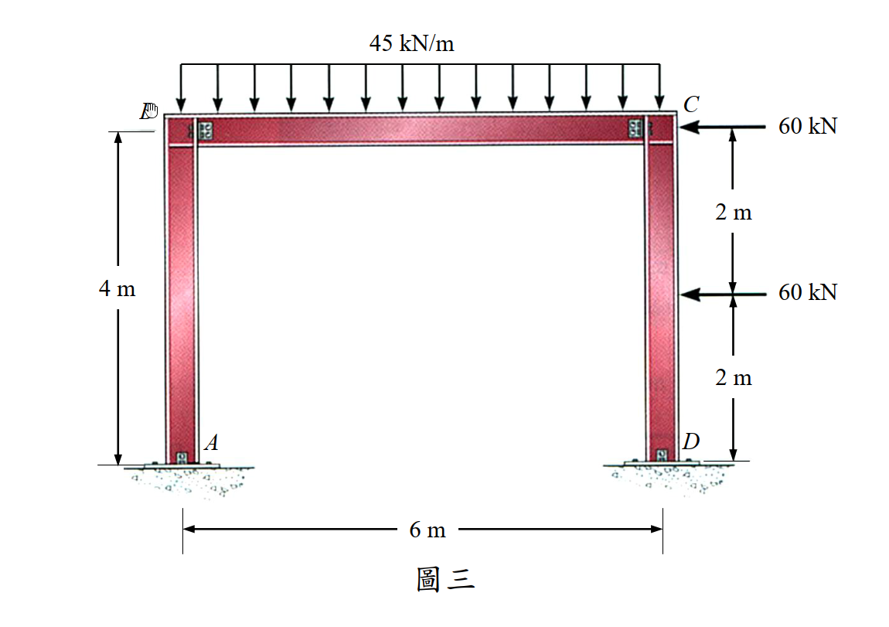

# 考題編號：SA-2017-3

**主分類：** 靜不定結構分析—位移法 (SA-U2-3)
**副分類：** 
**分析法：** 傾角變位法（Slope-Deflection Method）
**標籤：** `傾角變位法` `門型剛架` `側移` `層剪力方程` `固定端彎矩` `節點轉角`

---

## 1. 原始題目重述 (Problem Restatement)

*圖說：門型剛架（Portal Frame）。A 在左下（鉸支承），B 在左上（剛節點），C 在右上（剛節點），D 在右下（鉸支承）。左柱 AB 高 4m，梁 BC 跨 6m，右柱 CD 高 4m。梁 BC 受均布向下載重 45 kN/m。右柱 CD：C 點受 60 kN 向左（↲）之節點集中力，距 C 下方 2m 處（距 D 上方 2m）受 60 kN 向左（↲）之桿件集中力。所有桿件 EI 為定值（均一）。*

**題目要求（指定僅能用傾角變位法）：**
1. 求各桿件端點彎矩（需標明方向）
2. 求 A 點與 D 點之轉角（需標明方向）

---

## 2. 考題核心精神與出題者意圖 (Core Concepts & Examiner's Intent)

**核心觀念：** 本題為含側移的非對稱門型剛架。兩根柱（AB 與 DC）底部皆為鉸支承，梁端（B 與 C）為剛接。梁受均布重力載重（對稱）；右柱受兩個水平集中力（非對稱），驅動框架整體向左側移。

**出題者意圖：**
- 測驗考生能否正確處理**側移修正項**（層剪力方程），這是傾角變位法中最容易出錯的環節。
- 測驗對**鉸支承邊界條件的處理**：A、D 為鉸，因此 $M_{AB} = M_{DC} = 0$，需利用此條件消去 $\theta_A$ 與 $\theta_D$，使用「修正傾角變位方程式」（pin-base 簡化式）。
- 測驗**固定端彎矩（FEM）的正確計算**：右柱 DC 的 60 kN 桿件載重需計算 FEM（注意：C 點的 60 kN 是節點載重，**不**進入 FEM）。
- 測驗考生能否在解完各角度後，再**反求鉸支承的轉角** $\theta_A$、$\theta_D$。

---

## 3. 解題戰略地圖與陷阱分析 (Strategic Roadmap & Trap Analysis)

**步驟化作戰計畫：**
1. 確認側移方向（框架向左，$\psi < 0$，定義為統一向右正）
2. 建立三個未知量：$\theta_B$、$\theta_C$、$\psi$（$\theta_A$、$\theta_D$ 由 pin 邊界條件消去）
3. 寫出各桿修正傾角變位方程（pin base 式）
4. 寫出兩個節點力矩平衡方程（B、C）
5. 寫出層剪力方程（正確計算 $H_A$ 與 $H_D$）
6. 解方程組得 $\theta_B$、$\theta_C$、$\psi$
7. 反求 $\theta_A$、$\theta_D$

**⚠ 陷阱一：C 點的 60 kN 是節點載重，不是桿件載重**
C 點的 60 kN（水平）直接作用於剛節點 C，**不進入 FEM 計算**，也**不出現在節點力矩平衡方程中**（力矩平衡只含彎矩，不含水平力）。它只在**層剪力方程**中貢獻外力。

**⚠ 陷阱二：層剪力方程中 $H_D$ 的計算含桿件載重修正**
右柱 DC 有桿件載重（60 kN 在 2m 處），基底水平反力 $H_D \neq (M_{DC}+M_{CD})/L$，必須從 FBD 另行推導：
$$H_D = \frac{120 + M_{CD}}{4}$$

**⚠ 陷阱三：力矩的方向余弦計算**
取矩時注意：水平力在垂直構件的力臂為垂直高度，但力矩正負需用向量叉積（$\vec{r} \times \vec{F}$，z 分量）確認，不能直接用直觀判斷。

**⚠ 陷阱四：層剪力方程的符號推導**
$H_A = M_{BA}/4$（從 $\sum M_A = 0$ for column AB），$H_D = (120 + M_{CD})/4$（含 60kN 桿件載重修正）；兩者之和等於總水平外力 120 kN。

---

## 3.5 變數層次分析 (Variable Hierarchy Analysis)

> 複習提示：第一次解題後，在每個卡住的知識點旁標記 `⚠`；第二次複習時只看有 `⚠` 的項目。

### 最終目標

以傾角變位法求所有桿端彎矩（$M_{AB}, M_{BA}, M_{BC}, M_{CB}, M_{CD}, M_{DC}$）及 A、D 兩點的轉角。

### 本題關鍵公式（依計算順序）

$$\text{Step 1：pin base 修正式} \quad M_{BA} = \frac{3EI}{L_{AB}}(\theta_B - \psi_{AB})$$

$$\text{Step 2：梁的傾角方程} \quad M_{BC} = \frac{2EI}{L_{BC}}(2\theta_B + \theta_C) + M_F^{BC}$$

$$\text{Step 3：右柱 pin base 修正式（含 FEM）} \quad M_{CD} = \frac{3EI}{L_{DC}}(\theta_C - \psi_{DC}) + M_F^{CD} - \frac{1}{2}M_F^{DC}$$

$$\text{Step 4：節點 B 平衡} \quad M_{BA} + M_{BC} = 0$$

$$\text{Step 5：節點 C 平衡} \quad M_{CB} + M_{CD} = 0$$

$$\text{Step 6：層剪力} \quad H_A + H_D = 120 \text{ kN} \implies \frac{M_{BA}}{4} + \frac{120 + M_{CD}}{4} = 120$$

$$\text{Step 7：解 } \theta_B, \theta_C, \psi \text{，再反求 } \theta_A, \theta_D$$

### L1：題目直接給定

| 符號 | 數值 | 說明 |
|------|------|------|
| $L_{AB}$ | 4 m | 左柱高度 |
| $L_{BC}$ | 6 m | 梁跨度 |
| $L_{DC}$ | 4 m | 右柱高度 |
| $w$ | 45 kN/m (↓) | 梁 BC 均布載重 |
| $P_1$ | 60 kN (←) | C 點節點水平集中力 |
| $P_2$ | 60 kN (←) | 右柱 DC 距 C 下方 2m 之桿件集中力 |
| 支承 | A、D 為鉸；B、C 為固接 | — |
| $EI$ | 定值（均一） | — |

### L2：需知識點推導

**【固定端彎矩（FEM）】**

| 符號 | 公式／來源 | 卡關? |
|------|-----------|-------|
| $M_F^{BC}$ | 梁 BC 均布 w，長 6m：$-wL^2/12 = -45\times36/12 = -135$ kN·m | |
| $M_F^{CB}$ | $+wL^2/12 = +135$ kN·m | |
| $M_F^{DC}$ | 60kN 在距 D 2m（a=2, b=2, L=4）：$-Pab^2/L^2 = -60\times2\times4/16 = -30$ kN·m | |
| $M_F^{CD}$ | $+Pa^2b/L^2 = +30$ kN·m | |

**【修正傾角變位方程式（pin at A and D）】**

| 符號 | 公式 | 卡關? |
|------|------|-------|
| $M_{BA}$ | $\frac{3EI}{4}(\theta_B - \psi)$ | |
| $M_{BC}$ | $\frac{EI}{3}(2\theta_B + \theta_C) - 135$ | |
| $M_{CB}$ | $\frac{EI}{3}(2\theta_C + \theta_B) + 135$ | |
| $M_{CD}$ | $\frac{3EI}{4}(\theta_C - \psi) + 30 - (-30)/2 = \frac{3EI}{4}(\theta_C - \psi) + 45$ | |

**【三個方程式】**

| 方程 | 公式 | 卡關? |
|------|------|-------|
| 節點 B | $\frac{17EI}{12}\theta_B + \frac{EI}{3}\theta_C - \frac{3EI}{4}\psi = 135$ | |
| 節點 C | $\frac{EI}{3}\theta_B + \frac{17EI}{12}\theta_C - \frac{3EI}{4}\psi = -180$ | |
| 層剪力 | $M_{BA} + M_{CD} = 360$，即 $\frac{3EI}{4}(\theta_B+\theta_C-2\psi) = 315$ | |

**【解與反代】**

| 符號 | 來源 | 卡關? |
|------|------|-------|
| $\psi$ | 聯立解方程組 | |
| $\theta_B, \theta_C$ | 聯立解方程組 | |
| $\theta_A$ | $\theta_A = (3\psi - \theta_B)/2$（由 $M_{AB}=0$） | |
| $\theta_D$ | $\theta_D = (3\psi - \theta_C + 60/EI)/2$（由 $M_{DC}=0$） | |

### L3：深層知識（不懂就卡住）

| 知識點 | 說明 | 卡關? |
|--------|------|-------|
| Pin-base 修正傾角變位式 | 遠端為鉸（pin）時，取 $M_{near}=\frac{3EI}{L}(\theta_{near}-\psi)+M_F^{mod}$，省去遠端角度 | |
| 修正固端彎矩 | $M_F^{mod,near} = M_F^{near} - \frac{1}{2}M_F^{far}$（pin 修正，消去遠端 FEM 影響） | |
| 層剪力方程的建立 | 對含桿件載重的柱取整體 FBD，用 $\sum M_D = 0$ 推導 $H_D$，不能簡單套 $(M_{DC}+M_{CD})/L$ | |
| 節點載重 vs 桿件載重 | 節點載重：直接作用在剛節點，不進入 FEM，但進入層剪力外力總和；桿件載重：作用在桿件上，需計算 FEM | |
| 兩鉸支承轉角求法 | 由 $M_{AB}=0$ 之完整傾角方程反推 $\theta_A$；由 $M_{DC}=0$ 之完整傾角方程（含 FEM）反推 $\theta_D$ | |

---

## 4. 步驟化詳細計算過程 (Step-by-Step Detailed Calculation)

### 4.1 結構與符號確認

**未知量：** $\theta_B$、$\theta_C$、$\psi = \Delta/L_{col}$（以向右側移為正，預期 $\psi < 0$）
**已知邊界：** $M_{AB} = 0$（A 鉸），$M_{DC} = 0$（D 鉸）→ 消去 $\theta_A$、$\theta_D$

**載重識別：**
- 梁 BC：桿件載重 45 kN/m（↓），計算 FEM
- 右柱 DC：桿件載重 60 kN (←) 在距 D 2m 處，計算 FEM
- C 點：**節點載重** 60 kN (←)，不進 FEM，只進層剪力外力

### 4.2 固定端彎矩（Fixed-End Moments）

**梁 BC（L = 6m，w = 45 kN/m↓）：**
$$M_F^{BC} = -\frac{wL^2}{12} = -\frac{45 \times 36}{12} = -135 \text{ kN·m}$$
$$M_F^{CB} = +\frac{wL^2}{12} = +135 \text{ kN·m}$$

**右柱 DC（L = 4m，P = 60 kN ← 在距 D 2m 處，即 a=2m, b=2m）：**
$$M_F^{DC} = -\frac{Pab^2}{L^2} = -\frac{60 \times 2 \times 4}{16} = -30 \text{ kN·m}$$
$$M_F^{CD} = +\frac{Pa^2b}{L^2} = +\frac{60 \times 4 \times 2}{16} = +30 \text{ kN·m}$$

### 4.3 修正傾角變位方程式（Pin at A 與 Pin at D）

**左柱 AB（A 為鉸，pin-base 修正式）：**
$$M_{AB} = 0 \quad \text{(邊界條件)}$$
$$\boxed{M_{BA} = \frac{3EI}{4}(\theta_B - \psi)}$$

**梁 BC（B、C 均為剛節點）：**
$$M_{BC} = \frac{2EI}{6}(2\theta_B + \theta_C) + M_F^{BC} = \frac{EI}{3}(2\theta_B + \theta_C) - 135$$
$$M_{CB} = \frac{2EI}{6}(2\theta_C + \theta_B) + M_F^{CB} = \frac{EI}{3}(2\theta_C + \theta_B) + 135$$

**右柱 DC（D 為鉸，pin-base 修正式，含 FEM）：**

由 $M_{DC} = 0$，利用完整方程消去 $\theta_D$，修正固端彎矩為：
$$M_F^{CD,\text{mod}} = M_F^{CD} - \frac{1}{2}M_F^{DC} = 30 - \frac{1}{2}(-30) = 30 + 15 = +45 \text{ kN·m}$$

$$\boxed{M_{CD} = \frac{3EI}{4}(\theta_C - \psi) + 45}$$

### 4.4 建立方程組

**方程一：節點 B 力矩平衡（$M_{BA} + M_{BC} = 0$）**
$$\frac{3EI}{4}(\theta_B - \psi) + \frac{EI}{3}(2\theta_B + \theta_C) - 135 = 0$$

整理：
$$\frac{17EI}{12}\theta_B + \frac{EI}{3}\theta_C - \frac{3EI}{4}\psi = 135 \quad \cdots (3)$$

**方程二：節點 C 力矩平衡（$M_{CB} + M_{CD} = 0$）**

*（注意：C 點的 60kN 水平節點力不在力矩平衡中）*
$$\frac{EI}{3}(2\theta_C + \theta_B) + 135 + \frac{3EI}{4}(\theta_C - \psi) + 45 = 0$$

整理：
$$\frac{EI}{3}\theta_B + \frac{17EI}{12}\theta_C - \frac{3EI}{4}\psi = -180 \quad \cdots (4)$$

**方程三：層剪力方程（$H_A + H_D = 120$ kN）**

由左柱 AB（無桿件載重）的 FBD（$\sum M_B = 0$）：
$$H_A = \frac{M_{BA}}{4}$$

由右柱 DC 的 FBD（含 60kN 桿件載重在 2m 處）的 $\sum M_D = 0$（逆時針正，水平力 60kN(←) 在高 2m 處對 D 取矩 = $+60 \times 2 = 120$ kN·m 順時針...）：

以向量叉積計算（D 為原點，C 在上方 4m，60kN 作用點在 y=2m）：

$\sum M_D = 0$（以 $\vec{r}\times\vec{F}$ 的 z 分量，CCW 為正）：
$$-4q_C + (-M_{CD}) + 120 = 0 \implies q_C = \frac{120 - M_{CD}}{4}$$
$$H_D = 60 - q_C = 60 - \frac{120 - M_{CD}}{4} = \frac{120 + M_{CD}}{4}$$

其中 $q_C$ 為關節 C 對右柱在 C 端施加的水平力（向右正）。

故層剪力方程：
$$\frac{M_{BA}}{4} + \frac{120 + M_{CD}}{4} = 120$$
$$M_{BA} + M_{CD} = 360 \quad \cdots (5)$$

代入傾角變位式：
$$\frac{3EI}{4}(\theta_B - \psi) + \frac{3EI}{4}(\theta_C - \psi) + 45 = 360$$
$$\frac{3EI}{4}(\theta_B + \theta_C - 2\psi) = 315$$
$$\theta_B + \theta_C - 2\psi = \frac{420}{EI} \quad \cdots (5'')$$

### 4.5 解方程組

**由 (3) − (4)：**
$$\frac{13EI}{12}(\theta_B - \theta_C) = 315 \implies \theta_B - \theta_C = \frac{3780}{13EI} \quad \cdots \text{(A)}$$

**由 (3) + (4)：**
$$\frac{7EI}{4}(\theta_B + \theta_C) - \frac{3EI}{2}\psi = -45 \quad \cdots \text{(C)}$$

**由 (5'') 代入 (C)：**

$\theta_B + \theta_C = 2\psi + 420/EI$

$$\frac{7EI}{4}\left(2\psi + \frac{420}{EI}\right) - \frac{3EI}{2}\psi = -45$$
$$\frac{7EI}{2}\psi + 735 - \frac{3EI}{2}\psi = -45$$
$$2EI\psi = -780$$
$$\boxed{\psi = -\frac{390}{EI} \text{ rad（向左側移，CCW 弦旋轉，負號）}}$$

**由 (5'') 求 $\theta_B + \theta_C$：**
$$\theta_B + \theta_C = 2\left(-\frac{390}{EI}\right) + \frac{420}{EI} = -\frac{360}{EI} \quad \cdots \text{(B)}$$

**由 (A) 與 (B) 解：**
$$\theta_B = \frac{1}{2}\left(-\frac{360}{EI} + \frac{3780}{13EI}\right) = \frac{1}{2} \cdot \frac{-4680 + 3780}{13EI} = -\frac{450}{13EI}$$

$$\theta_C = -\frac{360}{EI} - \theta_B = -\frac{4680}{13EI} + \frac{450}{13EI} = -\frac{4230}{13EI}$$

### 4.6 各桿端彎矩

$$\boxed{M_{AB} = 0}$$

$$\boxed{M_{BA} = \frac{3EI}{4}\!\left(-\frac{450}{13EI} - \left(-\frac{390}{EI}\right)\right) = \frac{3EI}{4} \cdot \frac{4620}{13EI} = \frac{3465}{13} \approx +266.5 \text{ kN·m（CCW，以 B 節點計）}}$$

$$\boxed{M_{BC} = \frac{EI}{3} \cdot \frac{-5130}{13EI} - 135 = -\frac{1710}{13} - 135 = -\frac{3465}{13} \approx -266.5 \text{ kN·m（CW，以 B 節點計）}}$$

驗算節點 B：$M_{BA} + M_{BC} = \frac{3465}{13} - \frac{3465}{13} = 0$ ✓

$$\boxed{M_{CB} = \frac{EI}{3} \cdot \frac{-8910}{13EI} + 135 = -\frac{2970}{13} + 135 = -\frac{1215}{13} \approx -93.5 \text{ kN·m（CW，以 C 節點計）}}$$

$$\boxed{M_{CD} = \frac{3EI}{4} \cdot \frac{840}{13EI} + 45 = \frac{630}{13} + 45 = \frac{1215}{13} \approx +93.5 \text{ kN·m（CCW，以 C 節點計）}}$$

驗算節點 C：$M_{CB} + M_{CD} = -\frac{1215}{13} + \frac{1215}{13} = 0$ ✓

$$\boxed{M_{DC} = 0}$$

驗算層剪力：$M_{BA} + M_{CD} = \frac{3465}{13} + \frac{1215}{13} = \frac{4680}{13} = 360$ ✓

### 4.7 求 A、D 之轉角

**A 點轉角（由左柱完整傾角方程，$M_{AB} = 0$）：**
$$\frac{2EI}{4}(2\theta_A + \theta_B - 3\psi) = 0 \implies 2\theta_A + \theta_B = 3\psi$$
$$2\theta_A = 3\left(-\frac{390}{EI}\right) - \left(-\frac{450}{13EI}\right) = \frac{-15210 + 450}{13EI} = -\frac{14760}{13EI}$$
$$\boxed{\theta_A = -\frac{7380}{13EI} \approx -\frac{567.7}{EI} \text{ rad（CW，順時針）}}$$

**D 點轉角（由右柱完整傾角方程，$M_{DC} = 0$，含 FEM）：**
$$\frac{2EI}{4}(2\theta_D + \theta_C - 3\psi) + M_F^{DC} = 0$$
$$\frac{EI}{2}(2\theta_D + \theta_C - 3\psi) - 30 = 0 \implies 2\theta_D + \theta_C - 3\psi = \frac{60}{EI}$$
$$2\theta_D = 3\left(-\frac{390}{EI}\right) - \left(-\frac{4230}{13EI}\right) + \frac{60}{EI}$$
$$= \frac{-15210 + 4230 + 780}{13EI} = \frac{-10200}{13EI}$$
$$\boxed{\theta_D = -\frac{5100}{13EI} \approx -\frac{392.3}{EI} \text{ rad（CW，順時針）}}$$

### 4.8 結果彙整

| 桿端 | 彎矩 | 方向 |
|------|------|------|
| $M_{AB}$ | 0 | — (鉸支承) |
| $M_{BA}$ | $\frac{3465}{13} \approx 266.5$ kN·m | CCW（正方向，使左柱外側受拉） |
| $M_{BC}$ | $-\frac{3465}{13} \approx -266.5$ kN·m | CW（使梁 B 端上側受拉，hogging） |
| $M_{CB}$ | $-\frac{1215}{13} \approx -93.5$ kN·m | CW（使梁 C 端上側受拉，hogging） |
| $M_{CD}$ | $+\frac{1215}{13} \approx 93.5$ kN·m | CCW（正方向，使右柱內側受拉） |
| $M_{DC}$ | 0 | — (鉸支承) |

| 節點 | 轉角 | 方向 |
|------|------|------|
| $\theta_A$ | $-\frac{7380}{13EI} \approx -\frac{567.7}{EI}$ rad | **順時針（CW）** |
| $\theta_D$ | $-\frac{5100}{13EI} \approx -\frac{392.3}{EI}$ rad | **順時針（CW）** |
| ($\theta_B$) | $-\frac{450}{13EI}$ rad | CW（供參考） |
| ($\theta_C$) | $-\frac{4230}{13EI}$ rad | CW（供參考） |

---

## 5. 關鍵爭議點與進階探討 (Critical Issues & Advanced Discussion)

**爭議一：C 點 60kN 是否要在節點力矩平衡中加入？**
答：否。水平集中力作用在節點 C，但節點力矩平衡（$\sum M_C = 0$）只計算**彎矩**，水平力的力矩作用是透過層剪力方程（故事剪力）來體現的。若誤將其當作節點彎矩代入，結果將錯誤。

**爭議二：側移方向的驗算**
$\psi = -390/EI < 0$，代表弦旋轉為 CCW（逆時針），即梁柱節點向**左**移動。這與物理直覺一致：兩個 60kN 力向左，框架必然向左側移。若得到 $\psi > 0$，代表計算有誤。

**爭議三：各桿端彎矩的物理意義**
$M_{BA} \approx +266.5$ kN·m（正）表示左柱頂端對節點 B 施加的彎矩為 CCW，即左柱在側移後其頂端彎矩使柱外側（左側）受拉。$M_{CB} \approx -93.5$ kN·m（負）表示梁在 C 端上側受拉（hogging），與 UDL 作用下固定端彎矩的物理行為一致，但右端值較小（因為右柱更弱，提供較少的約束力矩）。

**進階觀念：非對稱剛架的力學行為**
本題中 $|M_{BC}| = |M_{BA}| > |M_{CB}| = |M_{CD}|$，反映了右側的水平載重讓左柱的端彎矩顯著大於右柱。傳統對稱門型剛架（UDL 為主）兩端力矩相等，本題的非對稱性完全來自右柱的兩個橫向集中力。
