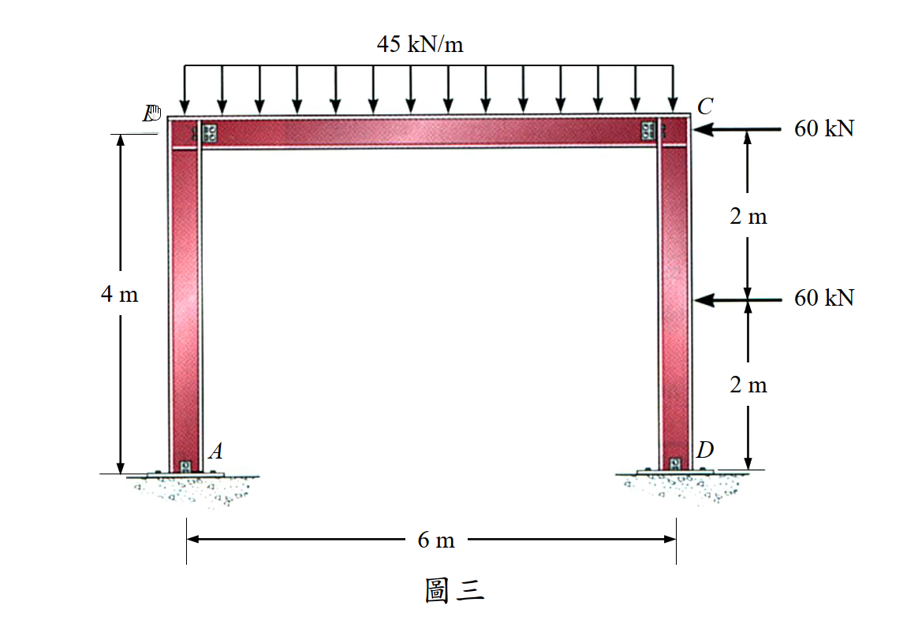
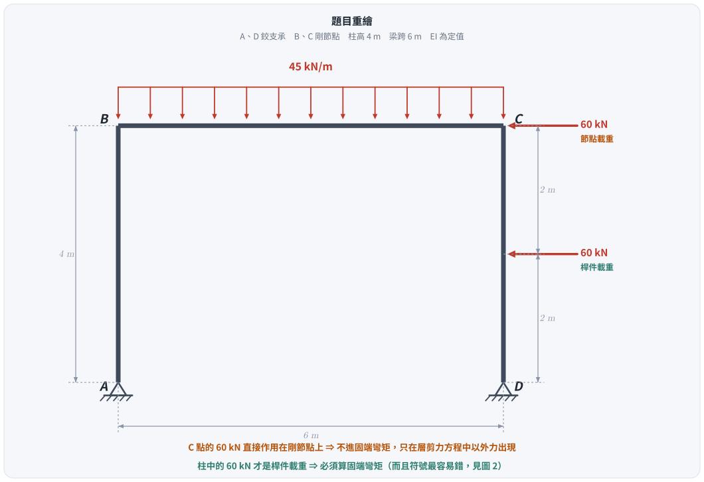
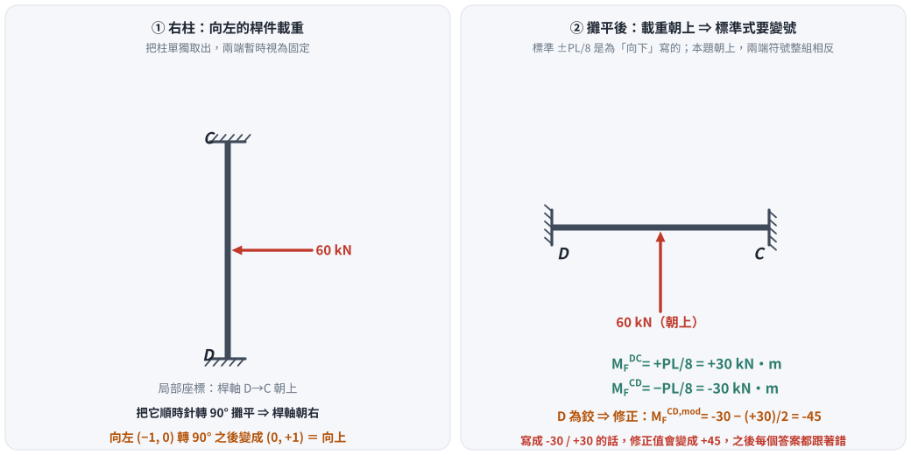
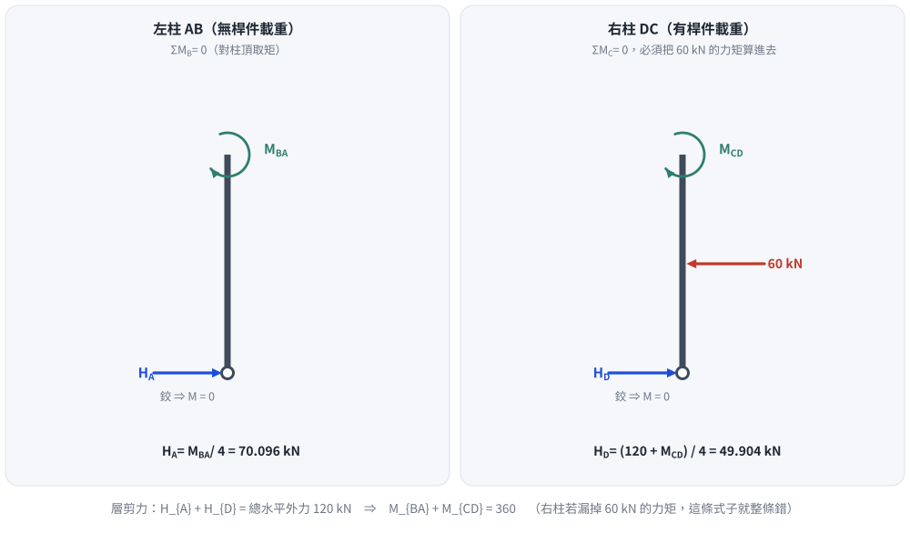
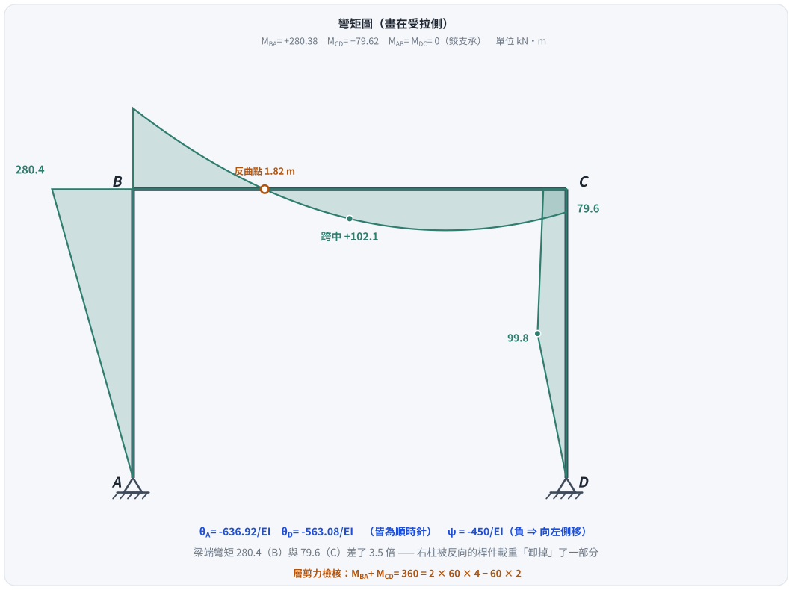

# 考題編號：SA-2017-3

**主分類：** `SA-U2-3` 靜不定結構之傾角變位法
**副分類：** 無
**分析法：** 傾角變位法（Slope-Deflection Method）
**標籤：** `傾角變位法` `門型剛架` `側移` `層剪力方程` `固定端彎矩符號` `節點轉角`

---

## 1. 原始題目重述 (Problem Restatement)

*圖說：門型剛架。$A$ 左下、$D$ 右下皆為**鉸支承**；$B$ 左上、$C$ 右上為剛節點。左柱 $AB$ 高 4 m，梁 $BC$ 跨 6 m，右柱 $CD$ 高 4 m，$EI$ 為定值。梁 $BC$ 受 45 kN/m 向下均布載重。右柱：**$C$ 點**受 60 kN 向左的**節點**集中力；**距 $D$ 上方 2 m 處**受 60 kN 向左的**桿件**集中力。*

**題目要求（指定僅能用傾角變位法）：**

1. 求各桿件端點彎矩（需標明方向）
2. 求 $A$ 點與 $D$ 點之轉角（需標明方向）

---

## 1.5 ⚠ 勘誤（2026-08-26）：右柱固端彎矩符號寫反，九個答案全錯

> 舊版的**方法、層剪力方程的推導、$H_D$ 的修正式全部正確**，唯一的錯是右柱的固端彎矩符號。

右柱的 60 kN **向左**。把柱順時針轉 90° 攤平（桿軸 $D\to C$ 由「朝上」轉成「朝右」），向左的 $(-1,0)$ 會轉成 $(0,+1)$，也就是**朝上**。而標準式 $M_F = \mp PL/8$ 是為「向下」寫的，因此兩端符號整組相反：

$$M_F^{DC} = +\frac{PL}{8} = +30,\qquad M_F^{CD} = -\frac{PL}{8} = -30 \quad\text{（舊版寫成 }-30\ /\ +30\text{）}$$

修正固端彎矩因此由 $+45$ 變成 $-45$，節點 $C$ 方程與層剪力方程跟著改，**九個答案全部改變**：

| 量 | 舊版（錯） | 正確 |
|---|---|---|
| $EI\psi$ | $-390$ | $\mathbf{-450}$ |
| $EI\theta_B$ | $-450/13 \approx -34.6$ | $\mathbf{-990/13 \approx -76.15}$ |
| $EI\theta_C$ | $-4230/13 \approx -325.4$ | $\mathbf{-3690/13 \approx -283.85}$ |
| $EI\theta_A$ | $-7380/13 \approx -567.7$ | $\mathbf{-8280/13 \approx -636.92}$ |
| $EI\theta_D$ | $-5100/13 \approx -392.3$ | $\mathbf{-7320/13 \approx -563.08}$ |
| $M_{BA} = -M_{BC}$ | $3465/13 \approx 266.5$ | $\mathbf{3645/13 \approx 280.38}$ |
| $M_{CD} = -M_{CB}$ | $1215/13 \approx 93.5$ | $\mathbf{1035/13 \approx 79.62}$ |

側移方向（向左）與 $M_{AB} = M_{DC} = 0$ 不受影響。

---

## 2. 考題核心精神與出題者意圖 (Core Concepts & Examiner's Intent)

**核心觀念：** 含側移的非對稱門型剛架，兩柱底皆為鉸支承。梁受對稱重力載重；右柱受兩個同向水平力，驅動整體向左側移。

**出題者意圖：**

- **鉸支承邊界**：$M_{AB} = M_{DC} = 0$，用**修正傾角變位式**（pin-base 式）消去 $\theta_A$、$\theta_D$，最後再反求它們。
- **節點載重 vs 桿件載重**：$C$ 點的 60 kN 是**節點**載重 —— **不進固端彎矩**，也不進節點力矩平衡（力矩平衡只含彎矩），只在層剪力方程中以外力出現。
- **固端彎矩的符號**：右柱的 60 kN 是**桿件**載重，必須算固端彎矩 —— 而**符號正是本題最容易失分的地方**（見 §1.5）。
- **層剪力方程**：對含桿件載重的柱，$H_D \ne (M_{DC}+M_{CD})/L$，必須從自由體另行推導。

---

## 3. 解題戰略地圖與陷阱分析 (Strategic Roadmap & Trap Analysis)

**步驟化作戰計畫：**

1. 確認側移方向（框架向左 $\Rightarrow \psi < 0$，本文以向右為正）
2. 未知量三個：$\theta_B$、$\theta_C$、$\psi$（$\theta_A$、$\theta_D$ 由鉸條件消去）
3. **先把右柱的固端彎矩符號釘死**（把柱攤平判斷）
4. 寫 pin-base 修正式
5. 兩個節點力矩平衡（$B$、$C$）
6. 層剪力方程（$H_D$ 含桿件載重的力矩修正）
7. 解三元一次方程組，再反求 $\theta_A$、$\theta_D$

**陷阱分析：**

| 陷阱 | 為什麼會錯 | 正解 |
|---|---|---|
| **右柱固端彎矩的符號** | 直接套 $M_F = -Pab^2/L^2$，沒注意那條式子是為「向下」寫的 | 把柱攤平：向左 $\Rightarrow$ 朝上 $\Rightarrow$ 兩端符號整組相反，$M_F^{DC} = +30$ |
| $C$ 點 60 kN 進了 FEM | 看到 60 kN 就想算固端彎矩 | 它作用在**剛節點**上，不進 FEM，也不進 $\Sigma M_C = 0$ |
| $H_D$ 直接套 $(M+M)/L$ | 忘了右柱有桿件載重 | $H_D = \dfrac{P(L-y_P) + M_{CD}}{L} = \dfrac{120 + M_{CD}}{4}$ |
| 力矩方向靠直覺 | 水平力在垂直桿上的力臂容易搞混 | 用向量叉積 $\vec r \times \vec F$ 的 $z$ 分量確認 |
| 忘了反求 $\theta_A$、$\theta_D$ | pin-base 式已把它們消掉 | 用**完整**傾角變位式加上 $M_{AB}=0$、$M_{DC}=0$（**含 FEM**）反推 |

---

## 3.5 變數層次分析 (Variable Hierarchy Analysis)

> 複習提示：第一次解題後，在每個卡住的知識點旁標記 `⚠`；第二次複習時只看有 `⚠` 的項目。

### 最終目標

以傾角變位法求所有桿端彎矩（$M_{AB}, M_{BA}, M_{BC}, M_{CB}, M_{CD}, M_{DC}$）及 $A$、$D$ 兩點的轉角。

### 本題關鍵公式（依計算順序）

$$\text{Step 1：右柱 FEM 的符號} \quad \text{（攤平判斷，見圖 2）}$$

$$\text{Step 2：pin-base 修正式} \quad M_{BA} = \frac{3EI}{L_{AB}}(\theta_B - \psi)$$

$$\text{Step 3：梁} \quad M_{BC} = \frac{2EI}{L_{BC}}(2\theta_B + \theta_C) + M_F^{BC}$$

$$\text{Step 4：右柱 pin-base（含修正 FEM）} \quad M_{CD} = \frac{3EI}{L_{DC}}(\theta_C - \psi) + \boxed{M_F^{CD,\text{mod}}}$$

$$\text{Step 5：節點平衡} \quad M_{BA} + M_{BC} = 0,\qquad M_{CB} + M_{CD} = 0$$

$$\text{Step 6：層剪力} \quad H_A + H_D = 120 \implies \boxed{M_{BA} + M_{CD} = 360}$$

$$\text{Step 7：反求} \quad \theta_A,\ \theta_D$$

### L1：題目直接給定

| 符號 | 數值 | 說明 |
|---|---|---|
| $L_{AB},\,L_{DC}$ | 4 m | 柱高 |
| $L_{BC}$ | 6 m | 梁跨 |
| $w$ | 45 kN/m（↓） | 梁 $BC$ 均布載重 |
| $P_1$ | 60 kN（←） | $C$ 點**節點**載重 |
| $P_2$ | 60 kN（←） | 右柱距 $D$ 上方 2 m 的**桿件**載重 |
| 支承 | $A$、$D$ 鉸；$B$、$C$ 剛接 | $M_{AB} = M_{DC} = 0$ |

### L2：需知識點推導

**【固定端彎矩】**

| 符號 | 公式／來源 | 卡關? |
|---|---|:--:|
| $M_F^{BC}$ | $-wL^2/12 = -135$ kN·m | |
| $M_F^{CB}$ | $+wL^2/12 = +135$ kN·m | |
| $M_F^{DC}$ | 載重朝「上」（攤平後）$\Rightarrow$ $\mathbf{+PL/8 = +30}$ kN·m | ⚠ |
| $M_F^{CD}$ | $\mathbf{-PL/8 = -30}$ kN·m | ⚠ |
| $M_F^{CD,\text{mod}}$ | $M_F^{CD} - \tfrac12 M_F^{DC} = -30 - 15 = \mathbf{-45}$ kN·m | ⚠ |

**【修正傾角變位方程式】**

| 符號 | 公式 | 卡關? |
|---|---|:--:|
| $M_{BA}$ | $\tfrac{3EI}{4}(\theta_B - \psi)$ | |
| $M_{BC}$ | $\tfrac{EI}{3}(2\theta_B + \theta_C) - 135$ | |
| $M_{CB}$ | $\tfrac{EI}{3}(2\theta_C + \theta_B) + 135$ | |
| $M_{CD}$ | $\tfrac{3EI}{4}(\theta_C - \psi) - 45$ | |

**【三個方程式】**（令 $t = EI\theta_B$、$s = EI\theta_C$、$p = EI\psi$）

| 方程 | 公式 |
|---|---|
| 節點 $B$ | $\tfrac{17}{12}t + \tfrac13 s - \tfrac34 p = 135$ |
| 節點 $C$ | $\tfrac13 t + \tfrac{17}{12}s - \tfrac34 p = -90$ |
| 層剪力 | $t + s - 2p = 540$ |

### L3：深層知識（不懂就卡住）

| 知識點 | 說明 | 卡關? |
|---|---|:--:|
| **固端彎矩的符號來源** | $\mp PL/8$ 是為「載重指向桿件局部 $-\hat y$」寫的。把桿件攤平成水平、載重轉成向下，才能直接套表；否則整組變號 | ⚠ |
| Pin-base 修正式 | 遠端為鉸時 $M_{\text{near}} = \tfrac{3EI}{L}(\theta_{\text{near}} - \psi) + M_F^{\text{mod}}$ | |
| 修正固端彎矩 | $M_F^{\text{mod,near}} = M_F^{\text{near}} - \tfrac12 M_F^{\text{far}}$ | |
| 層剪力方程的建立 | 對含桿件載重的柱取自由體、對柱頂取矩，不能直接套 $(M_{\text{top}}+M_{\text{bot}})/L$ | |
| 節點載重 vs 桿件載重 | 節點載重不進 FEM、不進節點力矩平衡，但進層剪力外力總和 | |

---

## 4. 步驟化詳細計算過程 (Step-by-Step Detailed Calculation)

### 4.1 結構、載重與符號

*圖 1　題目重繪。這張圖攔的是把 $C$ 點的 60 kN 也拿去算固端彎矩：它作用在剛節點上，只在層剪力方程中以外力出現；真正要算 FEM 的是柱中間那一個。*

**符號約定：** 順時針為正；$\psi$ 以**向右**側移為正（預期本題 $\psi < 0$）。
**未知量：** $\theta_B$、$\theta_C$、$\psi$。**邊界：** $M_{AB} = 0$、$M_{DC} = 0$。

### 4.2 固定端彎矩 —— 本題的成敗關鍵

*圖 2　右柱固端彎矩的符號判定。這張圖攔的就是本題唯一、但會讓九個答案全錯的那個錯：$\mp PL/8$ 是為「向下」寫的，右柱的載重攤平後朝**上**，兩端符號整組相反。*

**梁 $BC$（$L = 6$ m，$w = 45$ kN/m ↓）：** 桿軸本來就水平、載重本來就向下，直接套表：

$$M_F^{BC} = -\frac{wL^2}{12} = -135\ \text{kN·m},\qquad M_F^{CB} = +\frac{wL^2}{12} = +135\ \text{kN·m}$$

**右柱 $DC$（$L = 4$ m，$P = 60$ kN ← 在中點）：**

局部座標的桿軸為 $D \to C$（朝上）。把它順時針轉 $90^\circ$ 攤平，桿軸變成朝右，而**向左的 $(-1,0)$ 轉成 $(0,+1)$ ＝ 朝上**。標準式為「向下」寫的，故：

$$\boxed{M_F^{DC} = +\frac{PL}{8} = +30\ \text{kN·m},\qquad M_F^{CD} = -\frac{PL}{8} = -30\ \text{kN·m}}$$

$D$ 為鉸，修正固端彎矩：

$$M_F^{CD,\text{mod}} = M_F^{CD} - \tfrac12 M_F^{DC} = -30 - 15 = \boxed{-45\ \text{kN·m}}$$

### 4.3 修正傾角變位方程式

$$M_{AB} = 0,\qquad M_{BA} = \frac{3EI}{4}(\theta_B - \psi)$$
$$M_{BC} = \frac{EI}{3}(2\theta_B + \theta_C) - 135,\qquad M_{CB} = \frac{EI}{3}(2\theta_C + \theta_B) + 135$$
$$M_{CD} = \frac{3EI}{4}(\theta_C - \psi) - 45,\qquad M_{DC} = 0$$

### 4.4 三條平衡方程式

**（1）節點 $B$：** $M_{BA} + M_{BC} = 0$

$$\frac{17}{12}t + \frac13 s - \frac34 p = 135 \tag{1}$$

**（2）節點 $C$：** $M_{CB} + M_{CD} = 0$（$C$ 點的 60 kN 水平力**不在**力矩平衡中）

$$\frac13 t + \frac{17}{12}s - \frac34 p = -90 \tag{2}$$

**（3）層剪力方程：**

*圖 3　兩根柱的自由體。這張圖攔的是「對右柱直接套 $(M_{\text{top}}+M_{\text{bot}})/L$」：右柱有桿件載重，$H_D$ 必須另外從 $\Sigma M_C = 0$ 推導，多出 $60 \times 2 = 120$ 的力矩項。*

左柱（無桿件載重），對柱頂 $B$ 取矩：$\;H_A = \dfrac{M_{BA}}{4}$

右柱（含桿件載重），對柱頂 $C$ 取矩（以 $\vec r \times \vec F$ 的 $z$ 分量，逆時針為正）：

$$4H_D - 60 \times 2 - M_{CD} = 0 \;\Longrightarrow\; H_D = \frac{120 + M_{CD}}{4}$$

總水平外力 120 kN：

$$\frac{M_{BA}}{4} + \frac{120 + M_{CD}}{4} = 120 \;\Longrightarrow\; \boxed{M_{BA} + M_{CD} = 360}$$

代入傾角變位式：$\;\dfrac34(t - p) + \dfrac34(s - p) - 45 = 360$

$$t + s - 2p = 540 \tag{3}$$

### 4.5 解方程組

$(1) - (2)$：$\;\dfrac{13}{12}(t - s) = 225 \Rightarrow t - s = \dfrac{2700}{13}$

$(1) + (2)$：$\;\dfrac74 (t+s) - \dfrac32 p = 45$，代入 (3) 的 $t + s = 2p + 540$：

$$\frac74(2p + 540) - \frac32 p = 45 \;\Longrightarrow\; 2p = -900 \;\Longrightarrow\; \boxed{EI\psi = -450}$$

$$t + s = -360,\qquad t - s = \frac{2700}{13}$$

$$\boxed{EI\theta_B = -\frac{990}{13} \approx -76.15},\qquad \boxed{EI\theta_C = -\frac{3690}{13} \approx -283.85}$$

$\psi < 0$ $\Rightarrow$ 框架**向左**側移 ✓（與兩個向左的 60 kN 一致）

### 4.6 各桿端彎矩

$$M_{AB} = 0$$
$$M_{BA} = \frac34\!\left(-\frac{990}{13} + 450\right) = \frac{3645}{13} \approx \mathbf{+280.38}\ \text{kN·m}$$
$$M_{BC} = -\frac{3645}{13} \approx \mathbf{-280.38}\ \text{kN·m}\qquad(\text{節點 } B:\ M_{BA} + M_{BC} = 0\ \checkmark)$$
$$M_{CB} = -\frac{1035}{13} \approx \mathbf{-79.62}\ \text{kN·m}$$
$$M_{CD} = \frac34\!\left(-\frac{3690}{13} + 450\right) - 45 = \frac{1035}{13} \approx \mathbf{+79.62}\ \text{kN·m}$$
$$M_{DC} = 0$$

> **層剪力檢核：** $M_{BA} + M_{CD} = \dfrac{3645 + 1035}{13} = \dfrac{4680}{13} = 360$ ✓
> **反力：** $H_A = 280.38/4 = 70.10$ kN，$H_D = (120 + 79.62)/4 = 49.90$ kN，合計 $120$ kN ✓

### 4.7 求 $A$、$D$ 的轉角

**$A$ 點**（完整傾角變位式 ＋ $M_{AB} = 0$，無 FEM）：

$$\frac{2EI}{4}(2\theta_A + \theta_B - 3\psi) = 0 \;\Longrightarrow\; EI\theta_A = \frac{3(-450) + \frac{990}{13}}{2} = -\frac{8280}{13} \approx \mathbf{-636.92}$$

**$D$ 點**（完整式 ＋ $M_{DC} = 0$，**含 $M_F^{DC} = +30$**）：

$$\frac{2EI}{4}(2\theta_D + \theta_C - 3\psi) + 30 = 0 \;\Longrightarrow\; 2\,EI\theta_D + EI\theta_C - 3EI\psi = -60$$

$$EI\theta_D = \frac{-60 + \frac{3690}{13} - 1350}{2} = -\frac{7320}{13} \approx \mathbf{-563.08}$$

兩者皆為負 $\Rightarrow$ **順時針**。

### 4.8 結果彙整與彎矩圖

*圖 4　彎矩圖（畫在受拉側）。這張圖攔兩件事：把左右柱的端彎矩畫成一樣大（右柱被反向的桿件載重卸掉一部分，只有左柱的 28%），以及把右柱畫成直線（載重點 $y = 2$ m 有折點，該處彎矩 99.8 反而比柱頂大）。*

| 桿端 | 彎矩（順時針為正） | 方向 |
|---|---|---|
| $M_{AB}$ | $0$ | — （鉸支承） |
| $M_{BA}$ | $\dfrac{3645}{13} \approx +280.38$ kN·m | **順時針** |
| $M_{BC}$ | $-\dfrac{3645}{13} \approx -280.38$ kN·m | 逆時針（梁 $B$ 端**上側受拉**） |
| $M_{CB}$ | $-\dfrac{1035}{13} \approx -79.62$ kN·m | 逆時針 |
| $M_{CD}$ | $\dfrac{1035}{13} \approx +79.62$ kN·m | **順時針** |
| $M_{DC}$ | $0$ | — （鉸支承） |

| 節點 | 轉角 | 方向 |
|---|---|---|
| $\theta_A$ | $-\dfrac{8280}{13EI} \approx -\dfrac{636.92}{EI}$ rad | **順時針** |
| $\theta_D$ | $-\dfrac{7320}{13EI} \approx -\dfrac{563.08}{EI}$ rad | **順時針** |
| （$\theta_B$） | $-\dfrac{990}{13EI} \approx -\dfrac{76.15}{EI}$ rad | 順時針（參考） |
| （$\theta_C$） | $-\dfrac{3690}{13EI} \approx -\dfrac{283.85}{EI}$ rad | 順時針（參考） |

**梁 $BC$ 的彎矩圖：** $B$ 端 $-280.38$（上側受拉）$\to$ 距 $B$ 約 1.82 m 處反曲 $\to$ 跨中 $+102.1$（下側受拉）$\to$ $C$ 端 $+79.62$。
**右柱：** $D$ 端 0 $\to$ 載重點（$y=2$ m）$99.8$ $\to$ $C$ 端 $79.62$，**折點在載重處**。

---

## 5. 關鍵爭議點與進階探討 (Critical Issues & Advanced Discussion)

### 5.1 固端彎矩符號：一個最不起眼、代價最大的步驟

$M_F = \mp PL/8$、$-Pab^2/L^2$ 這些式子都預設「載重指向桿件局部座標的 $-\hat y$」。**梁是水平的、載重向下時剛好符合**，所以平常直接套沒事；一旦桿件是垂直的（或斜的），就必須先確認載重在局部座標裡朝哪一邊。

**最不會錯的做法：** 把桿件旋轉到水平，看載重變成朝上還是朝下。本題右柱 $D\to C$ 朝上，順時針轉 $90^\circ$ 之後桿軸朝右，而向左的載重轉成**朝上** $\Rightarrow$ 整組變號。

這一個符號的代價：$M_F^{CD,\text{mod}}$ 由 $-45$ 變成 $+45$，節點 $C$ 方程的右端由 $-90$ 變成 $-180$、層剪力方程由 $540$ 變成 $420$，**九個答案全部改變**。

### 5.2 $C$ 點 60 kN 是否進節點力矩平衡？

否。水平集中力作用在節點 $C$ 上，但**節點力矩平衡只計算彎矩**；水平力的效應是透過**層剪力方程**體現。若誤把它當成節點彎矩代入，結果全錯。

### 5.3 側移方向的驗算

$\psi = -450/EI < 0$ $\Rightarrow$ 弦旋轉為逆時針 $\Rightarrow$ 梁柱節點向**左**移動 —— 與兩個 60 kN 皆向左的物理直覺一致。若算出 $\psi > 0$，一定有錯。

### 5.4 為什麼左柱的端彎矩是右柱的 3.5 倍

兩根柱幾何、$EI$、邊界條件都相同，端彎矩卻差 3.5 倍，原因全在**右柱自己身上有一個反向的桿件載重**：$M_{CD}$ 裡的修正固端彎矩 $-45$ 直接把它「卸掉」了一大截。$M_{BA} + M_{CD} = 360$ 是固定的（層剪力方程），所以右柱少扛的部分就整個轉嫁到左柱。

這也解釋了右柱彎矩圖的形狀：**最大彎矩不在柱頂，而在載重點**（99.8 > 79.6）。

### 5.5 驗算紀錄（2026-08-26）

本題以**分數精確解**（Gauss 消去，全程有理數）與**剛架有限元**（梁分 24 元素、$EA$ 取極大）兩條獨立路徑求解，$\psi$、$\theta_B$、$\theta_C$、$\theta_A$、$\theta_D$、$M_{BA}$、$M_{BC}$、$M_{CB}$、$M_{CD}$ 九項**全部相符至小數第三位**，且滿足：

- 兩個節點力矩平衡恰為 0（分數運算，非近似）
- 層剪力方程 $M_{BA} + M_{CD} = 360$ 恰好成立
- $H_A + H_D = 120$ kN、$V_A = 195$ kN、$V_D = 75$ kN

---

## 6. 本題知識點索引

| 知識點 | 概念 ID |
|---|---|
| 傾角變位法 | [[SLOPE-DEFLECTION-EQUATION]] |
| 固定端彎矩 | [[FIXED-END-MOMENT]] |
| 修正傾角變位式（遠端鉸接） | [[MODIFIED-SLOPE-DEFLECTION]] |
| 層剪力方程式 | [[SWAY-EQUATION]] |

---

## CHANGELOG

| 日期 | 變更 | 原因 |
|---|---|---|
| 2026-07-02 | 初版解析 | — |
| 2026-08-26 | **更正右柱固端彎矩符號**（$M_F^{DC}$ 由 $-30$ 改為 $+30$），九個答案全部重算；補四張向量圖 | 舊版把「向左」的桿件載重直接套用為「向下」的標準式。方法與層剪力推導本身正確，僅此一個符號有誤 |

---

*解析日期：2026-07-02　｜　勘誤＋圖解：2026-08-26（分數精確解與剛架有限元兩條獨立路徑逐項相符；向量圖腳本 `gen_SA-2017-3.py`，可重跑）*
