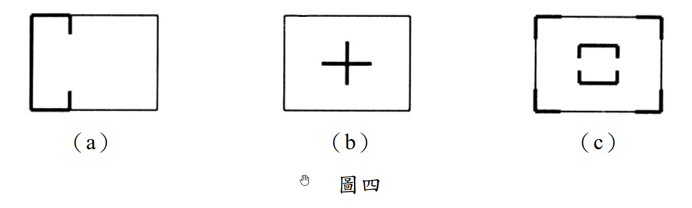

# 考題編號：SA-2017-4

**主分類：** 抗側力系統設計概念 (SA-U4-1)
**副分類：** 
**分析法：** 論述題（定性分析）
**標籤：** `剪力牆` `平面配置` `偏心` `扭矩` `水平載重傳遞` `建築結構系統`

---

## 1. 原始題目重述 (Problem Restatement)

*圖說：圖四（a）剪力牆配置於平面左側兩端（形似 H 字，左邊閉合，右邊開放）；圖四（b）剪力牆配置於平面中央，形成十字（+）形核心筒；圖四（c）剪力牆配置於平面四周角落，形成開口矩形（ロ字形，四角有牆但四邊中間開口）。*

**題目要求：** 分別說明此三種平面配置規劃用以**傳遞水平載重**之**優缺點**。（20分）

---

## 2. 考題核心精神與出題者意圖 (Core Concepts & Examiner's Intent)

**核心觀念：** 剪力牆的平面配置決定了建築的：
1. **剛性中心（CR, Center of Rigidity）**的位置
2. **質量中心（CM, Center of Mass）**與 CR 之間的**偏心距（e）**
3. 對水平載重（地震、風）的**抗扭轉能力**
4. 各方向（x、y）的**側向勁度**是否充足

**出題者意圖：**
- 測驗考生對「**剛性中心**」概念的理解：剛性中心距越小，扭矩越小。
- 測驗考生對「**兩方向均需配置**」的認識：x 方向與 y 方向的水平力需分別有牆承擔。
- 測驗考生對「**均勻分散配置**」的優缺點辨識：集中配置（如中央核心筒）vs 分散配置（如四周角落）的工程取捨。

**關鍵評分要點（各題 5～7分）：**
1. **剛性中心位置的分析** — CR 在哪裡、偏心距大不大
2. **扭轉效應的討論** — 偏心大時地震引發附加扭矩
3. **雙向抗側能力** — 是否能有效傳遞兩個方向的水平力
4. **實用性與空間利用** — 建築平面使用效率

---

## 3. 解題戰略地圖與陷阱分析 (Strategic Roadmap & Trap Analysis)

**答題架構：**
對三種配置各自分析：
1. 剛性中心位置 → 偏心距 → 扭矩大小
2. X 向與 Y 向的抗側勁度
3. 優點（明確列舉）
4. 缺點（明確列舉）

**⚠ 陷阱一：混淆「剪力牆方向」與「抵抗方向」**
垂直紙面方向（平面圖的上下）延伸的牆，其面外（out-of-plane）勁度極小，只有面內（in-plane）方向才能有效抵抗水平力。因此必須辨別每面牆能抵抗哪個方向的水平力。

**⚠ 陷阱二：忽略扭矩討論**
地震不但產生平移，如果 CM ≠ CR 還會產生附加扭矩，導致邊緣構件受力加大。很多考生只討論剪力傳遞而忘了扭轉效應。

**⚠ 陷阱三：配置（c）的誤判**
圖（c）四角有牆但四邊中間開口，這種「開口矩形」配置實際上能提供較大的扭轉力臂（因為牆距質心較遠），但開口使得水平力傳遞路徑需要樓板的剛性假設才能成立。

---

## 3.5 變數層次分析 (Variable Hierarchy Analysis)

> 複習提示：第一次解題後，在每個卡住的知識點旁標記 `⚠`；第二次複習時只看有 `⚠` 的項目。

### 最終目標

論述三種平面剪力牆配置的優缺點，涵蓋剛性中心、偏心、扭矩、雙向剛度、空間利用等面向。

### L1：題目直接給定

| 符號/概念 | 說明 |
|-----------|------|
| 配置 (a) | 剪力牆在平面左側（上、中、下皆有），右側開放，H 型 |
| 配置 (b) | 剪力牆在平面中央，形成十字形核心筒 |
| 配置 (c) | 剪力牆在平面四角（開口矩形，ロ型） |
| 比較基準 | 水平載重（地震、風）的傳遞效率與抗扭性 |

### L2：需知識點推導

| 概念 | 公式／推導 | 卡關? |
|------|-----------|-------|
| 剛性中心（CR） | $x_{CR} = \sum(k_i x_i)/\sum k_i$，剪力牆在哪側、勁度大，CR 就偏向哪側 | |
| 偏心距（e） | $e = |x_{CM} - x_{CR}|$，CM 通常假設在平面幾何中心 | |
| 附加扭矩 | $T = V \cdot e$，V 為總水平力，e 為偏心距 | |
| 抗扭剛度 | $GJ = \sum k_i \cdot d_i^2$，$d_i$ 為各牆至 CR 的距離；牆離 CR 越遠，抗扭貢獻越大 | |
| 雙向抗側 | x 方向水平力需由「y 向牆」承擔（面內），y 方向水平力需由「x 向牆」承擔 | |

### L3：深層知識（不懂就卡住）

| 知識點 | 說明 | 卡關? |
|--------|------|-------|
| 樓板剛性假設 | 剪力牆之間的水平力傳遞需要剛性樓板（Rigid Diaphragm）；若樓板為柔性，則各牆分擔依其相對位置直接計算，偏心效應更顯著 | |
| 開口截面 vs. 閉合截面 | 剪力牆形成閉合截面（如圍繞電梯井）時，其抗扭剛度（$GJ$）遠大於開口截面（Bredt's formula）；配置 (b) 若能形成閉合核心筒效果最佳 | |
| 牆的面內/面外勁度差異 | 牆面內勁度 >> 面外勁度；配置設計需確保兩個正交方向各有牆的面內參與 | |
| 規則性要求（耐震設計規範） | 規範通常要求建築在平面上的剛性中心與質量中心之偏心距應盡量小（通常 < 10% 平面尺寸），以避免過大扭矩 | |

---

## 4. 詳細論述（Step-by-Step Analysis）

### 4.1 配置（a）分析：左側集中式（H 型）

**圖形說明：** 剪力牆集中配置於平面左側，上端與下端各有一片水平（y 向）牆，左端有一片垂直（x 向）牆，右側無牆，形似字母 H 的左半部（或 C 型開口向右）。

**剛性中心位置：**
- 左側牆（x 向面內）提供 x 方向（水平）勁度，且位置偏左 → CR 在平面**左側**，距右側邊緣較遠。
- 上、下兩片牆（y 向面內）提供 y 方向勁度，且均等分布於上下 → y 方向 CR 約在平面中央。
- **總體：CR 大幅偏向左側**，與平面幾何中心（CM 通常假設在此）相距甚遠，**偏心距 e 大**。

**優點：**
1. **施工方便，採光良好**：剪力牆集中在一側，建築右側完全開放，有利於大開窗與平面彈性規劃。
2. **垂直（y 向）勁度尚可**：上、下各有牆，y 向（垂直紙面）的水平力可由兩片牆分擔。
3. **構造整合方便**：牆集中在一區，鋼筋與模板施工效率高。

**缺點：**
1. **嚴重偏心，產生大扭矩**：CR 在左，CM 在中，$e_x$ 很大，地震水平力 $V$ 產生巨大扭矩 $T = V \cdot e_x$，右側角落柱需承受大量附加剪力，容易成為薄弱點。
2. **x 向（水平方向）勁度不足**：左端雖有一片牆，但右側完全沒有牆；在 x 方向水平力下，扭矩使右側構件受力加劇。
3. **不符合耐震規範要求**：此配置的偏心率（eccentricity ratio）遠超規範容許值，需要大量補強措施。
4. **抗扭剛度低**：抗扭力臂（各牆至 CR 距離）分布不均，右側無牆可提供抗扭力偶。

**結論：** 此配置**不適合**作為主要的水平力抵抗系統，在耐震設計中屬於嚴重偏心、不規則的平面。

---

### 4.2 配置（b）分析：中央十字形核心筒

**圖形說明：** 剪力牆配置於平面中央，形成正十字（+）形，等同於常見的電梯間核心筒（Core Wall）形式。

**剛性中心位置：**
- 十字形牆對稱配置於平面中央 → x 方向 CR 與 y 方向 CR 均在平面幾何中心。
- 假設質量均勻分布，CM 也在幾何中心 → **偏心距 e ≈ 0**，**無扭矩效應**。

**優點：**
1. **偏心距極小，幾乎無扭矩**：CR ≈ CM，水平力 V 幾乎不產生附加扭矩，結構行為純平移，各構件受力均勻。
2. **雙向抗側能力均等**：十字形有 x 向牆（上、下兩翼）和 y 向牆（左、右兩翼），兩個方向的水平力均能有效傳遞。
3. **整合設備空間**：核心筒可整合電梯、樓梯、設備管道，形成結構與設備的高效整合。
4. **高層建築適用**：核心筒系統在高層建築廣泛應用，抗側效率高，且具備良好的整體性（閉合截面可提高抗扭剛度）。
5. **符合耐震規範**：平面規則，偏心小，最符合耐震設計的「規則性」要求。

**缺點：**
1. **核心筒佔據中央空間**：剪力牆位於平面中央，佔用核心區域，周邊空間雖然通透，但中央區域無法作為使用空間，在小型建築中造成空間浪費。
2. **樓板傳力路徑長**：水平力從周邊傳至中央核心筒，樓板需跨越較長距離傳遞剪力，樓板厚度與配筋要求較高。
3. **個別牆體力臂小**：各牆距平面邊緣的距離較遠（在中央），相較於周邊配置，對於整體建築的抗扭力臂（樓板邊緣到核心的距離）雖然足夠，但單一牆體的力偶力臂不如周邊配置大。
4. **平面使用彈性受限**：核心筒固定位置使建築平面分區（如辦公大樓的「回」字形布局）有固定模式，難以改變。

**結論：** 此配置為**最佳的抗側力系統之一**，廣泛應用於高層辦公及住宅建築，是設計優選。

---

### 4.3 配置（c）分析：四周角落式（ロ型，開口矩形）

**圖形說明：** 剪力牆配置於平面四周角落，形成開口矩形（ロ字形）——四角各有牆段，但四邊中間位置開口（無牆），形成類似圍合但中間開敞的配置。

**剛性中心位置：**
- 四角牆對稱配置 → x 方向與 y 方向 CR 均在平面中央，與 CM 重合 → **偏心距 e ≈ 0**。

**優點：**
1. **偏心距近乎為零**：四角對稱配置，CR = CM，幾乎無附加扭矩，受力行為規則。
2. **極大的抗扭剛度**：各牆距 CR（中心）最遠，$d_i$ 最大，$GJ = \sum k_i d_i^2$ 為最大，**抗扭能力在三種配置中最佳**，角部牆組成的「力偶」能以最長力臂抵抗扭轉。
3. **雙向抗側**：四角牆同時含 x 向與 y 向的面內勁度，兩方向水平力均能抵抗。
4. **平面中央通透**：中央空間完全開放，可提供大跨度無柱使用空間（如大廳、展覽廳）。
5. **樓板受力效率高**：水平力從邊緣樓板直接傳至相鄰角落牆，傳力路徑短。

**缺點：**
1. **四邊中間開口導致水平力傳遞路徑不連續**：若對應邊的中間沒有牆，水平剪力需要繞過開口、由樓板完整傳遞，對樓板的剛性要求極高；若樓板非完全剛性，傳力效率大幅下降。
2. **個別牆長度有限，勁度可能不足**：角落牆體通常長度受限（與整面牆相比），若角落牆太短，則面內剛度不足，側移量較大。
3. **施工分散、整合性差**：四個角落分別施工，不利於設備管道整合（不像核心筒可集中布置電梯、管道）。
4. **開口處可能形成應力集中**：牆端開口處在地震時容易產生較大的應力集中，牆端需加強構造配筋（邊界構件，Boundary Element）。
5. **適用於低矮建築**：此配置在高層建築中，若周邊牆長度不足，整體抗傾覆力矩（Overturning Moment）能力不如連續周邊牆；適合中低層建築。

**結論：** 此配置的**抗扭能力最優**，適合中低層或需要中央大空間的建築；但須確保樓板剛性與角部牆體長度足夠。

---

## 5. 三種配置綜合比較（Summary Table）

| 評估項目 | 配置（a）左側集中 | 配置（b）中央十字 | 配置（c）四角分散 |
|---------|-----------------|-----------------|-----------------|
| 剛性中心位置 | 嚴重偏左 | 中央（最佳）| 中央（良好）|
| 偏心距 e | **大**（最差）| **≈ 0**（最佳）| **≈ 0**（良好）|
| 附加扭矩 | **大**（危險）| **最小**（最佳）| **最小**（良好）|
| X 向抗側勁度 | 不足 | 良好 | 良好 |
| Y 向抗側勁度 | 尚可 | 良好 | 良好 |
| 抗扭剛度 GJ | **最低** | 中等 | **最高**（力臂最大）|
| 平面使用彈性 | 右側開放，好 | 中央被佔，差 | 中央開放，好 |
| 規範符合性 | 不符合規則性 | **最佳**符合 | 良好符合 |
| 適用建築類型 | 不建議單獨使用 | 高層辦公/住宅 | 中低層大空間 |
| 設備整合能力 | 差 | **最優**（核心筒）| 差 |

**設計建議優先次序：（b）> （c）> （a）**

配置（a）在實際設計中幾乎不會單獨使用，通常需要補充右側的水平力抵抗構件。

---

## 關鍵爭議點與進階探討 (Critical Issues & Advanced Discussion)

**爭議一：配置（c）的樓板剛性假設**
在實際設計中，圖（c）的四角配置必須搭配厚實剛性樓板（或加強水平桁架），才能確保水平力能從受力點傳至遠端角落牆。若樓板有大開孔或為預制柔性板，此配置效果將大打折扣。

**爭議二：配置（b）的開口 vs. 閉合核心筒**
圖（b）若十字形牆之間能形成閉合截面（如圍合電梯間），則抗扭剛度按 Bredt's formula 計算，遠大於開口截面；若只是四片獨立牆，則抗扭剛度較小。圖中「+」形若為閉合 Box 型核心，則優點更多。

**爭議三：「水平載重傳遞」的完整路徑**
完整的水平力傳遞路徑為：**慣性力（地震）→ 樓板（剛性隔板）→ 水平力傳至各剪力牆（按剛度分配）→ 剪力牆傳至基礎**。三種配置的差別在於樓板到剪力牆的傳力效率，以及剪力牆是否均勻分配，防止局部過載。
