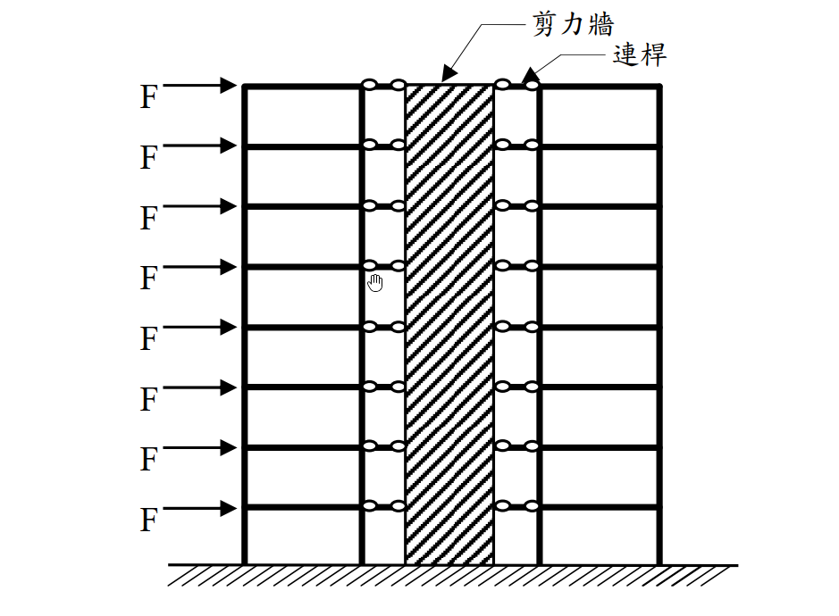

# 考題編號：SA-2018-1

**主分類：** 建築結構系統分析 (SA-U3-2)
**副分類：** 
**分析法：** 結構系統定性分析
**標籤：** `剛架與剪力牆互制` `變形模態` `剪力型與彎曲型` `水平力分配`

---

## 1. 原始題目重述 (Problem Restatement)
一、8 層樓平面構架以貫通全樓高的剪力牆加勁，假設剪力牆提供的樓層水平勁度為構架的 5 倍，且構架與剪力牆之間使用只能承受軸力的連桿連接。若各樓層承受相等的水平力 $F$ 作用。
(一) 不需經過精確分析，請分別繪出構架與剪力牆所受的樓層水平力分布示意圖，圖中請以虛線畫上外力 $F$，並依此比例標畫水平力大小，以資比較。
(二) 請解釋題(一)中水平力分布圖的理由。（25 分）

*圖說：8層樓平面剛架與剪力牆並聯系統，各樓層鉸接連桿傳遞水平力，外部各樓層均受水平向右之集中力 F。*

## 2. 考題核心精神與出題者意圖 (Core Concepts & Examiner's Intent)
本題測驗的核心觀念為**「剛架與剪力牆的互制作用 (Wall-Frame Interaction)」**。
出題者希望考生突破「依勁度比例固定分配水平力」的盲點（例如誤以為每層樓剛架分擔 $\frac{1}{6}F$，剪力牆分擔 $\frac{5}{6}F$）。事實上，剛架屬於「剪力型結構 (Shear Mode)」，而剪力牆屬於「彎曲型結構 (Flexural Mode)」，兩者因為連桿的束制必須維持相同的側向位移，這會導致兩者在高度方向產生強烈的互制力，進而改變水平力的分配，甚至在某些樓層出現反向的水平力。

## 3. 解題戰略地圖與陷阱分析 (Strategic Roadmap & Trap Analysis)
- **戰略一：分析各自的變形模態**
  剪力牆若單獨受載，變形曲線如懸臂梁呈「下凹 (Concave)」，頂部斜率最大；剛架若單獨受載，變形曲線呈「上凸 (Convex)」，底部斜率最大。
- **戰略二：推導互制力的方向**
  為了迫使兩者位移一致，在結構下半部，剛架會拉住變形較小的剪力牆（剛架受負向力，牆受大於 $F$ 的正向力）；在結構上半部，剪力牆頂部位移增長迅速，剛架會試圖拉回剪力牆，導致剛架頂層承受極大的正向水平力，而剪力牆在頂部則承受反向水平力。
- **陷阱**：直接按樓層勁度比 1:5 畫出均勻等比例的分布圖，將會完全錯失本題的測驗核心，得 0 分。

## 3.5 變數層次分析 (Variable Hierarchy Analysis)

### 最終目標
定性繪製出因變形模態互制而產生的剛架與剪力牆水平力高度分布圖，並合理解釋。

### 本題關鍵公式（依計算順序）
$$ \boxed{F_{ext}} = \boxed{F_{frame}} + \boxed{F_{wall}} = F $$
（各樓層水平力總和）
$$ y_{frame}(x) = y_{wall}(x) $$
（位移諧合條件）

### L1：題目直接給定
- 樓層數 ∣ $n = 8$ ∣ 8層樓
- 勁度比 ∣ $K_{wall} = 5 K_{frame}$ ∣ 單層等效水平勁度
- 外力 ∣ $F$ ∣ 各層外力相同（均勻分布）

### L2：需知識點推導
**互制力分配**
- $F_{frame}$ ∣ 模態疊加 ∣ 
- $F_{wall}$ ∣ $F - F_{frame}$ ∣ 

### L3：深層知識（不懂就卡住）
- 剛架與剪力牆互制作用 ∣ 必須理解剪力型與彎曲型結構強迫位移一致時，水平力分配不會是常數，且在頂層與底層會產生反向載重。 ∣

## 4. 步驟化詳細計算過程 (Step-by-Step Detailed Calculation)

### (一) 水平力分布示意圖
> 📊 **繪圖說明：**
> - **外力 $F$**：各樓層為定值，以等長虛線表示。
> - **剛架受力 ($F_{frame}$)**：中低樓層承受向左的力（負值，與外力反向）；頂樓承受巨大的向右力（大於 $F$）。
> - **剪力牆受力 ($F_{wall}$)**：中低樓層承受巨大的向右力（大於 $F$）；頂樓承受向左的力（負值，與外力反向）。

由於剛架與剪力牆間由連桿連結，各樓層的水平位移必須完全一致。其受力分布規律如下圖特徵：
- **剪力牆 (Wall)**：底部 1~5 樓受力遠大於 $F$，6 樓附近接近 $F$，7~8 樓受力逐漸變小，**第 8 樓出現反向（向左）的水平力**。
- **剛架 (Frame)**：底部 1~5 樓受力為**反向（向左）**，6 樓附近受力約為 0，7~8 樓受力為正向，**第 8 樓承受極大正向水平力（遠大於 $F$）**。

### (二) 水平力分布圖的理由

**1. 變形模態的差異：**
- **剪力牆**屬於「彎曲型變形 (Flexural mode)」：如同一根直立的懸臂梁，受水平力時其變形曲線在底部曲率最大，且位移增加率（斜率）會隨著高度越來越大，呈現下凹形狀。
- **構架**屬於「剪力型變形 (Shear mode)」：其變形主要來自樓層間的相對層次剪力變形，變形曲線在底部斜率最大，隨著高度增加斜率逐漸減小，呈現上凸形狀。

**2. 位移諧合與互制作用 (Interaction)：**
本題中兩者透過連桿連接，強制兩者在各樓層的位移必須相等（$y_{frame} = y_{wall}$），形成一個「反曲」的綜合彈性曲線（底部下凹、頂部上凸）。
為了達成此一妥協形狀，兩者之間會產生巨大的內部互制力：
- **在結構中下半部**：剪力牆自身剛度極大且變形小，而構架較易變形。為了把構架「拉住」以配合剪力牆的較小位移，剪力牆必須施加向左的力給構架。對外力平衡而言，意味著**構架承受了反向（負）的水平力**，而**剪力牆則必須承擔大於外力 $F$ 的水平力**。
- **在結構上半部（特別是頂層）**：剪力牆若自由變形，其頂部位移會非常大；而構架的剪力變形特性使其頂部增量較緩。為了將剪力牆「拉回」以配合構架，構架必須對剪力牆施加向左的拉力。因此在頂層，**剪力牆承受了反向（負）的水平力**，而**構架則承擔了極大的正向水平力**（遠大於外部施加的 $F$）。

**結論：**
因兩者變形特性的根本差異，雖然剪力牆提供的平均樓層勁度為構架的 5 倍，但水平力分配絕非各層固定的 5:1，而是底部牆受載大於外力，頂部構架受載大於外力，且兩者在不同高度區段均會出現與外力相反的反向載重。

## 5. 關鍵爭議點與進階探討 (Critical Issues & Advanced Discussion)
- **錯誤作法**：若直接將外力 $F$ 依勁度比分配為：構架受力 $F/6$、剪力牆受力 $5F/6$，這僅適用於兩者皆為「純剪力型」或「純彎曲型」結構且勁度比例沿高度恆定之極端情況。對於混合系統而言，此假設完全失效。
- **高層建築設計實務**：這種「剛架－剪力牆」雙重系統 (Dual System) 是高層建築抗震設計的經典型式。工程師正是利用頂部剛架能拉住剪力牆、底部剪力牆能限制剛架變形的互補特性，使得整體結構在頂部的側移大幅減少，從而獲得極佳的整體剛度。
